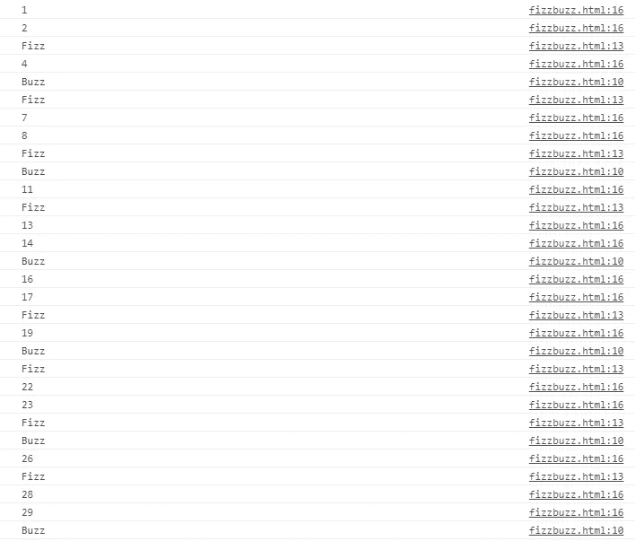
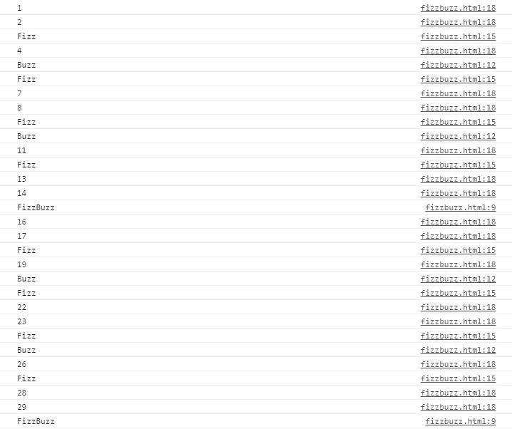

# FizzBuzz:解决一个棘手的编程面试问题

> 原文：<https://javascript.plainenglish.io/fizzbuzz-solving-a-tricky-programming-interview-question-44c64c05f3c1?source=collection_archive---------10----------------------->


Photo by [Daoud Abismail](https://unsplash.com/@daoud_absml?utm_source=medium&utm_medium=referral) on [Unsplash](https://unsplash.com?utm_source=medium&utm_medium=referral)

目前，我正在阅读雄辩的 JavaScript。书中的练习之一是 FizzBuzz。问题陈述是这样的:

写一个程序，用 console.log 打印从 1 到 100，
的所有数字，有两个例外。对于能被 3 整除的数字，打印“Fizz”而不是
数字，对于能被 5 整除的数字(而不是 3)，打印“Buzz”。
当你完成后，修改你的程序，为能被 3 和 5 整除的
数打印“FizzBuzz”(仍然为只能被其中一个整除的数打印“Fizz”或“Buzz”
)。

有一点需要说明的是，这个问题是用来淘汰面试人选的。我认为这是由于问题是如何提出的。

本文将从我自己的角度分析这个问题并提供解决方案。我已经尽力使它尽可能简单。

# 设置

创建一个名为**fizzbuzz.html**的文件，并在其中输入以下代码:

```
<script src=”[https://gist.github.com/Oiselenjakhian/9bfae2b6df96fd2e7df9de4efc952e01.js](https://gist.github.com/Oiselenjakhian/9bfae2b6df96fd2e7df9de4efc952e01.js)"></script>
```

这将允许您从 HTML 文件运行 JavaScript。代码将放在`<script>`标签所在的区域。

# 数字生成

问题的第一部分涉及数字生成。使用 while 循环很容易做到这一点，如下所示:

```
for (var i = 1; i <= 100; i++) {
  console.log(i);
}
```

上面的代码将生成从 1 到 100 的数字。

# 应用过滤器

我们在生成的数字是 3 和 5 的倍数的地方应用过滤器。

%是 JavaScript 中的模数运算符。它用于测试一个数是否能被另一个数整除。如果是这种情况，它给出的值为 0。

```
for (var i = 1; i <= 100; i++) {
 if (i % 5 == 0) {
  console.log(“Buzz”);
 }
 else if (i % 3 == 0) {
  console.log(“Fizz”);
 }
 else {
  console.log(i);
 }
}
```

输出如下所示:



请注意，3 和 5 可以像 15 一样分开的点会显示嗡嗡声。这个特殊的问题是一个棘手的问题，因为它使用了选择的顺序。

它遇到的第一个真条件被用作打印出数字或字符串的基础。

一旦发现条件的放置顺序决定了打印的内容，复合条件就必须放在最前面。

最后一段代码如下所示:

```
<script src=”[https://gist.github.com/Oiselenjakhian/7262252c9838c69a2d7ef7b4c4c5ef9a.js](https://gist.github.com/Oiselenjakhian/7262252c9838c69a2d7ef7b4c4c5ef9a.js)"></script>
```

程序的最终输出如下所示:



# 结论

FizzBuzz 是一个很容易解决的面试问题。然而，这很棘手，因为你必须将条件按正确的顺序排列。