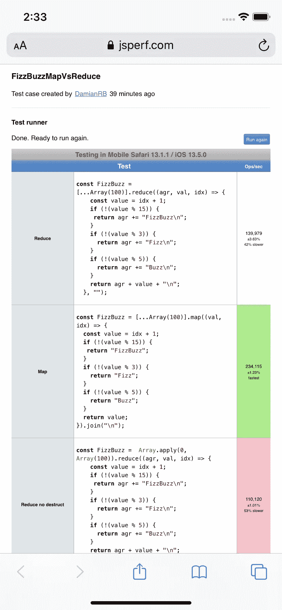

# 使用 FizzBuzz。减少 JavaScript 中的错误

> 原文：<https://javascript.plainenglish.io/fizzbuzz-using-reduce-in-javascript-quick-and-readable-but-is-it-fast-690cf5fa83a7?source=collection_archive---------4----------------------->

## 快速易读，但速度快吗？

网上有无数关于 Fizz Buzz 的解决方案，有些超级聪明，有些很难读懂，有些很快，有些很慢(看看你的“for loop”；)但在我看来，就工作负载与性能的对比而言，使用 reduce 或 map 是最有效的(据我所知，性能最好的是将迭代次数减少到 28 次)。

那么为什么要缩小地图呢？

理论上，答案很简单——当您将空字符串作为第二个参数*传递时，减少聚合值中的返回字符串。reduce(回调，initial value)**映射*返回处理过的数组行，所以你需要在最后连接得到一个字符串。

但是浏览器中的测试已经产生了有趣的结果——基于铬的浏览器非常支持 reduce，而 map 慢了 60-70%:
*(在铬 81、83、85 中尝试——结果在误差范围内)*

JSPerf Chrome 83

在火狐中，我们看到两者之间的差别很小，但是仍然支持减少，map 要慢 25-30%

JSPerf Firefox 76

有趣的是，在 Safari 中，速度降低了 10%-15%。

JSPerf Safari 13.1

***你可以在这里自己试试:***
[https://jsperf.com/fizzbuzzmapvsreduce](https://jsperf.com/fizzbuzzmapvsreduce)

所以我检查了自毁装置是否是罪魁祸首——事实并非如此。
还尝试了不同的基准站点(jsbench.me)，结果相似(百分比):

Safari Test

## 只是为了查看手机…

所以在移动 Safari 上，结果是相似的……

iPhone 11 Simulator

Android 上的 Chrome(物理设备，三星 Galaxy S9+)，略有不同，但趋势依然存在。

Chrome on Samsung Galaxy S9+

# 减少:

Reduce FizzBuzz

# 地图:

Map FizzBuzz

**精简版代码沙箱游乐场:**

CodeSandbox for you to play with.