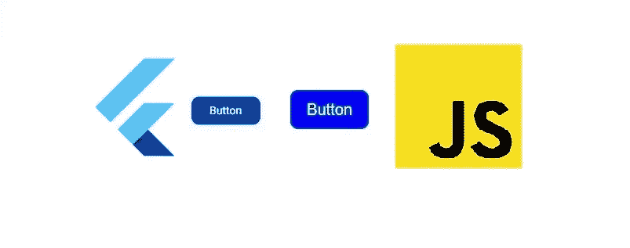
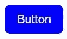
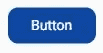

# Flutter vs JavaScript:创建按钮

> 原文：<https://javascript.plainenglish.io/flutter-vs-javascript-creating-a-button-dd29a99cf537?source=collection_archive---------5----------------------->



Flutter Button and JavaScript Button Comparison

从我的编程之旅开始，我就为 time pass 开发了 web 应用程序。在过去的一年里，我一直使用 HTML、CSS 和 JavaScript 进行开发。Flutter 是 google 开发的跨平台 SDK。在本文中，我将向您展示用 JavaScript 和 Flutter 制作按钮的区别。

我用 JavaScript 和 HTML 编写的按钮代码如下

```
<html>
    <body>
        <div id="mainDiv"></div>
        <script>
            var div=document.getElementById("mainDiv");
            var button=document.createElement("button");
            button.style.backgroundColor="blue";
            button.style.borderRadius="10px";
            button.style.height="50px";
            button.style.width="100px";
            button.style.borderWidth="0px";
            var textDiv=document.createElement("div");
            textDiv.textContent="Button";
            textDiv.style.color="#fff"; 
            textDiv.style.fontSize="20px";
            button.appendChild(textDiv);
            div.appendChild(button);
        </script>
    </body>
</html>
```



*document.getElementById* 用于获取 Id 为 *mainDiv* 的 Div 标签

*document.createElement* 用于创建新元素。这里的*按钮*。

*button . style . borderradius*用于使按钮弯曲*边缘*

*文本分类*。 *textContent* 用于修改元素的文本内容。

现在，让我们用 flutter 制作同样的按钮。

```
FlatButton(
  child: new Text("Button"),
  onPressed: () {},
  color: Colors.blue[900],
  textColor: Colors.white,
  shape:
    RoundedRectangleBorder(borderRadius:BorderRadius.circular(10.0),
  ),
),
```



*FlatButton* 是一个用于在 flutter 中创建按钮的小工具。

Text(" ")类似于我们之前使用的 *textContent* 。

```
RoundedRectangleBorder(borderRadius:BorderRadius.circular(10.0),
```

它用于使按钮边缘弯曲。

*颜色:colors . blue【900】，*类似*button . style . background color = " blue "；*使按钮的背景为深蓝色。

这是 JavaScript 与 Flutter 的一个示例演示。希望你喜欢阅读，并发现这是有用的。