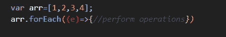
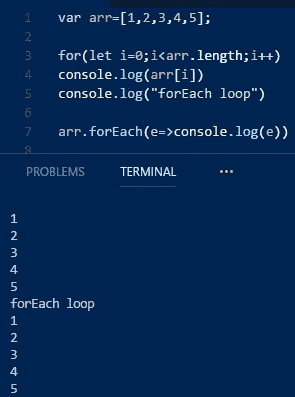
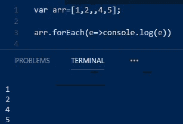
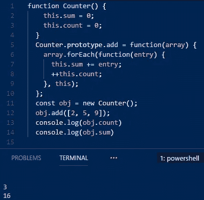
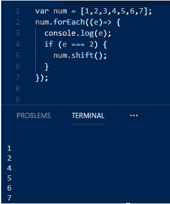

# JavaScript 中的 forEach l∞p

> 原文：<https://javascript.plainenglish.io/foreach-loop-in-javascript-6b19e78d655b?source=collection_archive---------0----------------------->

JavaScript 提供了 n 种方法来循环数组。与传统 for 循环不同的主要方式之一是 **forEach** 循环。

Photo by [Lysander Yuen](https://unsplash.com/@lysanderyuen?utm_source=medium&utm_medium=referral) on [Unsplash](https://unsplash.com?utm_source=medium&utm_medium=referral)

# 每个人的 l∞ps

与其他语言相比，使用 JavaScript 的一个最大优势是它提供了足够的选择来做基本的事情。例如，考虑循环。程序中最简单和最基本的部分之一。循环有很多种方式，每个 JS 程序员都有他/她喜欢的循环方式。 **forEach** 就是其中之一。

**forEach** 方法为每个数组元素执行一次提供的函数，即**回调**。这听起来对**贴图**或**滤镜**太熟悉了。让我们了解更多关于 **forEach** 的知识，看看是什么让它从 JavaScript 的其他循环中脱颖而出。

## 句法

上面的代码片段是一个 **forEach** 循环的语法。 **forEach** 循环只能在迭代器上迭代。这里我们使用一个数组。数组被迭代，所有的元素被一个接一个地分配给 *e* ，我们可以对它执行任何操作。

## 因素

参数在回调函数中传递，它们是-

*   currentValue —回调中传递的当前值。在 snip 中，currentValue 是 e。必须提供此参数。
*   index —数组中当前元素的索引。这是一个可选参数。
*   this —对调用对象的引用，换句话说，它将被用作回调的 this 值。否则，这将被设置为未定义。最终，提供的 this 值由该赋值的常规规则决定。这可能有点令人困惑，你可以参考这篇关于*的文章*来了解更多信息。

## 返回

未定义。一直都是。

Filter，Map 返回数组， **forEach** 返回 undefined。这是这些循环之间的主要区别。

既然基本的工作已经完成，让我们来看看使用 **forEach 时要记住的规则。**

*   **forEach** 对每个数组元素执行一次回调函数。
*   它总是返回 undefined。
*   它不会改变数组，但是回调函数可以这样做。
*   **forEach** 不像 map、reduce 或 filter 那样可以链接。
*   由 **forEach** 循环处理的元素范围是在第一次调用回调函数之前设置的。
*   循环不会访问在 **forEach** 开始后追加到数组中的元素。
*   在被循环访问之前被删除的元素不会被访问。
*   如果已经访问过的元素在迭代过程中从数组中删除，后面的元素将被跳过。
*   **forEach** 循环一旦开始就不能停止。有几分地..
*   **forEach** 不会对没有值的数组元素执行回调。

当使用 **forEach** 循环时，这些是必须记住的规则。有些很简单，有些可能需要解释。

下面将显示不同的示例，这些示例将突出显示规则，并明确何时何地使用 forEach 以及何时不使用。

## 例子

**for 循环**和 **forEach** 循环语法的区别

该截图向我们展示了与 for 循环相比，使用 **forEach** 循环是多么容易。

使用 for 循环，我们必须为循环创建完整的模板获取数组的长度，初始化，递增并赋值给 *i.* **ForEach** 不需要所有这些，我们只需定义一个回调，使用 arrow 函数语法会容易得多。

在这个截图中，我们可以看到，当数组中有一个 null、空的或未定义的元素时， **forEach** 循环就不会访问它。

*Example taken from MDN*

在这里我们可以看到 this 关键字的用法。我们创建了一个名为 counter 的函数，并在其原型中添加了一个 add 函数。使用 **forEach** 循环，我们计算数组中元素的数量以及元素的总和。这用于指向计数器的属性 sum 和 count。

在这个代码片段中，我们在一个数组上使用了 **forEach** ，如果一个元素满足某个条件，我们使用 shift()从数组中删除该元素。我们可以看到这里发生了一件奇怪的事情，元素 2 从数组中移除，但它也被打印出来，但下一个元素 3 没有被打印出来。

这是因为元素 2 在打印后被移除。当使用 shift()移除元素 3 时，元素 3 占据了它的位置。移除时的当前指数为 1。移除后 **forEach** 移至索引 2，本应是 3 的位置，但在 2 的位置被移至位置 1，因此未被打印。

规则中规定，一旦开始运行，就不能停止 **forEach** 循环。它不能用传统的方法停止，比如使用 break，或者从回调函数返回 false。它只有在抛出异常时才会停止。在这个截图中，我们创建了一个名为 exception 的对象，如果条件满足要求，就会抛出一个异常，最终停止执行 **forEach** 循环。整个循环都包含在 try catch 块中。

希望你喜欢这篇文章，并且理解 **forEach** 循环是如何工作的。

Google