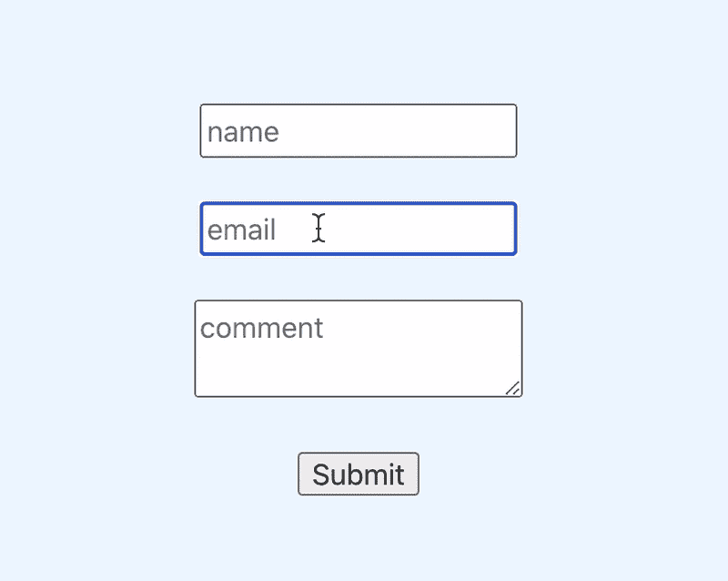
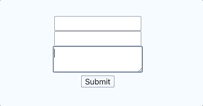

# 使用 React 挂钩表单进行表单验证

> 原文：<https://javascript.plainenglish.io/form-validations-react-hook-forms-df129fece668?source=collection_archive---------9----------------------->


表单验证对安全性很重要，它使我们的 web 应用程序更容易使用。开发人员一直在创建表单，我们在每个项目中一遍又一遍地重复相同的模式。

我们也喜欢有效率(让我们自己的事情更容易)，使用一些可信的第三方库是减少代码并使其更容易阅读和工作的好方法。

今天我要实现一个真正有用的库，React Hook Forms。这个库使用一个定制的 React 钩子来快速添加验证。

*本演示假设您已经创建了一个 React 项目。有关如何创建 React 应用程序的更多信息，请查看他们的* [*文档*](https://reactjs.org/docs/getting-started.html) *或我的* [*以前的*](https://medium.com/javascript-in-plain-english/a-guide-to-creating-a-react-app-without-create-react-app-5337c5ac2ea0) [*博客*](https://medium.com/javascript-in-plain-english/how-to-stream-a-medium-blog-to-your-react-js-portfolio-9d62de41916e) [*帖子*](https://medium.com/javascript-in-plain-english/recoil-js-simple-global-state-d84100b3d535) *中的每一个帖子都有一步一步的说明。*

# 我们今天在建造什么？

我们将创建一个接受用户的`name`、`email`和`message`的表单。对于此演示，我们将添加以下验证:

*   `name`存在并且长度少于 20 个字符。
*   `email`存在并且是有效的电子邮件格式。
*   `message`存在。

这是我们完成后表单的外观:



# 创建一个组件

我将调用我的组件`Contact`。

# 安装并导入 React Hook 表单

*   在你的终端:`npm install react-hook-form`。
*   将`useForm`导入您的组件。

# 构建一个基本表单

Assign `useForm()` to variables using deconstruction.

使用解构将`useForm()`分配给变量。

分配`onSubmit`。这是一个暂时的占位符，我们将在下一篇博客中更新它，因此消息将通过电子邮件发送。

每个`<input>`需要一个唯一的名称。

`register`是使用表单的关键。它允许值可用于验证和提交。



我们现在有表格了！让我们添加一些验证。

# 添加验证

useForm 支持以下验证:

*   需要
*   部
*   最大
*   最小长度
*   模式
*   使生效

验证被添加到每个`register`。点击查看验证[的规则。](https://react-hook-form.com/api#register)

下面是输入的单行版本(如果您觉得更容易阅读的话)。

```
<input name="name" ref={register({required: true, maxLength: 20})}/>
```

# 显示错误

为了展示这些验证的有效性，让我们回顾并显示错误。

这就是我们要使用从 useForm 得到的`errors`的地方。我们将在每个`<input>`下添加一些 Javascript。

*   如果您在一个`<input>`上有一个验证，通过如下传递一个字符串来格式化`error`:

```
{errors.name && "Please enter a name"}
```

*   如果您有多个验证，则按如下方式添加:

```
{errors.name && errors.name.message}
```

并更新每个验证的值，使其包含两个键；`value`和`message`，如下例所示。

# 就这么简单！结果如下:


下周，我们将使用 EmailJS 将此邮件从您的 React 应用程序发送到您的电子邮件。敬请期待！

查看我的其他一些故事； [*CSS 重置*](https://medium.com/swlh/css-reset-2b4831d4664e) *，或者* [*反冲. js &简单全局状态*](https://medium.com/javascript-in-plain-english/recoil-js-simple-global-state-d84100b3d535?source=your_stories_page-------------------------------------) *。在 joshuagauthreaux@gmail.com 或通过*[*joshgotro.com*](https://www.joshgotro.com/)*与我联系。*

感谢您的阅读，祝您身体健康！