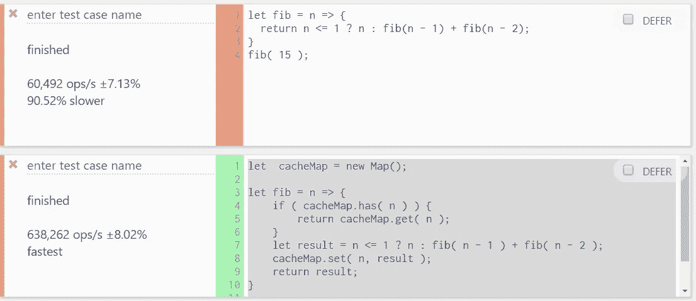
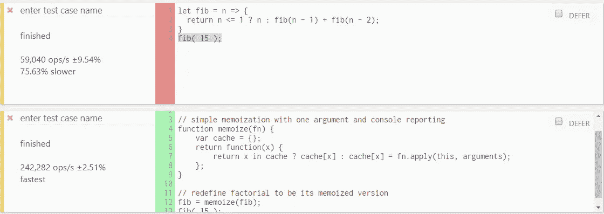

# 普通 JavaScript 中的四个超级有用的技术

> 原文：<https://javascript.plainenglish.io/four-super-useful-techniques-in-vanilla-js-896bab184574?source=collection_archive---------3----------------------->

## 复制到剪贴板，加速递归函数，获得文件扩展名和正确洗牌数组


Two monitors with code

## 索引

*   使用记忆化来加速递归函数(基准)
*   复制到剪贴板
*   获取文件扩展名
*   打乱数组

## 使用记忆来加速递归函数

内存化是一种优化技术，通过在函数初始执行后缓存函数返回，使长递归(或迭代)函数运行得更快。

我们创建一个缓存，如果输入之前已经计算过，我们在缓存中找到相应的值并返回它。如果输入没有被计算，我们计算它并把它插入缓存。

让我们来看一个计算一个数字的斐波纳契数列的例子:

```
let fib = n => {
  return n <= 1 ? n : fib(n - 1) + fib(n - 2);
}fib( 15 );
```

它可以工作，但是效率非常低，而且需要大量重复的计算工作。

我们可以使用缓存映射来存储之前计算的值，并加快整体执行速度:

```
let  cacheMap = new Map();let fib = n => { //1.
    if ( cacheMap.has( n ) ) {
        return cacheMap.get( n );
    } //2.
    let result = n <= 1 ? n : fib( n - 1 ) + fib( n - 2 ); //3.
    cacheMap.set( n, result );return result;
}fib( 15 );
```

1.  如果结果在缓存中，则从缓存中获取。
2.  计算新的结果。
3.  将结果保存在缓存中。

*注意，缓存版本正在缓存*斐波那契函数调用的结果值，*如果结果已经在缓存中，这将显著加快计算速度。*

您可以在 [jsperf](https://jsperf.com/) 中运行和测试不同的解决方案。



Result of no cached version vs. the cached version

缓存版本每秒执行 638，262 次操作，占 8.02%，而非内存版本每秒执行 60，492 次操作，占 7.13%。

同样，我们可以定义一个高阶函数[,它接受一个函数作为它的参数，并返回它自己的记忆版本。](https://en.wikipedia.org/wiki/Higher-order_function)

```
function fib(n) {
 return n <= 1 ? n : fib(n - 1) + fib(n - 2);
}function memoize(fn) {
    var cache = {};
    return function(x) {
        return x in cache ? cache[x] : cache[x] = fn.apply(this,   
        arguments);
    };
}// redefine factorial to be its memoized version
fib = memoize(fib);fib( 15 );
```



Result of no cached version vs. the cached version

内存化版本每秒执行 242，282 次操作，占 2.51%，而非内存化版本每秒执行 59040 次操作，占 9.54%。

*注意，结果不仅取决于算法，还取决于机器的状态。*

记忆化有很多优点，如果计算函数的返回值需要一些时间，那么用简单的查找代替它可以节省大量时间。我们还可以避免许多递归调用，因为计算值意味着进入递归调用的。

通常，如果我们对多次计算相同的值感兴趣，我们应该使用记忆化。

## 复制到剪贴板

在下面的例子中，我创建了一个普通的“复制到剪贴板”按钮。这是实现复制到剪贴板功能的最简单的方法，但是不好的是我们必须添加一个文本区域来选择要复制到剪贴板的文本。

*你可以在类似*[*JS Bin*](https://jsbin.com/?html,output)*这样的在线编辑器中尝试下面的代码，或者将其保存在. html 文件中，用 chrome 这样的浏览器打开。*

```
<!DOCTYPE html>
<html><body>
<h1>Write something:</h1><textarea id="textareaId" rows="4" cols="50"></textarea>
</br><button type="button" onclick="copyToClipboard();">Copy to clipboard</button><p>Paste here the clipboard content to verify that it works:</p> 
<p>(but you can paste the content wherever you wants)</p><textarea id="textarea2Id" rows="10" cols="50"></textarea>

<script>
  const **copyToClipboard** = () => {
     //1.
     document.querySelector('#textareaId').select();
     //2.
     document.execCommand('copy');
  }; 
</script>

</body>
</html>
```

1.  使用 HTMLInputElement.select()选择<textarea>元素的内容。</textarea>
2.  使用 Document.execCommand('copy ')将<textarea>的内容复制到剪贴板。</textarea>

## 获取文件扩展名

有时你需要获得一个文件的扩展名，这里有一个简单的方法，使用 slice 和 lastIndexOf 方法:

```
let file1 = "file1.doc";
let file2 = "file2.txt";
let file3 = "file3";
let file4 = "file4.a.b.jpg";
let file5 = "/home/tmp/file4.a.b.jpg";const getExt = (path) => {
   //1.
   let root = path.split(/[\\/]/).pop();
   //2.
   let pos  = root.lastIndexOf('.');
   //3.
   let extension = (root === '' || pos < 1) ? '' :
   //4.
   root.slice(pos + 1);
return extension;
}console.log(getExt(file1)); 
//xslconsole.log(getExt(file2));
//txtconsole.log(getExt(file3));
//''console.log(getExt(file4));
//jpgconsole.log(getExt(file5));
//jpg
```

1.  从完整路径中提取文件名(如果传递了完整路径)。
2.  获取“.”的索引
3.  如果文件名为空或“.”找不到(-1)或先出现(0)。
4.  从 pos+1 扩展名中提取文件名，忽略“.”

## 打乱数组

打乱一组值是计算中最古老的问题之一，我们有不同的方法来解决它。在这里，我们将看到在 javascript 中实现这一点的两种最常见的方法。

第一种解决方案:

```
array.sort(function (a, b) { return 0.5 — Math.random() })
```

如果你传递给 sort 的函数是“比较函数”,并且它小于 0，元素“a”优先；否则，元素“b”优先。0.5 Math.random()将给出大约 50%负数和 50%正数的随机数。

乍一看，这似乎是一个有效的解决方案。该代码使用 javascript 的 sort 函数和一个 0.5 到-0.5 之间的自定义比较器。这种排序算法有各种各样的问题。一个是排列的可能性不一样，因为 array.sort()更喜欢一些数字。

更好的解决方案是使用费希尔-耶茨洗牌法:

*[*费希尔-亚特*](https://en.wikipedia.org/wiki/Fisher%E2%80%93Yates_shuffle) *s shuffle 是一种生成有限序列随机排列的算法。它打乱了每种排列都具有同等可能性的序列。**

```
*const shuffle = (array) => {
  let currentIndex = array.length;
  let tmpValue;
  let randomIndex;
  let i = currentIndex-1; //1
  while (0 !== currentIndex) { //2
    randomIndex = Math.floor(Math.random() * currentIndex);
    currentIndex = i--; //3
    tmpValue = array[currentIndex];
    array[currentIndex] = array[randomIndex];
    array[randomIndex] = tmpValue;
  }return array;
}*
```

1.  *如果我们有要洗牌的元素，重复这个步骤。*
2.  *选择剩余的元素。*
3.  *用当前元素替换它。*

*示例:*

```
*//Example:
let arr = [1,2,3,4,5,9,8,7,6];console.log(shuffle(arr));
//[4, 1, 3, 6, 7, 9, 2, 8, 5]console.log(shuffle(arr));
//[2, 7, 4, 6, 5, 1, 3, 8, 9]...*
```

**请注意，所有纯软件算法都是伪随机的，除非它们与硬件相连以生成真正随机的种子。**

## *结论*

*在本文中，我谈到了开发应用程序时可能出现的需求，以及我们如何以最佳方式直接解决这些需求。如果这对你有帮助，那就值得写下来。*

*感谢您花时间阅读我的文章！*

# ***简明英语笔记***

*你知道我们有四份出版物和一个 YouTube 频道吗？你可以在我们的主页[**plain English . io**](https://plainenglish.io/)找到所有这些内容——关注我们的出版物并 [**订阅我们的 YouTube 频道**](https://www.youtube.com/channel/UCtipWUghju290NWcn8jhyAw) **来表达你的爱吧！***