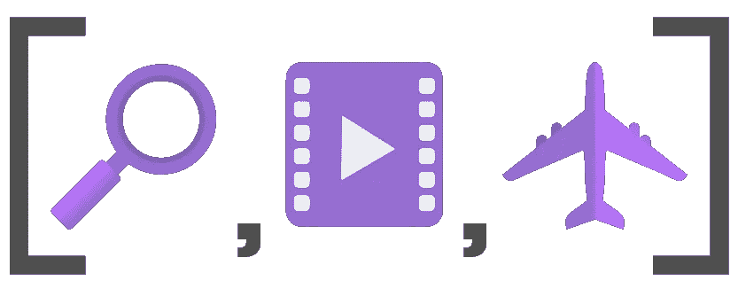
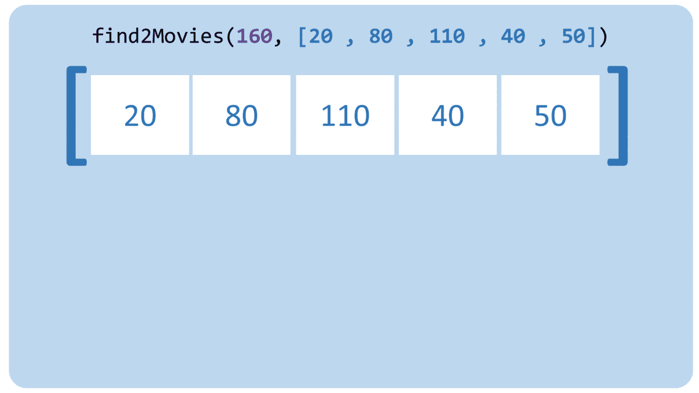
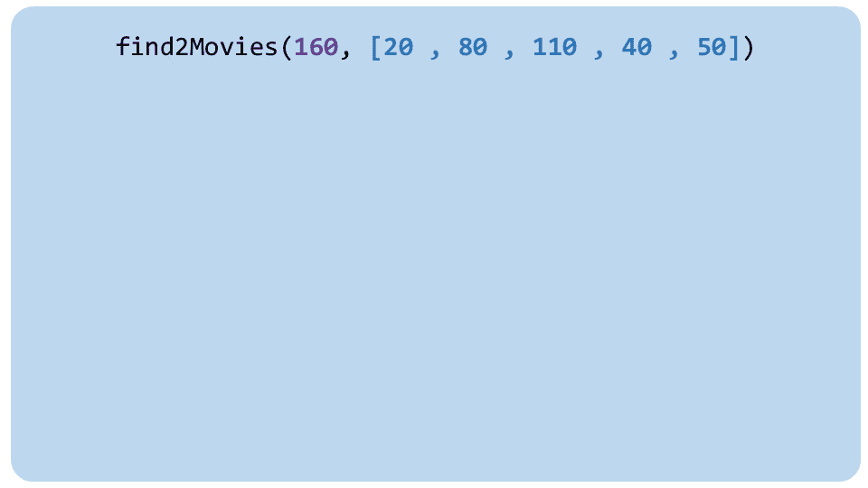

# 频率计数器算法

> 原文：<https://javascript.plainenglish.io/frequency-counter-algorithm-405424e00f0c?source=collection_archive---------1----------------------->

## 第 1 部分:使用 Javascript 对象查找数组中的元素



许多面试、 [LeetCode](https://leetcode.com/) 、 [HackerRank](https://www.hackerrank.com/) 、 [CodeWars](https://www.codewars.com/) 和其他类似网站的编码挑战都涉及到计数或寻找数组中的元素。最近，我参加了一个技术面试，我遇到了两个问题。两者都涉及到这种模式的使用。我们来看其中一个！

## //在一个数组中找到两部电影，将**加起来正好是**给定的飞行长度

```
// Find 2 movies in an array that add up **EXACTLY** to a given flight   length// **Input**
// flightLength: duration of the flight in minutes (integer)
// movieLengths: array of movie times in minutes (array of integers)// **Output**
// boolean, true if there exists TWO movies that add up EXACTLY to the flightLength// **Examples**
// flightLength 160
// [80, 110, 40] => false, because no two movies = 160
// [80, 110, 80] => true, because 80 + 80 = 160
// [20, 30, 110, 40, 50] => true, because 110 + 50 = 160
```

我的第一个反应(也是最常见的一个)是循环遍历数组，对于数组中的每部电影，再次循环遍历数组**和**，看看是否有另一部电影加在一起等于飞行长度。

大概是这样的:

```
**function find2Movies(flightLength, movies){**
  //loop through every movie  
  **for(let i = 0; i < movies.length; i++){**
    //loop through every movie AGAIN
    **for(let j = 0; j < movies.length; j++){**
      //if the movies are different
      **if (i !== j){**
        // if the sum of the 2 movies equals the flight length
        **if (movies[i] + movies[j] === flightLength){**
          // Then return true
          **return true** 
        **}**
      **}** 
    **}**
  **}** // If you went through the loops and didn't find any movies that 
  // add up EXACTLY to a given flight length, return false
  **return false**
**}**
```

这是如何运行的:



现在，除了它是 O **(n )** 之外，这将是非常好的。对于数组中的每个元素，循环遍历数组中的每个元素。这是一批**迭代。如果你有 100 部电影，你必须检查 100 * 100 = 10，000 个案例。如果你有 1000 部电影，那就是 100 万个案例。扩展性不好。**

# 100 部电影？一万箱！

# 1000 部电影？100 万箱？！

这就是所谓的暴力方法。你正在评估每一个可能的测试用例。

让我们评估一下我们的方法。

要在数组中寻找一个元素，我们必须遍历数组，试图找到它，也就是 O(n)。当我们在循环中这样做时，我们得到 O(n)。

## **还有一个更高效的方法。**

进入**频率计数器** **算法**。这个模式是关于滥用你可以在**常量时间**，O(1)中寻找一个对象中的元素的事实。

它的工作原理是将你想在对象内部看到的值存储为一个键。然后，您可以比较当前迭代的电影是否在您的对象中。代码应该是这样的:

```
**function find2Movies(flightLength, movies){**
  // create an object
 ** let results = {}**
 // loop through every movie
  **for(let i = 0; i < movies.length; i++){**
    // If current movie is inside your object
 **if (results[movies[i]]){** // Then return true **return true 
    }**
    // Otherwise, add the movie that would pair with our current
    // movie to our object 
    // We know what that movie's length should be by 
    // subtracting the current movie's length from the flight length 
    **let result = flightLength — movies[i]
    results[result] = true
  }** 
  // If you went through the loops and didn't find any movies that 
  // add up EXACTLY to a given flight length, return false
 **return false
}**
```

这是如何运行的:



这更快，快得多。使用**频率计数器** **算法**我们现在只需要对数组中的每个电影迭代一次。如果我们有 100 部电影，我们检查 100 个案例。如果我们有 1000 部电影，我们检查 1000 个案例。我们达到了 O(n)。

# 100 部电影？100 箱！

# 1000 部电影？1000 箱！

这种模式适用于比这种情况更多的情况。如果你必须在一个数组中寻找元素，并且发现自己使用了嵌套循环，频率计数器很可能会帮助你更快地解决它！