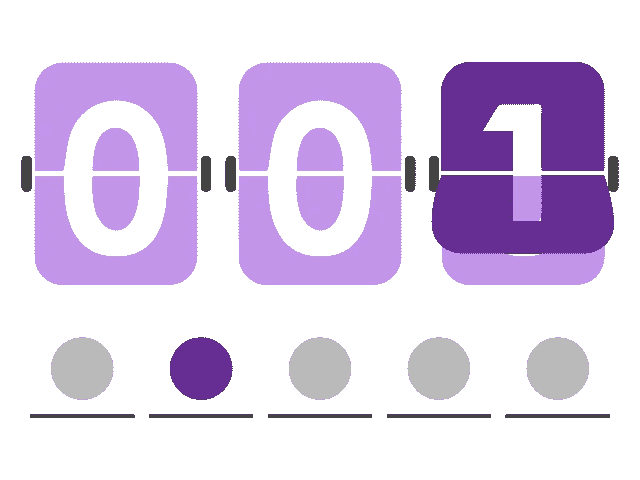
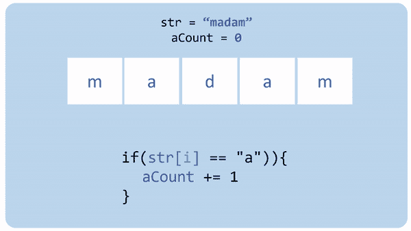
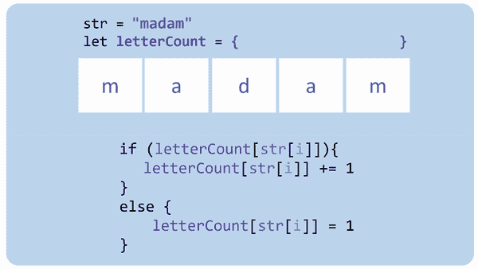
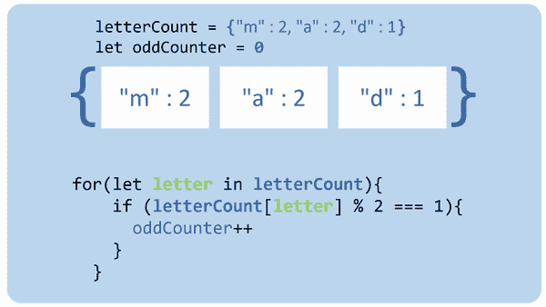

# 频率计数器算法

> 原文：<https://javascript.plainenglish.io/frequency-counter-algorithm-b3fa98efe8ba?source=collection_archive---------0----------------------->

## Pt 2:如何使用 JavaScript 对象计算数组中的元素



在我的前一篇文章中，我谈到了如何使用对象更快地找到数组中的元素，以及如何使用它来解决一次技术采访中的两个难题之一。在这里，我们将讨论第二个挑战！

## **//检查是否可以将一个字符串变成回文**

```
// A **palindrome** is a word that spelled backward reads the same
// Check if it's possible to make a string into a palindrome// **Input** // str: any string

// **Output**
// boolean, true if you can make the string into a palindrome// **Examples** // racecar => true
// ice => false
// madam => true
// aaabb => true
// abc => false
```

这里的关键区别在于，我们并不是在确定一个字符串是否是回文，而是它是否**可以**变成回文。

思考了一会儿后，我想到了回文词的特点。有一件事对我来说很突出，那就是有一个或没有奇数个字母。

既然是这样，我们可以换一种方式来回答这个问题。它可以变成“有一个或没有数量的奇数字母吗？”

为了回答这个问题，我们需要计算字符串中每个字母的数量。说起来容易做起来难！

对数组中的元素进行计数的最常见方法之一如下所示:

传统方法

Counting With Variables

这种方法的 GIF 在这里:



这里的问题是它只计算一种类型的字母，即 *a* 。我们不知道绳子里面会有什么字母。我们可以为从 a 到 z 的每个字母做一个计数器(lol ),并检查 if 中每个可能的字母。但那将是 [WET](https://i.imgur.com/Mq8Ey7K.png) 代码。 [DRY](https://i.imgur.com/Mq8Ey7K.png) 代码是硬道理。

介绍物品。又来了。

我们可以使用对象来存储计数器。每当我们碰到一个新的字母，我们可以把它作为一个键添加到一个对象中，并将值设置为 1。如果它是我们对象中已经存在的一个字母，我们可以更新它的值。

将计数器存储在对象中使我们可以在遍历数组中的每个元素时动态创建计数器。代码如下所示:

频率计数器法

Counting With Objects

我喜欢直观地显示代码，而不是用文本来解释，所以这里有一个关于它如何工作的 gif:



最后一个 GIF 显示返回的对象:{“m”:2，“a”:2，“d”:1 }

现在我们有了一个包含所有计数器的对象，我们可以在该对象上循环计数奇数中的每个字母。如果有一个或更少的奇数个字母，我们会返回 true。否则，为假。

Solution



这就是如何使用对象来计数，而不是常规变量。当您想要计算数组中任何元素的出现次数，而又不知道数组中会有什么或多少元素时，这非常有用。