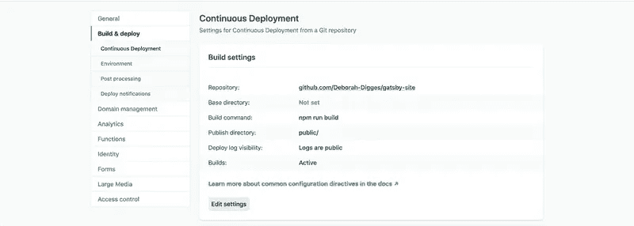

# 从哲基尔到盖茨比:7 个简单的步骤

> 原文：<https://javascript.plainenglish.io/from-jekyll-to-gatsby-7-simple-steps-98e0b7a5ead2?source=collection_archive---------7----------------------->


六年前，在我大学的最后一年，我参加了一个关于开源技术的课程。要通过这门课程，要做两件事:为一个开源项目做贡献，并写博客。可笑的是，促使我开始公开写作的唯一原因是害怕这门课不及格。

我通过了课程考试，并设法创建了一个类似于博客的网站。然而，我并没有花太多的精力去构建网站本身，因为我的大部分精力都花在了编写内容和尝试进入开源领域。那时候，杰基尔风靡一时，我点了一个名为[兰宁](https://github.com/poole/lanyon)的杰基尔主题开胃菜。

这些年来，它为我提供了很好的服务，但是我对它的工作方式不熟悉，这使我无法对网站的结构进行任何实质性的改变。我最终选择了一个我更喜欢的筹码。

# 为什么是盖茨比？

我考虑过用[盖茨比](https://www.gatsbyjs.com/blog/2017-11-08-migrate-from-jekyll-to-gatsby/)和[下一个](https://dev.to/joserfelix/how-to-make-a-static-blog-with-next-js-2bd6)来刷新我的博客。我决定用 Gatsby，因为它更适合静态站点生成。

# 让我们开始迁移吧

## 脚手架

Gatsby 网站上的[详细记录了 Gatsby 项目的启动和运行。增强项目以从 markdown 文件生成页面也在](https://www.gatsbyjs.com/docs/quick-start/)[中有清晰的解释](https://www.gatsbyjs.com/docs/adding-markdown-pages/)。以下是我为博客建立初始项目所遵循的步骤:

*   使用`gatsby-source-filesystem`插件将 markdown 文件读入 Gatsby。我在`gatsby.config.js`的`plugins`键中添加了一个条目。

```
plugins: [{ resolve: `gatsby-source-filesystem`, options: { name: `markdown-pages`, path: `${__dirname}/src/markdown-pages` }}]
```

*   使用`gatsby-transformer-remark`插件解析 markdown 文件，该插件将 frontmatter 提取为数据，将内容提取为 HTML。

```
plugins: [ { resolve: `gatsby-source-filesystem`, options: { name: `markdown-pages`, path: `${__dirname}/src/markdown-pages` }, }, `gatsby-transformer-remark`]
```

*   使用 React 为博客文章创建了一个[模板](https://github.com/Deborah-Digges/gatsby-site/blob/master/src/templates/blogTemplate.js)，以 React 组件的形式呈现博客文章的数据。
*   使用`[createPage](https://github.com/Deborah-Digges/gatsby-site/blob/master/gatsby-node.js#L55)` [Gatsby API](https://github.com/Deborah-Digges/gatsby-site/blob/master/gatsby-node.js#L55) 为所有 markdown 文件生成页面。
*   为所有显示链接列表的博客文章创建了一个[索引页面](https://github.com/Deborah-Digges/gatsby-site/blob/master/src/pages/index.js)。

## 迁移内容

我把所有的降价文件从我的旧网站复制到了`gatsby-source-filesystem`配置条目中指定的文件夹:`markdown-pages`。我现在可以看到我所有的旧博客都列在索引页上，但大多数帖子本身看起来很糟糕。

## 修理所有的东西

**链接**

为了避免破坏链接，我使用了我以前的 Jekyll 站点使用的 slug 格式:`YYYY/MM/DD/Title`。在我的例子中，slug 来自文件名而不是 frontmatter，这需要一点特殊的处理。

*   为了访问文件名，我使用了 [createFilePath](https://github.com/Deborah-Digges/gatsby-site/blob/master/gatsby-node.js#L8) 。
*   我从文件名中提取了 slug 和日期，并将它们作为节点字段传递，供后续的页面查询使用。

```
const result = extractMetadataFromFilename(filePath);
date = result.date;
slug = result.slug;
createNodeField({ node, name: `date`, value: date });
```

**高亮显示**

在我以前的 Jekyll 网站上，我使用`pygments`来突出代码片段的语法，它使用这样的语法来创建一个突出显示:

```


  void f(int x, int n) 
  {
    Gadget * g = new Gadget{n}; // Look ! I'm a Java Programmer :)           if(x < 100) throw std::runtime_error{"weird"}; //leak

    if(x < 200) return; //leak delete p; 
  }


```

因为这在 Gatsby 中不再有效，所以我把所有的亮点都用三个反引号括起来，也就是说用一个`<pre>`标签括起一个`<code>`博客。

我想最终将 gists 直接嵌入到我的帖子中，但这是对后来的博客帖子的改进。

**图像**

首先，我将图片从我的旧网站复制到`src/images`。为了让 Gatsby 知道我的图片在哪里，我为`gatsby-source-filesystem`插件添加了另一个插件条目。

```
{
  resolve: `gatsby-source-filesystem`,
  options: {
    name: `images`,
    path: `${__dirname}/src/images`,
  },
}
```

然后我修改了`gatsby-trasformer-remark`的插件条目，将`gatsby-remark-images`插件添加到其中。

```
{
  resolve: `gatsby-transformer-remark`,
  options: {
    plugins: [ { 
      resolve: `gatsby-remark-images`,
      options: { maxWidth: 800, }, 
    }]
  }
}
```

通过这种配置，我能够使用熟悉的降价格式内嵌图像:

```

```

使用`images`文件夹的相对路径很重要。

```
- src
  - markdown-pages
  - images
```

对于上面的目录结构，`../images/image.png`将是降价文件中引用的图像的路径。

**gif 图**

`gatsby-remark-images`无法处理 gif。我添加了`gatsby-remark-copy-linked-files`插件来正确处理盖茨比遇到的任何 gif。

```
{
  resolve: `gatsby-transformer-remark`,
  options: {
    plugins: [ {
      resolve: `gatsby-remark-images`,
      options: { maxWidth: 800, }, 
    }, 
   `gatsby-remark-copy-linked-files`]
  }
}
```

**图标**

我再次调用了盖茨比强大的插件系统，并在`gatsby-config.js`中添加了另一个插件条目。

```
{
  resolve: `gatsby-plugin-favicon`,
  options: {
    logo: `./src/favicon.ico`
  }
}
```

# 式样

我懒洋洋地复制了 poole/lanyon 主题，以避免我不得不写任何 CSS。我们不要欺骗自己，我真的不知道如何设计一个网站。

由于这些是全局 CSS 样式，我需要将它们导入到`gatsby-browser.config.js`文件中，使它们适用于生成的 HTML 文件。

```
import './src/styles/poole.css';
import './src/styles/lanyon.css';
import './src/styles/Calendas_Plus.otf';
```

# 部署

为了测试这个站点并与我的旧站点进行比较，我将这个站点部署到了。这就像访问 Netlify 站点、授权访问我的 GitHub repo 并提供一个构建命令一样简单。



# 测试没有链路断开

将我的站点部署到 Netlify 后，我通过确保旧站点上的每个链接也存在于新站点上来测试没有链接会断开:

```
links.forEach(link => { 
  link = link.replace('deborah-digges.github.io', 'epic-mirzakhani-8e39a6.netlify.app');
  request(link, (err, res, body) => { 
    if (err) { console.log('Page fetch failed', err); }            console.log(link, res.statusCode);
  });
});
```

我在我的旧博客的两个页面上分别运行以下脚本来提取所有链接:

```
let links = document.querySelectorAll('a');
let siteLinks = [];for (let i=0; i < links.length; i++) {
  let linkText = links[i].textContent;
  linkText = linkText.replace(/\s+/g, ' ').trim();
  const link = links[i].href;
  siteLinks.push([linkText, link]); 
}for(let i=0; i < siteLinks.length; i++) {
  console.log(siteLinks[i][1]);
}
```

诚然，这是一个有点简陋，但嘿！它完成了任务。

# 切换

一旦我准备好告别我的 Jekyll 站点的束缚，我就用闪亮的新 Gatsby 站点覆盖了我的 Github 用户页面库。我将在后续的博客文章中详细介绍将 Gatsby 站点部署到 GitHub 页面的细节。

# 接下来

现在我正在使用一个我比较了解的系统，我想很快:

*   实现分页
*   为页面创建类别，并允许按类别浏览博客
*   在标题中创建一个名为`Content`的导航元素，展开为`Blogs`、`Drawings`、`Book Reviews`
*   创建一个`Reading List`导航元素
*   对 CSS 和设计有足够的了解来创建一个更好的登陆页面(也许雇佣一个设计师？)

如果你想查看更多细节，你可以在这里找到源代码。

再次收听我的盖茨比博客的更多精彩更新！

*原载于*[*https://Deborah-digges . github . io*](https://deborah-digges.github.io/2020/09/16/Jekyll-to-Gatsby)*。*