# 从实体模型到棱角分明的材料

> 原文：<https://javascript.plainenglish.io/from-mockup-to-angular-material-6a14fe0f8743?source=collection_archive---------7----------------------->

在本文中，我们将采用一个用户界面草图，并使用 Angular 材质将其转换为一个新的 Angular 应用程序的视觉结构，以快速设置新应用程序的样式和外观。

具体来说，我们将制作一个名为“Doggo Quest”的基于文本的冒险游戏项目的主用户界面。

我们将从我为关于[的文章创建的用户界面模型开始，使用游戏设计的事件建模](https://killalldefects.com/2020/02/01/game-design-with-event-modeling/)，我们将以应用程序的视觉结构和外观结束。

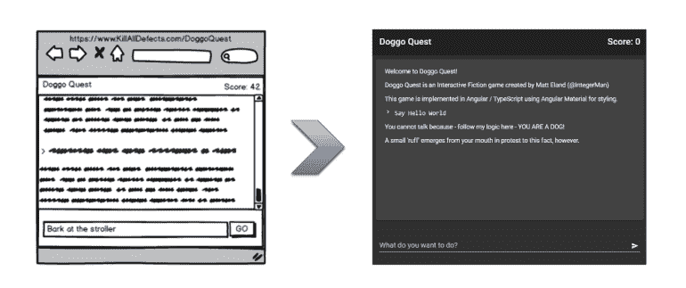

# 角形和角形材料

对于那些不熟悉的人来说， [Angular](https://angular.io/) 是一个单页面应用(SPA) JavaScript 框架，用于设计复杂但可维护的 web 应用。Angular 由 Google 维护，从每个新项目开始就使用 TypeScript、依赖注入、npm、web pack 和其他技术，以便为新项目的成功做准备。

[Angular Material](https://material.angular.io/) 是一个提供 Angular 组件的库，以支持 Android 和 Chrome 操作系统以及谷歌在线服务普及的谷歌材质风格 UI。

# 安装先决条件

如果这是您第一次构建 Angular 应用程序，在开始之前您需要做一些事情。我将讲述基础知识，但是如果你遇到意想不到的事情，我建议你查看 Angular 的[设置指南](https://angular.io/guide/setup-local)以获取更多信息。

虽然 Angular 应用程序有一些很棒的编辑器(我推荐 [WebStorm](https://www.jetbrains.com/webstorm/) 或 [Visual Studio Code](https://code.visualstudio.com/) )，但是我在本文中向您展示的所有内容都可以用记事本和命令提示符之类的基本文本编辑器来完成。

首先，你需要安装节点包管理器(NPM)来安装 Angular 的命令行工具。因为这方面的说明会因操作系统而异，我建议您[访问 npm 网站](https://www.npmjs.com/get-npm)并遵循他们的说明。

安装 npm 后，打开命令行窗口并从任意文件夹运行此命令:`npm i -g @angular/cli`

这告诉 npm 安装在`@angular/cli`找到的包，并将其全局安装在 npm 的整个机器的共享包目录中。

您应该会看到类似这样的内容:

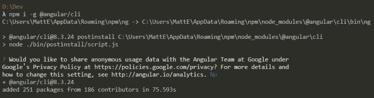

一旦完成，您现在已经设置好 Angular 的命令行界面(CLI ),并可以在本文的剩余部分使用它。

# 创建并运行项目

现在，让我们创建我们的角度应用程序。导航到包含我们将要创建的项目文件夹的文件夹，然后使用命令行运行:`ng new project-name`但是用您的项目名称替换`project-name`。鉴于我正在创建的项目，我使用了`doggo-quest`。

Angular 会提示你几次。在撰写本文时，我将带您浏览 Angular 8.3 中的每个提示。

首先，Angular 会询问您是否要使用路由(导航管理)功能。对于我的小的单页应用程序，这是不需要的，只会增加大小和复杂性，所以我回答没有。

接下来，Angular 将询问您更喜欢使用哪种形式的样式表技术。这完全是您的偏好，因为所有这些都在构建过程中被转换为 CSS，但本文中的示例都是使用 SCSS 编写的。

回答完这些问题后，您会看到 Angular CLI 生成了许多文件:

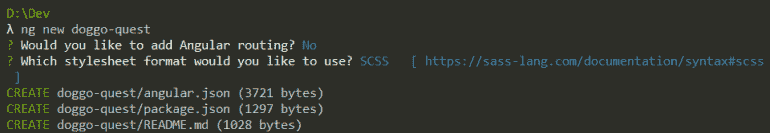

一旦完成，您的新目录就会出现，您可以通过类似`cd doggo-quest`(再次，您的项目名称)的命令导航到该目录。

如果您在目录中列出文件，您可能会注意到 Angular CLI 已经在该目录中自动创建了一个 git 存储库，并进行初始提交。这只是 Angular 的一个例子，它让你随着时间的推移获得良好的实践，并帮助你在新项目上有一个坚实的开端。

你可以通过运行`ng serve -o`命令 Angular 提供应用程序并在浏览器中打开它来启动默认项目

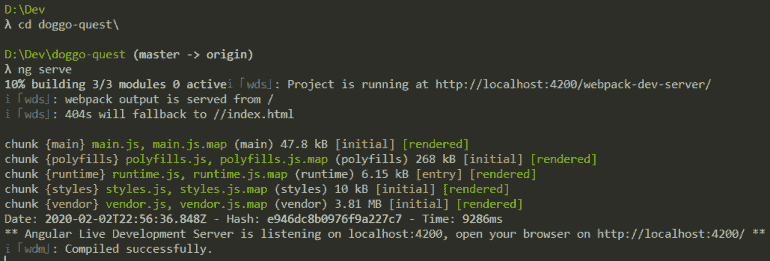

您应该会看到类似这样的内容:

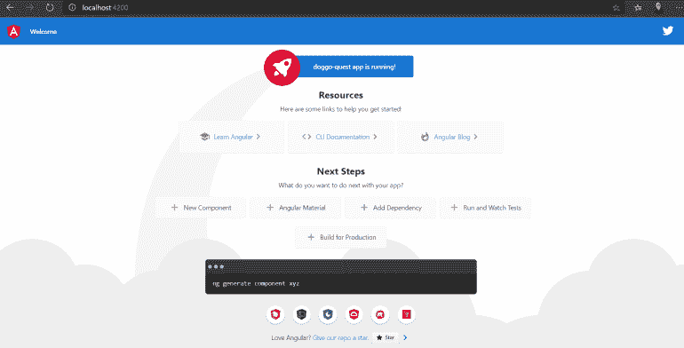

# 替换默认内容

现在您已经启动并运行了，让我们看看如何定制这个应用程序。

首先，让我们进入`Src\Index.html`页面，用`Hello Doggo Quest`替换它的全部内容并保存文件。这将用占位符文本替换应用程序的当前视图，并将屏幕更改为更易于管理的内容。

除非你之前停止了`ng serve`操作，否则 Angular 应该会自动刷新并呈现你刚才在浏览器中所做的更改。这使得校对更改速度更快，并加快了您尝试新事物的速度。

*注意:有时在修改代码时，Angular 可能会在尚未编译或需要修改其他文件的代码上挂起。如果发生这种情况，您可能会在控制台窗口中看到错误，并且可能需要点击* `*Control + C*` *来停止服务器，然后通过* `*ng serve*` *再次启动它。*

# 将实体模型转换成角度组件

让我们再看看我们将转换的样机。

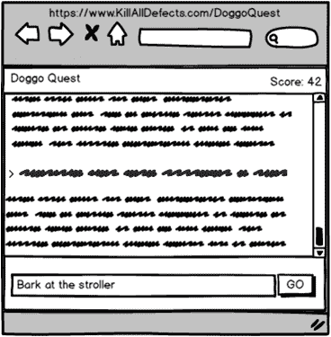

这是一个非常简单的用户界面，但是将它分割成更易管理的部分会导致更易维护的代码，所以让我们看看如何将这个屏幕分割成组件和子组件。

对于那些不熟悉的人来说，Angular 组件本质上是一个自定义的 HTML 标签，可以包含在其他地方(包括在其他组件内部)。Angular 以 HTML 的形式为组件提供视图，以特定于视图的 CSS 的形式提供样式(稍后将详细介绍)，并以视图的 TypeScript 类定义的形式提供逻辑。将组件想象成页面上的一个区域，可以根据需要重用。

这里有一个模型的注释视图，它的角组件已经确定。请记住，组件可以包含其他组件。图的右侧列出了较大的组件，左侧列出了更细粒度的组件。

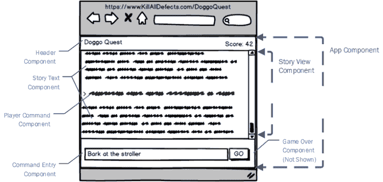

游戏的组成部分是:

*   `App.Component` -应用程序的主容器
*   `Header.Component` -包含游戏标题和高级游戏信息，包括分数
*   `Footer.Component` -包含命令输入组件和游戏结束组件
*   `StoryView.Component` -包含游戏的叙事。新条目将被添加到底部
*   `CommandEntry.Component` -允许玩家输入游戏命令并提交
*   `GameOver.Component` -游戏结束时显示，允许用户重新开始游戏
*   `PlayerCommand.Component` -代表玩家在引擎中输入的东西，现在是故事的一部分
*   游戏叙述中的一个单独的段落。安置在`StoryView.Component`内部

# 创建应用程序组件

好了，是时候开始创建这些组件并使用它们了。

首先，返回命令行，如果服务器当前正在运行，点击`Control + C`停止服务器。

接下来，我们需要通过命令行创建我们的角度组件。虽然这似乎是一种奇怪的创建组件的方式，但这是一种非常简单的创建方式，Angular 根据项目的设置在一个命令中创建多个文件。

为了创建第一个组件，我们将运行`ng g c header`。这告诉 Angular to **g** 生成一个名为`header.component`的 **c** 组件，并创建一些文件。

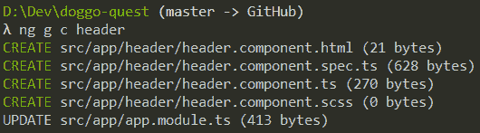

`.html`文件是组件的用户界面。

`.scss`文件是一个空样式表，用于可以定义的样式，这些样式将**只**影响这个组件(除非您自定义 Angular 的 CSS 作用域行为)。我一般更喜欢全球造型，但每个人都有不同的偏好。

`.ts`文件包含组件定义以及您以后可能添加的任何定制逻辑。

`spec.ts`文件是一个自动生成的 Jasmine 测试文件。我们不会在本文中讨论测试，但是在后面的系列文章中，我们会深入讨论角度测试。

现在继续生成上面列出的其余组件，记住以下准则:

*   避免大写字符
*   如果您通常使用空格或大写字母来区分单词，请使用破折号(例如，用`story-view`代替`Story View`或`storyView`)
*   不要包含`component`这个词。Angular 会自动附加这个。

# 自定义应用程序组件

完成后，将`app.component.html`修改为以下内容:

这三个标签使用您的应用程序的前缀(默认为`app`)和我们刚刚创建的引用组件来将它们嵌入到生成的视图中。

运行`ng serve -o`，您应该会看到如下内容:

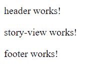

如果您查看这些组件中的任何一个，您将会看到它们的 HTML 内容只是“<componentname>作品！”所以这实际上和我们预期的完全一样。</componentname>

# 添加有角度的材料

在我们开始构建内容之前，让我们引入[棱角分明的材料](https://material.angular.io/)来帮助我们设计和构建应用程序的视觉效果。

如果服务器当前正在运行，停止服务器，然后运行`ng add @angular/material`。这告诉 Angular 通过 npm 为 Angular 材料添加所需的从属关系，并适当地保存这些从属关系。

Angular CLI 将提示您使用四个可用的默认主题。我计划做一些自定义，所以我选择了自定义，但如果你愿意，可以随意选择一个默认的。

接下来 Angular CLI 会问你关于 HammerJS 和浏览器动画的问题。我建议你对这两个都同意，因为如果你想为移动设备开发复杂的用户界面，HammerJS 会很重要，而且动画会让一切变得更好。

您的体验应该如下所示，并在几分钟后完成:

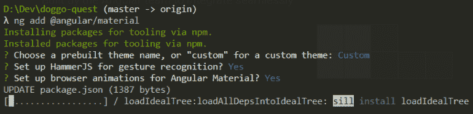

# 导入材料组件

现在我们已经安装了 Angular 材质，我们还需要告诉 Angular 我们想把它作为可以注入各种组件的东西包含进来。

我们通过进入`app.module.ts`并为我们想要在顶部使用的每个组件添加一个导入来实现这一点。在本文中，我将使用 Material 中的 5 个控件，所以现在我将导入它们:

```
import {MatCardModule} from '@angular/material/card'; 
import {MatInputModule} from '@angular/material/input'; 
import {MatButtonModule} from '@angular/material/button'; 
import {MatToolbarModule} from '@angular/material/toolbar'; 
import {MatIconModule} from '@angular/material/icon';
```

接下来，向下滚动到模块定义的导入列表，我将这些内容声明为模块导入的内容:

```
imports: [ 
BrowserModule, 
BrowserAnimationsModule, 
MatInputModule, 
MatCardModule, 
MatButtonModule, 
MatToolbarModule, 
MatIconModule 
],
```

这是我最不喜欢 Angular 的一个方面，但是，谢天谢地，一旦一个项目有了动力，你就不需要经常这么做了。

# 自定义角度材料样式

材质主题只是一些常见功能的颜色组合，所以定制一个主题一点也不困难。在我的例子中，我想要一个带有蓝色和绿色的深色主题。

进入你的`src`目录下的`Styles.scss`文件，看一看，明白我的意思。

在我的例子中，我将原色和强调色定义中命名的颜色分别调整为青色和绿色:

```
$doggo-quest-primary: mat-palette($mat-cyan); 
$doggo-quest-accent: mat-palette($mat-green, A200, A100, A400);
```

我还把`mat-light-theme`的功能引用改成了`mat-dark-theme`。

为了得到我想要的高级定制，这就是我要做的全部事情。

*注意:我在这个文件的底部添加了一些定制的全局样式类，它们是应用程序最终外观所需要的。它们不是我们在这里讨论的核心，所以我不打算讨论它们，但是如果你感兴趣的话，可以查看一下* [*文件的全文*](https://github.com/IntegerMan/DoggoQuest/blob/master/src/styles.scss) *。*

# 构建标题

让我们从简单的添加来自样机的标题栏开始。

进入`header.component.html`并粘贴以下代码:

```
<mat-toolbar> 
  <span>Doggo Quest</span> 
  <span class="spacer"></span> 
  <span>Score: {{Score}}</span> 
</mat-toolbar>
```

这里需要指出一些事情:

*   `mat-toolbar`使用 Angular Material 的[工具栏组件](https://material.angular.io/components/toolbar/overview)(注意组件库中的`mat`前缀)来呈现我们提供的一些自定义内容。
*   前缀`{{Score}}`告诉 Angular 将用户界面的那个区域绑定到组件类的一个`Score`属性的值

接下来，让我们进入组件的`.ts`文件，做一些修改来支持我们刚刚添加的视图中的变化。

首先，将`Input`添加到我们从 Angular Core 导入的内容列表中:

`import {Component, **Input**, OnInit} from '@angular/core';`

接下来，在类中定义一个新属性，如下所示:

```
@Input()
public Score = 0;
```

`@Input()`语法告诉 Angular，当一个组件在另一个组件内部被声明时，如果该组件选择了，那么它可以向`Score` *传递一个值。*

例如，我可以在另一个组件中定义`<app-header **Score=42** />`，它会适当地设置`Score`属性。

当您运行应用程序时，您*现在应该*看到标题栏:

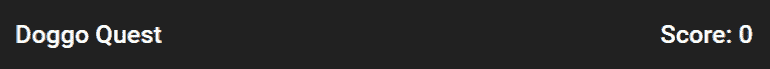

# 条件显示

现在让我们构建页脚组件，并在这个过程中演示一个角度指令。

在`footer.component.html`中添加以下 HTML:

这里我们引用了我们的两个组件，命令输入组件和游戏结束组件，玩家可以在命令输入组件中输入游戏命令，游戏结束组件将显示游戏摘要。

注意这里的`*ngIf`语法。这是一个角度指令，告诉 Angular 仅在该子句中的条件为真时发射这些分量。这就是为什么我们希望游戏结束组件只显示`GameOver`是否为真，命令输入组件只显示`GameOver`是否为假。在 JavaScript 中表示否定)。

在这种情况下，我们绑定到组件内部的`GameOver`,我在本文中将其定义为常量 false:

```
@Input() 
public GameOver = false;
```

现在，如果你运行你应该看到“命令输入组件工作！”而不是“页脚工作！”。这是一个进步，因为页脚组件拥有正确的子组件。

# 表单和输入:命令输入组件

接下来，我们将详细介绍命令输入组件。

虽然这个组件对于本文来说相当愚蠢，因为它实际上并不处理您输入的任何内容，但 Angular Material 实际上有一些非常棒的表单控件。

使用以下 HTML:

好吧，这里有很多东西:

*   `mat-form-field`表示有棱角的材料会影响造型的区域。尽管有多个子级，但该级别及其下的所有内容都是文本框。
*   你会注意到这里控件上的一些有角度的材质属性:`matInput`、`mat-button`、`matSuffix`和`mat-icon-button`。这对于使用 Angular Material 来修饰现有的 HTML 元素而不到处使用自定义组件来说并不少见。
*   `mat-icon`代表一个谷歌风格的图标，将显示在输入框的右边。该元素的内容引用图标集中的特定图标。查看[文档](https://material.angular.io/components/icon/overview)了解更多详情。
*   我们通过属性在输入控件上操作焦点和自动完成，因为这样可以带来更好的用户体验。

同样，该控件现在几乎不起作用，但是您可以与它进行交互，并看到占位符动画和主题正常工作:

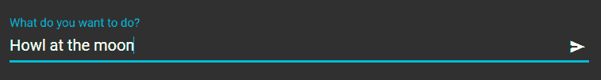

# 卡片、事件和属性

既然我们在应用程序中有了素材，并且工作正常，我们就可以提炼应用程序的主体来使用它。

回到`app.component.html`，用下面的代码替换它的 HTML:

```
<mat-form-field class="command-area">
  <input matInput type="text" placeholder="What do you want to do?" autofocus autocomplete="off">
  <button mat-button matSuffix mat-icon-button aria-label="Submit">
    <mat-icon>send</mat-icon>
  </button>
</mat-form-field>
```

这里有一些注意事项:

*   `mat-card`及其相关标签都指的是角形材料[卡片组件](https://material.angular.io/components/card/overview)，这是一种为你的应用程序添加完美视觉结构的非常简单的方式。
*   `(window:resize)="onResize()"`是一个语法，告诉 Angular 每当窗口的`resize`事件触发时调用这个组件中的`onResize`方法。我使用这个事件来调整一个`ContentHeight`属性。
*   `[style.height.px]="ContentHeight"`告诉 Angular 在该元素上保持一个内联样式，将其高度设置为控件上`ContentHeight`的数值，并且该值表示像素值。
*   `#scrollMe`告诉 Angular 在元素上生成一个`id="scrollMe"`，但也允许 Angular 的视图引擎将该元素与后面的代码挂钩。

这是一段有些复杂的代码，我想在介绍性文章中稍加解释，因为这段代码是自动扩展卡片以填充用户界面可用高度的系统的一部分，但我认为解释本文中的语法可能是有益的。

# 故事和玩家命令文本

故事和玩家命令文本节点将显示在主可视区域中，并且只是以适当样式呈现内容的控件。

故事文本组件使用简单的 HTML，用`<p>{{Text}}</p>`作为它的整个 HTML 模板。

类似地，播放器命令组件使用稍微详细一些的模板:

```
<code> 
  <mat-icon inline="true">chevron_right</mat-icon> 
  {{Text}}
</code>
```

这只是向模板添加了一个图标和预格式化的文本样式。

这两个控件都依赖于它们的类定义中的一个条目:

```
@Input() 
public Text: string;
```

如果您运行应用程序，它们都不会呈现，因为还没有组件包含它们。让我们现在改变这一点。

# 添加文章文本

进入`story-view.component.html`，您现在可以定制模板，以使用我们刚刚定制的两个组件:

这只是占位符文本，但它足以完成我们的用户界面。

# 最终产品

现在一切都正常工作了，您可以后退一步，看看本文的结果:

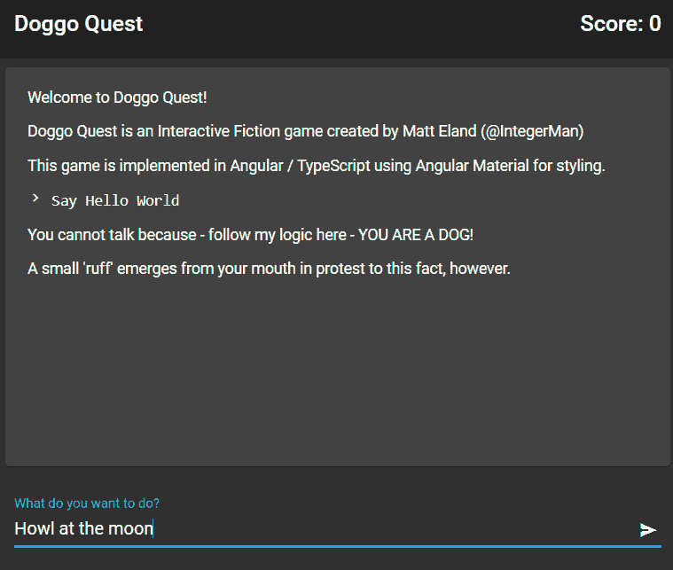

虽然这肯定不是一个复杂的或者甚至是功能性的应用程序，但是您可以看到 Angular 如何让我们快速开始，Angular Material 为我们提供了我们需要的可视化框架，以最少的工作量开始运行。

完整的代码可以在 GitHub 的[mockuptangularmamaterial 标签](https://github.com/IntegerMan/DoggoQuest/tree/MockupToAngularMaterial)上获得。

这个应用程序才刚刚开始，请继续关注其他文章，详细介绍如何使应用程序的其余部分正常工作，从单击事件和事件处理到行呈现，再到文本解析和状态管理逻辑。

会很有意思的。

【https://killalldefects.com】原载于 2020 年 2 月 5 日[](https://killalldefects.com/2020/02/05/from-mockup-to-angular-material/)**。**