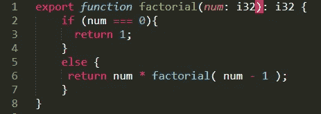
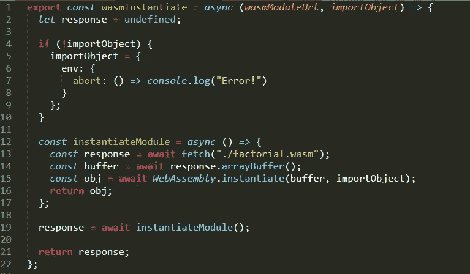
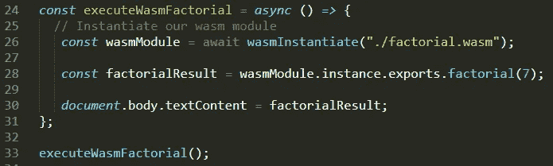
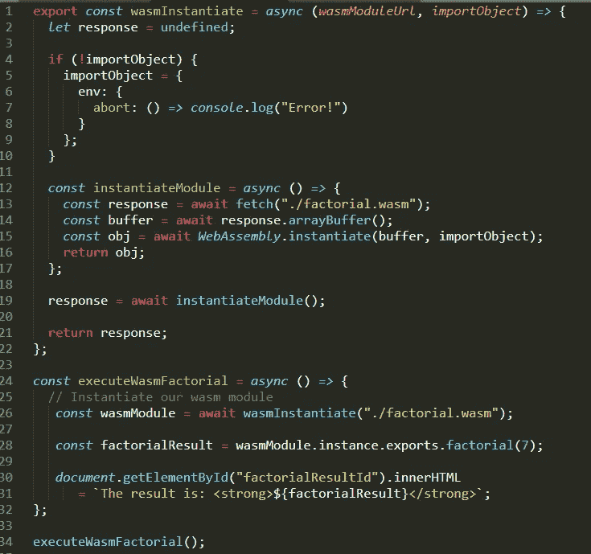
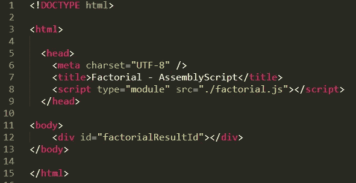
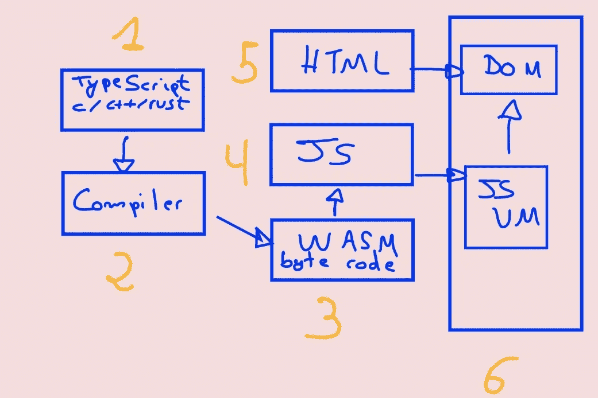
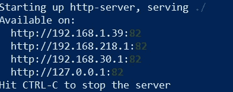

# 从 TypeScript 到 WebAssembly 只需几个步骤

> 原文：<https://javascript.plainenglish.io/from-typescript-to-webassembly-in-few-steps-c76f98f00632?source=collection_archive---------0----------------------->

## 如何在 WebAssembly 中构建您的第一个程序


Photo by [Pixabay](https://www.pexels.com/es-es/@pixabay?utm_content=attributionCopyText&utm_medium=referral&utm_source=pexels)

在本文中，我将向您展示如何将一个 TypeScript 程序编译成 WebAssemby 来打印一个数字的阶乘。

我将使用 TypeScript 编写它，然后用 [AssemblyScript](https://www.assemblyscript.org/) 编译它，后者使用 Binaryen 将 TypeScript 的严格变体编译为 WebAssembly(Wasm)。

WebAssembly 是当前的 MVP，只处理整数和浮点，本身不支持字符串或其他类型。出于这个原因，我将编写一个函数，它接受一个数值类型的参数并返回其对应的阶乘，而不是使用字符串的典型 HelloWorld。

# 为什么是 Wasm？

使用 WebAssembly 最常见的原因之一是它的速度。特定上下文中的速度是必不可少的，并且可以证明牺牲其他因素(如开发人员经验、可靠性或可维护性)是合理的。所以，要小心。

# 在 TS 中创建阶乘函数

我们的 factorial.ts 文件导出一个 factorial 函数，该函数接受一个数值并返回相应的阶乘数。

**factorial.ts 文件**

```
export function factorial(num: i32): i32 {
    if (num === 0){ 
      return 1; 
    }
    else {
     return num * factorial( num - 1 );
    }
}
```



# 将 TypeScript 阶乘函数编译为 Wasm

在这一步中，我将使用 AssemblyScript 编译器将其编译成 wasm 模块，它将输出相应的 factorial.wasm 文件。

首先，我将把编译器作为一个全局 npm 包安装，这样我就可以很容易地使用它(你需要在你的计算机上安装[NPM](https://www.npmjs.com/get-npm)):

```
npm i -g assemblyscript
```

一旦安装了编译器，我们就可以用命令<asc sourcefile.ts="" destinationfile.wasm="">来使用它:</asc>

**factorial.wasm**

```
asc factorial.ts -b factorial.wasm
```

# 整合所有

接下来，我将创建一个 factorial.js **JavaScript** 文件，并添加一个使用 WebAssembly Web APIs 加载 Wasm 模块的函数:

**factorial.js**

```
export const wasmInstantiate 
= async (wasmModuleUrl, importObject) => {
  let response = undefined; if (!importObject) {
    importObject = {
      env: {
        abort: () => console.log("Error!")
      }
    };
  } const instantiateModule = async () => {
    //1.
    const response = await fetch("./factorial.wasm");
    const buffer = await response.arrayBuffer();
    //2\.  
    const obj = await WebAssembly.instantiate(buffer, importObject);
    return obj;
  }; response = await instantiateModule(); //3.
  return response;
};//...
```

1.  我将使用 Fetch 方法下载模块。
2.  这里，我们实例化 Wasm 模块。
3.  退回 Wasm 模块。



factorial.js part 1 file.

```
//...const executeWasmFactorial = async () => {
//1.
const wasmModule
     = await wasmInstantiate("./factorial.wasm");//2\. 
const factorialResult 
     = wasmModule.instance.exports.factorial(7);//3.
document.getElementById("factorialResultId").innerHTML  
      = `The result is: <strong>${factorialResult}</strong>`;
};executeWasmFactorial();
```

1.  实例化 wasm 模块。
2.  从 Wasm 调用我们的阶乘函数 export。
3.  将结果设置为我们的 HTML“factorial resultid”元素。



factorial.js part 2 file.

加入所有:



factoria.js complete file

**Index.html**

最后，我必须将 factorial.js 文件作为 ES6 模块加载到我们的 index.html 中:

```
<!DOCTYPE html><html>

  <head>
    <meta charset="UTF-8" />
    <title>Factorial - AssemblyScript</title>
    <script type="module" src="./factorial.js"></script>
  </head><body>
 <div id="factorialResultId"></div>
</body></html>
```



index.html file.

# 最终文件夹结构


folder structure.

# 摘要



From TypeScript to Wasm byte code.

1.  带有 factorial 函数的 TypeScript 文件计算一个数的阶乘。
2.  从 typescript 文件编译为 Wasm 文件。
3.  Wasm 模块计算一个数的阶乘。
4.  factorial.js 文件加载 Wasm 模块，并从 Wasm 模块执行数字 7 的 factorial 函数。
5.  index.html 文件导入 factorial.js 文件。
6.  浏览器。

# 执行它

为了简单起见，我将使用一个零配置的命令行 http 服务器:

在代码的文件夹中执行 [http-server](https://www.npmjs.com/package/http-server) 。

```
npm i -g http-serverhttp-server -p 82
```



The http-server running


Final result.

我们有一个 Wasm 字节码阶乘程序正在运行。

# 结论

在本文中，我开发了一个简单的例子，但我认为它有助于了解它的威力。

但是请记住，虽然性能对于任何技术来说都是一个基本因素，但我不认为它是最重要的因素，除非在特定的环境中。

如果你喜欢这篇文章，可以考虑通过我的[个人资料](https://kesk.medium.com/membership)订阅 Medium。谢谢大家！