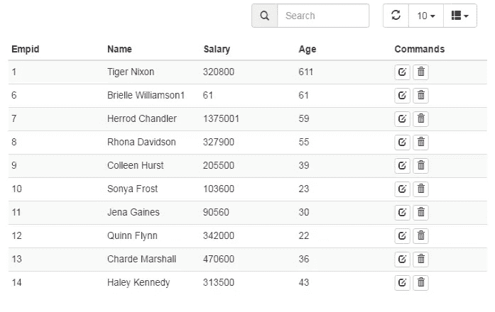
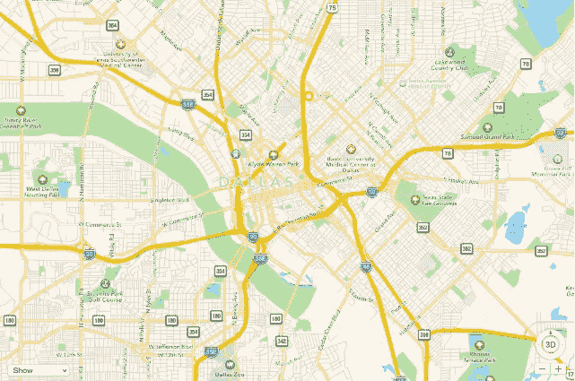
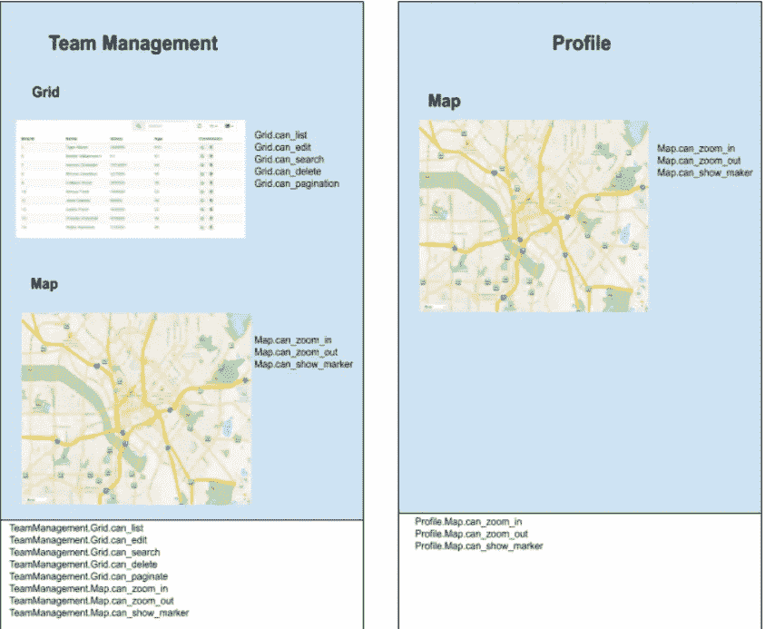
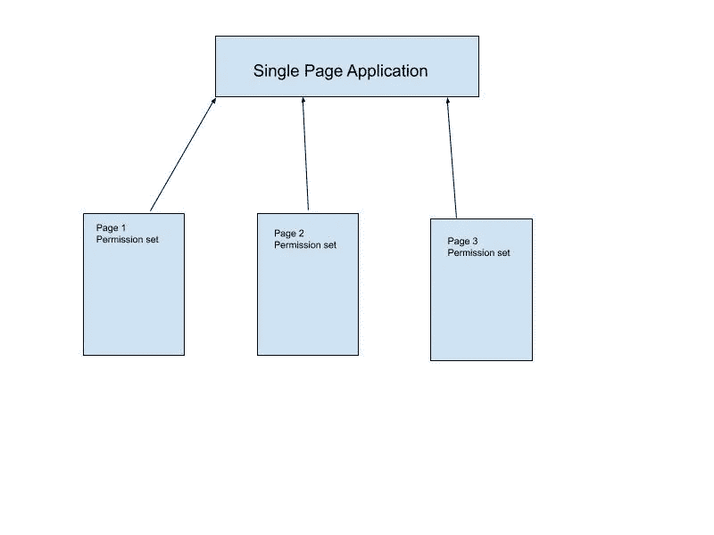

# 一种新的单页面应用程序前端授权方法

> 原文：<https://javascript.plainenglish.io/front-end-authorization-model-for-single-page-applications-eb3dc1fd228b?source=collection_archive---------5----------------------->

## ***自下而上*** 组件基础权限


Photo by [John Salvino](https://unsplash.com/@jsalvino?utm_source=medium&utm_medium=referral) on [Unsplash](https://unsplash.com?utm_source=medium&utm_medium=referral)

在我作为软件工程师职业生涯的早期，当我试图构建一个基于 Angular 的单页面应用程序时，我开始寻找各种方法来为单页面应用程序的前端执行授权。我发现大部分工程师都在做基于后端 API 的前端授权。

例如，如果一个角色或用户可以访问***can _ edit _ users***Api，那么只有在应用程序前端的网格上才能启用更新操作。这种方法的一个很大的缺点是，不能对不 ping 后端 Api 的前端操作进行授权。在本文中，我将讨论添加前端授权的另一种方式，我称之为 ***自底向上*** 基于组件的权限模型。

假设我们在单页面应用程序中使用了不同的前端组件。每个组件都有一组单独的操作，角色或用户可以执行这些操作。因为每个组件都有自己的一组操作，所以我们应该为该组件分配单独的权限集。例如，假设我们有一个网格组件。在这个网格中，用户可以列出、编辑、删除、分页和搜索一些数据。



现在，基于上面列出的操作，我们可以创建一个权限集，这将有助于这些操作的授权。

```
**Permissions Set:** can_list
can_edit
can_delete
can_search
can_paginate
```

现在，因为它们是 ***Grid*** 组件的一部分，Grid 应该被添加到这些权限的每一个之前，这样它们就不会与其他组件的权限集重叠。

```
**Complete Grid Permissions Set:** Grid.can_list
Grid.can_edit
Grid.can_delete
Grid.can_search
Grid.can_paginate
```

类似地，假设我们有另一个组件映射，我们将在我们的单页面应用程序中使用它。该组件将有自己的一组操作，因此也有自己的一组权限。正如我们在下图中看到的，用户可以放大，缩小，在地图上列出标记。因此，这个组件权限模型将

```
**Complete Map permission Set:** Map.can_list_markers
Map.can_zoom_in
Map.can_zoom_out
```



现在假设我们正在开发的单页面应用程序有不同的页面。其中一些页面将使用上述两个组件，其他页面可以使用其中任何一个，而其他一些页面将使用其他组件，这些组件将有自己的权限集。

让我们假设在我们的单页应用程序的许多页面中，有两个是团队管理和个人资料页面。团队管理页面呈现网格和地图组件，向用户显示所有雇员的列表以及他们在地图上的家庭地址，并带有标记。类似地，Profile 页面呈现地图组件，向每个用户显示他们当前的邮政地址。



正如您在上面的图表中所看到的，每个组件在 Team Management 和 Profile 页面中都有自己的权限集。因为这两个页面都是父组件，所以它们将在权限集中添加它们的名称，以便这些权限不会与其他页面权限集重叠。例如，“团队管理”页面中“地图”组件的权限已变为

```
*TeamManagement.Map.can_zoom_in
TeamManagement.Map.can_zoom_out
TeamManagement.Map.can_list_markers* 
```

但对于配置文件页面，权限集已成为

```
*Profile..Map.can_zoom_in
Profile.Map.can_zoom_out
Profile.Map.can_list_markers*
```

这是两组非常不同的权限。同样，每个页面都有自己的一组权限，这些权限可以被超级管理员分配给不同的角色/用户。



通过这种方法，超级管理员现在可以控制分配权限给任何页面或组件中的每个动作，这可以给他巨大的力量。

其次，这种方法具有很强的可扩展性。添加更多的页面或组件将自动增加权限集。同样，从单页应用程序中删除页面会减少权限集。

但是这种方法有一个很大的缺点。想象一个有这么多页面的应用程序，每个页面包含几十个子组件和动作。这可能会使权限集非常大，并使超级管理员无法将这些权限分配给每个角色。

然而，我们可以在应用程序的每一级引入另一种类型的权限(can_do_all_actions ),即组件级、页面级和应用程序级。在某个级别引入这种类型的权限将允许用户绕过该级别上的所有其他权限。

例如，在地图组件的情况下，我们的权限集现在将变为。

```
Map.can_zoom_in
Map.can_zoom_out
Map.can_show_markers
Map.can_do_all_actions
```

同样，配置文件页面的权限集将变为

```
Profile.Map.can_zoom_in
Profile.Map.can_zoom_out
Profile.Map.can_show_markers
Profile.Map.can_do_all_actions
Profile.can_do_all_actions
```

现在，当我们的超级管理员将分配一个用户*档案。Map.can_do_all_actions* 权限，用户可以在“配置文件”页面上的地图上执行所有操作。同样，拥有*Profile . can _ do _ all _ actions*权限将允许用户在 Profile 页面上执行任何类型的操作，无论该操作是在地图上还是在任何其他组件上。

当一个用户登录时，我们的单页应用程序将调用 api，并恢复超级管理员分配给该特定角色或用户的所有权限。我们的应用程序现在应该解析这个权限集，并在相应的页面和组件上使用它。

如果您喜欢本教程，请不要忘记向我们提供反馈。谢谢你的阅读！

[*德弗萨克斯*](https://devsaxe.com/) *是一家总部位于巴基斯坦拉合尔的咨询公司。我们为网络和移动应用、自动化测试、物联网解决方案和企业软件开发提供咨询服务。*