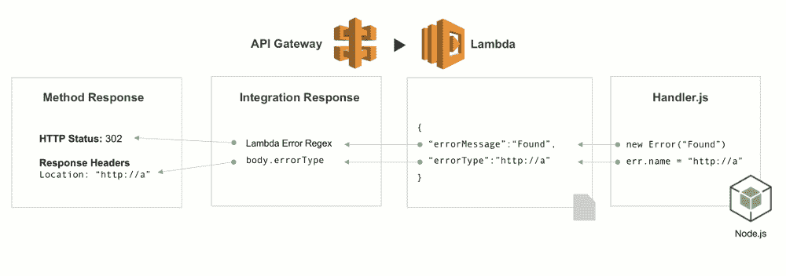
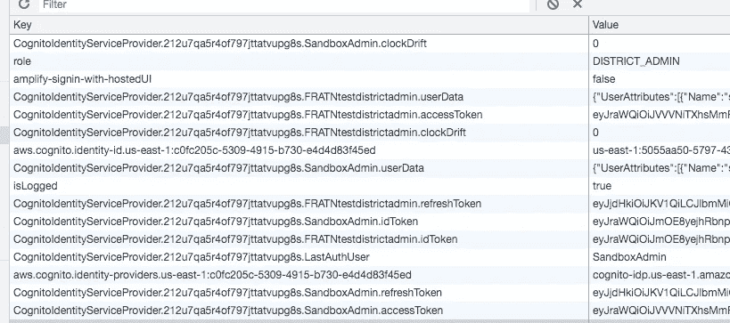

# 前端开发人员必须知道:本地存储与会话存储

> 原文：<https://javascript.plainenglish.io/front-end-developers-guide-to-localstorage-vs-sessionstorage-d3fcc8c597a0?source=collection_archive---------6----------------------->

# 一.导言

最近，我部署了一个使用以下技能构建的 web 应用程序

*   反应(还原)
*   AWS (API 网关、Lambda、RDS (PostgreSQL)、Amplify)

*关于我如何实现 AWS 无服务器后端的一点解释*

*   *主要组件有* ***API 网关****|****λ****|****RDS****|****放大***
*   ***API 网关*** *接收来自客户端的所有 API 调用，然后通过请求路由、组合和协议翻译将它们路由到适当的微服务(在我的例子中是 lambda)*
*   ***λ****做后端逻辑(类似 Node.js)*
*   **λ**对 **RDS** 的查询(PostgreSQL)

*   *AWS****Amplify****有一个内置功能，可以帮助我从前端轻松地与 AWS 组件交互*
*   *例如，使用提供认证 API*的 AWS***Amplify****认证模块，从前端认证用户要容易得多*

# 二。面临的问题😱

> 我希望前端记住当前用户

> AWS 似乎是通过将用户元数据保存在用户的浏览器本地存储上来做到这一点的

*For example, AWS Cognito maintains values once user signs in*

save boolean value to localStorage as a key name “isLogged”

In addition to user authentication, I want to show different UI depending on user’s authentication status. For example, show PrivateComponent only to authenticated user

> 起初它似乎工作得很好，但事实并非如此…

## 当用户刚刚关闭标签页/窗口时，问题就出现了

*   如果用户通过单击“注销”适当地注销，它会清除所有本地存储并重定向到登录页面，如预期那样工作

*   **但是**，当用户刚刚关闭标签页/窗口时。它保持用户的身份验证。**安全问题**😱**！！**

> 安全问题！！用户无需知道登录信息即可登录

# 三。解决问题

# 将本地存储替换为会话存储

## 两次尝试都没有成功

## 1.超时空闲([https://www.npmjs.com/package/react-idle-timer](https://www.npmjs.com/package/react-idle-timer))

*   我在想，我可以通过使用超时空闲功能，强制用户在特定时间后退出
*   例如，我将超时设置为 30 分钟

*   它**不工作**😥因为一旦用户关闭窗口/标签，超时计时器就不再计时

## 2.卸载前事件

*   我想在从窗口 API 卸载事件之前使用
*   它在窗口、文档及其资源即将被卸载时被触发
*   问题很明显…它**没有工作**😥因为它允许用户在页面刷新时注销(窗口…即将被卸载)

# 四。解决方案和结论

**通过将本地存储更改为会话存储**

## 但是，为什么呢？

**本地存储**和**会话存储**在许多方面相似，但在某些方面也有所不同

**会话存储(对比本地存储)**

*   只要浏览器打开，页面会话就会持续，并在页面重新加载和恢复后继续存在

## *重要*关闭标签/窗口会结束会话并清除 S `essionStorage`中的对象

*   因为一旦用户关闭窗口或标签，存储在会话中的数据就过期了，所以当用户关闭窗口或标签时，不会再有用户会话过期的安全问题

# TL；速度三角形定位法(dead reckoning)

> LocalStorage 和 SessionStorage 的主要区别之一是，一旦窗口或选项卡关闭，SessionStorage 就会过期

感谢您的阅读，并感谢任何反馈！您的反馈有助于成长和快乐:)