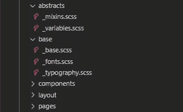
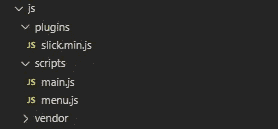

# 根据我的行业经验，前端 Web 开发最佳实践

> 原文：<https://javascript.plainenglish.io/front-end-web-development-best-practices-from-my-experience-in-the-industry-4c5bbc04c9e3?source=collection_archive---------0----------------------->

## 如果你还没有遵循这些，考虑马上开始

Photo by [Damian Zaleski](https://unsplash.com/@zal3wa?utm_source=medium&utm_medium=referral) on [Unsplash](https://unsplash.com?utm_source=medium&utm_medium=referral)

几个月前，我开始从事一个为期一年的 web 应用程序开发项目，我意识到有多少开发人员不太了解 web 应用程序前端开发的最佳行业实践。甚至我也没有意识到一些做法。所以我决定写这篇文章来分享我所知道的和我所学到的在开发 web 应用程序时应该遵循的最佳实践。

本文将关注前端开发中的最佳实践，因为根据我的经验，前端代码的质量是一个优秀 web 应用程序的最重要的决定因素，但大多数开发人员未能遵循这些实践并开发他们自己的组件。如果前端开发人员不遵循这些实践，管理代码将非常困难，整个设计将没有一致性，web 应用程序的速度也将产生负面影响。遵循这些实践将使代码变得干净和易于管理，并将提高所有开发人员的生产率。

在本文中，我将讨论构建项目前端架构、编写前端代码和准备部署时要遵循的最佳实践。所以让我们开始吧。

# 构建前端时的最佳实践

当你开始这个项目时，第一件事就是正确地构建前端代码架构。而这些都是每个项目前端开发人员需要遵循的最佳实践。

## 构建样式代码

在 styles 文件夹中，根据您的 web 应用程序为配置、基础、布局、组件和页面创建单独的文件夹。使用单独的版式文件来定义 web 应用程序中使用的所有 HTML 文本标签(如 h1、h2、…)的大小和颜色。颜色应该在一个变量文件中定义，用合适的名称给变量分配颜色，并在整个网站需要应用颜色时使用这些变量。将这些样式文件包含在创建的文件夹中，如下图所示。

screenshot of style file structure by author

然后，您可以将这些文件导入主样式文件。如果您在 web 应用程序中使用 scss，那么 main.scss 文件将类似于下面的代码。

## 构建 JS 代码

基本上，构建您的 JavaScript 意味着划分您的文件，并将您自己的 JavaScript 与来自其他地方的 JavaScript 分开。插件、供应商和脚本是我们可以将 JS 文件分成的三个主要文件夹。插件将包括我们在 web 应用程序中随处使用的有用代码段，如 jQuery 插件，供应商将是第三方 JavaScript 代码，如框架和库，如 slick library，脚本文件夹将包括我们为 web 应用程序逻辑编写的脚本。

screenshot of js file structure by author

# 编写前端代码时的最佳实践

## 使用 CSS 预处理器

不要在你的 web 应用中写纯 CSS 代码，耶！甚至你的一些组件也没有。总是使用像 SCSS 或萨斯的预处理器，并坚持上面提到的主要风格结构。

## 不要保留空的 SRC 或 HREF

在某些浏览器中，空的`src`或`href`属性会触发不必要的服务器请求，从而浪费带宽和服务器资源。所以最好避免在我们的代码中使用它们。

## 避免使用 CSS 表达式

CSS 表达式如`calc()`函数经常被求值，这会降低页面的性能。相反，如果需要，可以使用类似`box-sizing`的属性。

## 为您的自定义样式使用自定义父类

如果要为页面或组件编写自定义样式，请始终使用自定义父类。这可以确保你不会不小心覆盖了其他人的风格。也不要在样式代码中使用太多的嵌套类，使用一个父类就可以了，并且易于管理。通过使用太多的类来过度指定样式也会增加文件的大小。

## 仅使用全球创建的响应性排版样式

在全局排版中定义响应文本标签，并在 HTML 代码中始终使用这些定义的标签。对于单个组件和页面，不要编写自定义字体大小。开发者应该保持 web 应用的一致性。

## 避免使用全局 JavaScript 变量

尽可能避免在 JS 代码中使用全局变量，因为使用它们会导致冲突。当你需要的时候，声明你自己的局部范围变量。

## 添加有意义的注释来描述您的代码

给代码添加注释是一个非常重要的品质，但是大多数开发人员都懒得去做。通过向代码添加有意义的注释，它将帮助其他开发人员理解您所做的工作，特别是如果您正在编写可重用的插件或组件。

# 准备部署时的最佳实践

## 缩小 JS 和 CSS

为了减小文件大小，缩小会删除文件中不必要的字符，从而缩短加载时间。当文件缩小时，注释和不必要的空白字符被删除。确保 web 应用程序正在加载缩小的 JS 和 CSS 文件，而不是原始文件。

## 删除重复的 JavaScript 和 CSS

大型 web 应用项目中可能出现的一个大问题是重复的 JS 和 CSS。通过遵循正确的文件结构，这可以最小化，因为它将易于查看和管理代码文件。删除重复的代码将提高应用程序的速度。

## **重构你的代码**

重新审视你的代码，尽可能简化，但也要确保不要破坏代码。如果您正在使用类似的函数，只做了微小的修改，那么您应该检查是否有可能修改原始函数，使其适用于那些类似的场景。

# 最后的想法

当你从事工业项目时，你需要遵循这些实践。这些实践将有助于使 web 应用程序开发过程更快，也将提高应用程序的质量。开发人员之间的冲突会更少，整个应用程序的一致性也会更高。

本文到此为止。希望你学到了新东西。

感谢您的阅读，祝您编码愉快！

## 进一步阅读

 [## 代码文档被破坏了——但是我认为 Swimm 可能已经修复了它

### 传统的文档管理系统让软件开发人员失望了，是时候来点新的了。游泳吗…

javascript.plainenglish.io](/code-documentation-is-broken-but-i-think-swimm-may-have-fixed-it-daaa7547d834) 

*更多内容请看*[***plain English . io***](https://plainenglish.io/)*。报名参加我们的* [***免费周报***](http://newsletter.plainenglish.io/) *。关注我们关于*[***Twitter***](https://twitter.com/inPlainEngHQ)[***LinkedIn***](https://www.linkedin.com/company/inplainenglish/)*[***YouTube***](https://www.youtube.com/channel/UCtipWUghju290NWcn8jhyAw)*[***不和***](https://discord.gg/GtDtUAvyhW) ***。*****

*****对缩放您的软件启动感兴趣*** *？检查* [***电路***](https://circuit.ooo/?utm=publication-post-cta) *。***