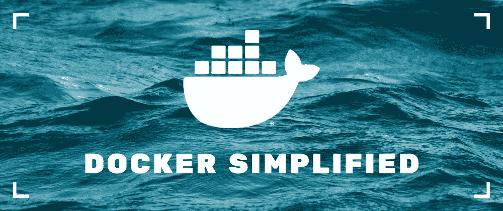
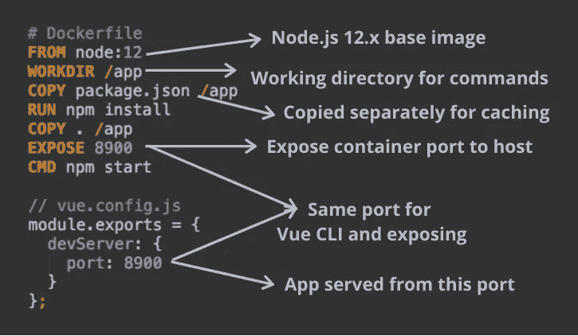
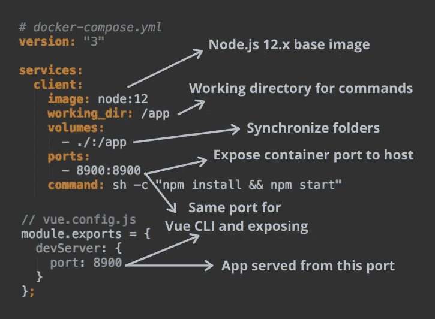
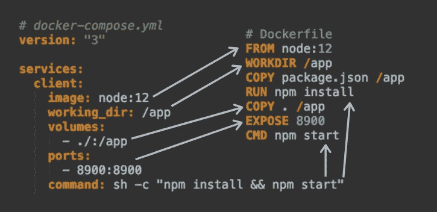

# 用 Docker 进行前端开发:简化指南

> 原文：<https://javascript.plainenglish.io/frontend-development-with-docker-a-simplified-guide-c869f6ee0fe8?source=collection_archive---------1----------------------->



Docker 是一个很棒的工具，可以帮助开发人员以标准化的方式更有效地构建、部署和运行应用程序。对于前端应用程序，我们只需要 Docker 映像进行本地开发，因为我们将它部署到一个静态托管提供商。在这种情况下，我们能没有自定义 Docker 图像吗？我们能有没有 Docker 时同样的开发体验吗？是的，这比你想象的要容易。

# 要求

假设一个应用程序，我们只需按下 start，一切都在运行。该设置可以是 React、Vue、Angular CLI 生成的任何应用程序。出于演示的目的，我将使用我的 [Vue Todo 应用程序](https://github.com/blacksonic/todoapp-vue)。

在开发过程中，我们将执行以下步骤:

*   使用`npm install`安装依赖项
*   用`npm start`启动应用程序
*   修改文件并在浏览器中检查更改
*   在编辑器中使用模块的代码补全
*   向`package.json`添加一个新的依赖项并安装它

# 自定义 Docker 文件

如果你用 Docker 在网上搜索前端开发，你可以找到很多使用自定义 Docker 图片的文章。让我们来看看它是如何工作的。



Dockerfile

[Docker 文件](https://github.com/blacksonic/todoapp-vue/blob/master/Dockerfile)从定义我们将要构建的基础映像(Node.js 12.x)开始(`FROM`，并将工作目录设置为`/app`文件夹(`WORKDIR`)。以`RUN`或`CMD`开头的每个命令都将这个文件夹作为默认工作目录。

下一步是复制源文件(`COPY`)并安装依赖项。我们将`package.json`与其他文件分开复制。为什么？因为 Docker 在多次构建映像时会缓存 Dockerfile 的每一步。当不修改任何内容并再次构建映像时，它不会做任何事情，因为步骤已被缓存。如果我们改变一个 Javascript 文件，Docker 将运行来自`COPY . /app`的命令。当我们修改`package.json`文件时，Docker 将重新运行来自`COPY package.json /app`的命令。

默认情况下，运行在容器内部特定端口上的应用程序在主机上不可用。我们必须使端口可用(`EXPOSE`)。只有在这之后，我们才能在我们的浏览器中键入 URL([http://localhost:8900](http://localhost:8900))并看到结果。

要运行这个映像，我们必须构建它并运行创建的容器。

```
# Build the image: docker build -t <image-name> <relative-path-to-dockerfile>
docker build -t client . 
# Run the image: docker container run -p <host port:container port> <image-name>  
docker container run -p 8900:8900 client
```

# 不足之处

上面的 Docker 图像可以工作，但是有多个缺点:

*   容器内生成的文件在主机上不可见，只能在容器内看到。这意味着我们在主机上看不到`node_modules`文件夹，正因为如此，我们失去了编辑器中的代码完成功能。我们不能将生成的`package.lock.json`提交到源代码控制，因为它在主机上也不可用。
*   我们必须停止、构建和重新运行依赖关系和文件变更的容器。我们失去了实弹射击的能力。

# 会见码头工人作曲

Docker 可以构建单个映像并运行构建的容器。Docker Compose 步骤更进一步，因为它可以同时构建和运行多个映像。在本教程中，我们不会使用众多的构建功能；我们将只使用它来克服前一个例子的缺点。

虽然我们可以使用之前的`Dockerfile`来运行 Docker Compose，但我们将使用它来跳过自定义图像的编写。



Docker Compose

Docker Compose 使用 [YAML 配置文件格式](https://github.com/blacksonic/todoapp-vue/blob/master/docker-compose.yml)，而不是用一系列命令定义图像。在`services`键下，Vue 应用程序的图像被命名为`client`。它相当于`docker build -t <image-name>`命令中的命名。这里的描述以同样的方式开始:定义基础映像(`image`)和设置工作目录(`working_dir`)。

关键的区别来自于`volumes`属性。通过使用它，本地文件夹与容器同步。如果我们在容器中执行`npm install`命令，那么`node_modules`文件夹也会出现在主机上:我们得到代码完成和锁文件。

应用程序也在容器中启动(`command: sh -c "npm install && npm start"`)，将端口暴露给主机对于浏览器访问是必要的(`ports`)。

要运行这个设置，我们必须构建它并运行构建的容器。

```
# Build the image and start the container 
docker-compose up
```

如果你看一下这两个解决方案，它们几乎是一样的。在`Dockerfile`中的命令和`docker-compose.yml`配置文件中的配置字段之间有很大的相关性。唯一的区别是它们如何处理挂载的文件，这解决了我们的同步问题。



Docker Compose vs Dockerfile

# 摘要

当进行本地开发时，拥有快速反馈循环和代码完成是很重要的。如果我们采用纯 Docker 解决方案，我们将失去这两者。我们不得不寻求 Docker 老大哥 Docker Compose 的帮助，帮助我们进行其文件夹同步。通过将我们的设置迁移到 Docker Compose，我们恢复了速度和代码完成。希望这一招对你有帮助，节省一吨开发时间。

特别感谢 [iben](https://twitter.com/iben12) 帮我进行设置。

*原载于 2020 年 1 月 16 日*[*https://dev . to*](https://dev.to/blacksonic/frontend-development-with-docker-simplified-254i)*。*