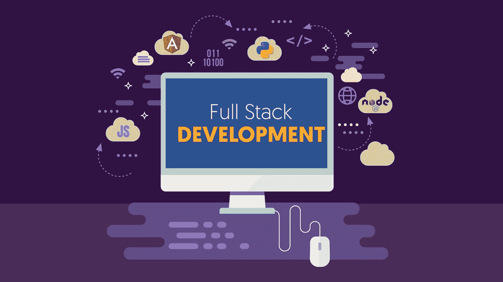
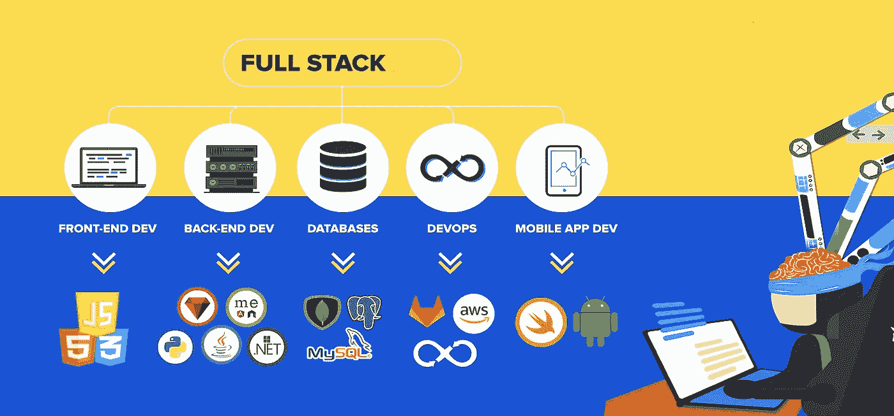
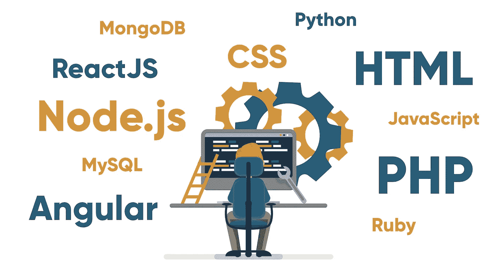

# 全栈开发者做什么？

> 原文：<https://javascript.plainenglish.io/full-stack-developer-explained-fdaceacf2487?source=collection_archive---------1----------------------->

什么时候有人说他是一个全栈开发人员，或者你看到一个同样的职位空缺，这到底意味着什么？什么是全栈开发？谁可以成为全栈开发者？我将解释所有这些问题，并告诉你一些成为全栈开发者的简单方法。

# 什么是全栈开发？

> 全栈开发是后端(服务器)和前端(客户端/浏览器)两方面的开发。

Credits: [Hacker Noon](https://www.google.com/url?sa=i&url=https%3A%2F%2Fhackernoon.com%2F6-essential-tips-on-how-to-become-a-full-stack-developer-1d10965aaead&psig=AOvVaw30lVkTOGZ5JRxZrf5eQy9a&ust=1581100324128000&source=images&cd=vfe&ved=0CAMQjB1qFwoTCIiC9uvHvecCFQAAAAAdAAAAABAq)

全栈开发来源于 [T 形开发者](https://medium.com/quick-code/what-it-is-a-t-shaped-developer-and-why-you-should-be-one-e87293e4bb84)的模式。T 型模型是一个已经存在了一段时间的概念，用来描述个人的能力或特征。一个理想的 T 型人拥有许多通用的技能，并在一个或几个特定领域有专长。

全栈开发者是前端和后端的专家；所以，组成一个网站的所有技术。他们精通前端和后端语言和框架，以及服务器、网络和托管环境。为了达到这种知识的广度和深度，大多数全栈开发人员将花费多年时间从事各种不同的工作。

# 全栈开发者的类型

Credits: [SoftLogic Systems](https://www.google.com/url?sa=i&url=https%3A%2F%2Fwww.softlogicsys.in%2Ffull-stack-developer-training-in-chennai%2F&psig=AOvVaw30lVkTOGZ5JRxZrf5eQy9a&ust=1581100324128000&source=images&cd=vfe&ved=0CAMQjB1qFwoTCIiC9uvHvecCFQAAAAAdAAAAABAk)

行业中有许多类型的堆栈可用，如 MEAN、MERN、LAMP 等。让我们看看它们是什么。我不打算详细解释每一项技术。可以谷歌一下:)

**1:平均栈:**蒙哥||快递||角||节点

**2: MERN 栈:**蒙哥||快递||反应||节点

**3: MEVN 栈:**蒙哥||快车|| VUE ||节点

**4: LAMP 栈:** LINUX || APACHE || MYSQL || PHP

**5: LEMP 栈:** LINUX || NGINX || MONGO || PHP

**6: Django 栈:**JAVASCRIPT | | PYTHON | | Django | | MYSQL

**7:Ruby on Rails:**JAVASCRIPT | | Ruby | | MYSQL | | Rails

> 在 LEMP 堆栈中，“E”代表 NGINX，因为它发音为“引擎 X”

# 如何成为全栈开发者？

要成为全栈开发人员，您需要积累多年的行业经验。你需要学习前端和后端语言，以及数据库和存储的细节。其实你不能只为了成为全栈开发者而学习；这一切都是为了不断地学习和获得尽可能多的前端和后端开发经验。

Credits: [Geeks For Geek](https://www.google.com/url?sa=i&url=https%3A%2F%2Fwww.geeksforgeeks.org%2Fhow-to-become-a-full-stack-web-developer-in-2019-a-complete-guide%2F&psig=AOvVaw30lVkTOGZ5JRxZrf5eQy9a&ust=1581100324128000&source=images&cd=vfe&ved=0CAMQjB1qFwoTCIiC9uvHvecCFQAAAAAdAAAAABAf)

# 为什么要成为全栈 Web 开发者？

如果可以选择专攻前端或后端开发，为什么会有开发人员选择学习所有领域呢？

又回到了做 T 型人的价值。当你能够处理和讨论 web 开发过程的两个方面并消除隔阂时，你对团队来说就更有价值了。

换句话说，如果一个开发人员能够在理解这种实现的技术限制的同时，很容易地评估和交流网站的外观、感觉和操作数据，那么他将成为任何团队或公司中受人尊敬和有价值的一员。

感谢阅读。

> 快乐编码||写作学习