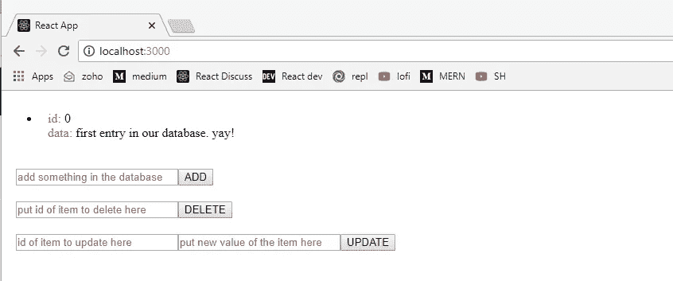
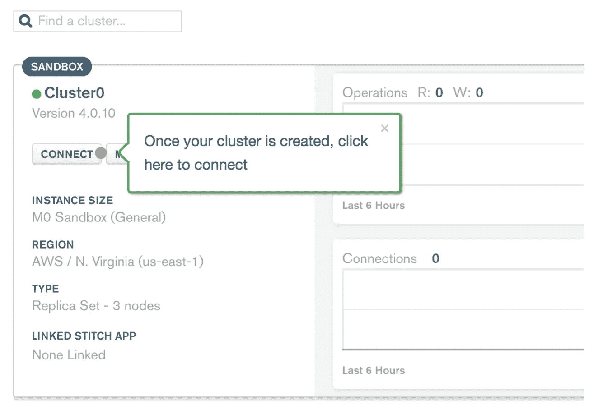
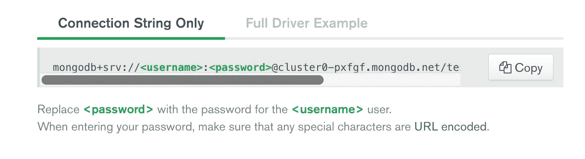

# 让我们构建一个完整的 MongoDB、React、Node 和 Express (MERN)应用程序

> 原文：<https://javascript.plainenglish.io/full-stack-mongodb-react-node-js-express-js-in-one-simple-app-6cc8ed6de274?source=collection_archive---------0----------------------->


“Pillars uphold the temple”

> 我用 React+Relay modern+graph QL+MongoDB+express 写了一篇更新的文章。看看这里的！

当我想从前端开发人员升级到全栈开发人员时，我很难找到一篇文章，其中包含了成为一名开发人员所需学习的所有不同技能的概念。

数据库知识、对后端语言的熟悉以及如何将后端与我的前端应用程序集成是我当时不知道的技能。这就是促使我写这篇文章的原因:为了帮助我自己和我的软件工程师同事，解决这个问题。

我已经在文章末尾包含了完整代码的 git 资源库链接，但是我建议您在查看 repo 之前一步一步地阅读本文。它会帮助你更好地理解教程。:)



“What will we build”

这是我们完成构建后应用程序的外观。

前端允许我们查看我们的数据库内的当前信息。它还允许我们向其中添加新数据、删除现有数据和更新现有数据。

我们将从零开始建造它。我们将建立自己的数据库，从头开始创建后端，并以最少的资源引导我们的前端。

所以，系好安全带，准备好你的编码手指！

# **首先最重要的事情**

让我们创建项目的主目录。这将持有我们的应用程序的前端和后端的代码。

```
*mkdir fullstack_app && cd fullstack_app*
```

然后，让我们从我们的前端开始。我们将使用 create-react-app 来引导我们的前端，这意味着我们将不必担心设置 Webpack 或 Babel(因为 create-react-app 在默认情况下会将这一切分类)。我们现在可以用 create-react-app 创建 react 应用程序了。为此，只需在命令行中键入以下任意内容。

```
*yarn create react-app client* npm init react-app my-app
```

我们还需要 Axios 来用 ajax 发出 get/post 请求。现在让我们安装它:

```
*npm i -S axios*
```

等待它完成，然后让我们继续在组织前端，以便它会很容易纳入我们的后端。

对于 PC 用户:

```
*del src\App.css src\App.test.js src\index.css src\logo.svg\*
```

对于 MAC 用户:

```
*rm src/App.css src/App.test.js src/index.css src/logo.svg*
```

然后，让我们编辑客户端文件夹中的 App.js 文件，让它呈现一些简单的内容。当我们准备好后端时，我们将进一步编辑这个文件。

“React app ready”

我们还必须编辑我们的 index.js 并从中删除一行代码。我们只需删除*导入。/index . CSS '；部分代码，我们现在可以启动我们的 react 应用程序。*

“index.js”

为了启动我们的前端，只需在命令行中键入。

`*npm start*`

然后在你的浏览器中输入[*http://localhost:3000/*](http://localhost:3000/)*。*您现在可以看到我们的前端已经启动并运行。

# 往后退一点点

是时候设置我们的后端了。回到我们的主目录，让我们从那里创建我们的后端目录。我们还将初始化这个目录，以便准备好我们的 package.json 进行构建。您的终端将提示您输入 package.json 的一些细节，只需一直按 enter 键，直到完成。

```
*mkdir backend && cd backend
npm init*
```

创建一个新文件，作为我们后端的主要代码，并将其命名为 server.js。这个后端代码非常简单，我创建它只是为了让初学者不必考虑代码的复杂性，而是考虑代码的意图。然后，他们可以很容易地操纵它，一旦他们把他们的头缠在它上面。为了便于理解，我在每个方法旁边都加了注释。

“Spine of every web app”

您可能已经注意到，在我们的后端代码中已经使用了数据库链接。别担心，这是我们文章的下一步。设置它也将像过去的几个步骤一样简单。首先，前往 M [*ongoDB atlas*](https://www.mongodb.com/cloud/atlas) 并在那里创建一个帐户。MongoDB Atlas 将让我们使用免费的 500 MB MongoDB 数据库，并远程使用它。它也托管在云中。这是我们行业的当前趋势，获得使我们能够使用云数据库的技能是当今真正的资产。

设置您的帐户后，登录您的帐户。按照网站提示的步骤创建自己的集群和集群/数据库用户。下面是创建自己的 mongoDB 数据库的清单或步骤。

1.  构建您的第一个集群。
2.  创建您的第一个数据库用户。
3.  将您的 IP 地址列入白名单(在我们的例子中，本地主机:3001)
4.  连接您的集群。

我们需要获取数据库的连接字符串，因此对于第 4 步，我们只需单击我们创建的集群的 connect 按钮，如下所示。



cluster connection

然后单击模态底部的“选择连接方法”，选择“连接您的应用程序”。然后，复制模态显示的字符串。



connection string

将这个字符串 uri 粘贴到 server.js 文件中。找到 *dbRoute* 变量，将带有您的凭证的链接作为一个字符串放在那里。

现在，回到我们的后端源代码。我们现在将配置我们的数据库，为此，创建一个名为 *data.js.* 的文件，其中应该包含以下代码。

“MongoDB, Baby”

我们快完成了！让我们只安装我们的后端的包和模块，我们准备好了。只需在命令行中传递这一行。

```
npm i -S mongoose express body-parser morgan cors
```

现在，如果我们使用

```
node server.js
```

我们可以在控制台中看到，它已经准备好，正在侦听端口 3001。让我们回到前端，开始创建向 MongoDB +节点发送动作所需的 ui。JS +快递。JS 系统。

啊，是啊！！！！

返回/client/src/App.js 并应用以下更改。

“React Rocks”

最后，我们编辑前端的 package.json，并在那里添加一个代理，指向部署后端的端口。

记住，这是我们前端的 package.json，所以它包含在客户端目录中。编辑那里。

现在，剩下要做的就是让我们可以同时启动后端和前端。

为此，请返回到我们项目的主目录，键入以下内容:

```
npm init -y
npm i -S concurrently
```

编辑我们主项目目录的 package.json。更改如下。

在这里，你可以看到在*“脚本”*键下，*“开始”*键使用了我们刚刚安装的包，并发包。该软件包使我们能够使用以下工具运行后端代码:

```
node server.js
```

前端代码使用:

```
npm start
```

有很多发生在引擎盖下能够做到这一点，但现在，我们将只是离开它，并为它的工作感到高兴！现在，要启动我们的应用程序，只需转到我们项目的主目录，然后键入:

```
npm start
```

一个包含我们的应用程序和*的浏览器将会打开，瞧！我们已经从零开始制作了我们自己的 MERN(全栈)应用程序！你可以随意摆弄它。把它当作一个沙盒，来把握这里两端的不同概念。*

哦，还有一件事。确保在你的浏览器上启用 CORS，因为我们通过自己的机器调用自己的 API。这里的是一个很好的插件。😬

正如承诺的那样，这是 git 回购协议。

# 各位，干杯！

我希望我已经提供了明确的指示，并且我能够尽可能多地将知识传递给你，读者。

如果你觉得这很有用，一定要留下一些掌声！哦，也在你的社交平台上分享吧！:)

*更多内容敬请关注*[***plain English . io***](http://plainenglish.io)**和上**[**我们的 YouTube 频道**](https://www.youtube.com/channel/UCtipWUghju290NWcn8jhyAw) **！****

**[](https://newsletter.plainenglish.io/) [## 上周简明英语评论

### 《上周简明英语》——科技世界的每周综述，散布着我们认为你会…

时事通讯. plainenglish.io](https://newsletter.plainenglish.io/)**