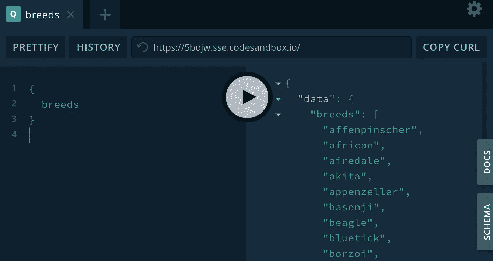
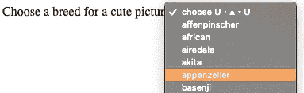
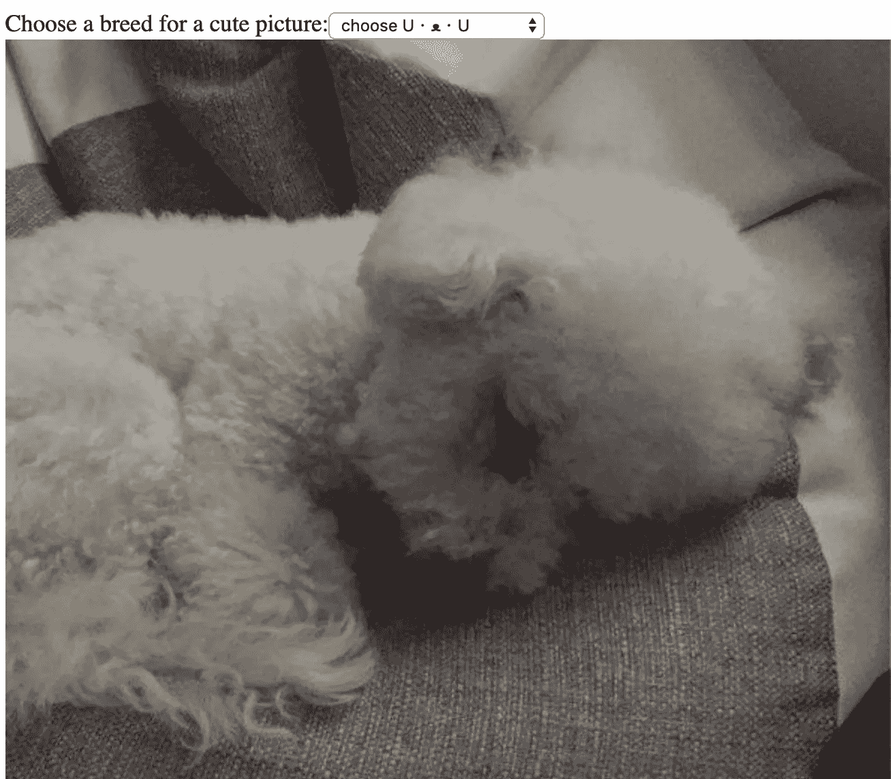
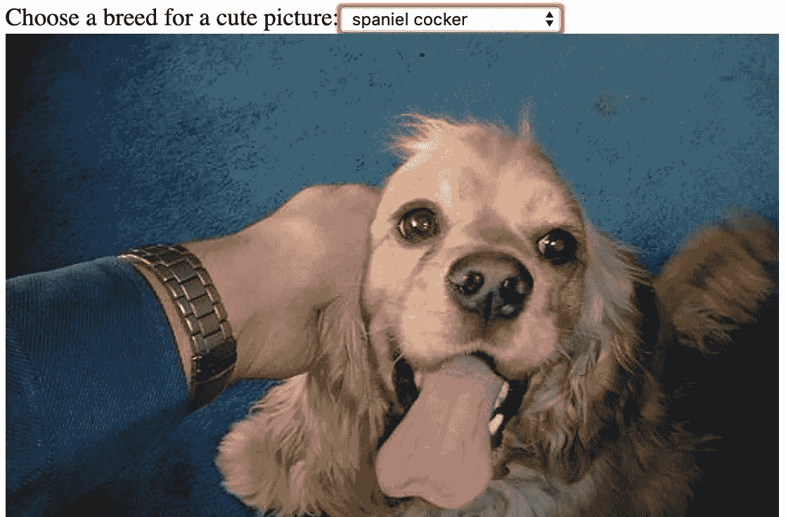

# 全栈 JavaScript + GraphQL 在 5 '与代码沙箱

> 原文：<https://javascript.plainenglish.io/fullstack-javascript-graphql-in-5-with-code-sandbox-374cfec2dd0e?source=collection_archive---------2----------------------->


Paxos, Greece

在生活中，我最喜欢的事情莫过于[代码沙箱](https://codesandbox.io)了，而且它们都不在🧡科技馆，当我发现你现在可以将它用作 GraphQL 服务器，几乎可以取代已被弃用的 Apollo Launchpad 的功能时，我的爱更加强烈了。阿波罗团队实际上在他们的优秀文档中使用了代码沙箱！

你所需要的只是通过点击[https://codesandbox.io/s/apollo-server](https://codesandbox.io/s/apollo-server)来旋转一个，修改它以返回你想要的数据，然后创建一个新的沙箱，用一个 Apollo 客户端指向你将在操场上找到的 uri。

未来就是现在！

如果“您需要做的所有事情”部分看起来确实需要很多工作，请抽出五分钟时间，跟随我向您解释**您也可以**使用代码沙箱创建自己的 GraphQL 层，并使用它来服务您在不同的沙箱中创建的前端客户端。

# 服务器

如上所述，第一件事是点击[https://codesandbox.io/s/apollo-server](https://codesandbox.io/s/apollo-server)，这将使您开始使用一个解析`hello`查询的服务器。您可以使用右边的操场自动完成，确认它确实返回了“Hello world！”。

(如果你不熟悉 GraphQL 查询，你只需要`{ hello }`

您可以在代码窗格中修改您的模式和解析器，以返回一些硬编码的数据，只是为了让您的 UI 正常工作，或者您可以冷静地通过现有的 RESTful API 进行代理。

我喜欢阅读方便的[public-API Github repo](https://github.com/public-apis/public-apis)，这次引起我注意的是基于斯坦福狗数据集的 [Dogs API](https://dog.ceo/dog-api/) 。所以让我们更新我们的`typeDefs`来返回一系列品种！

如果你现在试图在操场上运行一个`{ breeds }`查询，你会得到一个错误，因为我们还没有为它实现一个解析器。所以让我们试着击中[https://dog.ceo/api/breeds/list/all](https://dog.ceo/api/breeds/list/all)端点！它似乎返回了一张所有品种及其子品种的地图，所有这些品种都在`message`地产内。

(我们引入了`node-fetch`作为依赖项，这样我们就可以在服务器端的浏览器中使用熟悉的 fetch API。您的应用程序最初应该会崩溃，因为没有安装该依赖项，但代码沙箱足够智能，会询问您是否要安装它；你所要做的就是点击一个按钮！)

我已经把上面的内容放在一个新文件中，`breeds.js`，所以让我们把它放在我们的`index.js`中，用它来代替默认的`hello`解析器:

尝试在操场上再次运行我们的查询，我们应该得到一个不同的问题:“预期的 Iterable，但没有找到一个字段查询。品种”…当然，我们已经定义了我们将返回一个数组，但我们实际返回的是一个对象！

GraphQL 不支持动态键，所以我们不能在`typeDefs`端做任何太聪明的事情:我们将不得不修改我们的`breeds.js`来实际返回一个字符串数组。如果你很急，一个简单的方法是最后只看`Object.keys(message)`,这会给你一个所有品种的数组，但是如果你也喜欢子品种，你可以试试这样的东西:

不管怎样，如果您现在在操场上重新运行查询，您应该最终获得一些实际的数据！



🎉🎉🎉

太好了！

您可能会注意到，游乐场的 uri 是一个实际的链接，您可以在任何浏览器上点击它并获得同一个游乐场。我上面的是[https://5bdjw.sse.codesandbox.io/](https://5bdjw.sse.codesandbox.io/)但是用你最后用的那个试试吧！

…这是否意味着我们可以将该 uri 提供给任何 GraphQL 客户端，并且它会用数据正确地响应我们的查询？

# 客户

答案是肯定的！让我们从 [React + TS](https://codesandbox.io/s/react-ts) 模板代码沙盒提供的开始:[https://codesandbox.io/s/react-ts](https://codesandbox.io/s/react-ts)

使用`apollo-boost`并感谢它过多的隐式依赖，我们只用几行代码就可以完成`apolloClient.ts`的工作:

(同样，代码沙箱会因为缺少依赖项而崩溃，只需不断点击按钮添加它们，直到满意为止)

有了这个文件，我们就可以把我们的`App.tsx`和一个 ApolloProvider 连接起来了！

使用 ApolloProvider，我们可以编写一个组件在其中呈现，运行我们的`apolloClient`可以满足的 GraphQL 查询！让我们创建一个下拉列表，列出我们所有的狗品种！

最后用在`App.tsx`里吧。

如果你看看嵌入式浏览器，你应该得到的东西不会太寒酸！



🎉🎉🎉

所以**你已经**用代码沙箱完成了全栈 Javascript + GraphQL！呜哇！你真的是 5 英尺吗？我很想知道！

无论如何，我们可以稍微突出一点爬行的特点，在页面上放一张可爱的小狗图片，怎么样？现在，您应该对这个过程更加熟悉了！

# 更新模式并添加解析程序

所以回到服务器沙箱，我们将用我们想要的新东西更新我们的`typeDefs`:当给定一个品种的字符串时，返回一个字符串、一个图像链接的查询。

够简单！现在来实现解析器:根据[狗文档](https://dog.ceo/dog-api/documentation/breed)，点击[https://dog.ceo/api/breed/VALID_BREED_HERE/images/random](https://dog.ceo/api/breed/VALID_BREED_HERE/images/random)将再次获得一个`json`有效载荷，在其`message`键中有该品种的随机图片。这是一个稍微复杂一点的子品种，因为你需要点击[https://dog.ceo/api/breed/BREED/SUBBREED/images/random](https://dog.ceo/api/breed/VALID_BREED_HERE/images/random)…

不过，找出路径并不疯狂:

但是等一下！为什么`breed`是该方法的第二个参数，并且是从该处的一个对象析构的？！

这就是解析器的工作方式:调用解析器时，第一个参数是整个被解析的对象(在我们的例子中是空的)，要解析的查询的 arguments 对象，以及 context 对象，在 context 对象中，您通常会放置一些东西，比如身份验证，或者获取您的模型的存储，或者任何我们在这里不会用到的东西。

我们所关心的是 arguments 对象，对于这个查询来说就是类似于`{ breed: 'frise bichon' }`的东西。

因此，让我们导入并添加该解析器以及我们为品种创建的解析器:

这样，服务器端就解决了！在操场上试一试，查询如下内容:

```
{
 randomPictureForBreed(breed: "frise bichon")
}
```

你应该得到一个可爱图片的链接，这远不如**看到**可爱图片本身。所以让我们回到客户端，使用我们的新解析器！

# 带有变量的 useQuery

因此，在客户端，我们需要做本文中最棘手的事情:实现一个如上查询的组件，但是要有一个动态的品种。

这不**太**棘手了。它类似于我们的`BreedSelector.tsx`，但是当我们调用`useQuery`时，我们将传递变量；将变量传递给方法是我们的工作，所以这不是棘手的部分！

`gql`查询本身就是一个具有非常具体和奇怪的语法的查询。您需要明确声明您正在编写一个查询并命名它，这样您就可以定义它将被一个变量调用，然后使用这个动态变量调用`randomPictureForBreed`解析器。

这是非常具体的 GraphQL，所以不要太担心；考虑下面的代码，随着你越来越多地使用它，它会变得越来越有意义，就像大多数事情一样😄

lines 5–9 is the gql, line 23 passing the variable

所以我们有了我们一直想要的组件！让我们用一个硬编码的道具在我们的`App.tsx`中渲染它，并从一张可爱的图片中获得回报，让我们继续前进！

浏览器预览中会发生什么？？？



🎉🎉🎉

噪音！不过，我们之前并不是为了好玩才实现这个下拉菜单的，所以让我们通过引入一些应用程序状态把它和我们正在显示的内容联系起来！

# 使用状态并上线

因为人们甚至会阅读不使用钩子的即时反应博客吗？好吧，告诉你吧，我们一直都在使用钩子，和阿波罗的`useQuery`一起，所以这应该不会太难！

我们的目标是让`BreedSelector`得到与我们的`breed`相同的`RandomPictureForBreed`，当用户从下拉菜单中选择不同的品种时，能够改变它。看起来像是给他们共同的父母`App`的工作！

让我们跟踪那里的`selectedBreed`，并给`BreedSelector`设定它的方法！

我们还给予`selectedBreed`到`RandomPictureForBreed`来代替我们的硬编码值，并且只有当它是真的时才呈现它；该查询永远不会使用空字符串作为品种，所以在选择某个项目之前呈现它是没有意义的。

我们最不需要做的就是让`BreedSelector`期待并使用那些新道具！

lines 8, 17 and 18 are the important changes!

玩转嵌入式浏览器中的下拉菜单，获取最终回报！



呜哇。让我们花点时间拍拍自己的背。我们都是如此好的男孩/女孩🐶

# 结局？

对于可爱的狗狗图片来说，天空是极限，但是对于一个 MVP 来说，这应该足够了。在本文开始的时候，我已经为客户端[嵌入了代码沙箱](https://codesandbox.io/s/cute-dog-picture-generator-tph85)，这是服务器的沙箱。

Feel free to play around with both and extend them!

如果前端看起来不同，那是因为我为了好玩，用[材质-U](https://material-ui.com/) I 和[样式组件](https://www.styled-components.com/)稍微改变了一下样式。我还做了一些基本的错误处理和重取。你会对一部接一部的戏剧感兴趣吗，或者也许你会想知道更多关于…

# 测试

在我陷入这个令人惊叹的代码沙箱的兔子洞之前，我最初的目标只是搭建代码示例，然后展示如何使用优秀的[测试库](https://testing-library.com/)，以一种更加“集成”的方式测试利用`ApolloProvider`的 React 组件。

我认为上面的内容足够有趣，至少应该有一个帖子关注它！

所以让我知道你对它的看法，以及你是否会发现一个专注于测试的有用的，以及订阅/关注/无论你在 Medium 中做什么，当它出版时都会被通知😄

或者勇往直前，不断尝试；没有压力！