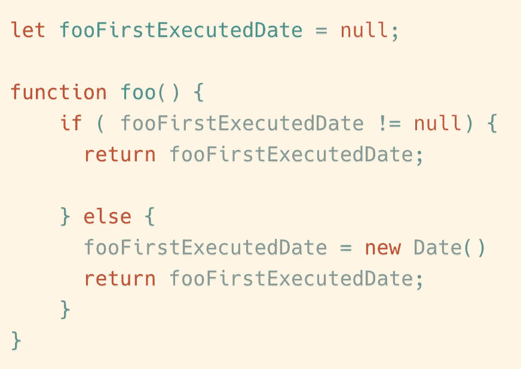

# JavaScript 中的函数比你想象的有更多的秘密

> 原文：<https://javascript.plainenglish.io/function-in-javascript-has-much-more-secrets-than-you-think-b3bf64055c99?source=collection_archive---------0----------------------->

## 高级 JavaScript 程序员必须知道的事情。


Photo by [Luca Bravo](https://unsplash.com/@lucabravo?utm_source=medium&utm_medium=referral) on [Unsplash](https://unsplash.com?utm_source=medium&utm_medium=referral)

函数是每个程序员都熟悉的语法。在 JavaScript 中，函数的地位非常高，通常被称为一等公民。但是你真的擅长使用函数吗？

这里我将介绍一些使用函数的高级技巧，希望对你有所帮助。本文包括以下几个部分:

*   纯函数
*   高阶函数
*   函数缓存
*   惰性函数
*   Currying
*   函数合成

# 纯函数

## 什么是纯函数？

满足以下两个条件的函数称为纯函数:

*   如果给出相同的参数，它总是返回相同的结果。
*   在函数的执行过程中没有副作用发生

示例 1:

```
function circleArea(radius){
  return radius * radius * 3.14
}
```

当半径值相同时，函数总是返回相同的结果。而且函数的执行对函数外部没有影响，所以这是一个纯函数。

示例 2:

```
let counter = (function(){
  let initValue = 0
  return function(){
    initValue++;
    return initValue
  }
})()
```


这个计数器函数每次运行的方式都会不一样，所以这不是一个纯函数。

示例 3:

```
let femaleCounter = 0;
let maleCounter = 0;function isMale(user){
  if(user.sex = 'man'){
    maleCounter++;
    return true
  }
  return false
}
```

在上面的例子中，函数`isMale`，给定相同的参数，总是有相同的结果，但是它有副作用。副作用是改变了全局变量`maleCounter`的值，所以不纯。

## 纯函数有什么用？

我们为什么要区分纯函数和其他函数？因为纯函数有很多优点，所以我们可以在编程过程中使用纯函数来提高我们代码的质量。

1.  纯函数更加清晰易读

每个纯函数总是完成一个特定的任务，并有一个确切的结果。这将大大提高代码的可读性，使编写文档变得更加容易。

2.编译器可以对纯函数进行更多的优化

假设我有这样一段代码:

```
for (int i = 0; i < 1000; i++){
    console.log(fun(10));
}
```

如果`fun`不是一个纯粹的函数，那么在这段代码运行时`fun(10)`需要被执行 1000 次。

如果`fun`是一个纯函数，编辑器将能够在编译时优化代码。优化后的代码可能如下所示:

```
let result = fun(10)
for (int i = 0; i < 1000; i++){
    console.log(result);
}
```

3.纯函数更容易测试

纯函数的测试不需要依赖于上下文。当我们为纯函数编写单元测试时，我们简单地给出一个输入值，并断言函数的输出满足我们的要求。

一个简单的例子:一个纯函数将一个数字数组作为参数，并将数组中的每个元素递增 1。

```
const incrementNumbers = function(numbers){
  // ...
}
```

我们只需要为它编写这样的单元测试:

```
let list = [1, 2, 3, 4, 5];assert.equals(incrementNumbers(list), [2, 3, 4, 5, 6])
```

如果不是一个纯函数，我们有很多外部因素要考虑，这不是一个简单的任务。

# 高阶函数

什么是高阶函数？

高阶函数是至少执行下列操作之一的函数:

*   接受一个或多个函数作为参数
*   返回一个函数作为结果。

使用高阶函数可以增加我们代码的灵活性，让我们能够写出更简洁高效的代码。

假设我们现在有一个整数数组，我们想创建一个新的数组。新数组的元素长度与原数组相同，对应元素的值是原数组值的两倍。

如果不使用高阶函数，我们可以这样写:

```
const arr1 = [1, 2, 3];
const arr2 = [];for (let i = 0; i < arr1.length; i++) {
    arr2.push(arr1[i] * 2);
}
```

在 JavaScript 中，数组对象有一个`map()`方法。

> `**map(callback)**`方法创建一个新的数组，其中填充了**对调用数组中的每个元素调用一个提供的函数**的结果。

```
const arr1 = [1, 2, 3];
const arr2 = arr1.map(function(item) {
  return item * 2;
});
console.log(arr2);
```

`map`函数是一个高阶函数。

正确使用高阶函数可以提高我们代码的质量。接下来的部分都是关于高阶函数的，所以让我们继续。

# 函数缓存

假设我们有一个像这样的纯函数:


```
function computed(str) {    
    // Suppose the calculation in the funtion is very time consuming        
    console.log('2000s have passed')

    // Suppose it is the result of the function
    return 'a result'
}
```

为了提高程序的速度，我们想缓存函数运算的结果。以后调用时，如果参数相同，就不再执行该函数，而是直接返回缓存中的结果。我们能做什么？

我们可以写一个`cached`函数来包装我们的目标函数。这个缓存函数将目标函数作为参数，并返回一个新的包装函数。在`cached`函数中，我们可以用`Object`或`Map`缓存前一次函数调用的结果。

这里有一个例子:


# 惰性函数

函数体通常包含一些条件语句。有时这些语句只需要执行一次。

我们可以通过在第一次执行后“删除”这些语句来提高函数的性能，这样函数就不需要在后续执行中执行这些语句。那就是懒功能。

例如，我们现在需要编写一个名为`foo`的函数，它总是从`first call`返回日期对象，注意“第一次调用”。



```
let fooFirstExecutedDate = null;
function foo() {
    if ( fooFirstExecutedDate != null) {
      return fooFirstExecutedDate;
    } else {
      fooFirstExecutedDate = new Date()
      return fooFirstExecutedDate;
    }
}
```

每次运行上述函数时，都需要执行判断语句。如果这个判断条件非常复杂，那么就会导致我们程序的性能下降。此时，我们可以使用惰性函数的技术来优化这段代码。

我们可以编写这样的代码:


```
var foo = function() {
    var t = new Date();
    foo = function() {
        return t;
    };
    return foo();
}
```

在第一次执行之后，我们用新函数覆盖原来的函数。以后执行该功能时，将不再执行判决语句。这将提高我们代码的性能。

那么我们来看一个更实际的例子。

当我们向元素中添加 DOM 事件时，为了兼容现代浏览器和 IE 浏览器，我们需要对浏览器环境做出判断:

```
function addEvent (type, el, fn) {
    if (window.addEventListener) {
        el.addEventListener(type, fn, false);
    }
    else if(window.attachEvent){
        el.attachEvent('on' + type, fn);
    }
}
```

我们每次调用`addEvent`函数，都要做一个判断。使用惰性函数，我们可以做到这一点:


```
function addEvent (type, el, fn) {
  if (window.addEventListener) {
      addEvent = function (type, el, fn) {
          el.addEventListener(type, fn, false);
      }
  } else if(window.attachEvent){
      addEvent = function (type, el, fn) {
          el.attachEvent('on' + type, fn);
      }
  }
  addEvent(type, el, fn)
}
```

综上所述，如果一个函数内部有一个条件判断只需要执行一次，那么我们可以用懒人函数来优化它。特别是在第一次判断后，用新函数覆盖原函数，新函数去掉条件判断。

# 函数 Currying

Currying 是一种将带有多个参数*的函数求值成带有单个参数的函数序列的技术。*

换句话说，当一个函数不是一次接受所有参数，而是接受第一个参数并返回一个接受第二个参数的新函数，然后返回一个接受第三个参数的新函数，以此类推，直到满足所有参数。

这就是我们把一个函数调用`add(1,2,3)`变成`add(1)(2)(3)`的时候。通过使用这种技术，可以轻松地配置和重用这个小部分。

为什么有用？

*   Currying 帮助你避免一次又一次地传递同一个变量。
*   它有助于创建高阶函数。这对事件处理非常有帮助。
*   小部分可以轻松配置和重用。

我们来看一个简单的`add`函数。它接受三个操作数作为参数，并返回三者之和作为结果。

```
function add(a,b,c){
 return a + b + c;
}
```

你可以用太少(结果奇怪)或太多(多余的参数被忽略)来调用它。

```
add(1,2,3) --> 6 
add(1,2) --> NaN
add(1,2,3,4) --> 6 //Extra parameters will be ignored.
```

如何将现有函数转换为 curried 版本？

## 代码:

## 示例:


# 函数合成

假设我们现在需要编写一个这样的函数:

> 输入' bitfish '，返回'你好，BITFISH '。

正如您所看到的，这个函数有两个组件:

*   串联字符串
*   将字符串转换为大写

所以我们可以这样写代码:

```
let toUpperCase = function(x) { return x.toUpperCase(); };
let hello = function(x) { return 'HELLO, ' + x; };let greet = function(x){
    return hello(toUpperCase(x));
};
```


在这个例子中只有两个步骤，所以 greet 函数看起来并不复杂。如果有更多的操作，greet 函数将需要更多的嵌套，编写类似于`fn3(fn2(fn1(fn0(x))))`的代码。

为此，我们可以编写一个专门用于组合函数的`compose`函数:

```
let compose = function(f,g) {
    return function(x) {
        return f(g(x));
    };
};
```

因此，通过`compose`函数可以得到`greet`函数:

```
let greet = compose(hello, toUpperCase);
greet('kevin');
```

使用`compose`函数将两个函数合并成一个函数，使得代码从右到左运行，而不是从里到外，从而使其可读性更好。

但是现在`compose`函数只能支持两个参数，我们真的希望函数可以接受任意数量的参数。

众所周知的开源项目[下划线](https://underscorejs.org/)就是这样实现 composer 函数的。


```
function compose() {
    var args = arguments;
    var start = args.length - 1;
    return function() {
        var i = start;
        var result = args[start].apply(this, arguments);
        while (i--) result = args[i].call(this, result);
        return result;
    };
};
```

通过函数组合，我们可以优化函数之间的逻辑关系，提高代码的可读性，并促进未来的扩展和重构。