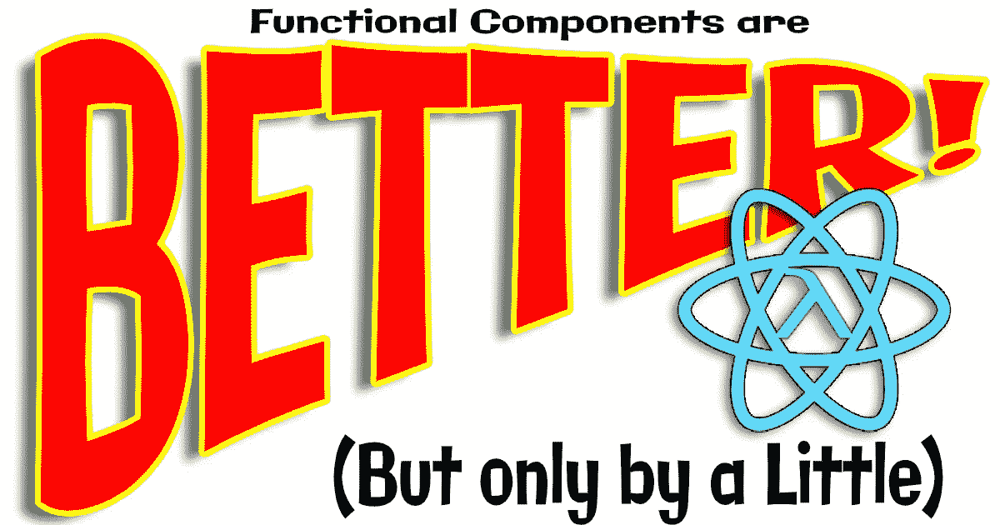

# 功能组件更好

> 原文：<https://javascript.plainenglish.io/functional-components-are-better-d6a889175b67?source=collection_archive---------0----------------------->

## 但只差一点点



Me and Photopea.com

# 很明显，React 中的直接函数组件比基于类的组件更简单。

我不是在没有一些精神痛苦的情况下得出这个结论的。我喜欢以不妥协的超然态度观察软件趋势。正在进行的 FP 对 OOP 的大讨论给出了一场反动的[猫战](https://medium.com/swlh/functional-programming-vs-object-oriented-programming-48eee6cf6830)的所有迹象。

站在辩论之外，保持一定的距离，在参与之前好好审视一下事情，总是很有用的。

> 有了这样的准备，我们就永远不会被观点冲昏头脑。—爱比克泰德

但是关于程序员的有趣的事情是，他们可能会对编码的本质和什么更好感到狂热，好像这是一个道德问题。

或者甚至是一个*审美*问题。有时候，程序员被情感所驱使，因为他们像音乐家热爱音乐一样热爱他们的艺术。

有时我们真的通过这个过程达到更好的技术。

在功能组件的情况下，我们正在做一些事情。

M 从心理上来说，作为 React 开发者，我相信我们正处于十字路口，我们可以简单地学习功能性 UI 组合(以及钩子),并完全忘记基于类的组件，除非我们需要为了遗留目的与它们交互。

这并不是因为功能组件+钩子是*所以*优越得多。功能性有优势，但并不特别。

但正如我所说的:从心理上来说，我们真的不需要在头脑中保持基于阶级的反应。这意味着更少的精神噪音。

这意味着更加简单。

越简单意味着越有创造力。

所以让我直截了当地说:我没有党派偏见。我热爱编码，因为它本身就是一件美好的事情。我见过许多令人惊叹的面向对象代码。

我认为功能组件优越的本质是:您可以逐渐增加复杂性。

简单就是非常简单，真的。

下面是最简单的功能应用:

```
<div id="app /> function WisdomComponent() {
  return <p>The good that ought to be the object of our earnest pursuit, is to be found only within ourselves.</p>;
}ReactDOM.render(<WisdomComponent />, document.querySelector("#app"))
```

所以我要说的重点是，这是力学欲望最简单的表达。这是组件的名称，这是输出。

下面是[类的版本](https://jsfiddle.net/mtyson/ycoutm8p/8/):

```
class WisdomComponent extends React.Component {
  render() {
    return <p>*If you want to improve, be content to be thought foolish and stupid.*</p>;
  }
}ReactDOM.render(<WisdomComponent />, document.querySelector(“#app”))
```

基于类的版本一点也不复杂。但是…我不能不查就把它打出来。它增加了一个与基类的交互层，位于绝对必要的元素之间。

本质上，函数允许在“哪里”和“什么”之间建立最清晰的联系。

在功能组件的情况下，我几乎可以。我可能需要查找`ReactDOM.render`调用，但是除此之外，我们只是在处理一个 JavaScript 函数和 JSX(在本例中实际上只是 HTML)。

我不知道你怎么样，但是我已经写了大约十亿个 JavaScript 函数。至少十亿，也许更多。所以这种风格在某种程度上是脱口而出的。它没有摩擦。

即使是很小的摩擦也会增加软件的复杂性。

所以我们可以和基于类的组件说再见了。

正如我在所说的，完全抛弃类组件的更深刻的原因是为了避免不必要的精神负担。即使我们有两种完全相同的方法来构建组件，随着时间的推移，我们应该放弃其中一种，只是为了避免在已经不堪重负的思维空间中保留额外的信息。

警告#1:如果你知道的话，构建类组件没有错。一点也不。我认为你可能需要尽快学习函数式风格。

警告#2:有一个巨大的基于类组件的代码库。没有必要去重构它们。没有必要开始通过强制功能性风格来改变现有的流程。

警告#3:过程、组织和人员的稳定性和平滑性必须始终放在天平上。

最后，我留给你们这个:

> 最重要的是:对你自己要真实，它必须遵循，就像黑夜是白天一样，你不能对任何人虚假。 **—莎士比亚**

不，不是这个，这是我想留给你的:

> 计算机程序员是宇宙的创造者，只有他才是宇宙的立法者。约瑟夫·韦森鲍姆

是啊，那很好。

[](http://www.wholisticsoftware.com)

Come Visit