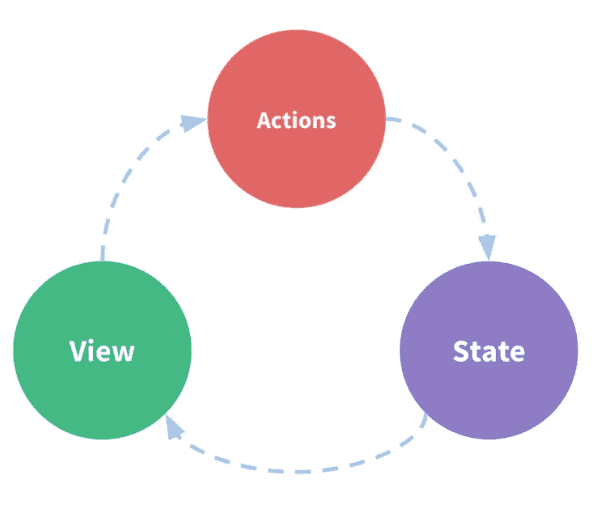
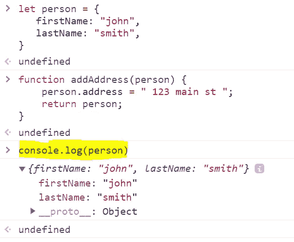
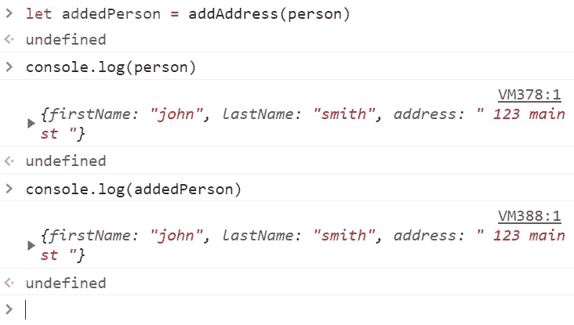
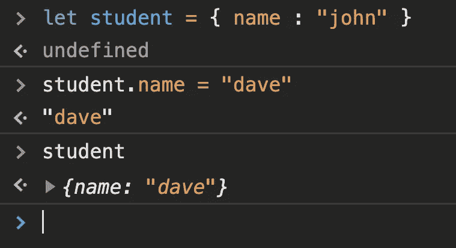
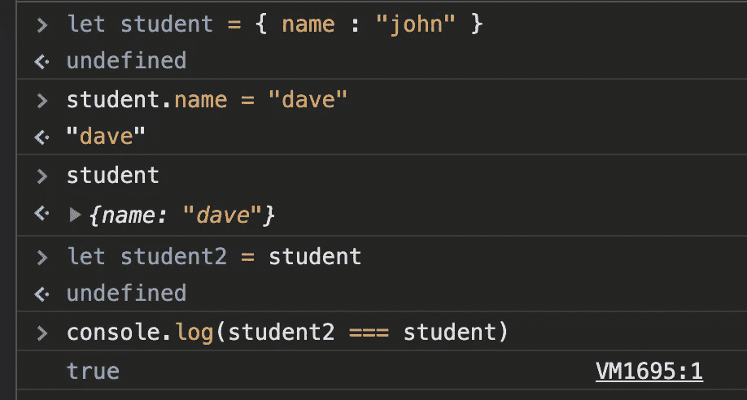

# Redux with React 的基础

> 原文：<https://javascript.plainenglish.io/fundamentals-of-redux-with-reactjs-dd14426b1ae1?source=collection_archive---------12----------------------->

## Javascript React Redux 教程

## 冗余模式、不变性和纯函数


在本教程中，我们将介绍在您的应用程序中使用 Redux 的核心概念和原则。

根据官方[网站](https://redux.js.org/tutorials/essentials/part-1-overview-concepts)，Redux 可以定义为:

> Redux 是一个模式和库，用于管理和更新应用程序状态，使用称为“动作”的事件。

Redux 是一个集中式存储，其中每个组件都可以访问应用程序的状态。Redux 有助于管理全局状态，应用程序的多个部分都需要这个状态。

```
function Counter() {
  // State: a counter value
  **const [counter, setCounter] = useState(0)**// Action: code that causes an update to the state when something happens
 ** const increment = () => {
    setCounter(prevCounter => prevCounter + 1)
  }**// View: the UI definition
  return (
    **<div>
      Value: {counter} <button onClick={increment}>Increment</button>
    </div>**
  )
}
```

正如 Redux 网站上解释的例子，我们有一个小程序做一件事，每点击一次它就增加 1。我们可以看到这个应用程序有 3 个阶段，第一个阶段是“**状态**，在这里计数器变量和 setCounter 函数得到它们的初始状态。第二个概念是“**动作**”。increment 函数只做一件事，它将计数器加 1。第三个概念是“**视图**”，在 div 标签内，我们显示一个按钮。



one-way data flow

然而，大多数应用程序并没有这么简单，状态可能出现在不同的组件上，随着组件越来越多，从这些组件访问状态会变得越来越困难。

解决这个问题的一个方法是将状态从组件中分离出来，这叫做状态管理。一个全局状态和所有的组件可以共享这个状态，这是创建 Redux 的唯一想法。

现在我们知道了为什么要用 Redux，下面来看看怎么用 Redux。

# 不变

所有的状态更新必须是不可变的。我们想要不变性的原因是我们不想永久地改变状态。一旦一个物体发生变异，就不可能再回到原来的状态。为了实现不变性，我们的代码必须复制现有的对象/数组，然后修改这些副本。

## 示例 1

```
let person = {  
   **firstName: "john",  
   lastName: "smith",** }
```

现在，假设我们编写一个函数来添加地址

```
function addAddress(person) {
    **person.address = " 123 main st ";
    return person;** }
```

现在让我们看看我们在控制台中发现了什么

```
console.log(person);
```



我们可以看到我们还没有添加地址属性。

```
let addedPerson = addAddress(person)
console.log(person)
console.log(addedPerson)
```



现在，person 对象发生了变异，并且更新了一个地址。

这可能会导致系统中出现一些严重的错误。对象的内部已经改变，但是对象引用没有改变。外面是同一个物体。

如果我们想让 addedPerson 函数不修改 Person，我们必须做一些修改。一个函数要成为纯函数，必须遵循两条规则。

1.  当给定相同的输入时，纯函数必须总是返回相同的值。
2.  一个纯函数一定不能有任何*副作用。*

# 副作用

举一个这个函数的例子

## 示例 2

```
**function add(a, b) {
   return a + b; 
}**
```

它总是只做一件事，如果你传递两个整数，它将返回这两个整数的和。而且没有副作用。它没有改变任何函数，参数，或者其他什么。

> 纯函数只能调用其他纯函数

# 纯函数

我们将 addAddress 函数转换为纯函数的方法如下所示:

```
function addAddress(person){
 **let newPerson = Object.assign({}, person , {
  address: '123 main st'
})** **return newPerson;**
}
```

我们没有修改对象本身，而是创建了一个对象，并将以前的对象分配给这个新对象，以前的对象保持不变。

我们可以这样写:

```
function addAddress(person){
 **let newPerson = {
  ...person,  
  address: '123 main st'
})****return newPerson;**
}
```

这个纯函数将返回一个全新的对象。

# JavaScript 中的引用相等

在 javascript 中，所有的数组和对象都存储在内存中。如果你把内存想象成一个盒子，那么变量就是指向盒子的指针，值就是盒子里面的东西。让我们来看一个例子，它是如何与一个对象一起工作的。

## 示例 3

```
let student = { name : "john" }
```

这里的学生是指向内存位置的指针，大括号里面的东西就是盒子里面的东西。

如果我们像这样把值改成 dave

```
let student = { name : "dave" }
```

会将指针更改为内存中的新值。

但是，以下更改不会影响存储位置

```
let student = { name : "john" }
student.name = "dave"; 
```



我们可以通过引用相等来测试这一点。



通过引用相等检查，我们可以看到两个对象是否指向同一个内存位置。

> 提示:
> 
> 比较运算符应用于数组或对象，运算符===比较它们指向的内存地址(它们的引用)。这就是所谓的参照平等。

在下一个教程中，我们将学习如何在 Redux 中更新状态。

喜欢这篇文章吗？如果是这样，通过 [**订阅解码获得更多类似内容，我们的 YouTube 频道**](https://www.youtube.com/channel/UCtipWUghju290NWcn8jhyAw) **！**

奥斯卡·伊尔迪兹在 [Unsplash](https://unsplash.com/s/photos/react?utm_source=unsplash&utm_medium=referral&utm_content=creditCopyText) 上拍摄的照片