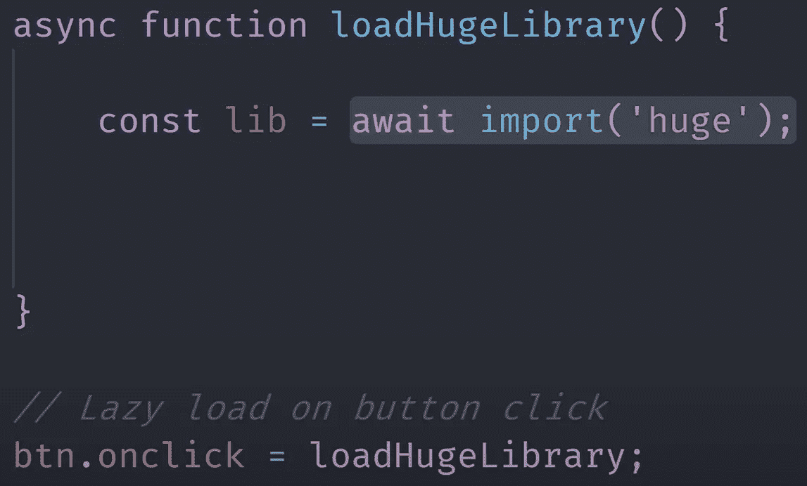
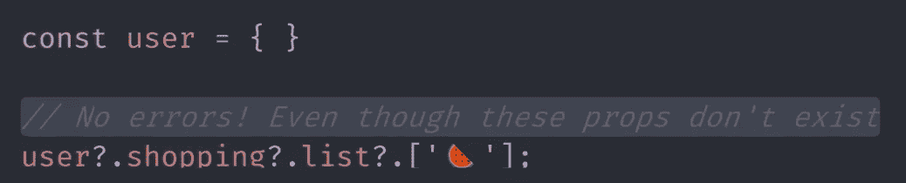
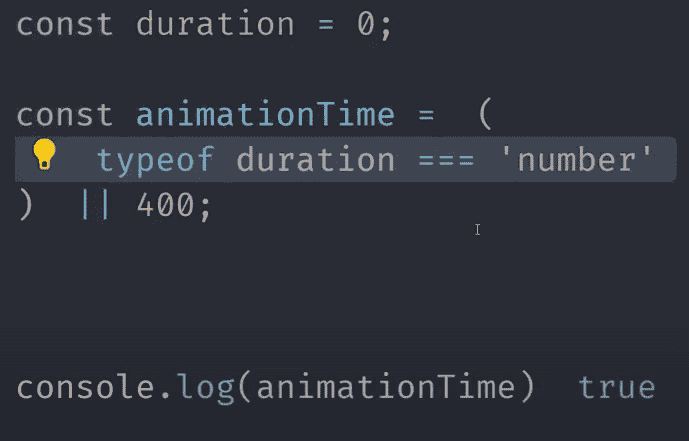
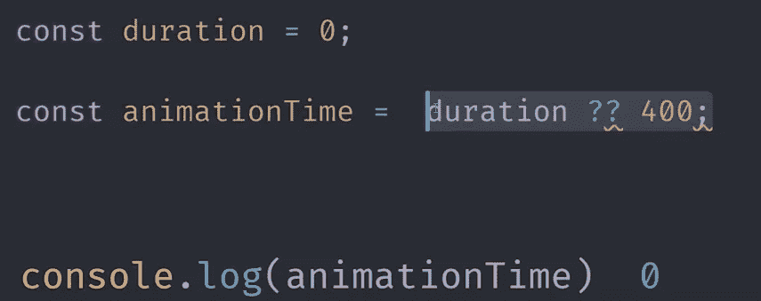
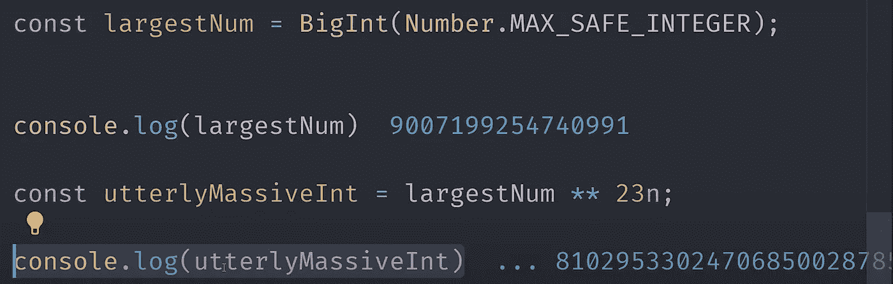
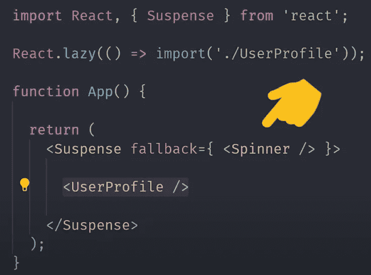
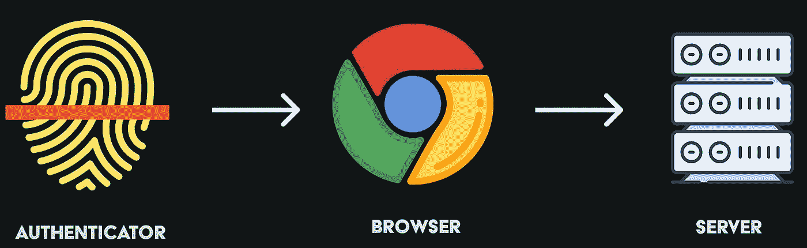
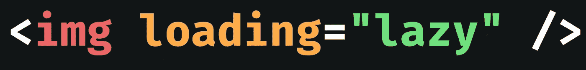

# JavaScript 的未来已经今非昔比了

> 原文：<https://javascript.plainenglish.io/future-of-javascript-f921f8f8be89?source=collection_archive---------0----------------------->

## 即将到来的 JS 特性，前端框架的状态，以及除了 JavaScript 之外你可以下注的新兴技术

# 动态导入

一个允许你在运行时延迟导入一个模块的函数，换句话说，你的导入不再需要在文件的顶部是静态的。您可以从代码中的任何地方异步加载模块。这意味着您可以延迟应用程序中非必要依赖项的加载，以提高性能。请注意，在这个代码片段中，当用户单击一个按钮时，我们是如何等待加载一个模块的。

# 可选链接

它使得调用深度嵌套的对象属性成为可能，而不会在其父属性未定义的情况下抛出错误。如果您曾经使用过 Lodash get 函数，这是一个很好的替代品。如果您使用的 API 或数据库返回一堆深度嵌套的对象，并且您不希望您的应用程序在这些对象的中间属性未定义的情况下中断运行时间，那么这将非常有用。

# 无效合并

接下来，我们有一个类似的新特性，称为 Nullish 合并运算符。在许多情况下，您可能希望为未定义的属性设置默认值。您已经可以在 JavaScript 中使用逻辑 or 操作符来实现这一点，但是如果定义的值是零或空字符串，就会出现问题，因为 JavaScript 会将这些值强制转换为 false。这非常烦人，因为这样你就必须在代码中进行运行时类型检查。

2020 年不会了。双问号只有在为 null 或未定义时才为 false，因此在设置默认值时，最终结果是更可预测的代码。

# 大整数

Javascript 也获得了一种新的原始数据类型 big int。它可以表示超出 JavaScript 的最大安全整数值(限制为 53 位)的数字。

你可以通过在一个常规整数上加一个 n 来创建一个大整数，或者你可以使用大整数构造函数来生成一个非常大的数。但是说实话，大多数开发人员可能不需要它，除非你在做非常精确的时间戳或几何计算，但是它是一个 JavaScript 原语，所以你肯定应该知道它。

# 以打字打的文件

让我们转到 JavaScript 世界中最大的颠覆之一: **TypeScript** 。它首次出现在 2016 年堆栈溢出调查中，只有不到 1%的开发人员使用它。三年过去了，它现在已经是超过 20%的开发人员使用的十大语言之一。这是 Js 世界中罕见的技术之一，似乎受到前端和后端开发人员以及跨框架开发人员的喜爱。

# 前端框架

## 苗条的

现在先从 2019 Svelte 的大落伍者说起一些前端框架。它已经存在了几年，但在 2019 年 4 月发布了第 3 版。它引起了极大的兴奋，因为它被放在一个非常优雅、易于学习的包中，而且它的性能很高，没有运行时依赖性。它的 npm 下载量在过去的一年里大约翻了三倍，这是一个逃避现状的好地方。

说到这里我们来看看 React，Angular，和 Vue。在采用方面，react 是目前的主导力量，下载量是 angular 和 view 总和的两倍多。但下载量只是大局中的一部分数据。我们还来看看堆栈溢出的作业，react 有 850 个空缺，angular 有 388 个，Vue 有 156 个，所以我们有一个类似的分布，react 是明显的领导者。

## 反应

去年，React 的一大新特性是钩子。今天，我们在 react **并发模式**中有了另一个大的实验特性。它允许框架同时处理多个状态更新，并为一个新的内置 react 组件打开了大门。**悬念**将等待异步活动完成及其子活动，比如对云数据库的 API 调用，或者使用新的动态导入特性在运行时延迟加载 react 组件。这意味着您可以以声明方式处理加载状态，并且不需要在代码中手动切换某种布尔值。

## 有角的

现在让我们来看看棱角分明的世界，最新的重大更新是**常春藤**。它在 angular 9 中是默认启用的，这是一个全新的 angular 编译器。但更让我兴奋的是，终于有人决定为 angular 搭建一个静态站点生成器。

## 某视频剪辑软件

转到视图世界，一个大的新特性是**组合 API** 。这是一套工具，旨在为复杂的 Vue 应用程序提供更好的代码可重用性。它通过获取 Vue 的一些核心功能(如反应状态)并将其作为功能公开来实现。这些较小的片段可以用来组成更复杂的组件，并且更容易用 typescript 进行强类型化。

# Web 授权

所以框架在所有方面都很酷，但是 web 平台本身有一些新的特性，从根本上扩展了可以在 web 上构建的应用程序的类型。一个很大的例子是 web 认证 API 或 Web AuthN。它使浏览器能够通过基于硬件的认证器进行认证，这意味着您的 web 应用程序可以进行生物认证等操作。

# 本地文件系统

另一个需要关注的是原生文件系统 API，它可以让您的 web 应用程序访问用户的本地文件，这是 web 开发人员自古以来就希望的。它目前在 Chrome 中有一个标志，但除此之外它不受支持。

# 惰性 HTML 属性

另一个很小但很棒的特性是图像和 iframes 的新加载属性。有上百万种不同的惰性加载 JavaScript 库，但是现在它被内置到浏览器中，带有一个简单的 HTML 属性。

# 节点. js

JavaScript 当然不仅仅是用于浏览器，我们还有 Node . js。Node 最激动人心的新特性是**工作线程**。人们喜欢指出的 JavaScript 的最大限制之一是它是单线程的，这意味着你不能同时运行两个单独的进程。到 2020 年，这不再是一个问题，因为我们现在有了工作线程模块，它打开了使用线程并行执行 JavaScript 的大门。一个节点附带的另一个令人敬畏的特性是对 es 模块的支持**。在节点 13 中，您可以使用导入和导出语句来代替 require。**

Node.js 发展最快的后端工具之一是 NestJS。它利用 typescript 来构建可伸缩且对开发人员非常友好的服务器端应用程序。NestJS 还能帮你整合另一个颠覆性技术图 QL。这是一个已经持续了几年的趋势，但是 QL 图表公司还在继续增长。

# 无后端

当今世界的许多 web 应用程序根本不需要构建自己的后端。使用 AWS amplifier 或 firebase 之类的工具会更有效率，这两种工具也在不断发展。这些工具提供了您发展和扩展移动应用所需的一切，使您的团队几乎可以完全专注于构建出色的前端用户体验。

# 移动应用

但是 JavaScript 不仅仅适用于浏览器和服务器，它也适用于移动应用。当然，最大的应用是 React Native，我们还有 Ionic 和 Native Script。就 NPM 下载量而言，它们在过去的一年里都基本持平。React native 增加了一些不错的新改进，如快速刷新和 Ionic 现在支持 React，而他们以前只支持 angular，但总的来说在这个领域并不太令人兴奋。

# JS 反英雄

## 除了 JavaScript 之外，你可以下注的新兴技术。

2019 年 6 月，苹果发布了 Swift UI。它提供了一种构建声明式 UI 的方法，类似于 React，但使用 Swift 编程语言，因此它有望极大地改善 iOS 开发人员的体验，但它也只适用于 iOS。

当谈到为 iOS 和 Android 构建跨平台应用时，一个很大的颠覆性力量是 Flutter。它使用的 Dart 编程语言在语法上与 JavaScript 非常相似，并且在 2019 年 Dart 是增长最快的编程语言，是 GitHub 上最热门的开源项目之一，现在它也支持 web 作为测试版的目标。

## Web 组件

但是从长远来看，对 JavaScript 生态系统更大的破坏是 Web 组装。就在几天前，web assembly 成为了与 javascript、HTML 和 CSS 并列的第四种官方语言。现在，我不想表现得好像 web assembly 将取代 javascript，事实上，根本不是这样，它是对 JavaScript 的一种赞美，允许我们构建更多种类的应用程序，更重要的是，与任何桌面应用程序一样好的更高质量的应用程序。

目前，像 C、C++和 rust 这样的语言可以编译开花，它开始出现在更多的语言上，如 C sharp。微软最近发布了一个名为 **Blazer** 的新框架，部分通过 web 组装的魔力，它允许你使用 C sharp HTML 和 CSS 构建 web 应用程序，在未来，我希望看到更多的语言可以优雅地与 JavaScript 互操作。