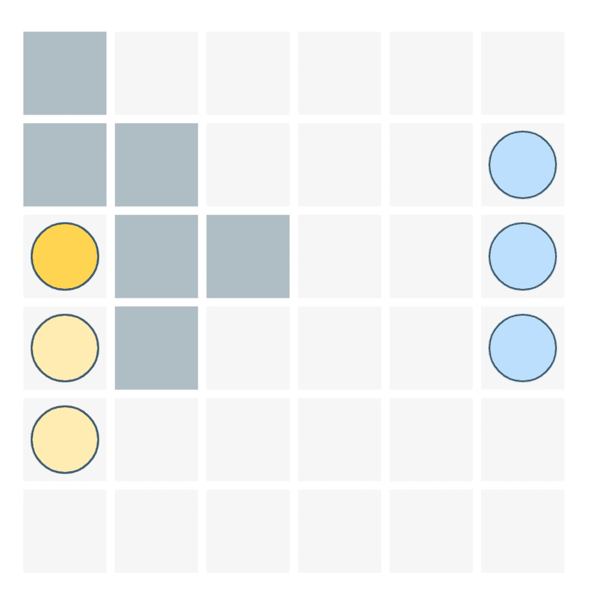

# 用 TypeScript 构建游戏

> 原文：<https://javascript.plainenglish.io/gamedev-patterns-and-algorithms-in-action-with-typescript-d29b913858e?source=collection_archive---------0----------------------->

关于如何使用 TypeScript 和本机浏览器 API 从头开始构建游戏的系列教程

[Background vector created by rawpixel.com](https://www.freepik.com/free-photos-vectors/background)

视频游戏是一个迷人的软件。开发人员必须解决的独特挑战的数量是巨大的。矢量数学和物理，运动和人工智能，图形和渲染…甚至术语本身听起来都很可怕！更不用说，将它们结合和混合在一起会很困难，让人不知所措。但是一定要这样吗？

# 让我邀请你踏上旅程

在这一系列的文章中，我将带你创建一个简单的游戏。我们将从零开始，在艰难险阻中慢慢建立自己的道路。我们将学习什么是**实体组件系统**以及如何使用 **Canvas API** 渲染网格结构。**状态玛奇纳**如何帮助设置游戏不同系统的行为。甚至如何实现我们自己的**人工智能敌人**。随着每一个新的步骤，我们的工艺变得更加复杂，但可管理和可预测。

[Car vector created by vectorpouch](https://www.freepik.com/free-photos-vectors/car)

有很多优秀的软件都是由聪明且专注的人创造的:Phaser.js、Pixi.js、Unity3d、Three.js，仅举几个例子。但是，我不会在这个系列中涉及这些令人难以置信的技术。我的目标是讲**原理**和**概念**、**模式**和**算法**，而不是具体的工具。我们将从头开始构建这个游戏。然而，你将获得的知识是非常可转让的。比方说，如果你意识到如何实现一个 **minimax** 或**寻路**算法，你可以将它们应用于 Unity/C#、Unreal/C+、Phaser/TS。这也有助于更好地理解开发人员为这些技术付出的努力。

## 项目概述

在本教程中，我们将构建一个简单的棋盘游戏:

它有两个玩家，每个玩家有 N 艘船。玩家可以在他们的回合中进行一次“移动”:转移船只或者攻击敌人。当一个玩家失去了所有的船，游戏就结束了。

听起来很简单，对吧？但是就像其他软件一样，游戏视觉上的简单并不一定意味着开发的简单。为了实施这个简单的游戏，我们必须问(并找到答案！)相当多的问题:

*   游戏怎么知道现在轮到哪个玩家了？
*   游戏如何突出和限制玩家重新定位他们的船的距离？
*   我们怎么能渲染网格和船只呢？
*   船如何逐渐改变它的位置(也叫动画移动)？
*   玩家如何与船只互动以使其移动？
*   “玩家可以攻击敌舰”是什么意思？什么是健康和伤害？
*   游戏敌人 AI 如何分析并做出合理的决策来试图赢得游戏？
*   游戏如何追踪玩家输赢？它将如何让玩家知道它？
*   还有很多很多其他人！

## 先决条件

在我们进入第一章之前，先说一句预防措施。本教程假设您已经掌握了一套特定的知识。你应该有:

*   使用现代浏览器执行的经验 **javascript**
*   至少对**打字稿**有基本的了解
*   很好地掌握了面向对象的编程
*   你知道如何使用 git

[Map vector created by stories](https://www.freepik.com/free-photos-vectors/map) — [www.freepik.com](http://www.freepik.com)

总而言之，你应该知道如何在浏览器中运行、测试和调试你的代码，不要害怕类和接口(它们会有很多！).我不会在本教程中介绍 TypeScript 的基础知识。幸运的是，有太多的课程/文章/视频可以消化其中的每一部分。就挑一两个你最喜欢的，准备好了再回来！我保证当你具备这些先决条件时，你的旅程将会更加愉快。

## 如何使用本教程

你可以在 [GitHub](https://github.com/soloschenko-grigoriy/gamedev-patterns-ts) 上找到源代码。本教程的每一章都包含一个专门的 git 分支。在每一章的开始，我们将从上一章离开的地方开始。

要运行开发服务器，只需使用`npm run serve`。运行测试:`npm t`，在观察模式下:`npm run test:watch`

> 请注意，我在这个项目中为 TypeScript 设置了相当严格的 ESLint 规则。我使用显式函数返回类型(表达式和高阶函数除外)。我对接口强制使用前缀“I”。我也禁止使用无用的变量和构造函数、分号和双引号。我发现这些规则非常有用。但是记住，这是我的主观选择，不是终极真理。您可以在项目中使用任何林挺规则。

[School vector created by freepik](https://www.freepik.com/free-photos-vectors/school)

每章中的每个步骤都包含代码片段。您可以复制粘贴它们，然后运行项目。但是我会建议你输入它们。这将帮助你更好地理解和记忆这段代码，并提高教程的效率。

## 测试

游戏软件相当精细，测试它是一个额外的挑战。然而，这是至关重要的。然而，我并不指望提供 100%的覆盖面。否则，这些教程会变得非常长，而且很可能会很无聊。我将花一些时间解释如何对这个游戏中最关键的元素进行单元测试。

## 为什么打字稿？

游戏开发行业有两大主导者:C++和 C#。虽然许多开发人员使用其他语言，但这两种语言(可以说)是最流行和最广泛的。

TypeScript 实际上是 JavaScript 和 C#的后代。它遵循“经典的”面向对象设计，这种设计很好地配合了游戏开发行业中流行的许多模式和方法。而且从句法上来说，非常接近 C#。将我们即将获得的知识转移到下一个层次会容易得多，比如说 Unity3D/C#

## 等等，gamdev 的 JavaScript？这不是表演！

JavaScript 在浏览器中运行，浏览器对其运行的软件进行限制。JS 引擎也有其局限性。比较我们开发主机游戏和浏览器游戏的机会是没有意义的。然而，我们并不期待这种水平的性能。

我们的目标是在行动中学习**原则**和**想法**，而不是发布 AAA 游戏。所以，javascript 和浏览器对我们来说已经足够好了。

## 那么，有什么计划？

在这一系列教程中，我们将涵盖:

1.  [实体和组件](https://medium.com/@gregsolo/entity-component-system-in-action-with-typescript-f498ca82a08e) s
2.  游戏循环([第一部分](https://medium.com/@gregsolo/gamedev-patterns-and-algorithms-with-typescript-game-loop-part-1-2-699919bb9b71)，[第二部分](https://medium.com/@gregsolo/gamedev-patterns-and-algorithms-in-action-with-typescript-game-loop-2-2-c0d57a8e5ec2))
3.  绘制网格([第 1 部分](https://medium.com/@gregsolo/building-a-game-with-typescript-drawing-grid-1-5-aaf68797a0bb)、[第 2 部分](https://medium.com/javascript-in-plain-english/building-a-game-with-typescript-drawing-grid-2-5-206555719490)、[第 3 部分](https://medium.com/@gregsolo/building-a-game-with-typescript-drawing-grid-3-5-1fb94211c4aa)、[第 4 部分](https://medium.com/@gregsolo/building-a-game-with-typescript-iii-drawing-grid-4-5-398af1dd638d)、[第 5 部分](https://medium.com/@gregsolo/building-a-game-with-typescript-drawing-grid-5-5-49454917b3af))
4.  舰船([第一部分](https://medium.com/@gregsolo/building-a-game-with-typescript-colors-and-layers-337b0e4d71f)、[第二部分](https://medium.com/@gregsolo/building-a-game-with-typescript-team-and-fleet-f223d39e9248)、[第三部分](https://medium.com/@gregsolo/building-a-game-with-typescript-drawing-ship-14e6c19caa38)、[第四部分](https://gregsolo.medium.com/building-a-game-with-typescript-ship-and-locomotion-4f5969675993))
5.  输入系统([第一部分](https://gregsolo.medium.com/building-a-game-with-typescript-input-system-1-3-46d0b3dd7662)、[第二部分](https://gregsolo.medium.com/building-a-game-with-typescript-input-system-2-3-cd419e36027c)、[第三部分](https://gregsolo.medium.com/building-a-game-with-typescript-input-system-3-3-8492552579f1))
6.  第六章。寻路和移动([部分 1](https://blog.gregsolo.me/articles/building-a-game-with-typescript-pathfinding-and-movement-17-introduction) 、[部分 2](https://blog.gregsolo.me/articles/building-a-game-with-typescript-pathfinding-and-movement-27-highlighting-locomotion-range) 、[部分 3](https://blog.gregsolo.me/articles/building-a-game-with-typescript-pathfinding-and-movement-37-graph-and-priority-queue) 、[部分 4](https://blog.gregsolo.me/articles/building-a-game-with-typescript-pathfinding-and-movement-47-pathfinder) 、[部分 5](https://blog.gregsolo.me/articles/building-a-game-with-typescript-pathfinding-and-movement-57-finding-the-path) 、[部分 6](https://blog.gregsolo.me/articles/building-a-game-with-typescript-pathfinding-and-movement-6-instant-locomotion) 、[部分 7](https://blog.gregsolo.me/articles/pathfinding-and-movement-7-animated-locomotion) )
7.  玛奇纳州
8.  攻击系统:生命和伤害
9.  比赛的输赢
10.  敌人 AI

厉害！介绍到此为止。我迫不及待地想在第一章中见到你！