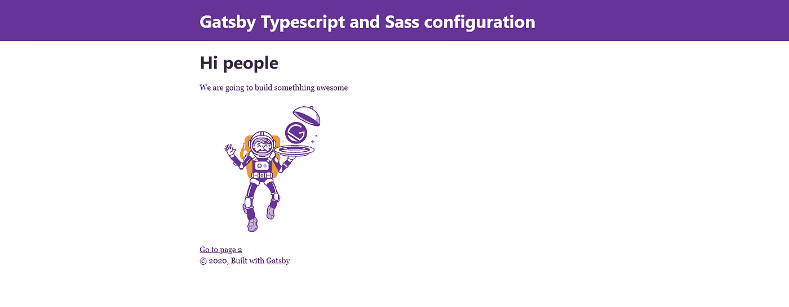

# 使用 Gatsby、TypeScript 和 Sass 配置进行设置

> 原文：<https://javascript.plainenglish.io/gatsby-typescript-and-sass-conf-a7ba527cfba9?source=collection_archive---------7----------------------->



如果你也是 React with TypeScript 的粉丝，并且想开始与 Gatsby 一起工作，那么这篇文章就是为你准备的。我将介绍如何为盖茨比设置基本环境，包括打字稿、萨斯、林挺和漂亮。

我一直在使用 React，主要是和 create-react-app 一起使用，因为它是一个很好的工具，可以和`npx create-react-app <name> --template typescript`一起使用。最近我看到盖茨比越来越重要，所以我很想试试。

# 盖茨比打字稿

create react 应用程序模板在 Gatsby 中被称为启动器。我已经检查了两个与 JavaScript 版本比较的 TypeScript 启动器，它们没有提供与原始版本一样多的价值:

*   [盖茨比首发打字稿](https://www.gatsbyjs.org/starters/haysclark/gatsby-starter-typescript/):
*   [盖茨比入门打字稿加](https://www.gatsbyjs.org/starters/resir014/gatsby-starter-typescript-plus/)

在这些项目没有一点进展之前，我会对基本的盖茨比做一些小的修改。这也有好处，核心版本通常得到更好的维护。我们将通过以下三个步骤在不到 5 分钟的时间内完成设置:

1.  安装盖茨比
2.  安装 TypeScript 并更新配置
3.  更新文件

## 1.安装盖茨比

Gatsby 可以全局安装在您的计算机上，然后使用 cli 命令，或者您可以直接使用 npx。我更喜欢避免安装更多的东西，所以我会选择第二个。从终端:

```
npx gatsby new <project-name>
```

这将需要几分钟的时间来安装所有必要的东西。打开项目时，您可以在`src`文件夹中看到:

```
| src
| -- components
| -- images
| -- pages
```

组件和页面有一些 JavaScript 文件。为了验证一切正常，你可以运行`npm start`，你会在 localhost:8080 中看到这个应用程序。

如果你愿意，因为 Gatsby 没有 git，我建议你在这里初始化它。

## 2.安装 TypeScript 并更新配置

要在 Gatsby 中使用 TypeScript，你需要安装`gatsby-plugin-typescript`

```
npm i -E gatsby-plugin-typescript
```

安装完成后，你需要更新包括插件在内的 gatsby 配置(`gatsby-config.js`)。该文件应该如下所示。

```
// gatsby-config.js
module.exports = {
  siteMetadata: {
    title: `Gatsby Default Starter`,
    description: `Kick off your next, great Gatsby project with this default starter. This barebones starter ships with the main Gatsby configuration files you might need.`,
    author: `[@gatsbyjs](http://twitter.com/gatsbyjs)`,
  },
  plugins: [
    `gatsby-plugin-react-helmet`,
    {
      resolve: `gatsby-source-filesystem`,
      options: {
        name: `images`,
        path: `${__dirname}/src/images`,
      },
    },
    **`gatsby-plugin-typescript`,**
    `gatsby-transformer-sharp`,
    `gatsby-plugin-sharp`,
    {
      resolve: `gatsby-plugin-manifest`,
      options: {
        name: `gatsby-starter-default`,
        short_name: `starter`,
        start_url: `/`,
        background_color: `#663399`,
        theme_color: `#663399`,
        display: `minimal-ui`,
        icon: `src/images/gatsby-icon.png`, // This path is relative to the root of the site.
      },
    },
    // this (optional) plugin enables Progressive Web App + Offline functionality
    // To learn more, visit: [https://gatsby.dev/offline](https://gatsby.dev/offline)
    // `gatsby-plugin-offline`,
  ],
}
```

在项目的根目录下创建文件`tsconfig.json`以包含 TypeScript 配置:

```
// tsconfig.json
{
  "compilerOptions": {
    "experimentalDecorators": true,
    "emitDecoratorMetadata": true,
    "target": "es5",
    "lib": ["dom", "dom.iterable", "esnext"],
    "allowJs": true,
    "skipLibCheck": true,
    "esModuleInterop": true,
    "allowSyntheticDefaultImports": true,
    "strict": true,
    "forceConsistentCasingInFileNames": true,
    "module": "esnext",
    "moduleResolution": "node",
    "resolveJsonModule": true,
    "isolatedModules": true,
    "noEmit": true,
    "jsx": "preserve",
    "baseUrl": "src",
    "paths": {
      "src/*" : ["*"],
    }
  },
  "include": ["src"]
}
```

和以前一样，要验证一切正常，只需运行`npm start`，它应该和以前一样正常工作。这些文件仍然是 javascript 格式的，所以我们暂时还没有做太多破坏的工作。

## 3.更新文件

在这个阶段，您可以将`.js/.jsx`文件更新为`.ts/.tsx`，或者，如果您已经初始化了 git，使用 git 更新文件名。别担心，代码如下:

使用 git:

```
git mv src/components/header.js src/components/header.tsx
git mv src/components/image.js src/components/image.tsx
git mv src/components/layout.js src/components/layout.tsx
git mv src/components/seo.js src/components/seo.tsx
git mv src/pages/404.js src/pages/404.tsx
git mv src/pages/index.js src/pages/index.tsx
git mv src/pages/page-2.js src/pages/page-2.tsx
```

直接更新名称:

```
mv src/components/header.js src/components/header.tsx
mv src/components/image.js src/components/image.tsx
mv src/components/layout.js src/components/layout.tsx
mv src/components/seo.js src/components/seo.tsx
mv src/pages/404.js src/pages/404.tsx
mv src/pages/index.js src/pages/index.tsx
mv src/pages/page-2.js src/pages/page-2.tsx
```

最后，对于使用 prettier 的格式化，您还需要更新 package.json 中的 scripts 部分:

```
"scripts": {
    "build": "gatsby build",
    "develop": "gatsby develop",
    **"format": "prettier --write \"**/*.{tsx,ts,js,jsx,json,md}\"",**
    "start": "npm run develop",
    "serve": "gatsby serve",
    "clean": "gatsby clean",
    "test": "echo \"Write tests! -> [https://gatsby.dev/unit-testing\](https://gatsby.dev/unit-testing\)" && exit 1"
  },
```

现在你可以做`npm start`来验证一切都如预期的那样工作。

# 萨斯的盖茨比

## 1.安装依赖项

我们需要安装`node-sass`和插件`gatsby-plugin-sass`，这样它才能工作。

```
npm i -E gatsby-plugin-sass node-sass
```

## 2.更新 gatsby 配置

在 gatsby 配置中包含插件`gatsby-plugin-sass`。

```
// gatsby-config.jsmodule.exports = {
  siteMetadata: {
    title: `Gatsby Default Starter`,
    description: `Kick off your next, great Gatsby project with this default starter. This barebones starter ships with the main Gatsby configuration files you might need.`,
    author: `[@gatsbyjs](http://twitter.com/gatsbyjs)`,
  },
  plugins: [
    **`gatsby-plugin-sass`,**
    `gatsby-plugin-react-helmet`,
    {
      resolve: `gatsby-source-filesystem`,
      options: {
        name: `images`,
        path: `${__dirname}/src/images`,
      },
    },
    `gatsby-plugin-typescript`,
    `gatsby-transformer-sharp`,
    `gatsby-plugin-sharp`,
    {
      resolve: `gatsby-plugin-manifest`,
      options: {
        name: `gatsby-starter-default`,
        short_name: `starter`,
        start_url: `/`,
        background_color: `#663399`,
        theme_color: `#663399`,
        display: `minimal-ui`,
        icon: `src/images/gatsby-icon.png`, // This path is relative to the root of the site.
      },
    },
    // this (optional) plugin enables Progressive Web App + Offline functionality
    // To learn more, visit: [https://gatsby.dev/offline](https://gatsby.dev/offline)
    // `gatsby-plugin-offline`,
  ],
}
```

## 3.更新文件

配置更新后，我们可以将`.css`文件更改为`.scss`。在 gatsby 的初始安装中，只有一个布局文件:

```
git mv src/components/layout.css src/components/layout.scss
```

记住还要更新这个文件的导入。它只在`src/components/layout.tsx`中显示

```
/**
 * Layout component that queries for data
 * with Gatsby's useStaticQuery component
 *
 * See: [https://www.gatsbyjs.org/docs/use-static-query/](https://www.gatsbyjs.org/docs/use-static-query/)
 */import React from "react"
import PropTypes from "prop-types"
import { useStaticQuery, graphql } from "gatsby"import Header from "./header"import "./layout.scss"
```

鲍勃是你的叔叔！你可以验证所有的事情都在做`npm start`。

# 丰富

像往常一样，总有改进的余地。如果你有任何想法或建议，请在下面留下评论。

## **简明英语团队的笔记**

你知道我们有四种出版物吗？给他们一个 follow 来表达爱意:[**JavaScript in Plain English**](https://medium.com/javascript-in-plain-english)，[**AI in Plain English**](https://medium.com/ai-in-plain-english)，[**UX in Plain English**](https://medium.com/ux-in-plain-english)，[**Python in Plain English**](https://medium.com/python-in-plain-english)**—谢谢，继续学习！**

**我们还推出了一个 YouTube，希望你能通过 [**订阅我们的简明英语频道**](https://www.youtube.com/channel/UCtipWUghju290NWcn8jhyAw) 来支持我们**

**一如既往,“简明英语”希望帮助推广好的内容。如果您有一篇文章想要提交给我们的任何出版物，请发送电子邮件至[**submissions @ plain English . io**](mailto:submissions@plainenglish.io)**并附上您的媒体用户名和您感兴趣的内容，我们将会回复您！****