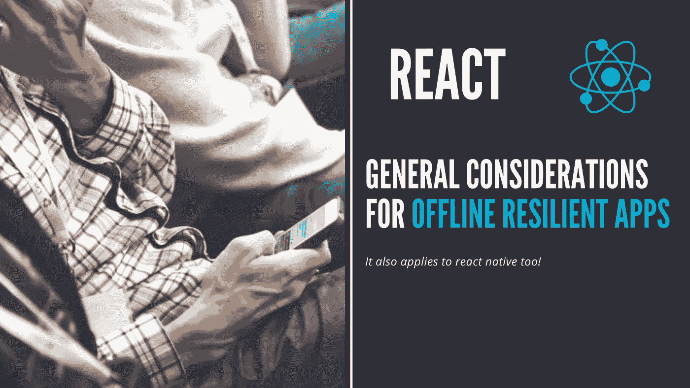
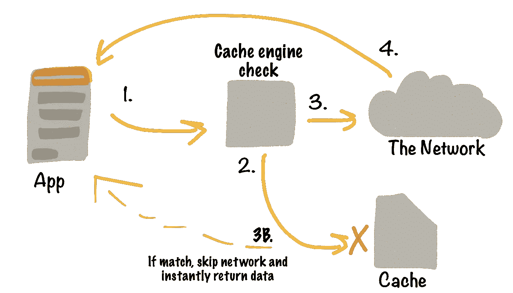
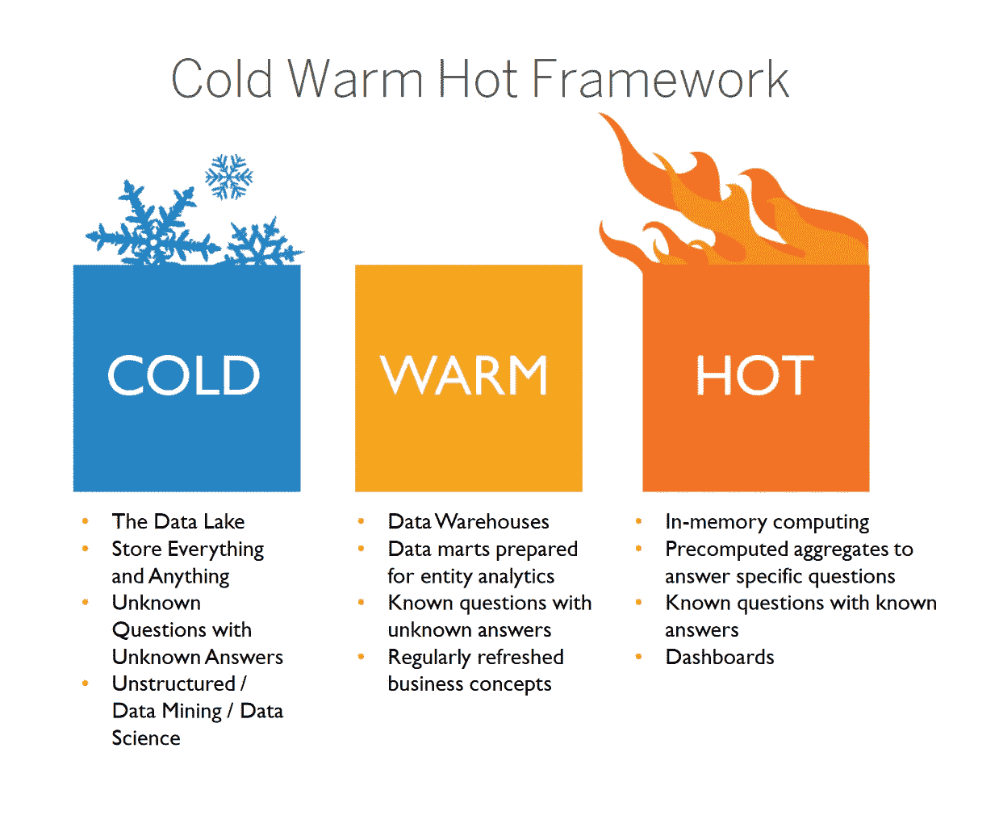
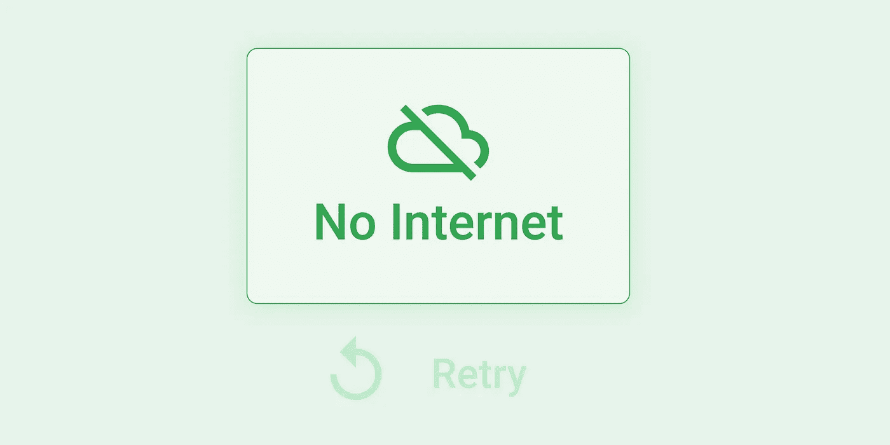
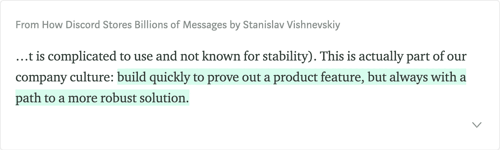
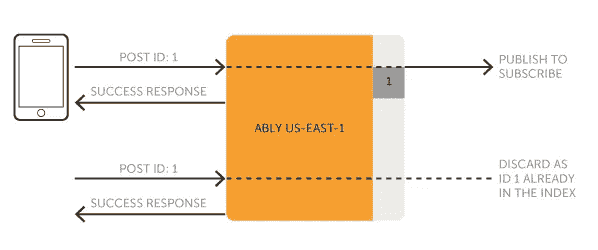

# 基于离线弹性反应的应用程序的一般注意事项

> 原文：<https://javascript.plainenglish.io/general-considerations-for-offline-resilient-react-based-apps-8dcb7181e495?source=collection_archive---------7----------------------->

## 它也适用于任何框架和渐进式网络应用程序或移动与反应原生！

你可能知道，在我写这篇文章的时候，互联网无处不在。即使在意想不到的地方…

我刚从飞机上下来，这是我第一次在离地面约 10 000 米的地方使用机上 Wi-Fi 体验在线连接…哇！

📰最近[埃隆·马斯克](https://en.wikipedia.org/wiki/Elon_Musk)刚刚使用其新的 SpaceX 卫星网络系统发了一条推文: [Starlink](https://en.wikipedia.org/wiki/Starlink_(satellite_constellation)) ，这简直太棒了！。

**虽然这些创新打开了广阔的前景，但仍有许多地方没有网络或者至少网络不稳定。**

我刚和一个巴黎的客户完成了一个项目，测试这个应用的人在一座摩天大楼的第 40 层。这导致了糟糕的移动互联网连接，因为淹没在巴黎 Défense quarter 主要广场的 4G 发射器的高度低于这层楼……就这么简单，即使在伟大的城市中心。

你应该总是首先离线设计你的应用程序，并且把网络看作是一个增强和改进。

网络不是一个常数，没有简单的方法来检测网络连接，这不是一个真/假布尔。有时你可以上 Wi-Fi，但这并不意味着你连接到互联网，而只是局域网。

你也可以有一个不稳定的 4G，每秒钟丢失许多数据包，即使你被认为在线，你不能正常使用互联网。

**有效检测连接和网络问题的唯一方法是尝试发送请求操作，并等待超时或网络驱动程序拒绝或确认。**

# ❶ 🏁开始考虑读操作的离线恢复能力

通过阅读我们参考了流行的 CRUD tasks，分别代表***C****reate*， ***R*** *ead，****U****pdate 和****D****elete*。

**读取操作是不修改数据的操作，只是获取数据并显示给最终用户。**

虽然变异(创建、更新、删除)操作很复杂，并且涉及到许多关于实现逻辑的想法，但是读取操作很容易缓存和设置。

现代的 API 和库，如浏览器的服务工人或 GraphQL 中的 apollo 客户端，允许以一种简单的方式处理这个问题。

Cache management logic in frontend application

利用缓存策略来保护您的应用程序读取操作是您可以实现的最简单、最快速的里程碑。这也是非常有价值的，因为线下体验得到了极大的改善，这就是为什么你应该首先实现它们。

## 🔥你应该想想你的内容温度❄️

不用深入到[我已经在应用架构](https://medium.com/javascript-in-plain-english/the-notion-of-data-temperature-in-computer-science-75446f267362)中谈到了**内容温度**，首先将你的传入数据分成两三类:**冷**、**缓和**和**热** **数据**。

Data temperature server side example, but this can be applied to network exchanges and caching if you understand the principle.

最热的变化频繁，而最冷的变化很少，这将引导您通过您的缓存失效策略。冷数据可以缓存更长时间，不会真正受到陈旧性的影响，热数据有时甚至不会被缓存。

如果数据从缓存中丢失，并且您由于任何原因无法更新，只需显示一个警告屏幕，说明将需要互联网来显示内容。

一旦读操作实现完成，您可以进一步改进您的变异操作。

# ❷ 🖋包括后来的变异/写操作，以及根据上下文的设计

对于任何其他改变数据的操作，比如创建、更新和删除，老实说，这有点复杂。

An example of screen asking for retry

如上所述，处理这些情况的唯一方法是尝试进行突变并观察结果。

如果由于网络原因失败:从一个简单的错误通知开始(上图中有一个小例子),稍后您将更新它以改善用户体验。

**一切都是关于迭代:快速交付和运营，然后改进。**

我最喜欢的格言之一是由 [Stanislav Vishnevskiy](https://medium.com/u/69ec5ec88dc6?source=post_page-----8dcb7181e495--------------------------------) 写的，他是 [Discord](https://discordapp.com/) 的首席技术官。

[https://blog.discordapp.com/how-discord-stores-billions-of-messages-7fa6ec7ee4c7](https://blog.discordapp.com/how-discord-stores-billions-of-messages-7fa6ec7ee4c7)

## 根据上下文分离您的操作

*   有些以后无法重试，需要用户离线才能申请。💳支付就是一个很好的例子。
*   有些可以在后台频繁重试(不确定的)尝试次数。❤️喜欢用户照片是一个很好的用例。

对于我们无法重试的突变，我们可以展示:

*   带有重试按钮的错误页面？
*   显示错误通知？

但是在消息中要明确:用户不在线，他需要一个网络连接来实现变异操作。

对于那些可以重试的，这取决于操作的批评级别:

*   没有自动重试:只显示一个重试按钮。这是处理这些问题最简单的方法。
*   自动重试:您需要处理同步队列、状态协调和冲突。

想象你喜欢某篇文章，不喜欢又喜欢。您可以计算结果(favorite+unfavorite+favorite = favorite ),或者只是按顺序发送三个请求。

## 幂等性是一级规则

> **幂等性** ( [英国](https://en.wikipedia.org/wiki/British_English) : [/ˌɪdɛmˈpoʊtəns/](https://en.wikipedia.org/wiki/Help:IPA/English) ，[【1】](https://en.wikipedia.org/wiki/Idempotence#cite_note-1)[美国](https://en.wikipedia.org/wiki/American_English):[/ˌaɪdəm-/](https://en.wikipedia.org/wiki/Help:IPA/English))[【2】](https://en.wikipedia.org/wiki/Idempotence#cite_note-2)是[数学](https://en.wikipedia.org/wiki/Mathematics)和[计算机科学](https://en.wikipedia.org/wiki/Computer_science)中某些[运算](https://en.wikipedia.org/wiki/Operation_(mathematics))的属性，由此它们可以被多次应用而不改变超出初始应用的结果。

First request could also haven’t received the acknowledgment.

在网络交换和网络风险环境中，幂等性比任何地方都更重要。这将确保您在没有获得返回语句(由于网络问题或延迟)的情况下调度的一些操作不会在后端导致重复的内容。

➡️ *想象有一个添加新评论的操作*

为了很好地处理幂等性，您可以在客户端生成注释文档的 [UUID](https://fr.wikipedia.org/wiki/Universal_Unique_Identifier) ，并在后端生成一个创建或更新操作。

简而言之，技术并不重要，你只需要确保你能识别两个值得相同结果的操作。

# ❸ 📦额外好处:多设备/帐户同步和冲突解决

**⚠️那些操作是你最大的敌人:尽可能长时间地避免那些用例，并在以后实现它们，因为它们真的会增加开发团队的复杂性和头痛。😱**

多设备同步是在一个设备上写入一些数据，并能够在另一个设备上访问更改的过程，无论支持(web、移动设备等)如何。这还意味着能够在另一台设备上更新这些数据。

这个用例提出了许多您需要处理的新问题，并提示:这一点也不容易！

## 关于内容删除

您需要保留已删除项目的索引，以便在同步时在拥有本地副本的所有设备上清理它们。否则，您最终会得到孤立的记录，这会污染您的数据模型。

💡您可以通过将远程数据源视为事实的来源，通过在前端获取和覆盖本地缓存来避免这种情况，但是这样做，您将失去在大型数据集上缓存的好处以及本地拷贝和可能的编辑功能。

## 关于内容版本:

如果你有一个记录的两个副本(在用户或设备之间),如果两个人都编辑内容，这就很方便了。你如何处理这两个版本？

*   你可以设置某种锁来防止同时出现多个版本，但是这对于用户来说并不友好。
*   您可以处理实时版本，但这需要网络连接。

如果你选择其他方式，你将需要处理版本冲突，就像示例中的`git`一样，这将变得非常棘手。

这就是为什么我建议始终将远程版本视为最新版本，只将缓存作为后备或第一个数据集，同时在后台从远程源更新缓存。

避免共享文档或实现接近实时的编辑逻辑。这并不是对所有的应用都可行，但是尽量避免离线编辑和发布，这很有帮助。

如果你需要这些特性，这是可以的，但是请记住，这些是你在前端应用程序中最难实现的用例，并且非常耗时。

# 🚛外卖/TLDR；

简单总结一下这一切都是为了什么:

1.  首先实现读逻辑优先和缓存策略。
2.  想想你的突变/写操作设计。
3.  首先实现最简单的策略，并随着时间的推移迭代升级这些策略，考虑用户体验以及对他们来说什么最重要:离线体验可能不是他们最常用的使用条件。他们能否等到网络恢复后再更改数据？
4.  在项目开始时避免多设备/账户同步，不要低估它们的复杂性。