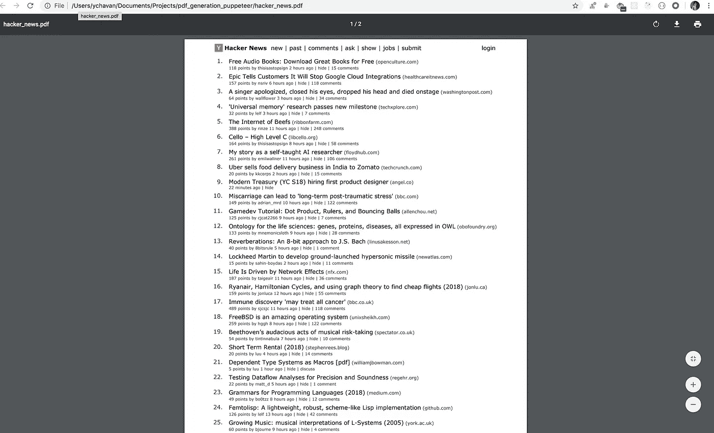
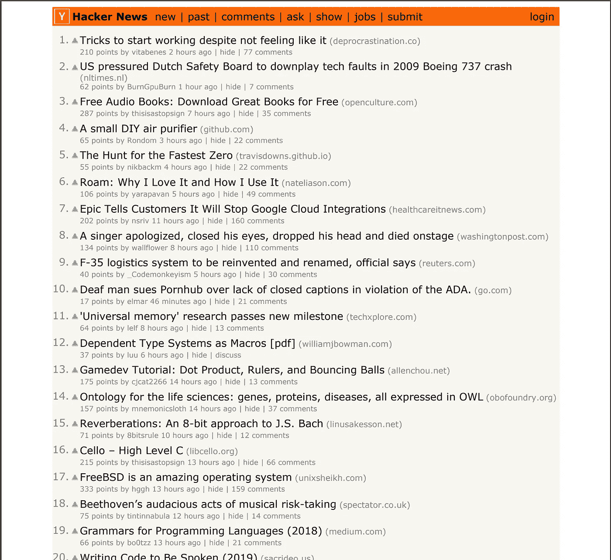
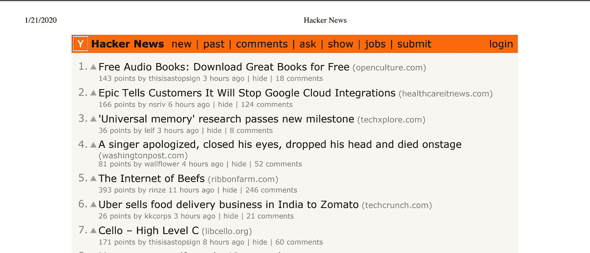
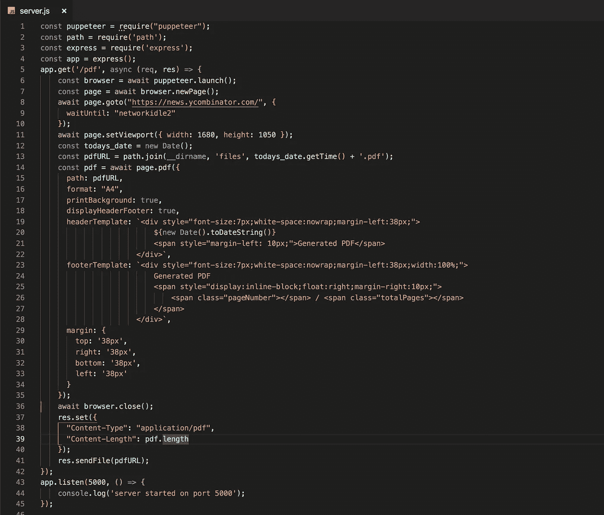
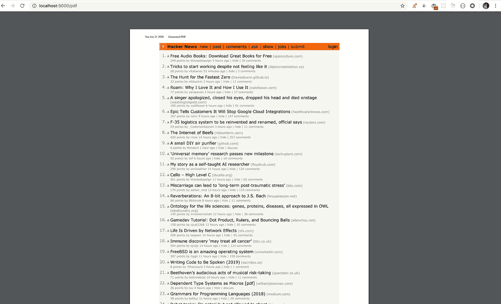
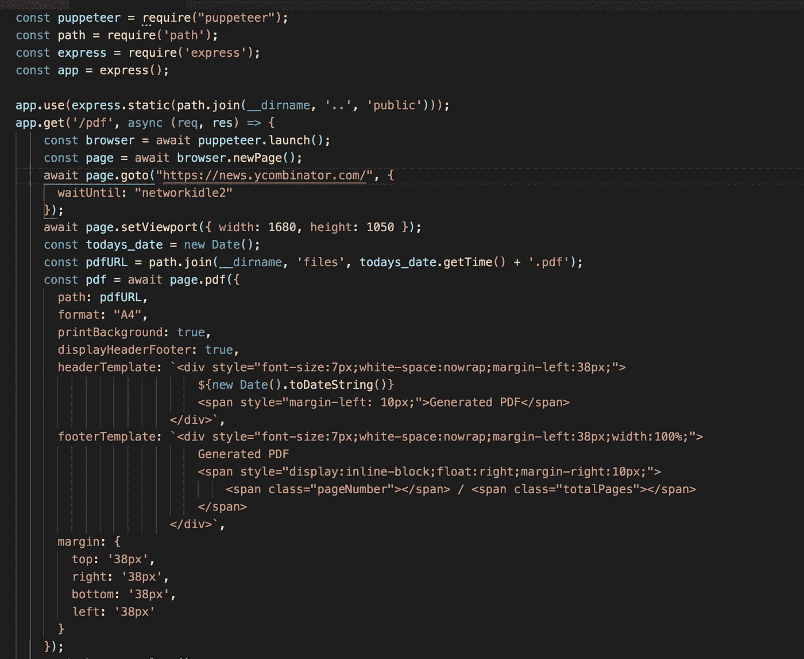
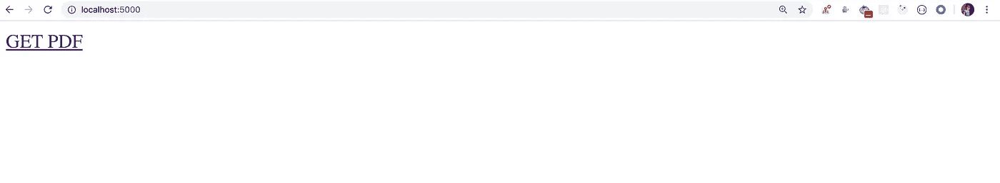

# 如何用 Node.js 生成网站页面的 PDF

> 原文：<https://javascript.plainenglish.io/generate-best-quality-pdf-of-any-webpage-html-page-in-nodejs-7b1223e1a3ac?source=collection_archive---------2----------------------->

轻松创建与我们在 Chrome 浏览器上使用 Ctrl + P 或 Command + P (Mac)打印 pdf 相同质量的 pdf


Photo by [Bank Phrom](https://unsplash.com/@bank_phrom?utm_source=medium&utm_medium=referral) on [Unsplash](https://unsplash.com?utm_source=medium&utm_medium=referral)

在本文中，我们将看到使用 Nodejs 生成任何网页的 PDF 并将其发送回客户端应用程序是多么容易。

我们将使用**木偶师**工具，这是一个无头的 chrome API 来生成 pdf
，让我们开始吧。

使用以下命令创建 package.json 文件

```
npm init -y
```

使用安装木偶师

```
npm install --save puppeteer@2.0.0
```

我们将生成一个黑客新闻页面的样本 pdf。

创建一个服务器文件夹，并使用以下代码在其中添加`index.js`文件:

**上面代码中的** `**waitUntil**` **选项会在生成 pdf 之前等待页面完全加载。**

要执行代码，请运行

```
node server/index.js
```

一旦你执行了上面的命令，你会看到一个名为`hacker_news.pdf`的新 pdf 文件生成了。



如果想保持网页的背景色，需要在生成 pdf 时添加`printBackground: true`选项



我们使用了`A4`格式来创建 pdf。
使用最广泛的格式是`A4`和`Letter`。

其他`format`选项有:

*   `Letter`:8.5 英寸 x 11in 英寸
*   `Legal`:8.5 英寸 x 14in 英寸
*   `Tabloid`:11 英寸 x 17in 英寸
*   `Ledger`:17 英寸 x 11 英寸
*   `A0`:33.1 英寸 x 46.8in 英寸
*   `A1`:23.4 英寸 x 33.1in 英寸
*   `A2`:16.54 英寸 x 23.4in 英寸
*   `A3`:11.7 英寸 x 16.54in 英寸
*   `A4`:8.27 英寸 x 11.7in 英寸
*   `A5`:5.83 英寸 x 8.27in 英寸
*   `A6`:4.13 英寸 x 5.83in 英寸

在使用`page.pdf`功能生成 pdf 之前，您可以使用`setViewport`设置视窗宽度和高度

```
await page.setViewport({ width: 1680, height: 1050 });
```

如果要显示默认的页眉和页脚，需要添加`displayHeaderFooter`选项并指定页眉和页脚的边距

这将在 pdf 中添加带有当前日期的标题，如下所示



页面 URL 将被添加到 pdf 的页脚中，如下所示


我们为页眉和页脚的所有边都提供了 38px 的边距，大约等于 1cm。

**自定义页眉和页脚:**
我们也可以分别使用`headerTemplate`和`footerTemplate`选项提供我们的自定义页眉和页脚。

在上面的所有例子中，我们将生成的 pdf 存储在根文件夹中，这并不理想。

让我们看看如何更改位置来存储生成的 pdf 文件。
我们将使用当前时间戳作为生成的 pdf 的名称。

在`server`目录下新建一个`files`文件夹。

在顶部导入路径节点包:

```
const path = require('path');
```

使用以下方式获取今天的日期:

```
const todays_date = new Date();
```

将 page.pdf 函数中的路径选项更改为

```
path: `${path.join(__dirname, 'files', todays_date.getTime() + '.pdf')}`,
```

`__dirname`指向当前目录，在我们的例子中是`server` 。

我们使用路径节点包的 join 方法，这样它将正确地创建文件，因为 Linux/mac 路径在文件路径中有正斜杠，而 windows 有反斜杠。

`path`节点包为我们自动处理这种转换。

现在我们将连接我们的后端节点和前端，这样当用户点击按钮或链接下载 pdf 时，我们可以从服务器发送 pdf 到客户端

使用以下方式安装 express:

```
npm install --save express@4.17.1
```

创建一个新文件`server.js`，并使用

```
const express = require('express');
const app = express();
```

1.在 get 处理程序中复制前面的 pdf 生成代码，并使用`app.listen`
2 启动服务器。将 pdf 文件路径存储在一个单独的变量中，以便我们以后使用

```
**const pdfURL =** path.join(__dirname, 'files', todays_date.getTime() + '.pdf');
```

3.将`page.pdf`函数调用的结果存储在 pdf 变量
4 中。设置响应内容类型，并使用

```
res.set({
 "Content-Type": "application/pdf",
 "Content-Length": pdf.length
});res.sendFile(pdfURL);
```



如果您在理解服务器创建代码方面有困难，请查看我以前关于在 Nodejs [中创建 REST API 的文章。](/easily-create-rest-apis-in-nodejs-using-express-d9a0484b3d59?source=friends_link&sk=60f6d88fe8e24b69927445a363e45a2a)

现在，通过执行以下命令启动 express 服务器

```
node server/server.js
```

并导航到[http://localhost:5000/pdf](http://localhost:5000/pdf)

您将在浏览器中看到生成的 pdf



现在，用以下内容创建一个公共文件夹和 index.html

在`server/server.js`文件中，在获取`/pdf` 路径之前，指定`public`文件夹路径以便我们可以访问公共文件夹下的所有文件

```
app.use(express.static(path.join(__dirname, '..', 'public')));
```



现在，使用以下命令重新启动服务器

```
node server/server.js
```

并导航到 [http://localhost:5000/](http://localhost:5000/) ，这将加载我们创建的`index.html`文件



如果您单击“获取 pdf”链接，您将能够看到生成的 pdf，您可以在其中查看或下载 PDF 文件


我们还可以使用以下方法将任何 CSS 样式添加到生成的 pdf 中

```
await page.addStyleTag({
 content: `
  body { border: 1px solid #ccc }
 `
});
```

在调用 page.pdf 方法之前，我们需要调用 addStyleTag。

**从本地 HTML 文件生成 PDF:**

要从 HTML 文件生成 pdf，我们需要在`page.goto`方法中使用**file:<path _ of _ file>**来指定 HTML 文件的 url

在`public`目录下创建一个`lorem.html`文件，内容如下

并引用`page.goto`函数中的文件为

```
await page.goto(`file:${path.join(__dirname, '..' , 'public', 'lorem.html')}`, { waitUntil: "networkidle2" });
```

要了解更多关于木偶师的信息，请点击[这里](https://github.com/puppeteer/puppeteer)

木偶师文档:[https://pptr.dev/](https://pptr.dev/)

完整的 Github 源代码:[https://github.com/myogeshchavan97/pdf_generation_puppeteer](https://github.com/myogeshchavan97/pdf_generation_puppeteer)

今天到此为止。希望你今天学到了新东西。

**别忘了直接在你的收件箱** [**这里**](https://yogeshchavan.dev) **订阅我的每周时事通讯，里面有惊人的技巧、诀窍和文章。**