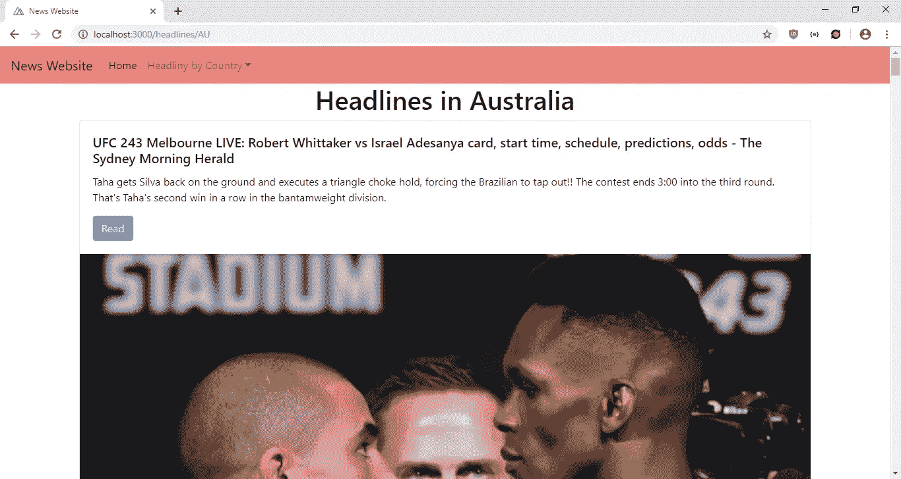
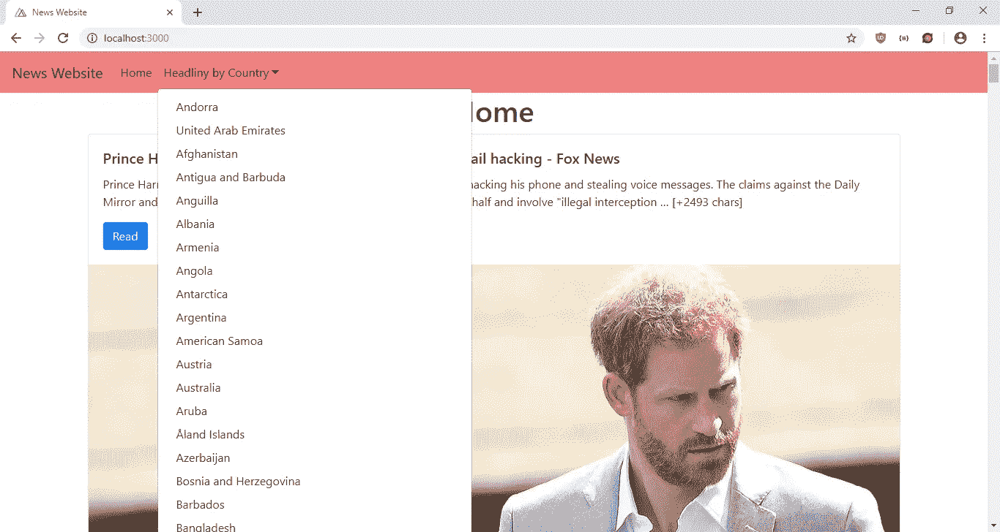
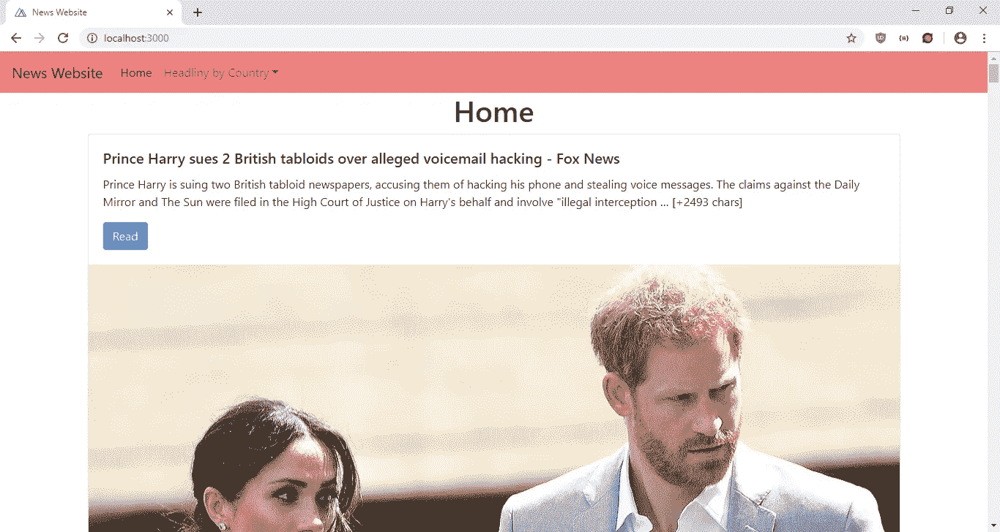

# 用 Nuxt 生成静态网站

> 原文：<https://javascript.plainenglish.io/generate-static-websites-with-nuxt-4fd0491340e?source=collection_archive---------0----------------------->

如今静态网站又开始流行了。信息和宣传册网站不再需要使用像 WordPress 这样的内容管理系统来动态更新。

使用静态站点生成器，您可以从动态源(如 headless CMS、API)以及 Markdown 文件等文件中获取内容。

Nuxt 是一个很棒的基于 Vue.js 的静态网站生成器，很容易用来构建静态网站。使用 Nuxt，我们所要做的就是从动态内容构建静态网站，我们创建模板来动态显示来自动态源的内容，如 API 和 Markdown 文件。然后在 Nuxt 配置文件中，我们静态地定义路由，以便它可以通过相同的路由将内容生成到静态文件中。

在本文中，我们将使用 Nuxt 构建一个新闻网站，并将使用位于[https://newsapi.org/](https://newsapi.org/)的新闻 API 获取内容。因为 Nuxt 是一个基于 Vue.js 的框架，所以在你使用 Nuxt 建立一个网站之前，你必须了解 Vue.js。

首先，我们在新闻 API 网站注册一个 API 密钥。如果我们只想要标题，它是免费的。我们通过使用 Nuxt CLI 开始构建网站。我们通过键入以下内容来运行`create-nuxt-app`命令:

```
npx create-nuxt-app news-website
```

这将在`news-website`文件夹中创建初始项目文件。当向导运行时，我们为服务器端框架选择“无”,为 UI 框架选择“无”,为测试框架选择“无”,为 Nuxt 模式选择“通用”,并选择包含 Axios、林挺和美化选项由您决定。

接下来，我们需要安装一些软件包。我们需要`@nuxtjs/dotenv`包来读取本地的环境变量，还需要`country-list`库来获取我们网站上的国家列表。为了安装它们，我们运行:

```
npm i @nuxtjs/dotenv country-list
```

现在我们可以开始建立我们的网站了。在`default.vue`文件中，我们将现有代码替换为:

```
<template>
  <div>
    <nav class="navbar navbar-expand-lg navbar-light bg-light">
      <nuxt-link class="navbar-brand" to="/">News Website</nuxt-link>
      <button
        class="navbar-toggler"
        type="button"
        data-toggle="collapse"
        data-target="#navbarSupportedContent"
        aria-controls="navbarSupportedContent"
        aria-expanded="false"
        aria-label="Toggle navigation"
      >
        <span class="navbar-toggler-icon"></span>
      </button> <div class="collapse navbar-collapse" id="navbarSupportedContent">
        <ul class="navbar-nav mr-auto">
          <li class="nav-item active">
            <nuxt-link class="nav-link" to="/">Home</nuxt-link>
          </li>
          <li class="nav-item dropdown">
            <a
              class="nav-link dropdown-toggle"
              href="#"
              id="navbarDropdown"
              role="button"
              data-toggle="dropdown"
              aria-haspopup="true"
              aria-expanded="false"
            >Headliny by Country</a>
            <div class="dropdown-menu" aria-labelledby="navbarDropdown">
              <nuxt-link
                class="dropdown-item"
                :to="`/headlines/${c.code}`"
                v-for="(c, i) of countries"
                :key="i"
              >{{c.name}}</nuxt-link>
            </div>
          </li>
        </ul>
      </div>
    </nav>
    <nuxt />
  </div>
</template><script>
import { requestsMixin } from "~/mixins/requestsMixin";
const { getData } = require("country-list");export default {
  mixins: [requestsMixin],
  data() {
    return {
      countries: getData()
    };
  }
};
</script><style>
.bg-light {
  background-color: lightcoral !important;
}
</style>
```

这是定义我们网站布局的文件。我们在这里添加了引导导航栏。该栏有主页链接和国家列表下拉菜单。当生成静态文件时，`nuxt-link`组件都是指向获取国家标题的页面的链接。通过调用`getData`函数，从`script`部分的`country-list`包中获取国家。在`style`部分，我们通过覆盖`.bg-light`类的默认颜色来改变导航栏的背景颜色。`template`部分底部的`nuxt`组件是显示我们内容的地方。

接下来，我们创建一个`mixins`文件夹和一个名为`requestsMixin.js`的文件。在那里，我们添加:

```
const APIURL = "[https://newsapi.org/v2](https://newsapi.org/v2)";
const axios = require("axios");export const requestsMixin = {
  methods: {
    getHeadlines(country) {
      return axios.get(
        `${APIURL}/top-headlines?country=${country}&apiKey=${process.env.VUE_APP_APIKEY}`
      );
    }, getEverything(keyword) {
      return axios.get(
        `${APIURL}/everything?q=${keyword}&apiKey=${process.env.VUE_APP_APIKEY}`
      );
    }
  }
};
```

该文件包含从新闻 API 中按国家和关键字获取标题的代码。

然后在`pages`文件夹中，我们创建`headlines`文件夹，在`headlines`文件夹中，创建一个`_countryCode.vue`文件。在文件中，我们添加了:

```
<template>
  <div class="container">
    <h1 class="text-center">Headlines in {{getCountryName()}}</h1>
    <div v-if="headlines.length > 0">
      <div class="card" v-for="(h, i) of headlines" :key="i">
        <div class="card-body">
          <h5 class="card-title">{{h.title}}</h5>
          <p class="card-text">{{h.content}}</p>
          <button class="btn btn-primary" :href="h.url" target="_blank" variant="primary">Read</button>
        </div>
        
      </div>
    </div>
    <div v-else>
      <h2 class="text-center">No headlines found.</h2>
    </div>
  </div>
</template><script>
import { requestsMixin } from "~/mixins/requestsMixin";
const { getData } = require("country-list");export default {
  mixins: [requestsMixin],
  data() {
    return {
      headlines: [],
      countries: getData()
    };
  },
  beforeMount() {
    this.getHeadlinesByCountry();
  },
  methods: {
    async getHeadlinesByCountry() {
      this.country = this.$route.params.countryCode;
      const { data } = await this.getHeadlines(this.country);
      this.headlines = data.articles;
    }, getCountryName() {
      const country = this.countries.find(
        c => c.code == this.$route.params.countryCode
      );
      return country ? country.name : "";
    }
  }
};
</script>
```

在该文件中，我们接受 route 参数`countryCode`，然后从那里，我们从之前制作并包含在该组件中的`requestsMixin`调用`this.getHeadlines`函数，以从新闻 API 获取标题。然后结果显示在`template`部分的引导卡中。在模板中，我们从`country-list`数据中找到国家名称。如果找不到标题，我们会显示一条消息。一般来说，如果我们想创建一个接受 URL 参数的页面，我们必须创建一个文件，以下划线作为第一个字符，并使用我们想要的 URL 参数的变量名。所以在这个例子中，`_countryCode.vue`将让我们通过使用`this.$route.params.countryCode`来获得`countryCode`参数。

接下来，在`pages`文件夹的`index.vue`中，我们将现有代码替换为:

```
<template>
  <div class="container">
    <h1 class="text-center">Home</h1>
    <div class="card" v-for="(h, i) of headlines" :key="i">
      <div class="card-body">
        <h5 class="card-title">{{h.title}}</h5>
        <p class="card-text">{{h.content}}</p>
        <button class="btn btn-primary" :href="h.url" target="_blank" variant="primary">Read</button>
      </div>
      
    </div>
  </div>
</template><script>
import { requestsMixin } from "~/mixins/requestsMixin";
const { getData } = require("country-list");export default {
  mixins: [requestsMixin],
  data() {
    return {
      headlines: []
    };
  },
  beforeMount() {
    this.getHeadlinesByCountry();
  },
  methods: {
    async getHeadlinesByCountry() {
      const { data } = await this.getHeadlines("us");
      this.headlines = data.articles;
    }
  }
};
</script><style>
</style>
```

这让我们可以在主页上显示美国的头条新闻。它的工作方式类似于`_countryCode.vue`页面，除了我们只获取美国的标题，而不是接受一个 URL 参数来根据 URL 获取不同国家的标题。

接下来，我们在项目的根文件夹中创建一个`create-env.js`并添加以下内容:

```
const fs = require('fs')
fs.writeFileSync('./.env', `API_KEY=${process.env.API_KEY}\n`)
```

这允许我们部署到 Netlify，因为我们需要从输入的环境变量中动态创建`.env`文件。此外，我们手动创建`.env`文件，并将`API_KEY`作为键，将 News API 键作为值。

接下来在`nuxt.config.js`中，我们将现有代码替换为:

```
require("dotenv").config();
const { getData } = require("country-list");export default {
  mode: "universal",
  /*
   ** Headers of the page
   */
  head: {
    title: "News Website",
    meta: [
      { charset: "utf-8" },
      { name: "viewport", content: "width=device-width, initial-scale=1" },
      {
        hid: "description",
        name: "description",
        content: process.env.npm_package_description || ""
      }
    ],
    link: [
      { rel: "icon", type: "image/x-icon", href: "/favicon.ico" },
      {
        rel: "stylesheet",
        href:
          "[https://maxcdn.bootstrapcdn.com/bootstrap/4.0.0/css/bootstrap.min.css](https://maxcdn.bootstrapcdn.com/bootstrap/4.0.0/css/bootstrap.min.css)"
      }
    ],
    script: [
      { src: "[https://code.jquery.com/jquery-3.3.1.slim.min.js](https://code.jquery.com/jquery-3.3.1.slim.min.js)" },
      {
        src:
          "[https://cdnjs.cloudflare.com/ajax/libs/popper.js/1.14.7/umd/popper.min.js](https://cdnjs.cloudflare.com/ajax/libs/popper.js/1.14.7/umd/popper.min.js)"
      },
      {
        src:
          "[https://stackpath.bootstrapcdn.com/bootstrap/4.3.1/js/bootstrap.min.js](https://stackpath.bootstrapcdn.com/bootstrap/4.3.1/js/bootstrap.min.js)"
      }
    ]
  },
  /*
   ** Customize the progress-bar color
   */
  loading: { color: "#fff" },
  /*
   ** Global CSS
   */
  css: [],
  /*
   ** Plugins to load before mounting the App
   */
  plugins: [],
  /*
   ** Nuxt.js dev-modules
   */
  buildModules: [],
  /*
   ** Nuxt.js modules
   */
  modules: [
    // Doc: [https://axios.nuxtjs.org/usage](https://axios.nuxtjs.org/usage)
    "[@nuxtjs/axios](http://twitter.com/nuxtjs/axios)",
    "[@nuxtjs/dotenv](http://twitter.com/nuxtjs/dotenv)"
  ],
  /*
   ** Axios module configuration
   ** See [https://axios.nuxtjs.org/options](https://axios.nuxtjs.org/options)
   */
  axios: {},
  /*
   ** Build configuration
   */
  build: {
    /*
     ** You can extend webpack config here
     */
    extend(config, ctx) {}
  },
  env: {
    apiKey: process.env.API_KEY || ""
  },
  router: {
    routes: [
      {
        name: "index",
        path: "/",
        component: "pages/index.vue"
      },
      {
        name: "headlines-id",
        path: "/headlines/:countryCode?",
        component: "pages/headlines/_countryCode.vue"
      }
    ]
  },
  generate: {
    routes() {
      return getData().map(d => `headlines/${d.code}`);
    }
  }
};
```

在`head`对象中，我们更改了`title`以便显示我们想要的标题，而不是默认标题。在`link`部分，我们添加了 Bootstrap CSS，在`script`部分，我们添加了 Bootstrap JavaScript 文件和 jQuery，这是 Bootstrap 的一个依赖项。因为我们想建立一个静态站点，所以我们不能使用 BootstrapVue，因为它是动态的。我们不希望在生成的输出中有任何动态 JavaScript，所以我们必须使用普通的 Bootstrap。在`modules`部分，我们添加了`”@nuxtjs/dotenv”`来读取我们在 Nuxt 应用程序中创建的`.env`文件中的环境变量。我们还增加了`require(“dotenv”).config();`，得到了`process.env.API_KEY`，可以添加到该配置文件中。我们必须这样做，这样我们就不用签入我们的`.env`文件。在`env`部分，我们有`apiKey: process.env.API_KEY || “”`，这是我们用`dotenv`读取`.env`文件中的 API KEY 得到的。

在`router`部分，我们定义了动态路由，这样当用户点击带有给定 URL 的链接或者点击带有这些 URL 的链接时，就可以看到这些动态路由。Nuxt 也使用这些路由来生成静态文件。在`generate`部分，我们定义了 Nuxt 为静态网站生成静态文件所遍历的路径。在本例中，路由数组由我们之前创建的 headlines 页面的路由组成。它将遍历它们以获取数据，然后渲染它们并从渲染结果中生成文件。文件夹结构将与路线相对应。因此，由于我们的`path`是`/headlines/:countryCode`，生成的工件将有`headlines`文件夹以及所有的国家代码作为子文件夹的名称，并且在每个文件夹内将有一个`index.html`和呈现的内容。

现在，我们准备将我们的网站部署到 Netlify。去[https://www.netlify.com/](https://www.netlify.com/)创建一个网络账户。免费计划将满足我们的需求。然后将代码提交到 GitHub、Gitlab 或 Bitbucket 上的 Git 存储库中。然后当你登录 Netlify，点击 Git 的新网站。从那里，您可以添加托管在这些服务之一中的 Git 存储库。然后当要求您输入构建命令时，输入`node ./create-env.js && npm run generate` ，发布目录将会是`dist`。

之后，将`.env`文件中的 API 键输入到网站设置的环境变量部分，您可以通过单击 Build & deploy 菜单上的环境链接进入该部分。输入`API_KEY`作为键，输入您的新闻 API API 键作为值。然后点击保存按钮。

一旦你提交和推送 GitHub、Gitlab 或 Bitbucket 托管的 Git 仓库中的所有东西，Netlify 就会自动构建和部署。

完成后，您应该会得到类似如下的结果:

