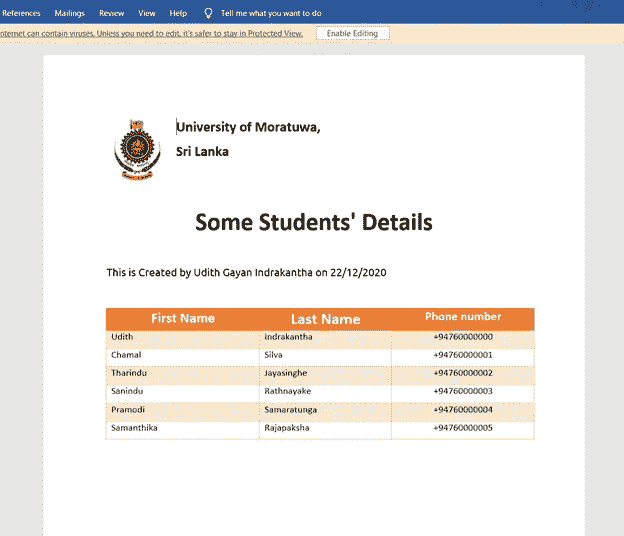

# 从 Vue 中的模板生成 Word 文档。带有类型脚本的 JS

> 原文：<https://javascript.plainenglish.io/generate-word-documents-from-templates-in-vue-js-with-typescript-da0f15114f5d?source=collection_archive---------3----------------------->

Photo by [Austin Chan](https://unsplash.com/@austinchan?utm_source=unsplash&utm_medium=referral&utm_content=creditCopyText) on [Unsplash](https://unsplash.com/s/photos/template?utm_source=unsplash&utm_medium=referral&utm_content=creditCopyText)

在我的一个 Vue 项目中，我需要用不同的模板生成 word 文档。我做了一个小的 R&D，遇到了几个库和 API 来实现这个。它们都不是免费的，我们必须购买订阅，这对我来说非常昂贵。可用的免费库使用的方法是，我们必须首先用 HTML 设计模板，然后将它们呈现为 word 文档。这种方法不适合我的需要，因为有许多模板，它们可以根据客户的需要经常改变。

最后，我遇到了一个很棒的库(这是互联网上唯一可用的库),它可以根据给定的模板生成 word 文档，该模板包括在生成报告时可以用当前数据替换的标签。它是一个 JavaScript 库，但我的 Vue 项目是在 Typescript 中。

在这篇文章中，我将解释如何用 Vue 轻松实现这个特性。TypeScript 中的 JS 项目。如果您不熟悉使用 TypeScript 的 Vue，请阅读这篇解释如何创建新 Vue 的文章。TypeScript 中的 JS 项目。其他人可以继续。

# 安装必要的库

为了生成 word 文档，我们使用由 [Edgar Hipp](https://twitter.com/EdgarHipp) 开发的 [docxtemplater 库](https://www.npmjs.com/package/docxtemplater)。首先，在项目文件夹内的控制台中运行这些命令

除了主库，在这个过程中我们还需要上面提到的其他库。文件保存库用于将最终输出保存到本地机器。

# 为 TypeScript 编写定义文件

如果某些 JavaScript 库不包含 TypeScript 的类型定义文件，则不能在 TypeScript 项目中直接使用它们。类型定义文件通常以*<library name>****. d . ts***的形式出现，你可以在项目的 node_modules 文件夹中查看已安装的库中是否有这样的文件。

除了 docxtemplater 库，其他三个库都不包含这样的定义文件。因此，我们必须自己单独为它们编写定义文件。这些文件被创建，按照结构***<library name>. d . ts***命名，放置在 ***src*** 文件夹中。

**jszip.d.ts**

**jszip.d.ts**

**jszip-utils.ts**

**jszip-utils.ts**

**file-saver.d.ts**

**file-saver.d.ts**

在 src 文件夹中创建这些文件后，您可以在任何组件中使用它们。

# 提交模板

首先，您必须将由标签组成的模板文档放在 Vue 项目的 **public** 文件夹中。标签写在两个大括号内。ex:-**{全名}** 。

为了解释这个问题，我创建了我的样本模板，并把它放在一个单独的文件夹中，这个文件夹位于 **public** 文件夹中(public→report templates→template-1 . docx)。

Sample template ( template-1.docx )

所有在 **{}** 里面的都是标签，它们被渲染时提供的 JSON 数据集所替代。JSON 对象中的标记名和属性名必须相似，才能对标记进行替换。

*{#students}……{/students}* 表格中的一行表示 JSON 对象中名为“students”的列表，我们将在渲染时提供该列表。

对于这个例子，这是我们将提供的 JSON 数据集。

JSON Object

# 编写组件

这就是我的最终组件代码的样子。当我单击这个按钮时，它会下载 docx 格式的最终 word 文档以及 JSON 格式的硬编码数据集。通常，您应该调用您的后端 API 并为报告获取这个数据集。

在第 82 行，对于 loadFile 函数的第一个参数，您可以给出模板相对于 **public** 文件夹的路径。

或者

如第 81 行(注释)所示，您也可以传递一个 URL。这也可以来自服务器或云存储。

这里使用 JSUtils 库从模板文档中读取二进制内容，并以可以压缩的方式准备它。JSZip 库用于创建压缩内容。docxtemplater 库要求模板为压缩内容。这就是我们在这个过程中使用另外两个库的原因。

在第 89 行，您可以看到我已经为文档设置了 JSON 数据集。如前所述，这个数据集可以来自 API。

在第 113 行，在 file-saver.js 库中导出的 saveAs 函数已经被用来下载具有给定文件名(这里是 MyDocument.docx)的 blob。

我在上面的代码中添加了一些有用的注释，这样你就可以随意修改代码了。

# 最终输出

在提交模板、创建定义文件和编写 Vue 组件之后，我们可以下载下面这个不错的 word 文档。

MyDocument.docx

## 我们还能用这个图书馆做什么？

仅 word 文档带有“.”。docx”可以生成免费版。(商业版也支持 pptx 和 xlsx 版本)

免费版本支持以下功能，足以在您的项目中生成好看的令人印象深刻的报告。

*   在表格中填充数据(就像我们讨论的例子一样)
*   用给定的对象列表重复 word 文档中的一节。(循环)
*   通过启用[角度解析器选项](https://docxtemplater.readthedocs.io/en/latest/angular_parse.html#angular-parser)对标签进行条件渲染。
*   创建循环列表

你可以在他们的[官方页面](https://docxtemplater.com/)的[演示区](https://docxtemplater.com/demo/)测试这些功能。

## 结论

我解释了如何通过 Vue 使用这个 docxtemplater 库。TypeScript 中的 JS 项目。使用这种方法，可以适应模板的频繁变化，而标签名称保持不变。这是我迄今为止遇到的最有优势的图书馆之一，我相信有一天你也会遇到同样的情况。

如果你对此有任何问题，请不要犹豫，使用评论部分。

感谢您的阅读&快乐编码！