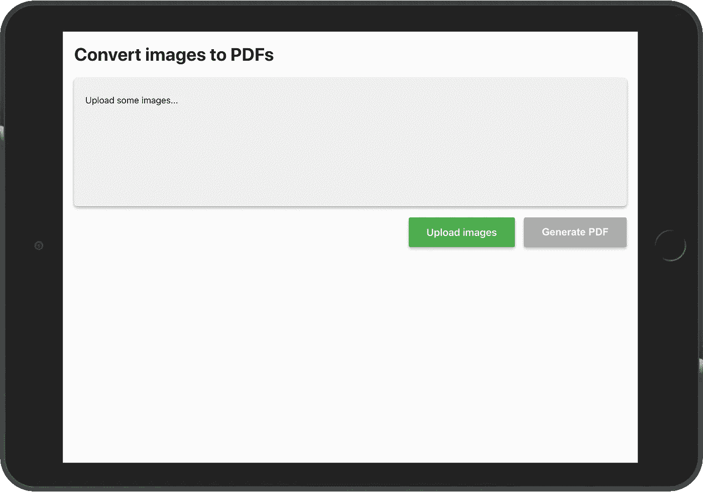
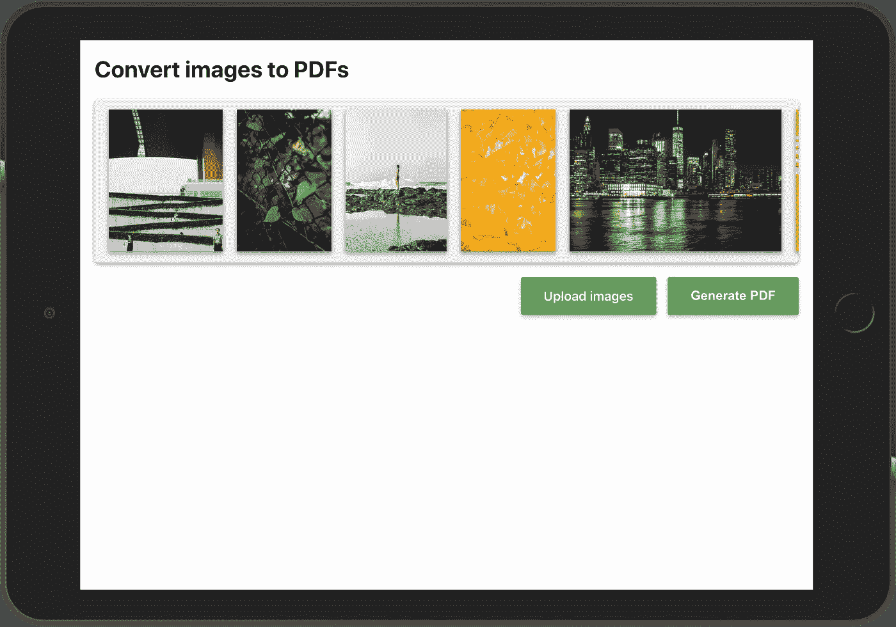

# 使用 React 在客户端从图像生成 PDF

> 原文：<https://javascript.plainenglish.io/generating-pdf-from-images-on-the-client-side-with-react-a971b61de28c?source=collection_archive---------1----------------------->

## 无需服务器，在前端将图像转换为 PDF


出于各种原因，您可能需要为 web 应用程序的用户提供一个 PDF 文档，例如财务报表、帐户信息或任何必须在单个文件中共享的重要信息。

在这篇文章中，我描述了为什么您应该考虑在客户端生成 PDF，以及如何将这一功能添加到您的 web，或者更具体地说，React 应用程序。

因为我喜欢从一开始就对正在发生的事情有一个很好的概述，所以在继续之前，您可以看到应用程序及其源代码的现场演示:

> **现场试玩:**【https://pixochi.github.io/pdf-from-images-react-app/】
> **源代码:**[https://github.com/pixochi/pdf-from-images-react-app](https://github.com/pixochi/pdf-from-images-react-app)

# 1.为什么在客户端/前端

*   如果你的应用还没有使用服务器，你就不需要设置和维护任何服务器。
*   您的服务器将使用更少的资源，因为所有的工作都由浏览器完成。
*   尽管这取决于您的工具，但是您可以利用所有现有的前端样式框架。

# 2.使用什么 JS 库

有 3 个流行的 JavaScript 库可以用来在前端生成 PDF 文档。

1.  [jsPDF](https://github.com/MrRio/jsPDF)
2.  [PDFKit](https://github.com/foliojs/pdfkit)
3.  [pdfmake](https://github.com/bpampuch/pdfmake)

## 为什么选择 jsPDF

我为这个项目选择了 [jsPDF](https://github.com/MrRio/jsPDF) ，原因如下:

*   [GitHub 星星的最高数量(20.3K)](https://github.com/MrRio/jsPDF)
*   [到期(2014 年发布)](https://github.com/MrRio/jsPDF/releases?after=1.1.135)
*   [最小尺寸(比 PDFKit 小 87%，比 pdfmake 小 460)](https://bundlephobia.com/result?p=jspdf@2.1.1)
*   [原生类型脚本支持](https://github.com/MrRio/jsPDF/tree/master/types)
*   [优秀文档](http://raw.githack.com/MrRio/jsPDF/master/docs/)

# 3.让我们构建 React 应用程序

## 初始设置

为了简单起见，我们将使用 [Create React App](https://create-react-app.dev/docs/adding-typescript/) 来设置应用程序。在终端中运行一个命令来初始化项目:

```
npx create-react-app pdf-from-images-react-app --template typescript
```

安装完成后，添加`jspdf`包:

```
npm install jspdf
```

然后使用以下命令启动 React 应用程序:

```
npm start
```

## **UI 骨架**

在实现功能之前，我们将准备好应用程序 UI。

您可以用下面的代码替换`App.tsx`的全部内容:

在上面的代码中，你可以注意到几个`className`*s*——这些是对应用程序的最小样式调整。所有的`className`*都来自`App.css`，其中包含以下 CSS 规则:*

*随着`App.tsx`和`App.css`中的内容被替换，您的应用在浏览器中应该是这样的:*

**

*UI for the app generating PDFs from images*

## *从您的设备上传图像*

*在生成 PDF 之前，您需要从设备中读取图像。`App.tsx`已经包含了一个用于选择文件的文件`input`元素，现在我们需要将选中的图片带入应用状态。*

*注意处理上传图像并更新状态的`handleImageUpload`函数:*

*有了最新的更改，您应该能够单击绿色的“上传图像”按钮，选择图像，然后图像应该会显示在 UI 中。*

**

*React app for generating PDFs from images*

## *从上传的图像生成 PDF*

*最后一步是最终创建一个包含所有图像的 PDF 文档。在您用以下更改更新您的`App.tsx`之后，您的 React 应用程序就完成了。*

*新的`handleGeneratePdfFromImages`功能负责 PDF 生成和应用程序清理。现在，当您点击“生成 PDF”按钮时，您的 PDF 就可以下载了。*

# *结论*

*随意克隆/派生 [GitHub 库](https://github.com/pixochi/pdf-from-images-react-app)并使用上述代码的重构版本。*

*如果有些事情没有按预期工作或需要更多的细节，只需在下面留下评论。*

*[](https://github.com/pixochi/pdf-from-images-react-app) [## pix ochi/pdf-from-images-react-app

### 这个项目是用 Create React App 引导的。在项目目录中，您可以运行:在…中运行应用程序

github.com](https://github.com/pixochi/pdf-from-images-react-app) 

**如果你喜欢这篇文章，请关注我，了解更多关于 React、JavaScript、TypeScript 等开发的技巧:】**


## 成为会员

*如果你喜欢阅读这样的故事，并想支持我成为一名作家，* [*考虑报名成为一名中等会员*](https://jakub-kozak.medium.com/membership) *。每月 5 美元，你可以无限制地阅读媒体上的故事。如果你* [*用我的链接*](https://jakub-kozak.medium.com/membership) *注册，我会赚一小笔佣金*🙌

[](https://jakub-kozak.medium.com/membership) [## 通过我的推荐链接加入 Medium 雅各布·科萨克

### 阅读雅各布·科萨克(以及媒体上成千上万的其他作家)的每一个故事。您的会员费直接支持…

jakub-kozak.medium.com](https://jakub-kozak.medium.com/membership) 

## 工作机会——来加入我吧

我在 T21 的团队正在寻找更多的开发者！你有使用 React 和 Ruby on Rails 的经验吗？那就不要犹豫，马上申请吧:[https://www.tjekvik.com/careers](https://www.tjekvik.com/careers)。你可以在欧洲的任何地方工作！🌍

[](https://medium.com/swlh/how-to-build-a-chrome-extension-with-react-typescript-and-webpack-92e806ce2e16) [## 如何使用 React、TypeScript 和 Webpack 构建 Chrome 扩展

### 从创建样板文件到发布 Chrome 网络商店的完整扩展

medium.com](https://medium.com/swlh/how-to-build-a-chrome-extension-with-react-typescript-and-webpack-92e806ce2e16) [](https://medium.com/swlh/best-moment-js-alternatives-5dfa6861a1eb) [## 最佳时刻。JS 替代方案

### 比较大小、性能、类型脚本支持等

medium.com](https://medium.com/swlh/best-moment-js-alternatives-5dfa6861a1eb) [](https://medium.com/swlh/build-a-real-time-chat-app-with-react-hooks-and-socket-io-4859c9afecb0) [## 用 React Hooks 和 Socket.io 构建一个实时聊天应用

### 有源代码和现场演示

medium.com](https://medium.com/swlh/build-a-real-time-chat-app-with-react-hooks-and-socket-io-4859c9afecb0)*