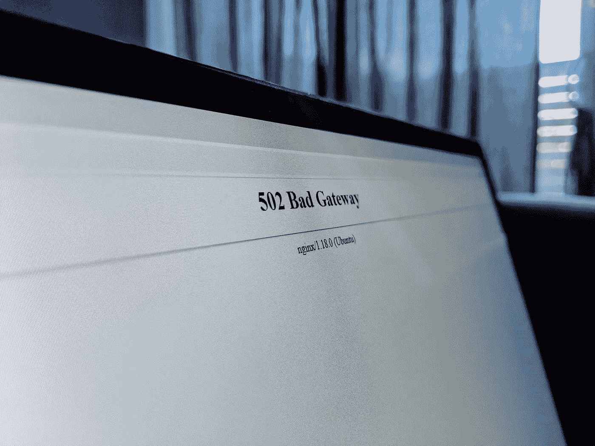
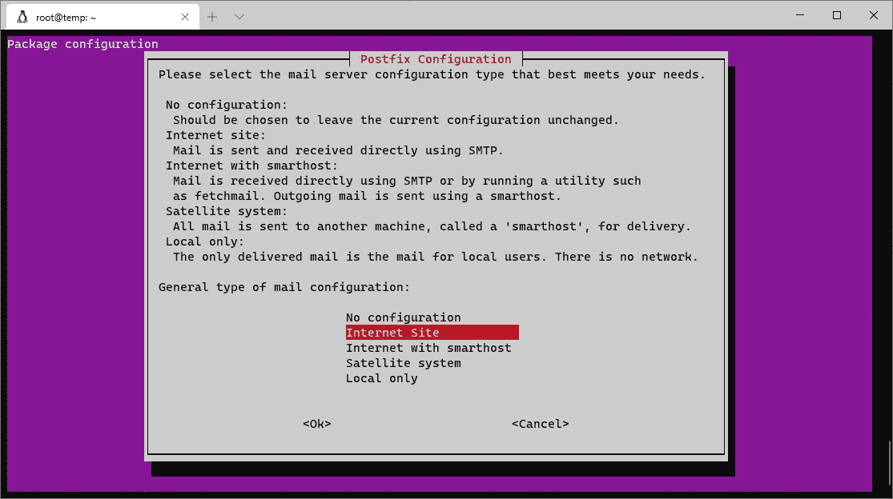
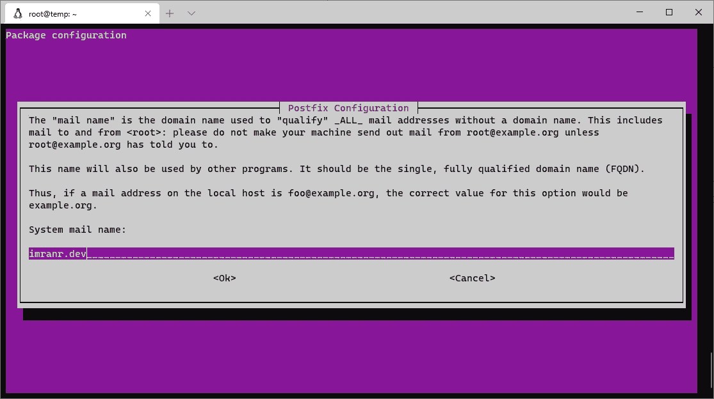
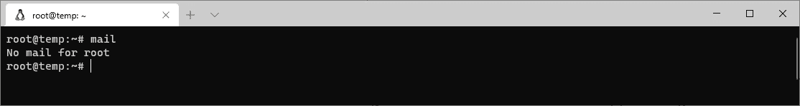
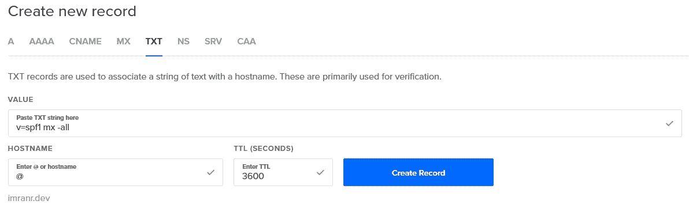
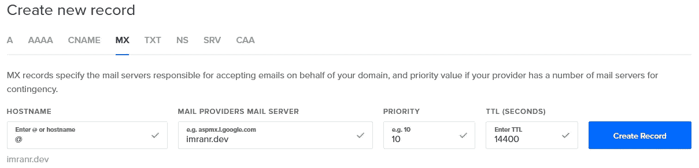
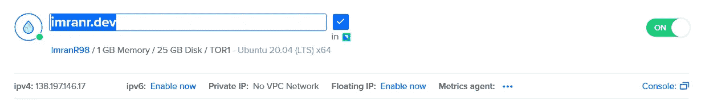

# 如果您的服务器应用程序在 Linux 上崩溃，您会收到通知

> 原文：<https://javascript.plainenglish.io/get-notified-if-your-server-app-crashes-on-linux-485217053a68?source=collection_archive---------8----------------------->

## 确保崩溃日志立即发送到您的收件箱



Source: Imran Remtulla

在之前的[指南中，我向您展示了如何将 web 应用程序部署到云中，并将其连接到您自己的域。现在你的应用已经启动并运行了，你的工作已经完成了，对吗？不完全是。即使是最好的软件也有漏洞，所以你的应用迟早会崩溃，当这种情况发生时，你可能会在几小时、几天或几周之后才发现。通过电子邮件立即得到通知不是很好吗？在本指南中，我将向您展示如何设置它。](https://medium.com/swlh/localhost-to-com-deploying-a-web-app-for-beginners-ea05b0213eb7)

# 前言

我希望你已经有一个应用程序运行在一个运行 Ubuntu 的服务器上，并且连接到你自己的互联网域。应用程序的启动过程应该使用 Systemd 来管理，这是 Ubuntu 的内置服务管理器。如果你对此不确定，我在这里回顾一下基本步骤。

如果你已经做好了所有的准备，你应该已经理解了一些概念和术语，包括基本的虚拟主机操作，比如为你的域名添加 DNS 记录。任何专门术语都是在需要时定义的。

# 步伐

本指南分为四个主要步骤:

1.  设置电子邮件服务器
2.  创建崩溃报告服务
3.  配置服务以使用故障报告程序
4.  确保发送的电子邮件确实被收到

我们开始吧！

# 设置电子邮件服务器

由于崩溃报告将通过电子邮件发送，我们需要设置一个电子邮件服务器。

首先，确保你的系统是最新的。运行以下命令:

```
sudo apt update && sudo apt upgrade -y && sudo apt autoremove -y
```

然后，安装`mailutils`包:

```
sudo apt install mailutils -y
```

您应该会看到下面的屏幕。按 Enter 键接受默认选项。



Select ‘Internet Site’ for the mail configuration.

您现在应该会看到一个文本框。输入服务器连接到的域名，然后按 Enter 键继续。



Enter your domain name as the system mail name.

配置完成后，运行`mail`命令以确保一切顺利。输出应该是类似于`No mail for user`的东西。



‘No mail’ indicates that the email server installation was successful.

# 创建崩溃报告服务

现在，我们需要创建一个 Systemd 服务，在启动时，它会将来自任何其他服务的日志发送到您的电子邮件地址。

运行`sudo nano /lib/systemd/system/notify-email@.service`。这将在文本编辑器中打开一个新的 Systemd 服务文件。请注意，文件名中的`@`表示该服务接受一个变量输入(稍后将详细介绍)。

在文件中，粘贴以下文本。确保将`imranr.dev`的所有实例都更改为您的实际域名，并将`placeholder@example.com`电子邮件替换为您要向其发送崩溃日志的电子邮件。

```
[Unit]
Description=Send service logs email[Service]
Type=oneshot
ExecStart=/usr/bin/bash -c '/usr/bin/systemctl status %i | /usr/bin/mail -s "[SYSTEMD_%i] Fail" -r "imranr.dev<root@imranr.dev>" placeholder@example.com'
```

正如您所看到的，这个文件非常简单。运行时，该服务从任何其他服务获取最新日志(由启动时提供的`%i`变量指定)，然后使用`mail`命令将它们通过电子邮件发送到预定义的地址。

现在，在你的键盘上按 Ctrl-X(Macs 用 Cmd-X)，然后按 Y，然后回车。这将保存文件。在`nano`命令使用的所有后续实例中，相同的键盘快捷键将用于保存文件。

# 配置服务以使用故障报告程序

现在，使用相同的`nano`命令对您想要监控崩溃的任何服务文件执行以下更改。

例如，如果每当我的 Node.js 应用程序崩溃时，我想通过电子邮件收到崩溃日志，我会找到启动它的服务文件(在我的例子中是`nodeapp.service`)，然后运行`sudo nano /lib/systemd/system/nodeapp.service`。

文件打开后，在`[Unit]`标题下添加以下行:

```
OnFailure=notify-email@%i.service
```

这一行告诉服务在崩溃时启动`notify-email`服务。这里行中的`%i`是当前服务的名称，对应于崩溃报告器服务文件中的`%i`变量。

再次按 Ctrl-X，然后按 Y，然后按 Enter 保存文件。

一旦你对所有你想监视的服务重复了这个过程，运行`sudo systemctl daemon-reload`来刷新 Systemd，然后单独重启相关的服务，或者重启你的服务器来重启所有的服务。

# 确保发送的电子邮件确实被收到

从技术上来说，现在一切都应该工作了，但是从你的服务器发出的任何崩溃日志可能永远不会到达你的收件箱。这是因为 Gmail、Outlook 和大多数其他电子邮件提供商会将其识别为垃圾邮件(这种邮件非常糟糕，会被直接拒绝，甚至永远不会被放入垃圾邮件文件夹)。

电子邮件系统的后端很复杂；以至于有[的整个业务](https://www.mail-tester.com/)建立在帮助你确保你的电子邮件通过垃圾邮件过滤系统上。虽然您不需要了解电子邮件配置这一复杂词汇的细节(这是一项重大的时间和精力投入)，但我会告诉您我采取的基本步骤，以确保我的 Gmail 帐户接受我的服务器崩溃日志电子邮件:

1.  添加 SPF 记录
2.  配置 DKIM
3.  更改邮件主机名并启用 rDNS。
4.  将电子邮件地址列入白名单
5.  测试

## 添加 SPF 记录

SPF 记录用于验证特定电子邮件来自的 IP 地址是否被授权代表该电子邮件声称来自的域发送电子邮件。例如，如果我试图给你发一封据称来自 medium.com 的电子邮件，你会知道这可能是垃圾邮件，因为 medium.com 的 SPF 记录不包括我的 IP 地址。

转到您的虚拟主机平台，添加以下 TXT 记录:

```
v=spf1 mx -all
```

这指定作为 MX 记录覆盖的任何 IP 也应被授权发送电子邮件。

我使用 DigitalOcean，所以这是我看到的样子:



Adding an SPF record on DigitalOcean.

MX 记录用于指示哪些服务器应该用作域的邮件服务器。由于我们的邮件服务器与发件人 IP 位于同一个域中，我们将添加适当的 MX 记录:



Adding an ‘MX’ record on DigitalOcean.

## 配置 DKIM

像 SPF 一样，DKIM 记录用于验证电子邮件是从它声称发送的域发出的。按照这里描述的[步骤](https://www.digitalocean.com/community/tutorials/how-to-install-and-configure-dkim-with-postfix-on-debian-wheezy)来配置 DKIM。它们是为 DigitalOcean 编写的，但适用于任何平台。

## 更改邮件主机名并启用 rDNS。

众所周知，DNS 是用来获取域名 IP 的系统；rDNS 正好相反，它用于查找给定 IP 地址的域名。这是另一种用于确定电子邮件是否是垃圾邮件的系统。

根据服务器托管方式的不同，rdn 的设置也有所不同。以 DigitalOcean 为例，只需将您的 Droplet 重命名为您的域名即可。您可能需要进行一些搜索，以了解您的提供商如何处理 rdn。



Renaming my DigitalOcean droplet to enable rDNS.

完成后，您需要修改电子邮件服务器使用的主机名以匹配该域。为此，运行`nano /etc/postfix/main.cf`并将`myhostname`值修改为您的域名。

## 将电子邮件地址列入白名单

作为最后的预防措施，您可能希望在收件箱中为从您的域发送的电子邮件明确添加白名单规则。这样，电子邮件一旦到达你的邮箱，就不会被标记为垃圾邮件。

## 测试

通过故意破坏一个被监控的服务并检查你是否收到邮件来确保一切正常。你可能还想使用[mail-tester.com](https://www.mail-tester.com/)来检查你是否正确地遵循了减少你的电子邮件的“垃圾邮件”的步骤。

恭喜你！如果您遵循了这些步骤，现在您可以高枕无忧了，因为如果您的应用程序崩溃，您会立即知道并采取行动。

我希望你觉得这个指南有用；非常感谢您的阅读！