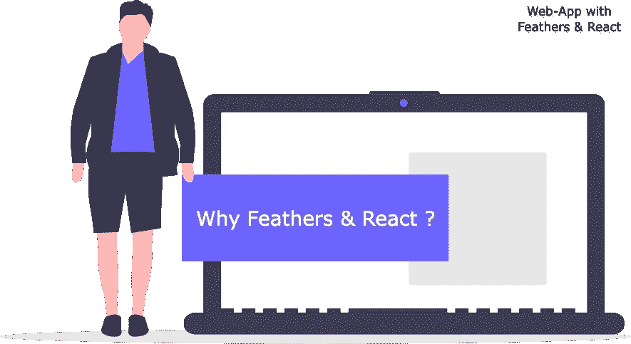

# 从羽毛和反应开始—第 1 部分

> 原文：<https://javascript.plainenglish.io/get-started-with-feathers-react-part-1-6b2b35a398c3?source=collection_archive---------13----------------------->



Illustration by [Undraw](https://undraw.co/)

> 本文及其后续部分假设您熟悉 JavaScript，并对 Feathers 和/或 Express & React 有基本的了解。这些文章只提供了使用 Feathers & React 创建 Web 应用程序的一般概念，并不包括任何相关概念的深入解释。这一系列文章的目的是概述 Web 应用程序的最基本要素，以及如何使用 Feathers & React 创建一个具有这些要素的 Web 应用程序。如果你想了解更多，请参考 Feathers & React 的官方文档。

# 为什么是羽毛？

[**羽毛**](https://docs.feathersjs.com) 是作为**微服务**框架开发的，但也可以作为**极简** web 框架，使用 JavaScript 或 TypeScript 以最小的努力创建**实时**应用程序和**REST API**。它建立在 [***节点***](https://nodejs.org/en/) ， [***表达***](https://expressjs.com/)*(用于*RESTful*transport)*和*[***socket . io***](https://socket.io/)它有两个核心特性:***

*   **[***服务***](https://docs.feathersjs.com/api/services.html) **—** 实现您的[业务逻辑](https://en.wikipedia.org/wiki/Business_logic)的类或对象的实例。**
*   **[***钩子***](https://docs.feathersjs.com/api/hooks.html) **—** 为*服务*提供可插拔的中间件功能。**

**在其核心， **Feathers** 是一套工具和架构模式，使得创建可伸缩的**REST API**和**实时**应用变得容易。**

****Feathers** 允许我们使用其 [***CLI***](https://github.com/feathersjs/cli) 来快速搭建新的 **Apps** 或**API**。您可以指定想要使用哪个 [*数据库*](https://docs.feathersjs.com/api/#databases) ，想要哪种 [*认证*](https://docs.feathersjs.com/api/authentication/) 配置等等。**

```
**feathers generate app**
```

**点击了解更多关于使用**羽毛** [的好处。](https://blog.feathersjs.com/why-we-built-the-best-web-framework-you-ve-probably-never-heard-of-until-now-176afc5c6aac)**

# **为什么要反应？**

**[**React**](https://www.reactjs.org) 是一个声明式的、高效的、灵活的 JavaScript(支持类型脚本)库，用于构建用户界面。它可以让你用称为**组件**的小而孤立的代码片段组成复杂的 ui。它使用[](https://reactjs.org/docs/introducing-jsx.html)**(JavaScript 的一种语法扩展)来产生 ***元素*** 。****

```
****const name = 'Monarch Maisuriya';
const greet = <h1>Hello, {name}</h1>;****
```

****将这些**元素组合在一起就构成了一个***组件*** 。******

******React** 提供了一个基于 ***组件的*** 结构。您可以在任何需要的地方重用这些 ***组件*** ，这使得维护和扩展您的代码库变得更加容易，并且它给了您的应用程序一致的外观和感觉。****

******React** 提供快速渲染，带有 [***虚拟 DOM***](https://reactjs.org/docs/faq-internals.html#:~:text=The%20virtual%20DOM%20(VDOM)%20is,This%20process%20is%20called%20reconciliation.)*—一个 **DOM** 保存在内存中。通过使用*虚拟 DOM* ***，*****React**[*diffs*](https://reactjs.org/docs/reconciliation.html)*两种不同状态之间的变化，并且只更新较新状态中的变化。******

*****使用 **React 还有很多好处，**在这里阅读更多关于它的[。同样，你可以使用](https://reactjs.org/blog/2013/06/05/why-react.html)[***create-React-App***](https://create-react-app.dev/)快速搭建一个 **React** App。*****

```
**npx create-react-app my-app**
```

****现在你大概知道为什么要用**反应**和 **羽毛**了。让我们从一个简单的网络应用开始。****

******那么，在网络应用中，你应该有什么样的*基本设置*和*配置*？******

*   ****一个 ***用户界面/客户端*** ，用于处理用户交互并访问*API*以传达交互和信息。****
*   ****一个 ***API*** ，用于与*服务器*进行交互并传输信息。****
*   ****一个 ***服务器*** ，用于存储上述信息，并对该信息执行[业务逻辑](https://en.wikipedia.org/wiki/Business_logic)并发回结果。****

****这些是创建一个 ***通用*** 网络应用的*最低*要求。****

******羽毛**和**的几个细节反应**:****

*   ******Feathers-Client:**[***客户端***](https://docs.feathersjs.com/api/client.html#feathersjs-client) 用于(通过 **React** 或任何其他前端技术)连接到中继方法调用，并通过 **REST** 或 **WebSocket** 传输监听服务器上的 [***事件***](https://docs.feathersjs.com/api/events.html) 。****
*   ******React-State:**[***State***](https://reactjs.org/docs/state-and-lifecycle.html)对象是你存储属于组件的属性值的地方。****

****我们将使用上面提到的概念创建一个 ***通用的*** 网络应用，带有**羽毛**和**反应**。****

****这就是 ***的 **Part 1** “上手羽毛& React”。*感谢阅读:)******

****[**第二部分**](https://ingeniousambivert.medium.com/get-started-with-feathers-react-part-2-d071e29cb6a9) :用**羽毛**和**反应**设置一个基本的 Web App。在**羽毛服务器**中添加*[***本地认证***](https://docs.feathersjs.com/api/authentication/local.html#localstrategy) 。并在****React App 中实现 **Feathers-Client** 。*********