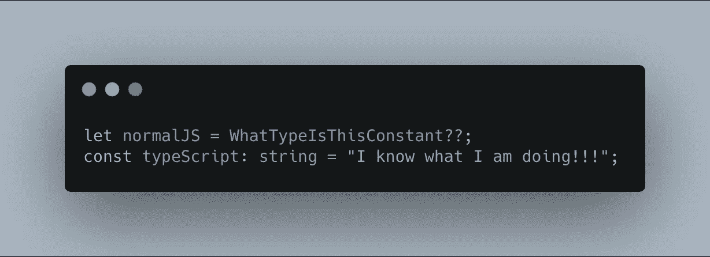

# Typescript 入门

> 原文：<https://javascript.plainenglish.io/get-started-with-typescript-e14495420167?source=collection_archive---------1----------------------->



## 打字稿？为什么？怎么会？

Typescript 是一种编译成 JavaScript 的编程语言。这意味着任何有效的 JS (JavaScript)代码都是有效的 TS (Typescript)。TS 是一种面向开发者的语言。如果你已经写了一堆 Javascript 代码，并且开始想知道，“嘿，那个函数参数的类型是什么？”，你懂的。

Typescript 是“可伸缩的 JavaScript ”,这意味着它在所有变量/返回值上强制执行类型，允许接口使用，等等。Typescript 还实现了一些 Javascript 将来会有的特性。

# 入门指南

Typescript 是一种编译语言，这意味着它需要编译器。您首先需要安装 NodeJS(TS 几乎总是与 Node 一起使用)。然后键入`npm i -g typescript`在您的计算机上全局安装 TS。如果输入`tsc -v`有效并产生了您的 TS 安装的版本号，您就可以开始了！

# 基础知识

使用 Typescript 真正需要的是编译器。因此，创建一个名为 hello.ts 的新文件，并将以下代码放入其中:

```
let message: string = "Hello, TS!";
console.log(`Message: ${message}`);
```

正如您所看到的，这里有一个与普通 JS 不同的地方——消息变量名后面的:string 类型注释。类型注释的一般形式是这样的:`let variableName: type`。注意:字符串类型将被推断为没有注释的类型，就像在这种情况下，设 a = 9，错误的类型将是 number。现在，要将 TS 文件编译成 JavaScript，运行 tsc hello.ts。这将使用编译后的 js 代码生成一个名为 hello.js 的新文件。让我们运行:node hello.js。您应该在控制台中看到“您好，TS ♥️".要了解更多关于 Typescript 语法和酷功能的信息，请查看手册。

# 带节点的工作流

因为 TS 主要用于 Node.js 环境中，所以了解它们是如何协同工作的非常重要。

用`npm init`创建一个新项目。

接下来，用`tsc -init`添加 TS 配置文件。这将在项目的根目录下创建一个名为`tsconfig.json`的新文件。里面有各种你可以使用的配置变量。我们暂时感兴趣的是一个叫 outDir 的。这是编译后的 TS 放入的文件夹。找到定义它的那一行，取消对它的注释，并赋予它值`"./build"`。

现在，你可以把你的 TS 文件放在任何地方，它们都将通过命令`tsc`编译到`./build`目录中。

将您的`hello.ts`文件复制到您的项目的根目录中，并运行 tsc(就这三个字母)。现在，在构建文件夹中，应该有一个 hello.js 文件。可以用`node build/hello.js`运行。

这是创建、编译和运行 TS 文件的一般工作流程。请记住，您可以随意命名`outDir`目录！

# 编辑器和@类型

对于编辑打字稿，我会非常非常推荐 [Visual Studio 代码](https://code.visualstudio.com/)。它是我几乎用于所有事情的编辑器。我以前用 Atom，但是当我换了之后，我意识到 VSC 要好得多。这是超快的⚡️.拥有数以千计的令人惊叹的插件。几乎可以在所有平台上运行。对于 intellisense，VSC 的默认 Typescript 包工作得非常好。但是，当在 Typescript 中使用 npm 包时，您必须安装包的类型定义(如果它们可用)。我们以 express.js 为例。express 的类型定义包是`@types/express`。因此，要获得自动完成、智能感知等功能。用`npm i @types/express`安装包即可。

如果没有安装类型定义，默认情况下包的类型为 any。

一个很好的为你喜欢的 npm 包寻找类型定义的网站是 [definitelytyped](http://definitelytyped.org/) .org。点击搜索，它将带你到 [TypeSearch](https://microsoft.github.io/TypeSearch/) ，在那里你可以找到你的包的类型和如何安装它们(通常是@types/package)。和 TS ❤️.玩得开心

## 进一步阅读

[](/typescript-made-easy-a-guide-to-your-first-type-safe-app-with-next-js-wundergraph-and-prisma-e197a59e2b30) [## 轻松编写类型脚本:使用 Next.js、WunderGraph 和 Prisma 编写第一个类型安全应用程序的指南

### 是时候抛开恐惧，学习 TypeScript 了。让我们给你第一次“发现！”瞬间通过建立一个完整的…

javascript.plainenglish.io](/typescript-made-easy-a-guide-to-your-first-type-safe-app-with-next-js-wundergraph-and-prisma-e197a59e2b30)