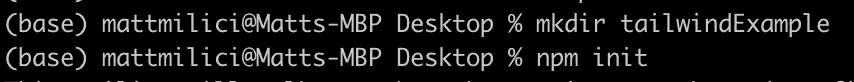
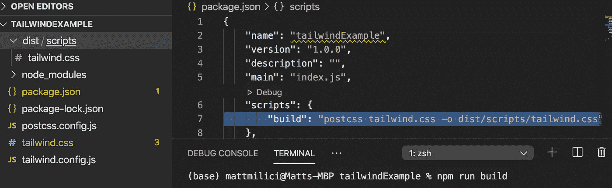

# 借助顺风和节点启动并运行。射流研究…

> 原文：<https://javascript.plainenglish.io/get-tailwind-up-running-c454199f72ec?source=collection_archive---------2----------------------->

## 再见 Bootstrap。你好顺风！


Tailwind will have your apps looking ALMOST as stylish as Dennis in this hat.

Tailwind 是一个 CSS 框架，允许开发人员使用低级实用程序类轻松快速地构建自定义组件。使用 Tailwind，您可以创建一个元素(例如，按钮、卡片、表单等。)从零开始，而不像使用 Bootstrap 那样与预先设计的组件发生冲突。

本文的剩余部分提供了如何安装和设置 Tailwind 的逐步说明。请注意，本文假设你使用的是 [Visual Studio](https://visualstudio.microsoft.com/downloads/) 、 [node](https://nodejs.org/en/download/) 、npm(随 node 自动安装)、以及 [Chrome](https://www.google.com/chrome/?brand=CHBD&gclid=Cj0KCQjwp4j6BRCRARIsAGq4yMFNySCZtV_71VnJGlnfeDE2NxNzglMWaO2NpdtVz_lkltZMasi1bR0aAvThEALw_wcB&gclsrc=aw.ds) 。现在聊够了。让我们开始吧。

## **创建新项目**

首先，让我们开始为我们的项目创建一个新目录并初始化它。对于这个例子，我将把目录命名为“tailwindExample”，但是您可以使用对您来说最有意义的名称。



Entered in Terminal

## **安装尾翼、后舵和自动舵**

接下来，我们要安装 Tailwind、PostCSS 和 Autoprefixer。初始化后，这将在“tailwindExample”目录中创建一个空的 tailwind.config.js 文件。

```
npm install tailwindcss postcss-cli autoprefixer
npx tailwind init
```

PostCSS 是一个可以用 JavaScript 插件处理和转换 CSS 的框架(例如，可以在程序中轻松访问的独特特性/功能)。Tailwind 不包含厂商前缀，所以 Autoprefixer 会自动编译你的 CSS，并通过使用[我能使用](https://caniuse.com/)来确定是否需要前缀。这使得 CSS 特性(或属性)可以在任何浏览器上看到。

## **创建 PostCSS 配置 JavaScript 文件**

首先，在“tailwindExample”目录下创建一个名为“postcss.config.js”的文件。这是我们将要提供插件的地方。下面的代码片段提供了我们将使用的两个包。

```
module.exports = {
plugins: [
require("tailwindcss"),
require("autoprefixer"),
]};
```

## **创建一个顺风 CSS 文件**

现在创建一个名为“tailwind.css”的新文件，并添加以下代码。Tailwind 将在项目中搜索这些标记，并用 Tailwind 提供的基本样式、组件和实用程序替换它们。

```
@tailwind base;
@tailwind components;
@tailwind utilities;
```

## **更新 Package.json**

导航到您的“package.json”文件，并更新测试脚本以读取下面第 7 行中的内容。现在进入终端，运行“npm run build”如果操作正确，您将在项目中看到 dist/scripts/tailwind.css 文件路径。



您会注意到新创建的“tailwind.css”文件已经添加了所有的基本样式、实用工具和组件。

## **链接顺风**

最后但同样重要的一点是，打开你的 HTML 页面，在页面头部添加一个样式链接。现在，您可以开始在 CSS 文件中使用 Tailwind 了。我建议你直接去找顺风医生，然后开始行动！

`<link rel=”stylesheet” href=”dist/scripts/tailwind.css”/>`

## **总结**

顺风有一些我见过的最好的医生。如果这篇文章没有回答你所有的问题，我推荐你使用下面的链接。

*   [顺风首页](https://tailwindcss.com/)
*   [Tailwind 文档介绍了如何在 HTML 中使用实用程序](https://tailwindcss.com/docs/installation)