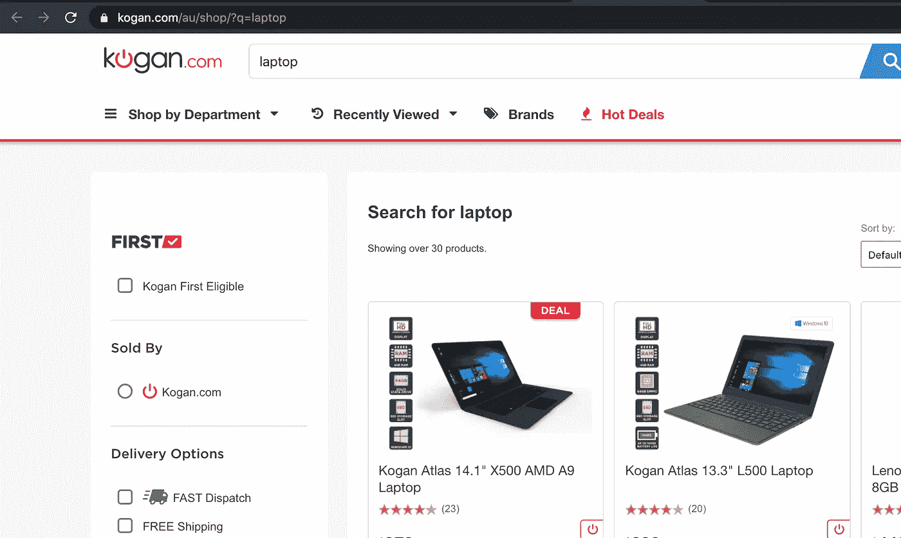
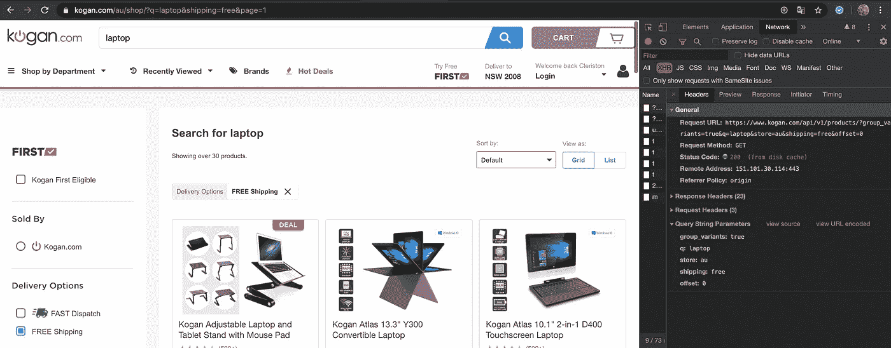
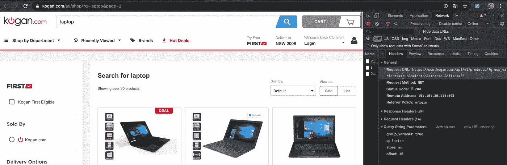
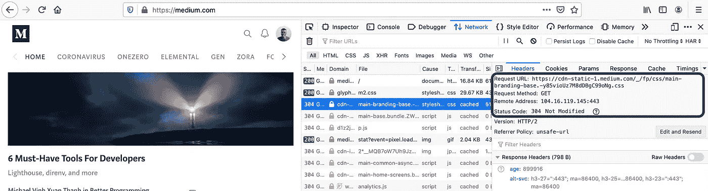
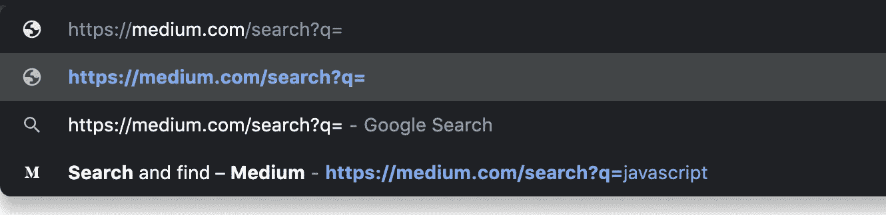

# 关于 GET 和 POST，开发人员应该知道的 11 件事

> 原文：<https://javascript.plainenglish.io/get-vs-post-are-you-confident-about-the-differences-189562fac0a7?source=collection_archive---------0----------------------->

Photo by [Erik Mclean](https://unsplash.com/@introspectivedsgn?utm_source=unsplash&utm_medium=referral&utm_content=creditCopyText) on [Unsplash](https://unsplash.com/s/photos/404?utm_source=unsplash&utm_medium=referral&utm_content=creditCopyText)

很长一段时间以来，我在采访中一直在问这个问题，令人惊讶的是，很多人对两个最常用的 RESTful API 方法:GET 和 POST 没有足够的了解。因为我相信很多人会觉得不想通读这篇文章，所以我根据这两种方法的不同之处准备了一个简单的小测验，并给出了答案和应用。

**GET 还是 POST？**

1.  将浏览器视为客户端，哪个方法的参数存储在浏览器的会话历史中？
2.  考虑一个浏览器作为客户端，哪种方法可以缓存？
3.  哪一种是“安全”的方法？
4.  哪个不是幂等的？
5.  如果我将一个端点 url 复制并粘贴到浏览器的地址栏，然后按 enter 键，默认情况下会调用哪种方法？
6.  哪个方法请求有主体？
7.  考虑一个静态网站，这个 app 唯一响应的方法是什么？
8.  哪种方法有长度限制？
9.  哪种方法更安全，应该用来处理敏感数据？
10.  哪种方法可以加入书签？
11.  哪种方法只允许 ASCII 字符？

你知道所有的答案吗，为什么？如果没有，也没什么好羞愧的。让我们更详细地分析这两种方法，并理解它们的特性。

1.  **获取参数将存储在浏览器的会话历史中。**

浏览器使用它的历史记录来导航用户前进和后退，因此，每个新输入的 URL 都会自动进入历史记录。但是，如果 GET 请求是通过 SPA(通过 ajax 或 axios)隐式完成的呢？在这种情况下，请求 URL 必须通过`history.pushState`手动推送，它可以在浏览器的 URL 地址上更新，而无需重定向用户。

考虑两种不同的场景:

A.转到[https://www.kogan.com/au/shop/?q=laptop](https://www.kogan.com/au/shop/?q=laptop)，点击任意过滤器(例如“免运费”)。网站将发出新的 GET 请求，获取响应，重新呈现产品列表，更新浏览器 url 地址，并将 url 保存在浏览器历史记录中(不一定是这个顺序)。虽然页面没有刷新，但是新的查询仍然被推送到浏览器历史，因此您将能够导航回初始页面。

Image form [kogan](https://www.kogan.com/au/)

选择免运费时:

Image form [kogan](https://www.kogan.com/au/)

请注意，新的请求是在没有刷新页面的情况下发出的，后退按钮现在已启用，浏览器中设置的 url 甚至与检查中的不同。

B.现在转到[https://www.kogan.com/au/shop/?q=laptop](https://www.kogan.com/au/shop/?q=laptop)，而不是点击任何过滤器，滚动到底部，点击“查看更多”。该网站将发出一个新的 GET 请求，获取响应，重新呈现产品列表并更新浏览器 url 地址。但是，它不会将 url 保存在浏览器历史记录中。虽然页面没有刷新，但由于新查询没有被推送到浏览器历史记录中，您将无法导航回初始页面。

Image form [kogan](https://www.kogan.com/au/)

请注意，新的请求是在没有刷新页面的情况下发出的，即使在浏览器 url 更改后，back 按钮仍然不可用。

关于 POST，如果用户在提交表单后向后导航，数据将被重新提交(浏览器应该提醒用户数据即将被重新提交)，但它不会保留在历史记录中。

Chrome form resubmission popup

**2。获取可以缓存的响应**

因为 get 是等幂的，并且大多数网页资源都是通过这个方法返回的，所以默认情况下浏览器会缓存 GET 请求。所以下次你访问网页时，不用再去服务器请求所有的图片，它会直接从浏览器的缓存中加载。

> 在 REST API 的上下文中，当发出多个相同的请求与发出一个请求具有相同的效果时——那么这个 REST API 就称为等幂。

它的好处是，你的网站在第一次之后会加载得更快。但是，如果新部署在其浏览器中缓存了旧网站，则无法到达客户端。因此，要使缓存失效，每个请求的 URL 必须改变，或者客户端必须在浏览器上改变。举个例子，如果你网站的 CSS 用 URL【cdn-static-1.medium.com/_/fp/css/main-branding-base.***-y 85 viouz 7m 8 ddbgc 99 ONG****来表示。css* ，一个新的部署只会改变网站的布局，如果这个 url 被改成类似于*cdn-static-1.medium.com/_/fp/css/main-branding-base.*new hashkeyCSS .

Medium home page network. Highlight on CSS file.

帖子不能在客户端缓存。
帖子不是幂等的 **(4)** 。

**3。Get 是一种安全的方法**

因为这个方法不应该改变资源(如果它改变了，您就没有实现 RESTful 最佳实践)，所以它被认为是安全的。

> 安全方法是不修改资源的 HTTP 方法。

因此，它可以被安全地缓存，保存在浏览器的历史记录中，并保存在搜索引擎上，如谷歌。这是因为参数将存储在 URL 中，调用方法不会导致服务器发生任何变化。另一方面，POST 并不是一个安全的方法。

7。静态网站只响应 GET 请求

静态网站是不需要任何其他工具来处理其文件的应用程序，因为它们将返回浏览器可读的内容(Javascript、图像、CSS、HTML)。因此，它只需要响应 GET 请求就可以返回 html 页面。那么，这些信息意味着什么呢？

你知道吗，只要使用 AWS S3，你就可以托管一个静态网站。我相信很多人会说是。但是你也知道它只允许 GET 和 HEAD 请求。根据他们的[文档](https://docs.aws.amazon.com/AmazonS3/latest/dev/WebsiteEndpoints.html)，S3 桶上请求的所有对象都必须通过 GET。

**8。哪种方法有长度限制？**

理解 GET 方法在浏览器中总是被翻译成 URL(http 协议)并且只允许 ASCII 字符是非常重要的 **(11)** 。换句话说，您在浏览器 URL 地址中输入的任何文本都会生成一个服务器 GET 请求 **(5)** ，而且，即使 GET 请求是通过网站隐式完成的(例如通过 ajax)，它仍然会使用 querystring 中的参数将其转换为 URL 格式。

知道浏览器上的 GET 请求会通过 URL 发送参数，你觉得如果过滤器太多会怎么样？虽然这个数字在不同的浏览器之间会略有不同，但安全的 URL 长度限制通常是 2048 个字符，减去实际路径中的字符数。因此，如果您正在构建一个网站，其中您的产品可以有大量不同的过滤器，GET 方法可能是不够的。

关于 POST，因为有效负载是在请求体中发送的，所以从技术上讲，对要发送的数据没有限制 **(6)** 也没有数据类型限制。

**9。哪种方法更安全，应该用来处理敏感数据？**

虽然很多人都答对了，但他们通常不知道为什么。考虑一个基本的用户密码登录端点，您是否想过为什么它被用于 POST 而不是 GET？是的，与安全有关，但不是因为信息被隐藏。它与我们在这里讨论的第一点有关:浏览器缓存和历史。

想象一下，如果你开始在浏览器上键入一个网站，它会自动建议一个包含用户和密码的 URL 作为查询字符串的一部分。这听起来可能很奇怪，但是 GET login 端点会允许这样做，我确信这不是您想要的。

Browser suggesting URLs from history

[added 2020–05–01]一位读者对这篇文章添加了一条非常重要且相关的评论。GET 方法很有可能通过您的基础设施被记录。无论是 NGINX、AWS Api gateway 还是 AWS CloudFront，因为 get info 都要经过一个查询字符串，所以敏感信息会被记录到你的服务器中。您最不希望的事情就是在您的日志文件中包含客户的密码。

10。哪种方法可以加入书签？

帖子不应该被收藏，原因是上面讨论的几个主题的组合:

*   尝试将文章加入书签只会导致对 URL 的 GET 操作。
*   该方法不是等幂的，因此不能保证响应总是相同的。例如，这可能导致重复的银行交易。
*   URL 将丢失其参数，因为书签不支持正文有效负载。
*   它可能包含不应存储的敏感数据。

**结论**

尽管 GET 经常用于获取数据和 POST 来发送/保存数据，但我们可以得出结论，关于这两种方法还有很多，了解这些特性不仅有助于编写更好的代码，还有助于架构、设计和问题解决。你的分数怎么样？

**资源**

[https://restfulapi.net/idempotent-rest-apis/](https://restfulapi.net/idempotent-rest-apis/)
[https://www.w3schools.com/tags/ref_httpmethods.asp](https://www.w3schools.com/tags/ref_httpmethods.asp)
[https://restfulapi.net/http-methods/](https://restfulapi.net/http-methods/)
[https://docs . AWS . Amazon . com/Amazon S3/latest/dev/website hosting . html](https://docs.aws.amazon.com/AmazonS3/latest/dev/WebsiteHosting.html)