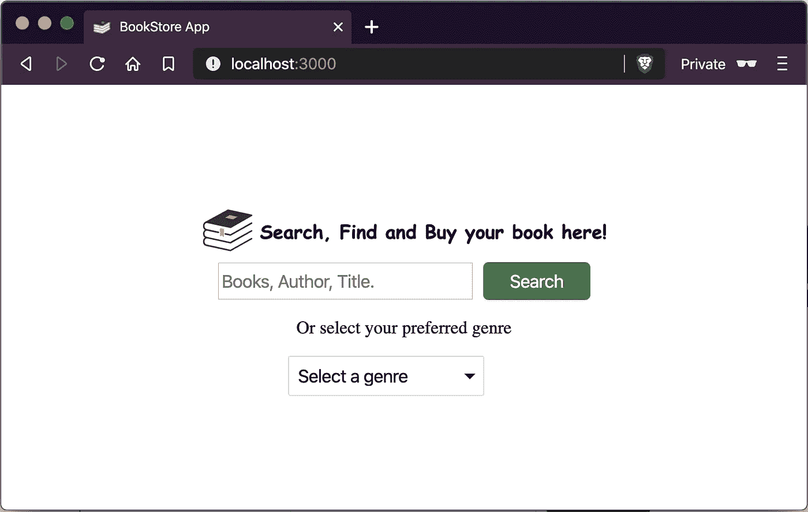
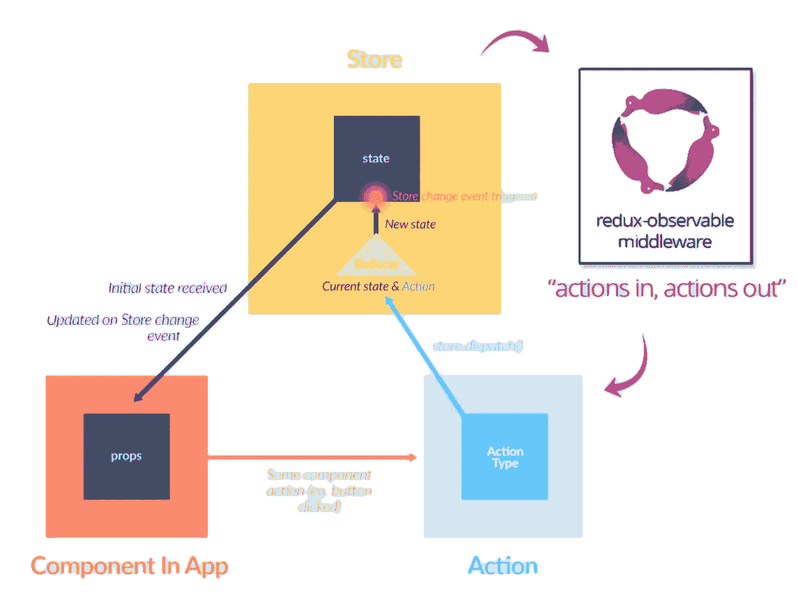
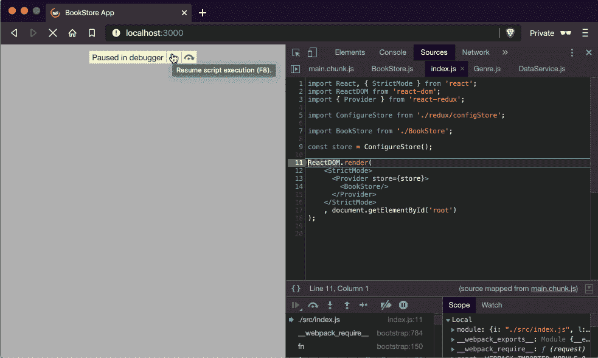
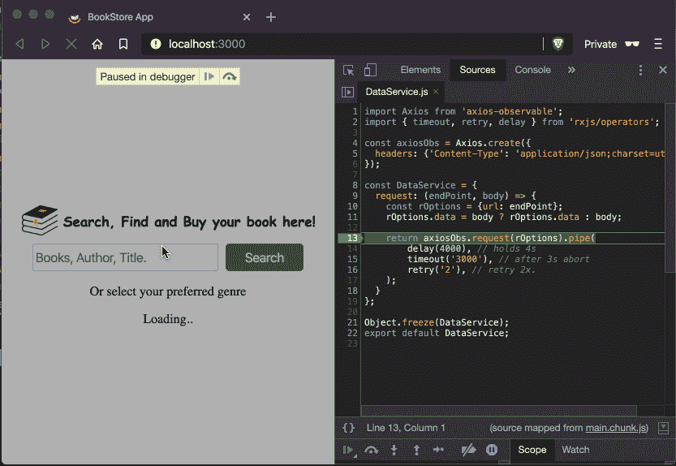

# 充分利用 RxJS、Redux 和 React

> 原文：<https://javascript.plainenglish.io/getting-best-of-rxjs-redux-react-f4c369ab181a?source=collection_archive---------3----------------------->


这里的想法是使用 [**Redux**](https://redux.js.org/) 创建一个 **React 应用**，但是利用 **RxJS** 库，为了这个目的，没有什么比 **Redux+RxJS，**更好的了，这给了我们 **redux-observable。**


source: [https://redux-observable.js.org](https://redux-observable.js.org/)

整个应用程序将由**功能组件**和 [***钩子***](https://reactjs.org/docs/hooks-intro.html) 组成，如果你不熟悉的话，看看这个 [**用钩子**写了一个简单的 react！](https://medium.com/@gabrielinflex/writing-a-simple-react-app-using-hooks-59fbeb56a40b)另一件很重要的事情是[**RxJS**](https://rxjs-dev.firebaseapp.com/)**lib**，我们稍后会谈到。

事不宜迟，让我们创建第一个组件。

```
import ***React*** from 'react';import './BookStore.css';const genres = ['Adventure', 'Romance'];const BookStore = () => {
  return (
      <div className="container">
        <div className="title">
          
          <h3>Search, Find and Buy your book here!</h3>
        </div>
        <div className="search">
          <input id="books" size="20"
                 className="search-input"
                 placeholder="Books, Author, Title."/>
          <button className="search-button">
            Search
          </button>
        </div>
        <p> Or select your preferred genre</p>
        <select id="genre" className="genre-select">
          <option defaultValue>Select a genre</option>
          {
            genres.map(genre => {
              return (<option key={genre}>{genre}</option>);
          })
        </select>
      </div>
  );
}export default BookStore;
```

一个简单的 HTML/CSS 组件和该类型的硬代码列表，还没有什么特别的，但这是一个开始。



Just a first look!

接下来的事情是从一个**restful API**中获取流派列表，除了进行不必要的 **API** 调用以从不存在的流派中检索书籍之外，它最终会得到一个不可用的流派，甚至没有可用的书籍。

让我们创建一个单独的***data service . js***文件，它将处理 **HTTP 调用** s。非常简单，这个想法是重用它作为来自 **EPICS** 的**数据访问层**。

```
import Axios from 'axios-observable';
import { timeout, retry } from 'rxjs/operators';const axiosObs = Axios.create({
  headers: {'Content-Type': 'application/json;charset=utf-8'}
});const ***DataService*** = {
  request: (endPoint, body) => {
    const rOptions = {url: endPoint};
    body ? rOptions.data = body : '';

    return axiosObs.request(rOptions).pipe(
        timeout('3000'),
        retry('2'),
    );
  }
};***Object***.freeze(***DataService***);export default ***DataService***;
```

这里有一些东西，`r**edux-observable**`需要安装，因为它有两个重要的依赖项`**rxjs**`和`**redux**`，两者都必须安装。

```
npm install redux-observable rxjs redux
```

你可能会疑惑“【Axios 怎么样？"正如你所看到的，" **axios-observable** "是一个包装器，它也提供了一个 **Axios** 实例，它也有依赖项，比如，但是`**rxjs,**`已经安装好了，只需运行这个。

```
npm install axios axios-observable
```

也不要忘记安装 Redux 的官方 React 绑定，我们也将利用一些来自它的**钩子**。

```
npm install react-redux
```

***免责声明:可以随意使用任何你想要的 AJAX 库*。**

现在，让我们创建一个 **genre.js，** redux 文件，所有的东西都在一个文件中，作为一个大图片。

```
import { ofType } from 'redux-observable';
import { map, mergeMap, catchError } from 'rxjs/operators';import ***DataService*** from '../utils/DataService';
**// initial state of Genre.**
const initialState = {
  genres: [],
  loading: false,
  fetched: false,
  error: null,
};
**// action types**
const types = {
  FETCH_GENRE_REQUEST: 'FETCH_GENRE_REQUEST',
  FETCH_GENRE_SUCCESS: 'FETCH_GENRE_SUCCESS',
  FETCH_GENRE_ERROR: 'FETCH_GENRE_ERROR'
};
**// action to fetch a list of genre.**
export const **fetchGenre** = () => ({type: types.FETCH_GENRE_REQUEST});**// reducers**
export const **genre** = (state = initialState, action) => {
  switch (action.type) {
    case types.FETCH_GENRE_REQUEST:
      return {
        ...state,
        loading: true
      };
    case types.FETCH_GENRE_SUCCESS:
      return {
        ...state,
        fetched: true,
        genres: action.payload,
      };
    case types.FETCH_GENRE_ERROR:
      return {
        ...state,
        error: action.payload
      };
    default:
      return state;
  }
};**// Epic**
export const **fetchGenreEpic** = action$ => action$.pipe(
    ofType(types.FETCH_GENRE_REQUEST),
    mergeMap(() => {
      return ***DataService***.request('api/genre.json').pipe(
          map(({data}) => {
            return {
              type: types.FETCH_GENRE_SUCCESS, payload: data.genres
            };
          }),
          catchError(error => {
            return {type: types.FETCH_GENRE_ERROR, payload: error}
          }),
      );
    }),
);
```

好吧，这是非常大的一步，事实上，让我们来分解一下。

正如你可能知道的，到目前为止，我们在这里有 **Redux** 流，如动作，减速器，但如何是**史诗？**这里是我们开始把 **Redux** 带到另一个层次的地方，对于那些熟悉 **RxJS、**的人来说，你知道使用**反应式编程、**流、复杂的异步/副作用、操作符等等是多么方便和强大。

那么，什么是**史诗**？来自文档:"**它是一个接受一系列动作并返回一系列动作的函数。*动作输入，动作输出***

**混淆**？把它想象成一个听众，每次某个**动作**被**调度**的时候，**史诗**就会监听它，跟 R **edux** 常规流程没什么变化，除了**史诗**。



**Redux + Observable = Cool 😎**

下一步，设置**配置存储中间件**。

```
import { *createStore*, applyMiddleware } from 'redux';
import { createEpicMiddleware } from 'redux-observable';**// reducer and Epic**
import { **genre**, **fetchGenreEpic** } from './Genre';const epicMiddleware = createEpicMiddleware();const **ConfigureStore** = () => {
  const **store** = *createStore*(
      genre,
      applyMiddleware(epicMiddleware)
  );
  epicMiddleware.run(fetchGenreEpic);
  return **store**;
};export default **ConfigureStore**;
```

在 **index.js 文件中，**从 **react-redux 中导入 **Provider** ，**还导入了刚刚创建的 **configStore** ，并将其设置到 Provider 标签中。

```
import *React*, { *StrictMode* } from 'react';
import ReactDOM from 'react-dom';import { Provider } from 'react-redux';**import ConfigureStore from './redux/configStore';**import BookStore from './BookStore';const **store** = ConfigureStore();ReactDOM.***render***(
    <StrictMode>
      <**Provider** store={**store**}>
        <BookStore/>
      </**Provider**>
    </StrictMode>
    , ***document***.getElementById('root')
);
```

就这样，我们已经用 **redux-observable、**完成了整个应用程序的设置，但是在我们演示之前，还有一些事情要做。

***如何调度一个动作？如何从 state+Redux 获取数据？如何处理来自组件的 HTTP 调用？***

现在，是时候创建我们的第一个**定制钩子**了，它将处理分派动作。

创建一个名为 **useActions.js** 的文件

```
import { ***useDispatch*** } from 'react-redux';
import { fetchGenre } from '../redux/Genre.js'const useActions = () => {
  const dispatch = ***useDispatch***();
  const fetchGenreAction = () => dispatch(fetchGenre());

  return {
    fetchGenreAction
  }
};export default useActions;
```

因此，基本上这里要做的是，创建一个自定义挂钩来为组件提供操作，这样，所有的操作都在一个地方，只需导入 **useActions** 挂钩就可以使用它，使组件更加整洁。

这里是我们的 **BookStore.js** 组件全部导入后， **useActions，useSelector，useEffect。**

```
import ***React***, { useEffect } from 'react';
import { ***useSelector*** } from 'react-redux';import useActions from './hooks/useActions';import './BookStore.css';const BookStore = () => {
  // Get action from custom hook.
  const {fetchGenreAction} = useActions();

  // Get Redux state using a hook
  const {
    genres, loading, fetched, error
  } = ***useSelector***(state => state);

  // This useEffect will trigger only once, when the component is mounted.
  useEffect(() => {
    fetchGenreAction();
  }, []);

  return (
      <div className="container">
        <div className="title">
          
          <h3>Search, Find and Buy your book here!</h3>
        </div>
        <div className="search">
          <input id="books" size="20"
                 className="search-input"
                 placeholder="Books, Author, Title."/>
          <button className="search-button">Search</button>
        </div>
        <p> Or select your preferred genre</p>
        {
          error
              ? error
              : loading || !fetched
              ? 'Loading..'
              : (
                  <select id="genre" className="genre-select">
                    <option defaultValue>Select a genre</option>
                    {
                      genres &&
                      genres.map(genre => {
                        return (
                          <option key={genre}>{genre}</option>)
                      })
                    }
                  </select>
                )
        }
      </div>
  );
}export default BookStore
```

最后，**演示**！！👀😅🤞



**RxJS + Redux + React = Amazing** 😁🤓👏☢️

只是为了多展示一点关于**操作符**，你可以用 **RxJS、**做的事情有很多选项，如果你想了解更多，[在这里查看。](https://www.learnrxjs.io/learn-rxjs/operators)



**Using “delay” to simulate a connection problem, causing an error.**

到目前为止，一切都很好，现在让我们重构整个应用程序并完成它，我将在这里总结这些步骤，但你可以查看仓库以了解更多细节。

*   创建 react 组件，比如**搜索/预订/结账。**
*   为**动作**、**减速器、**和**史诗**创建一个 **Redux** 结构文件夹
*   创建一个**史诗**到**搜索书**和**流派**。
*   创建一个**列表图书**组件来显示搜索到的**图书**。
*   添加**桶**进口策略改进方式 ***。js** 导入。
*   创建一个**自定义挂钩**来处理购物车**逻辑**和**篮子**。

就这样，让我们看看所有的碎片是如何组合在一起的！！


Hope you enjoy it 🤓

你可以在 https://github.com/gbrivate/react-book-store 的[查看回购协议。](https://github.com/gbrivate/react-book-store)

此外，在[https://gbrivate.github.io/react-book-store/](https://gbrivate.github.io/react-book-store/)处检查该运转

别忘了安装 [***React Dev 工具***](https://chrome.google.com/webstore/detail/react-developer-tools/fmkadmapgofadopljbjfkapdkoienihi?hl=en) 和 [**Redux**](https://chrome.google.com/webstore/detail/redux-devtools/lmhkpmbekcpmknklioeibfkpmmfibljd?hl=en) 浏览器插件，它们很有帮助。

如果您有任何问题、疑问或建议，请告诉我，我很乐意收到您的来信！

## **用简单英语写的 JavaScript 注释**

我们已经推出了三种新的出版物！请关注我们的新出版物:[**AI in Plain English**](https://medium.com/ai-in-plain-english)，[**UX in Plain English**](https://medium.com/ux-in-plain-english)，[**Python in Plain English**](https://medium.com/python-in-plain-english)**——谢谢，继续学习！**

**我们也一直有兴趣帮助推广高质量的内容。如果您有一篇文章想要提交给我们的任何出版物，请发送电子邮件至[**submissions @ plain English . io**](mailto:submissions@plainenglish.io)**，使用您的 Medium 用户名，我们会将您添加为作者。另外，请让我们知道您想加入哪个/哪些出版物。****