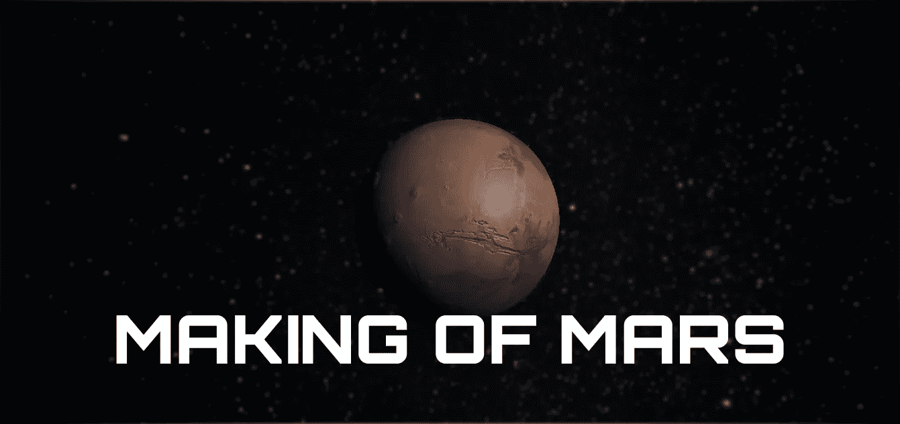
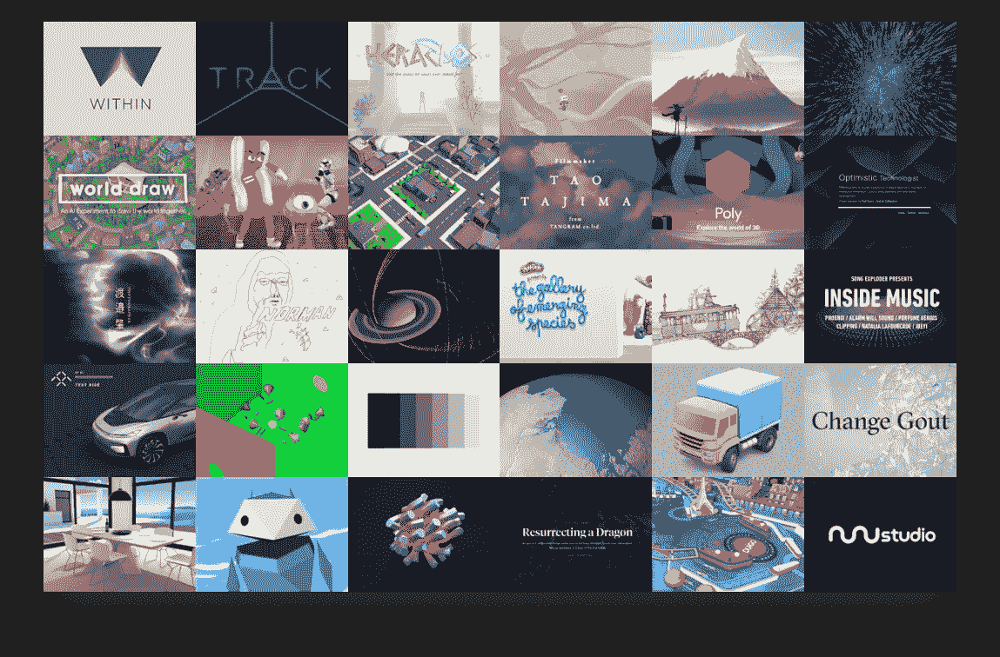
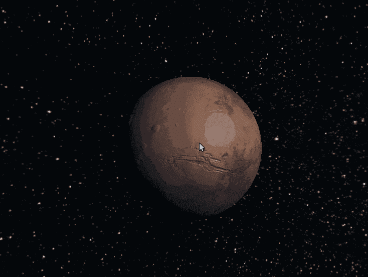
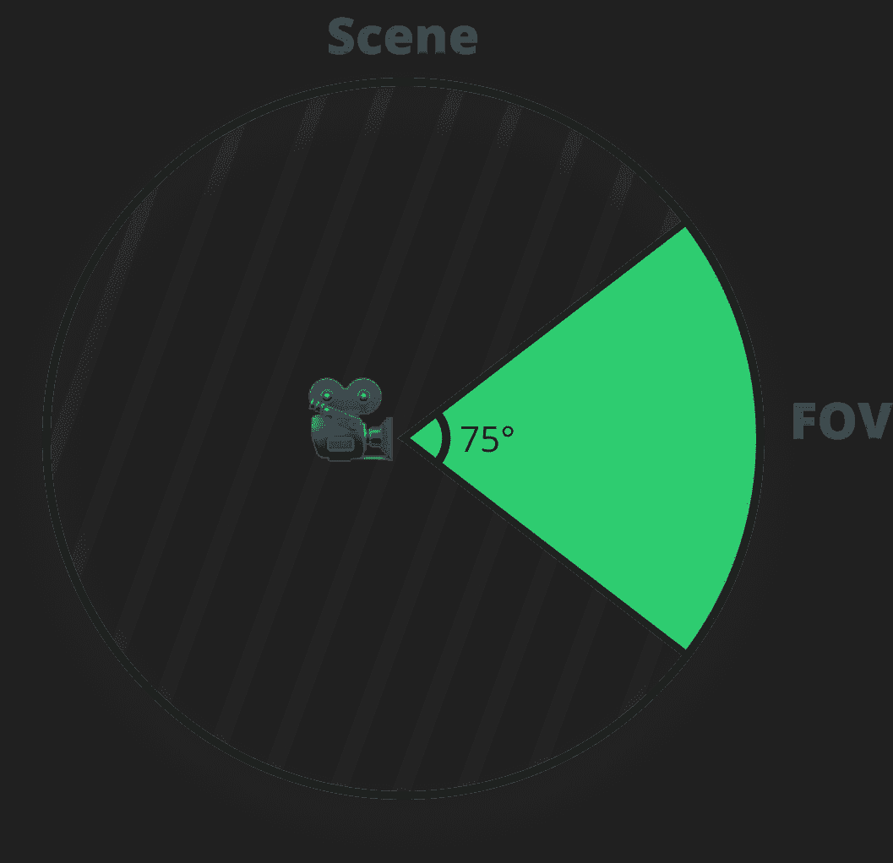
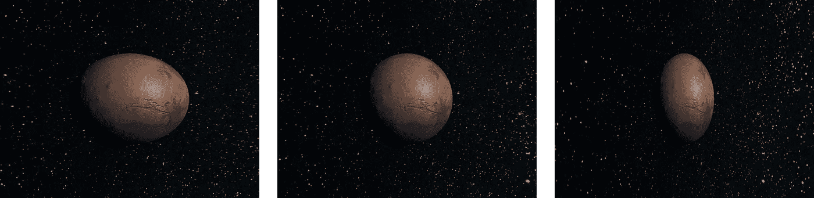
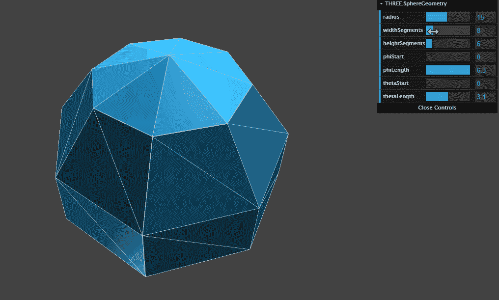
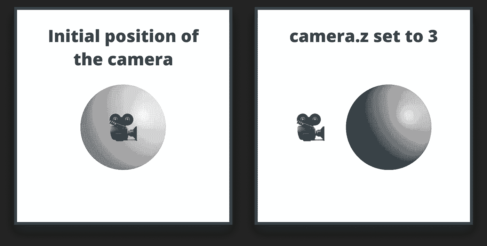
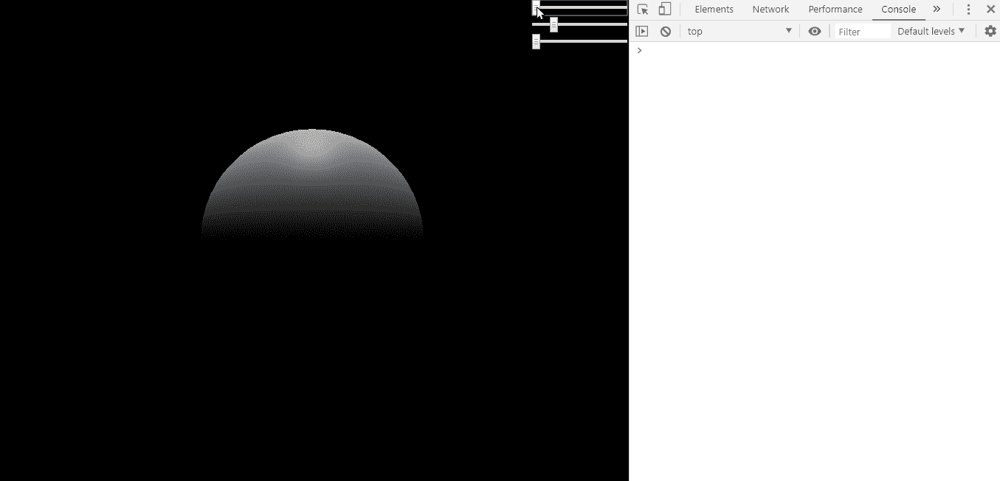
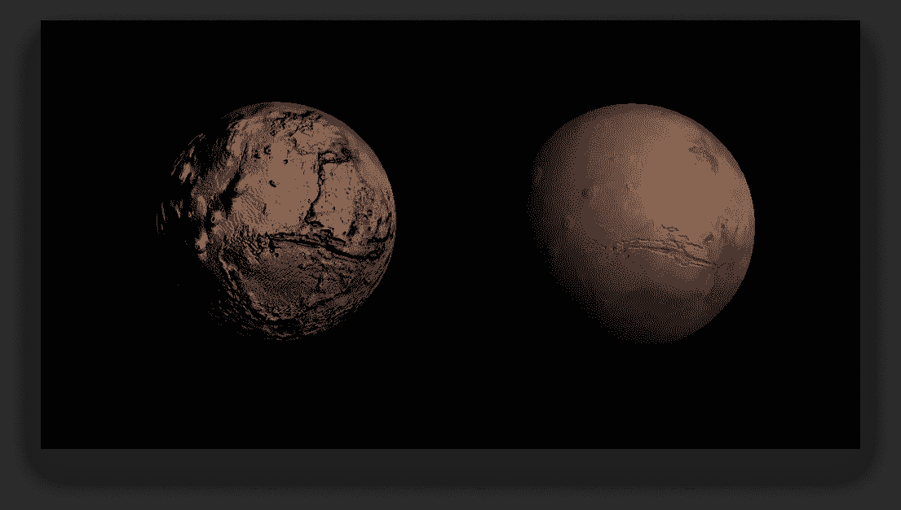

# 进入 Three.js

> 原文：<https://javascript.plainenglish.io/getting-into-three-js-70e99edf1c0e?source=collection_archive---------1----------------------->

## 火星的形成

Three.js 是一个 3D JavaScript 库，使我们能够在浏览器中构建美丽的 3D 世界。如果你只知道 JavaScript，但想让你的想象力在画布上栩栩如生，现在是时候了。

有了它，你不必担心物理和数学计算，因为每一件重要的事情都通过一个简化的 API 公开。

如果你访问 three.js 的官方网站，你可以看到大量的例子来说明这个图书馆真正的可能性。

Different examples on threejs.org

在 three.js 的帮助下，我们将深入了解 3D 的基础知识，在本教程结束时，您将实现如下内容:

# 设置 Three.js

在我们开始创建世界之前，我们需要一个画布来显示任何东西。将以下索引文件添加到项目根目录中:

我从 threejs.org 官方网站下载了这个库。我们实现的所有东西都会进入`mars.js`，所以在这个阶段你可以在`index.html`旁边创建一个空文件。

您可能还注意到，文档中没有`canvas`元素。我们不需要指定一个，因为我们将在脚本中创建它。我还添加了一个小的样式来使画布全屏显示。

现在要在画布上显示任何东西，我们需要三样东西:一个场景、一个摄像机和一个渲染器。要创建这三个文件，请将以下几行添加到空的`mars.js`文件中:

首先，我们有场景。

## 事件

场景只是一个空间，你可以在其中放置各种物体，如几何体、灯光或摄像机。在场景内部，您可以告诉 three.js 在哪里显示这些对象。接下来我们有相机。

## 照相机

在这个例子中，我们使用 three.js 的`PerspectiveCamera`,它接受四个参数:

第一个参数是视场，简称 FOV。这是我们的相机看到的场景的可见部分，用度数表示。

Field of view / visible area

第二个参数是纵横比。您几乎总是希望它被设置为画布的宽度除以其高度。否则，你会得到一个扭曲的图像。

Aspect ratio set to 1, width/height, 2

最后，我们定义近裁剪平面和远裁剪平面。这意味着任何比第一个数字更靠近相机的东西都不会被渲染。这同样适用于第二个数字。距离相机超过指定值的所有内容都不会被渲染。

## 渲染器

然后我们有渲染器。我们将使用它来渲染场景中的一切。Three.js 附带了一些内置的渲染器。通常情况下，你会选择 WebGL，其他的通常用于老版本的浏览器作为后备。

为了最终将画布添加到文档中，用下面两行代码扩展`mars.js`:

这里我们告诉渲染器使用画布元素的可用宽度和高度，然后我们可以将它附加到主体。如果你在浏览器中打开它，你会看到一个黑色的空白画布。现在就来添加星球吧！

# 将火星添加到场景中

为了创造这个星球，我们又需要三样东西:

*   定义对象形状的几何图形
*   材质-几何图形的外观和感觉，例如颜色和纹理
*   由几何体和材质组成的网格，可以在以后添加到场景中

让我们将以下内容添加到我们的脚本中:

首先，我们通过调用`SphereGeometry`创建一个球体。函数调用中的第一个参数是半径，第二个和第三个是球体的宽度和高度部分。请注意，当我将它们的值增加到 32 时，我们得到了一个更细粒度的球体:

对于材质，我们用的是`MeshPhongMaterial`。你现在需要知道的是，这样球体将会受到光线的影响。不像我们用一个`MeshBasicMaterial`做例子。

要创建一个网格，我们只需将`geometry`和`material`传递给`Three.Mesh`，并将其添加到我们的场景中，名为`scene.add`。

就在这个阶段，如果你刷新浏览器，你仍然什么也看不到。这是因为我们又一次错过了三样东西:

## 渲染场景

最重要的一点是我们没有告诉 three.js 渲染场景。为此，我们需要一个渲染循环:

我们可以使用`requestAnimationFrame`，这将导致大多数屏幕的 60fps。为了渲染一切，我们需要用我们的`scene`和`camera`调用`renderer.render`。

## 缩小

还有两个障碍阻止我们看到任何东西。第一，我们没有光源，意味着一切都是纯黑的。第二，我们的摄像机的位置在球体中心的内部。因此，即使我们有光源，我们仍然什么也看不见。首先，让我们把镜头往后移一点:

Moving the camera out of the sphere

## 让那里有光

为了最终看到一些东西，让我们用这三行来扩展`mars.js`:

我们添加一个新的`DirectionalLight`，设置它的颜色为`#ccc`，亮度为 100%。默认情况下，其方向设置为`0, 1, 0`，即 y 轴为 1，x、z 轴为 0。我们希望将这个设置为`5, 3, 5`以达到我们通常在电影中看到的行星的效果。

Adjusting the x, y and z-axis of the directional light

# 添加材料

为了让球体看起来像火星，我们需要添加一些纹理。我使用两个图像来获得最终结果。一个用于漫反射贴图，一个用于凹凸贴图。漫射贴图用于星球的颜色和纹理，而凹凸贴图用于创建不平坦的表面，使山脉突出并缩进沟渠和运河。

我将在文章的最后提供一个包含纹理的 GitHub 链接，但是你也可以从以下来源下载图片:

*   [漫射贴图](http://solarviews.com/raw/mars/marscyl1l.jpg)
*   [凹凸贴图](https://www.deviantart.com/oleg-pluton/art/Mars-elevation-map-773130208)

在你的项目结构中创建一个名为“*纹理*的新文件夹，并将图片放在那里。然后用以下三行代码扩展脚本文件:

*注意，为了加载本地文件，你需要运行一个 web 服务器。在本教程中，我一直使用*[*http-server*](https://www.npmjs.com/package/http-server)*包。*

我们为之前为这个星球创建的`MeshPhongMaterial`设置了这些。我发现对`bumpScale`使用`0.015`效果最好。否则效果太强。

Initial value of bumpScale vs 0.015

最后，让我们添加星星。为此，我在 Unsplash 上使用了[杰克·威瑞克](https://unsplash.com/@weirick)的这张漂亮图片。我们可以为它创建另一个网格，使用`MeshBasicMaterial`:

为了达到星星的效果，我们使用了另一个球体，但是这一次，将较大的半径设置为 4。您还希望只渲染球体的背面。这就是我们通过设置`starsMaterial.side`所做的事情。如果我们一直放大，你会看到，本质上，我们把整个星球包裹在一个更大的球体里。它有星星的纹理。

We can see the shape of the sphere by zooming all the way out

为了总结一切，让我们添加一些动画。

# 添加交互性

首先，让我们给行星添加一个小的旋转。用以下代码行扩展`animate`功能:

我们还想在用户移动光标时，让相机在地球上移动。为此，我们可以将下面的事件侦听器添加到文档中:

相机的原始 x 位置设置为 0。当我们将鼠标移动到左边时，我们希望减小该值，当我们将鼠标移动到右边时，我们希望增大该值。

问题是，保持鼠标水平位置的`e.x`从屏幕左边缘的 0 开始，一直向上，直到达到最大宽度。没有负值。我们希望从屏幕中间的 0 开始。这就是我们从`e.x`开始否定一半屏幕宽度的原因。为了缩小运动的规模，我还将数字乘以了`0.005`。这样，我们只有少量的移动。而要让摄像头一直对着我们的星球，我们需要调用`camera.lookAt`。

现在，每当用户在地球上移动光标时，摄像机也会随之改变:

如果你想加深对 Three.js 的了解，我强烈建议你浏览一下 threejs.org[的示例和官方文档。](https://threejs.org/docs/)

你不仅可以找到关于它的 API 的全部文档，还可以找到关于如何开始、画线、创建文本和动画、加载 3D 模型等等的多个循序渐进的教程。

希望你学到了新的有用的东西。要获得最终项目的源代码，请访问我在 Github 上的 [Threejs 资源库。🪐感谢你花时间阅读这篇文章，编码快乐！](https://github.com/flowforfrank/threejs)

