# 开始一个苗条的项目

> 原文：<https://javascript.plainenglish.io/getting-started-with-a-svelte-project-11a3f3c5a1cc?source=collection_archive---------7----------------------->

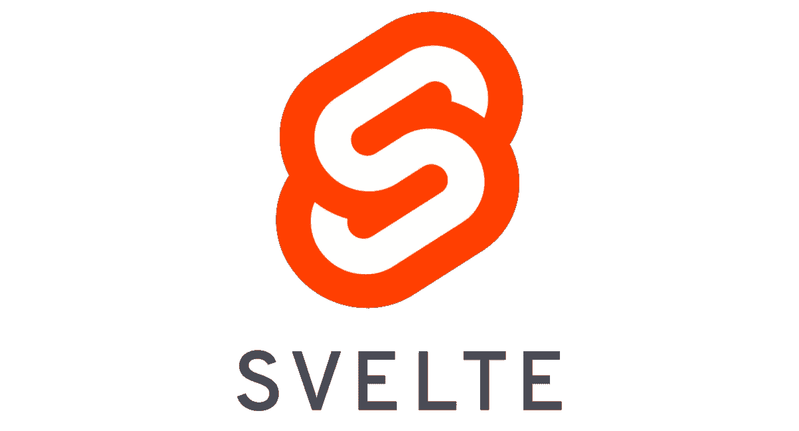

对于初学者，在 **SvelteJS** 资源库中有一个模板项目。您可以通过运行下面的命令来克隆此项目。

```
**npx degit** [**sveltejs/template**](https://github.com/sveltejs/template) **template-master**
```

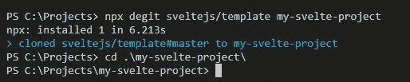

在克隆了模板项目之后，您可以很容易地从 ***localhost:5000*** 端口发布项目。

```
**cd template-master****npm install
npm run dev**
```

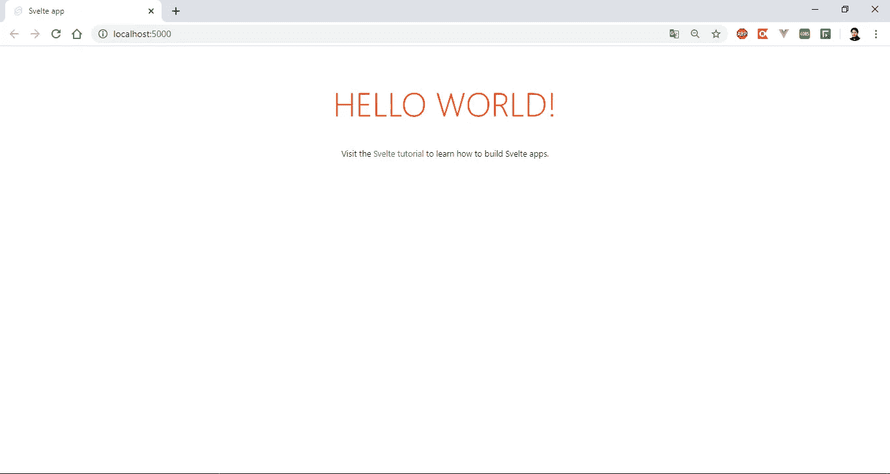

模板项目结构如图所示。

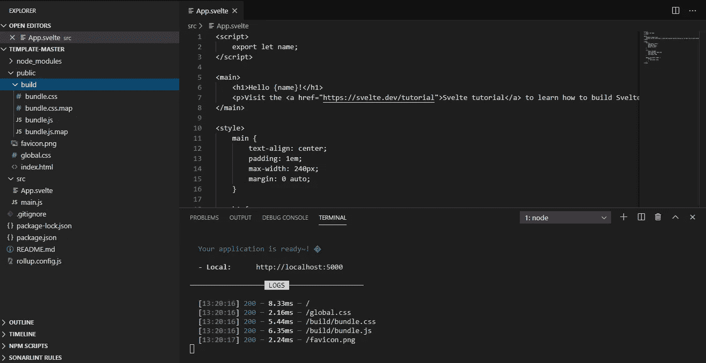

如果你安装了 SvelteJS 插件，在 Visual Studio 代码上写代码的时候会有帮助。

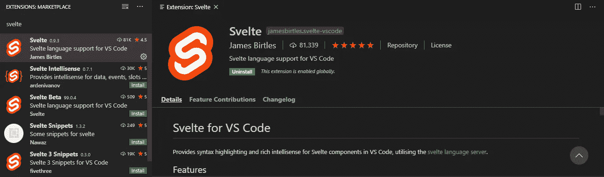

苗条的文件由三个主要部分组成。这些是可以编写操作的脚本部分，可以定义 html 元素的主要部分，以及用于修饰元素的样式部分。

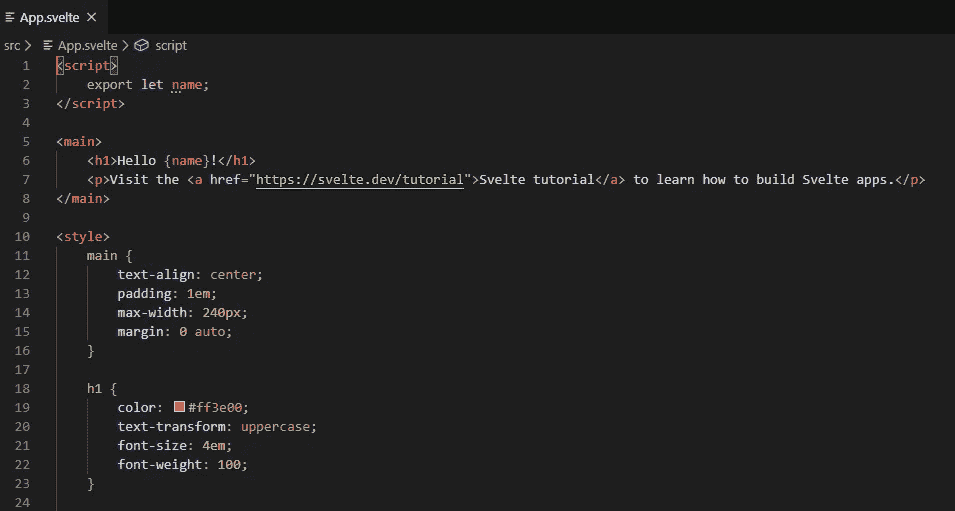

您可以在脚本部分中定义要在主部分中使用的变量，如下所示。

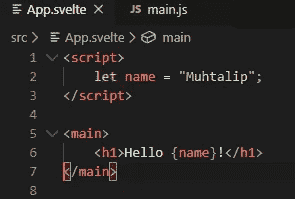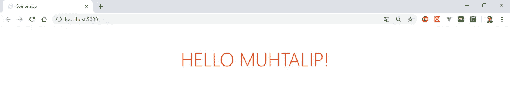

SvelteJS 中嵌套组件的使用如图所示。首先，应该编写子组件。


我们将把这里创建的 Nested.svelte 组件集成到 App.svelte 主组件中，如图所示。

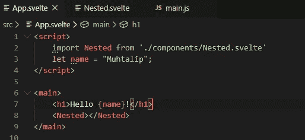

导入的元件将成为可用的元素。

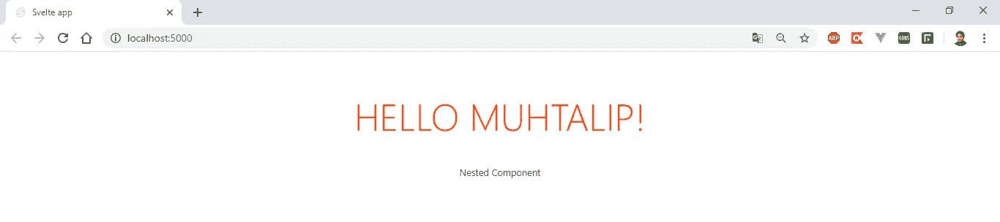

定义一个按钮，处理 click 事件，如图所示。

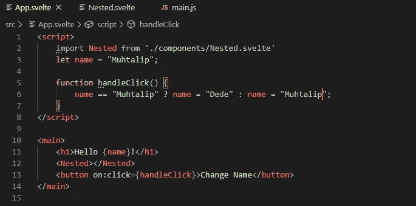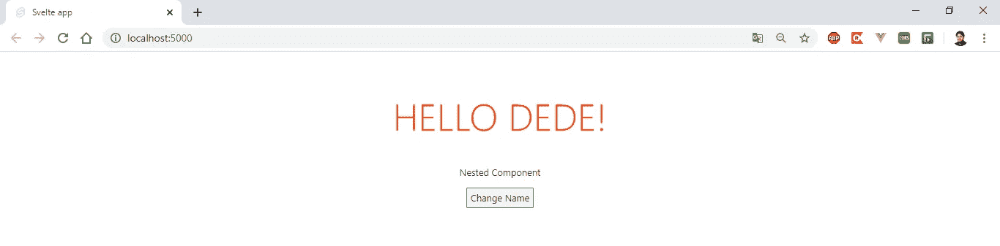

SvelteJS 框架能够使用大多数 Javascript 操作。你可以通过下面的链接访问 SvelteJS 教程，并使用 SvelteJS 框架的特性。

[](https://svelte.dev/tutorial/basics) [## 苗条教程

### 欢迎来到苗条教程。这将教会你构建快速、小型 web 应用程序所需的一切…

苗条的人](https://svelte.dev/tutorial/basics) 

希望在新的文章中看到你…

和平结束了，

穆赫塔利普·德德