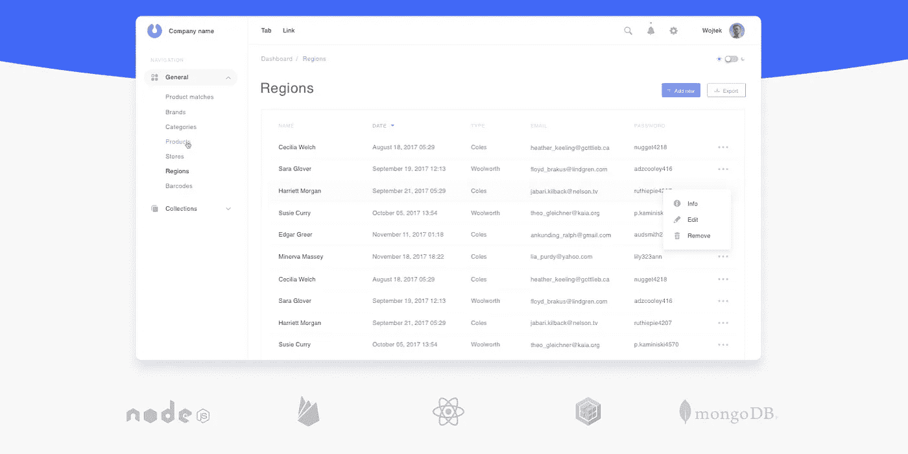
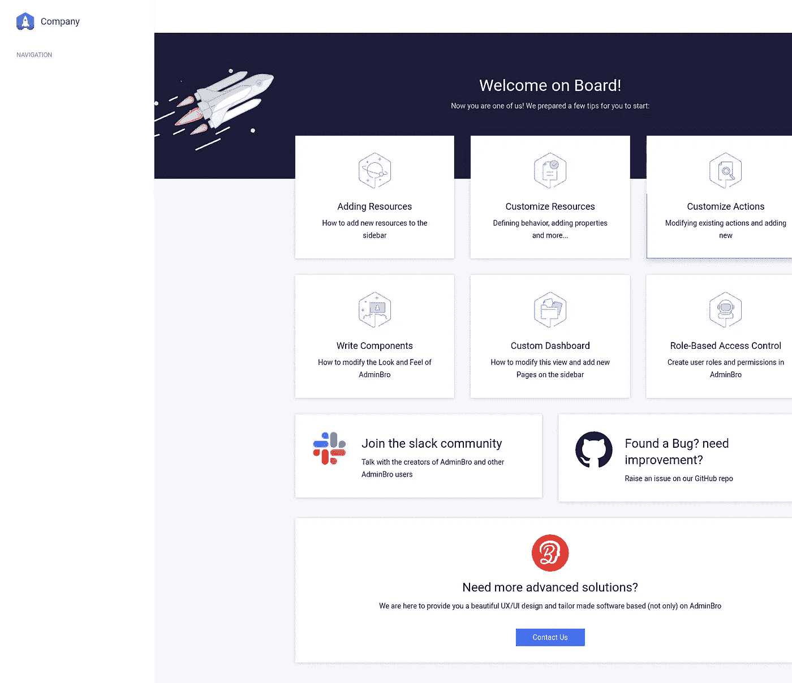

# 用 Node.js 构建一个管理面板，并做出反应

> 原文：<https://javascript.plainenglish.io/getting-started-with-adminbro-node-admin-panel-with-react-8552e281b55d?source=collection_archive---------1----------------------->

## AdminBro 入门



AdminBro image taken from [AdminBro website](https://adminbro.com/)

本教程是 AdminBro 的入门指南，一个节点管理面板，带有 Express 和 Sequelize。在本教程中，我们将创建一个演示应用程序，其中管理员可以使用由 [AdminBro](https://github.com/SoftwareBrothers/admin-bro) 创建的管理面板来操作用户和公司数据。随着教程的深入，我们将在代码中添加一些最佳实践。因为篇幅的原因，我打算把这篇教程分成不同的部分。每个部分的代码将被推送到 [Github](https://github.com/AKNiazi/adminbro-tutorial) 上的一个单独的分支。

这是教程的第一部分。在这一部分，我们将能够启动我们的管理仪表板。在[第二部分](https://medium.com/@akniazi/customize-adminbro-node-and-react-based-admin-panel-3c0a3e041966)，我们将对我们的管理面板做更多的定制。

当我主要从事 Ruby on Rails 项目时，我总是使用 [activeadmin](https://github.com/activeadmin/activeadmin/) 构建他们的管理面板。使用它有几个原因，但主要原因是，一个人可以用几个命令和配置拥有一个基本的运行管理面板。这不仅可以帮助开发人员展示项目的良好进展，还可以节省客户的大量资金，这些资金可以用于项目的其他模块。

在过去的几年里，我主要从事节点项目。从那以后，我一直在寻找与 activeadmin 相当类似的东西。最近偶然看到 AdminBro，一个受 activeadmin 启发的管理面板。我决定在我最近的一个项目中使用它，同时使用 Sequelize 和 Express，发现它非常有用，因为它不仅允许我在很短的时间内添加一个管理面板，还提供了各种定制选项。如 AdminBro 主页上所定义的，

> [*AdminBro*](https://softwarebrothers.github.io/admin-bro-dev/) *是一个自动管理界面，可以插入到您的应用程序中。作为开发人员，您提供数据库模型(如帖子、评论、商店、产品或您的应用程序使用的任何其他内容)，AdminBro 生成允许您(或其他受信任的用户)管理内容的 UI。*

在本教程中，我们将建立一个演示应用程序，其中管理员可以创建用户和他们的公司。公司也可以有徽标，在本教程的后面部分，我们将把徽标存储在开发环境中的本地机器上，以及生产环境中的亚马逊 S3 上。在教程的这一部分，我们将

1.  设置快速 JS
2.  设置序列 JS
3.  设置管理兄弟

## **设置快速 JS:**

创建一个新文件夹“adminbro-tutorial”并移动到该文件夹。

```
mkdir adminbro-tutorialcd adminbro-tutorial
```

创建 *package.json*

```
npm init
```

该命令将提示您一些问题。现在，您可以简单地点击 RETURN 键来接受它们中大多数的缺省值，但有以下例外:

```
entry point: (index.js)
```

除了 *index.js* 添加 *app.js* 后回车。这将创建初始 package.json 文件。现在加上 express js。

```
npm install express — save
```

最终的 *package.json* 会是这样的。

```
{
    “name”: “adminbro-tutorial”,
    “version”: “1.0.0”,
    “description”: “”,
    “main”: “app.js”,
    “scripts”: {
        “test”: “echo \”Error: no test specified\” && exit 1"
    },
    “author”: “”,
    “license”: “ISC”,
    “dependencies”: {
        “express”: “⁴.17.1”
    }
}
```

现在创建一个新文件 *app.js* 并复制粘贴以下代码。

```
const express = require(“express”);
const PORT = 3000;
const app = express();
app.get(“/hello”, (req, res) => {
  res.send(“Hello world”);
});
app.listen(PORT, () => {
  console.log(`Server is listening on port: ${PORT}`);
});
```

在端口 3000 上启动一个新服务器，并在浏览器上打开 [localhost](http://localhost:3000/hello) 。

```
node app.js
```

## **设置序列**

现在我们有了 setup express，我们想在 Postgres 中创建一个用户和公司数据库。我们可以通过使用 [Sequelize 命令行实用程序轻松做到这一点。要添加序列，我们可以遵循以下步骤。](https://github.com/sequelize/cli)

```
npm install sequelize pg — savenpm install sequelize-cli — save-dev
```

sequelize-cli 是 sequelize 的命令行实用程序，我们使用它来初始化 sequelize 项目、创建数据库、表、模型和运行迁移。接下来，我们将初始化一个序列化项目。

```
npx sequelize-cli init
```

初始化项目会创建四个子目录:config、migrations、models 和 seeders。让我们转到 config 文件夹，在 *config.json* 中添加配置，使 sequelize 与 Postgres 一起工作。假设 postgres 用户名是' postgres '，密码是' 123 '，最终的 *config.json* 应该是这样的。

```
{    
    “development”: {
        “username”: “postgres”,
        “password”: "123",
        “database”: “database_development”,
        “host”: “127.0.0.1”,
        “dialect”: “postgres”
    },
    “test”: {
        “username”: “postgres”,
        “password”: "123",
        “database”: “database_test”,
        “host”: “127.0.0.1”,
        “dialect”: “postgres”
    },
    “production”: {
        “username”: “postgres”,
        “password”: "123",
        “database”: “database_production”,
        “host”: “127.0.0.1”,
        “dialect”: “postgres”
    }}
```

完成配置后，让我们创建一个数据库。

```
npx sequelize-cli db:create
```

这将在 Postgres 中创建一个开发数据库，在我们的例子中是 development_database。要使用上述命令创建测试和生产数据库，您需要指定环境，例如— env=test。既然我们已经成功地创建了数据库，现在是创建用户和公司模型的时候了。

```
npx sequelize-cli model:generate — name User — attributes name:string,email:string,password:string,encryptedPassword:stringnpx sequelize-cli model:generate — name Company — attributes name:string,phone:string,logo:string,user_id:integer
```

运行以上两个命令应该会在 models 子目录中创建两个模型文件，在 migrations 子目录中创建两个迁移文件。让我们打开 models 子目录中的公司模型文件，在其中添加关联和一些验证检查。最终的公司模型应该是这样的

```
‘use strict’;
module.exports = (sequelize, DataTypes) => {
  const Company = sequelize.define(‘Company’, {
    name: {
      type: DataTypes.STRING,
      allowNull: false,
    },
    phone: DataTypes.STRING,
    logo: DataTypes.STRING,
    user_id: {
      type: DataTypes.INTEGER,
      references: {
        model: ‘Users’,
        key: ‘id’,
      },
    },
  }, {}); Company.associate = function(models) {
    Company.belongsTo(models.User, { foreignKey: ‘user_id’ });
  };
  return Company;
};
```

现在转到 migrations 子目录中的 create company 迁移文件，在其中添加关联和验证检查。

```
‘use strict’;
module.exports = {
  up: (queryInterface, Sequelize) => {
    return queryInterface.createTable(‘Companies’, {
      id: {
        allowNull: false,
        autoIncrement: true,
        primaryKey: true,
        type: Sequelize.INTEGER
      },
      name: {
        type: Sequelize.STRING,
        allowNull: false,
      },
      phone: {
        type: Sequelize.STRING
      },
      logo: {
        type: Sequelize.STRING
      },
      user_id: {
        type: Sequelize.INTEGER,
        references: {
          model:‘Users’,
            key: ‘id’,
        },
      },
       createdAt: {
         allowNull: false,
         type: Sequelize.DATE
       },
       updatedAt: {
         allowNull: false,
         type: Sequelize.DATE
       }
    });
  },
  down: (queryInterface, Sequelize) => {
    return queryInterface.dropTable(‘Companies’);
  }};
```

现在我们的模型和迁移已经准备好了，我们可以运行迁移来在数据库中创建用户和公司表。

```
npx sequelize-cli db:migrate
```

就是这样。我们已经成功添加了添加管理员兄弟的先决条件。

## **设置 AdminBro**

让我们添加 AdminBro npm 模块及其一些对等依赖项。

```
npm install admin-bro admin-bro-expressjs express-formidable admin-bro-sequelizejs — save
```

[强大的](https://github.com/felixge/node-formidable)是一个 Node.js 模块，用于解析表单数据，包括多部分/表单数据文件上传。

现在导航到 app.js，复制并粘贴以下代码。

```
const express = require(“express”);
const AdminBro = require(‘admin-bro’)
const AdminBroExpress = require(‘admin-bro-expressjs’)
const PORT = 3000;
const app = express();
const adminBro = new AdminBro({
  databases: [],
  rootPath: ‘/’,
});
const router = AdminBroExpress.buildRouter(adminBro)
app.use(adminBro.options.rootPath, router);
app.listen(PORT, () => {
  console.log(`Server is listening on port: ${PORT}`);
});
```

在上面的代码中，你可以看到我们已经删除了不再需要的“hello api ”,并且给了 admin bro UI 根路径。现在用以下命令启动服务器

```
node app.js
```

在浏览器中转到 [localhost](http://localhost:3000/) ，您将能够看到 admin bro 仪表盘。



在我们结束本教程的第一部分之前，我想增加一些改进，让我们的生活更轻松。

```
npm install nodemon cross-env — save-dev
```

然后在 package.json 中添加

```
“scripts”: {
    “test”: “echo \”Error: no test specified\” && exit 1",
    “sequelize”: “cross-env NODE_PATH=. sequelize”,
    “dev”: “cross-env NODE_PATH=. NODE_ENV=development nodemon”
},
```

每当您对服务器代码进行更改时，您都必须停止并重新启动服务器才能测试这些更改。有了 *nodemon* ，无论何时代码发生变化都不需要重启服务器，因为它可以在运行中选择变化。cross-env 帮助我们拥有一个单一的命令，而不用担心为平台正确地设置或使用环境变量。将来我们将使用以下命令。

```
npm run devnpm run sequelize db:migrate
```

在这一部分中，我们启动了一个 express 和 sequelize 应用程序，我们添加了两个模型(用户和公司)及其关联。最后，我们添加了 admin bro 的配置来呈现 admin dashboard。在[下一部分](https://medium.com/@akniazi/customize-adminbro-node-and-react-based-admin-panel-3c0a3e041966)中，我们将为我们的用例定制 admin bro。

如果你喜欢这个教程，别忘了给我们提供反馈。

[*Devsaxe*](https://devsaxe.com/) *是一家位于巴基斯坦拉合尔的咨询公司。我们为网络和移动应用、自动化测试、物联网解决方案和企业软件开发提供咨询。*