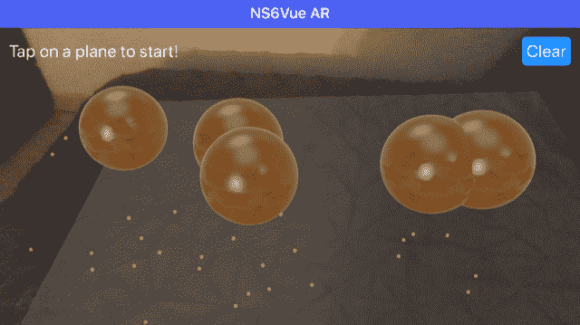
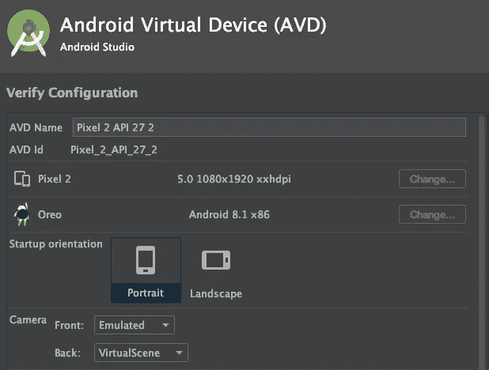
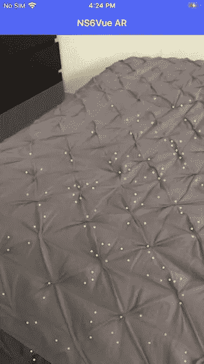
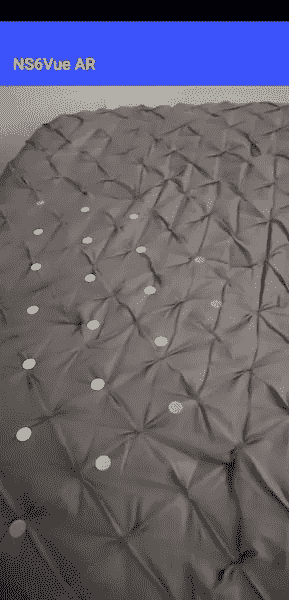
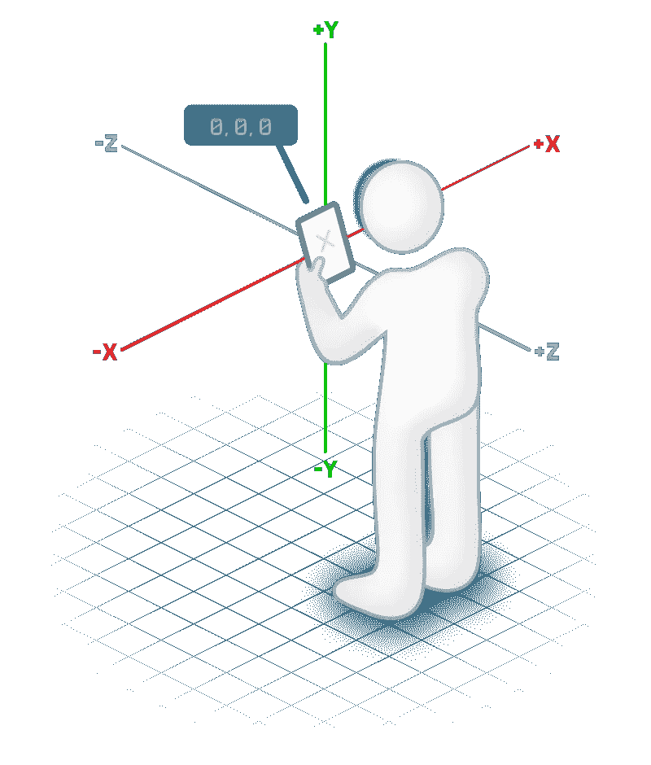
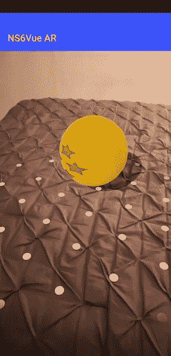
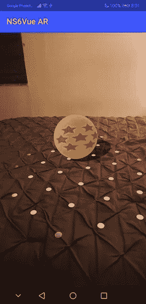
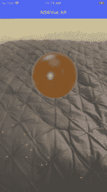
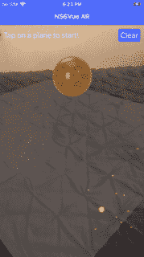

# 使用 NativeScript Vue 开始增强现实

> 原文：<https://javascript.plainenglish.io/getting-started-with-augmented-reality-using-nativescript-vue-6ea434b28e2b?source=collection_archive---------8----------------------->



口袋妖怪 Go 移动游戏成功后，人们对移动设备上的增强现实(AR)应用的兴趣稳步增长。安卓和 iOS 都有自己的增强现实框架，但是有了 NativeScript 和可用的增强现实插件，你可以开始学习如何用更低的学习曲线创建自己的跨平台增强现实应用。本文将向您展示使用 NativeScript Vue 开发一个简单的 AR 应用程序的基础知识，该应用程序用于放置、动画制作和与 3D 对象交互。

[https://www.youtube.com/watch?v=8cMZOnv0M7Y](https://www.youtube.com/watch?v=8cMZOnv0M7Y)

# 设置空白的 NS Vue 应用程序

首先，让我们使用 CLI 构建一个名为 ns6ar 的新 NativeScript Vue 应用程序(本文使用 NativeScript v6.5.o)。出现提示时，选择要开始的 Vue.js 和 Blank 模板。完成后，运行 CLI 诊断以确保您的 NS 环境没有问题。然后，将 [NativeScript AR 插件](https://github.com/EddyVerbruggen/nativescript-ar)(本文为 v1.1.0)添加到空白应用程序中。

```
tns create ns6ar
cd ns6ar
tns doctor
tns plugin add nativescript-ar
```

# 警告

在我们开始在安卓和 iOS 上创建增强现实应用程序之前，有一些重要的事情需要记住。**你** **不能在 iOS 模拟器上使用 AR**、**所以你会**、[、**需要一个支持 ARkit** 、](https://www.redmondpie.com/ios-11-arkit-compatibility-check-if-your-device-is-compatible-with-apples-new-ar-platform/)的真正的苹果设备。对于 iOS 设备，这意味着您将需要一款至少运行 iOS 11 的 iPhone SE/6 和 iPad Pro/2017 或更新版本。[如果您想支持面部跟踪](https://developer.apple.com/documentation/arkit/tracking_and_visualizing_faces)，那么您还需要一款正面朝向原深感摄像头的 iOS 设备，这款设备目前仅在苹果 X/XS/XS Max/XR、iPad Pro (11 英寸)和 iPad Pro (12.9 英寸，第三代)上提供。这个插件只支持 ARkit v1，所以较新的版本(也需要绝对最新的硬件)和它们的特性在当前版本的插件中不可用。

**对于 Android，你** [**可以在某些模拟器配置上使用 AR**](https://developers.google.com/ar/develop/java/emulator#create_a_virtual_device_with_ar_support)。要使用模拟器进行开发，请进入 Android Studio 中的 AVD(Android 虚拟设备)管理器，并使用 Pixel 2 基本配置创建一个新的虚拟设备(这也包括对 Play Store 的支持，因为需要用于 AR 包的 Google Play 服务)。在下一个屏幕上选择 Oreo API 27 或更新的操作系统版本，并在最后一个屏幕上打开高级设置，并确保背面摄像头设置为使用 VirtualScene，如下所示。



最后，进入 Android ARcore APK 发布页面，下载`Google_Play_Services_for_AR_1.16.0_x86_for_emulator.apk`。启动模拟器，加载后运行以下命令来安装库。

`adb install -r Google_Play_Services_for_AR_1.16.0_x86_for_emulator.apk`

您可以[查看该页面，了解您的设备是否受支持](https://developers.google.com/ar/discover/supported-devices)或者尝试运行其中一个演示应用。不过总的来说，最好使用真实的 Android 设备而不是模拟器来开发 AR 应用程序，这样你就可以测试该应用程序在现实世界中的工作情况。

最后，在开发和修改 AR 应用程序代码时，确保禁用热模块重载，因为这通常会导致插件崩溃(使用`tns run <platform> --no-hmr`)。

# 设置 AR 视图

让我们从修改空白模板应用程序开始，这样我们就可以使用 AR 插件通过设备摄像头显示增强现实视图。我们首先需要通过在导入声明后向`app/app.js`添加下面一行来注册插件:

`Vue.registerElement("AR", () => require("nativescript-ar").AR);`

我们将通过将`app/components/Home.vue`的内容更改为:

```
<template>
    <Page>
        <ActionBar title="NS6Vue AR"></ActionBar>
        <GridLayout>
            <AR trackingMode="WORLD" debugLevel="FEATURE_POINTS" :planeMaterial="planeMaterial" planeOpacity="0.4" planeDetection="HORIZONTAL" showStatistics="false" @arLoaded="arLoaded" @sceneTapped="sceneTapped" @planeTapped="planeTapped" @planeDetected="planeDetected">
            </AR>
        </GridLayout>
    </Page>
</template><script>
import { Color } from "tns-core-modules/color";
import { isIOS, isAndroid } from "tns-core-modules/platform";
export default {
    data() {
        return {
            planeMaterial: new Color("white"),          
        }
    },
    methods: {
        arLoaded(arLoadedEventData) {
            console.log(">> AR Loaded!");
            const arView = arLoadedEventData.object;
        },
        planeDetected(ARPlaneDetectedEventData) {
            console.log(">> plane Detected!")            
        },
        planeTapped(arPlaneTappedEventData) {
            console.log(">> plane Tapped!")
            const arPlane = arPlaneTappedEventData.object;
            const position = arPlaneTappedEventData.position  
            console.log(position)
        },
        sceneTapped(ARSceneTappedEventData) {
            console.log(">> scene Tapped!")
            const arScene = ARSceneTappedEventData.object;
            const position = ARSceneTappedEventData.position
            console.log(position)
        }
    },
};
</script><style scoped lang="scss"> 
</style>
```

该页面只包含动作栏和 ar 视图标签，配置了一些属性和事件处理程序，以及在`script`部分定义的相应处理程序方法。你应该通过[查看插件的文档](https://github.com/EddyVerbruggen/nativescript-ar/blob/master/docs/tag-properties.md)和插件附带的各种 AR 应用程序演示来了解这些属性和事件。

让我们更详细地回顾一下我们将在这篇文章中使用的 AR 标签属性和事件。

# AR 视图属性

1.  跟踪模式——“世界”跟踪是默认模式，也是 AR 应用中最常用的模式。这种模式扫描相机看到的区域，以检测 AR 对象要与之交互的平面。在这篇文章中，我们将使用世界追踪模式来展示这个插件在两个平台上支持的大部分功能。另一个选项是“人脸”跟踪，它试图在 AR 视图中找到人脸，在插件包含的 demo-glasses 目录中可以找到一个很好的示例应用程序。“图像”跟踪试图在扫描时找到预定义的 2D 图像(如棋盘图案)进行交互，在 demo-pokemon 目录中可以找到一个示例。
2.  planeDetection 告诉插件它是否应该尝试并检测平坦表面(平面)和表面类型(水平或垂直)。**垂直面检测是 IOS 才有的**，所以用这个插件做跨平台 app 的时候应该只设计基于水平面的 app。
3.  debugLevel **(仅限 iOS)**—指定插件将显示哪种额外的调试相关可视信息。“FEATURE_POINTS”将是最有用的，当您在尝试检测要交互的表面时，它会向您显示扫描结果的可视化表示。
4.  showStatistics **(仅限 iOS)**—在 AR 窗口的底部显示一些统计数据，如 FPS，尽管这对于初始开发来说通常不是很有用，所以你可以禁用它，除非你正在处理更复杂的场景和模型。
5.  planeMaterial **(仅适用于 iOS)**—使用 iOS 设备时，当插件检测到平面时，您可以指定应用于平面的 NS 颜色或材质对象。**对于 Android 设备，当平移相机以找到一个平面时，只会显示默认的白色 polkadot 图案**。在上面的代码中，你会看到我们为 iOS 设备上检测到的平面选择了白色 NS 颜色。如果不指定颜色或材质，那么检测到的平面将不会显示任何东西，这使得开发在视觉上有点困难。
6.  planeOpacity **(仅 iOS)**—指定检测到的平面材料/颜色的不透明度，0 表示不可见，1 表示实心。



iOS Feature points and plane detection

如果你现在在 iOS 设备上运行这个应用，在一个平坦的区域周围平移，你应该会看到类似上面截图的东西。特征点将在扫描该区域以获取 3D 信息时出现，并在您稳定握住相机时消失。当检测到一个平坦的区域时，它会将其着色为半透明的白色平面，让您了解 AR 插件在扫描过程中发现了什么。

如果你在 Android 设备上运行该应用，并在一个平坦的区域平移，你应该会看到白色圆点覆盖在检测到的平面上，类似于下面的截图。材质和不透明度属性对显示的内容没有影响。



Android plane detection

# AR 视图事件

1.  arLoaded —当 AR 视图已加载并准备好与之交互时发送。如果您使用的是速度较慢的设备，或者您的应用程序有长时间运行的初始化代码，请使用此事件来阻止任何与 AR 相关的功能运行，直到 AR 视图准备就绪。
2.  planeDetected 与 arLoaded 事件类似，如果要将平面用作 ar 场景中对象的参考点，可以在此设置一个标志，以防止与视图的任何交互，直到检测到平面。
3.  planeTapped——这是用于与大多数应用程序的 AR 视图交互的两个主要事件之一。如果你要设计一个依赖于固定在平面上的 AR 对象的应用程序，那么这将是你用来以可控的方式将它们添加到视图中的工具。例如，您可以将一个对象添加到当前视图，以便当用户点击它时，它看起来像是停留在视图中检测到的平面区域的顶部。
4.  sceneTapped —这是用于与 AR 视图交互的另一个主事件。对于那些您不关心添加的对象是否需要对应于平面的锚点的情况，这允许您在用户点击视图的任何地方添加对象。例如，如果您想要添加一个漂浮在用户点击屏幕的空白空间中的 3D 模型，例如应用程序中包含的太阳系演示，您可以使用此功能。

# 放置模型



Coordinate system in AR

运行应用程序，在平坦区域周围平移相机，直到检测到一架飞机，点击飞机上的某个地方，你会看到一条控制台消息，让你知道飞机上点击位置的坐标。上面的插图显示了 AR 插件使用的坐标系，系统中的每个单位对应于现实生活中大约 1 米。该插件有内置的球体，盒子和管道三维模型，以及一些其他 2D 建设，包括图像，视频，UIView 和平面对象。它还可以加载 DAE、USDZ 和 GLB 格式的更复杂的 3D 模型，尽管到目前为止，除了演示中包含的那些模型之外，我在任何 3D 模型上都没有取得什么成功。考虑到这一点，让我们从在检测到的平面上点击球体开始。

将`app/components/Home.vue`中的`planeTapped`功能替换为:

```
 planeTapped(ARPlaneTappedEventData) {
            console.log(">> plane Tapped!")
            const arPlane = ARPlaneTappedEventData.object;
            const position = ARPlaneTappedEventData.position
            console.log(position)
            const sphereRadius = 0.1
            arPlane.addSphere({
                radius: sphereRadius,
                position: {
                    x: position.x,
                    y: position.y + sphereRadius,
                    z: position.z - 0.5
                },
                materials: [new Color("blue")],
                onLongPress: interaction => {
                    console.log("Sphere was longpressed");
                },
                onTap: interaction => {
                    console.log("Sphere was tapped at coordinates " + interaction.touchPosition.x + " x " + interaction.touchPosition.y);
                },
                segmentCount: 100,
                draggingEnabled: false, //Android only
                rotatingEnabled: false, //Android only
                scalingEnabled: false, //Android only
                mass: 0, //iOS only
            }).then(arNode => {
                console.log("Sphere successfully added");
            })
        },
```

使用`arPlane`对象作为对 AR 场景的引用，我们调用带有几个参数和事件处理程序的`addSphere`函数来添加一个球体的模型。球体的 T2 为 0.1 米。它的`position`被设置为平面被点击的坐标，除了我们通过它的半径向上移动球体(y 轴),使它正好位于平面上方而不是与平面相交，我们还将它设置为离当前视图稍远一点(z 轴)。我们将通过使用一个`Color`赋予它一个`material`来给这个球体涂上蓝色。当有人点击或长按 AR 模型时，每个 AR 模型都支持两个事件处理程序`onTap`和`onLongPress`，我们稍后会用到。`segmentCount`用于定义球体模型的细节级别，对于较小的球体或更复杂的场景，您应该将此设置得更低，以保持较高的渲染速率。本例中使用的接下来三个属性`draggingEnabled`、`rotatingEnabled`和`scalingEnabled`仅适用于 Android，因此应该禁用它们，因为它们不会影响 iOS 设备上的模型交互。如果你在 Android 上运行这个程序并将它们设置为`true`，你可以用两个手指的交互来拖动球体，捏缩，扩大和旋转它。`mass`属性仅适用于 iOS，您可以为其指定一个正值，使其向下“下降”。但是要小心，如果没有平面或者它越过了平面边缘，那么它将会从视图中消失。

# 将材质应用于模型

虽然颜色适用于简单的对象和场景，但更有趣的是能够将图像作为材料应用于 AR 对象。为了让 AR 插件能够使用这些图像，您必须将它们放在每个平台的`app\App_Resources`文件夹下。我创建了一个简单的图像，有黄色背景和 7 颗红色星星，类似于流行动漫系列中的龙珠。对于 Android，我已经在`app/App_Resources/Android/src/main/assets/SevenStar.fw.png`中放置了一个副本。对于 iOS，我也给`app/App_Resources/iOS/SevenStar.fw.png`加了一份。现在我们可以将`materials`赋值改为:

```
{
  diffuse: { contents: "SevenStar.fw.png", wrapMode: "Clamp" },
}
```

如果您现在在 Android 上运行该应用程序，您应该会看到类似于以下内容的内容:



Android sphere with image material

它看起来更好，但是模型和材料方向与我们当前的观点不太一致。为了调整这一点，我们可以向`addSphere`函数添加一个`rotation`属性。

```
rotation:isIOS ? { x: -20, y: 0, z: 0 } : { x: 0, y: 100, z: -20 },
```

在 Android 上，现在应该添加一个球体，看起来像:



Rotated Android sphere placement

在 iOS 上，它应该是这样的:



Rotated iOS sphere placement

请记住，iOS 和 Android 在位置、方向、比例和旋转方面会呈现不同的对象和材料，因此您需要针对每个平台微调您的代码。还有许多其他材料属性可以应用，尽管这些属性也依赖于平台，并不总是按预期工作。你会注意到，默认情况下，Android 对象会有一个平坦的哑光材质外观并投射阴影。iOS 对象将具有光滑的金属材质外观，不会产生阴影。你可以浏览文档和插件演示，看看不同的材料属性，然后在 iOS 和 Android 上测试它们，看看哪些是受支持的，哪些是根据每个平台的 AR SDK 和插件的源代码桥工作的。在某些情况下，您还可以使用本机代码来获得更好的结果。

# 与模型互动

每个 AR 对象都支持两个事件处理器和一些函数调用，这可以在插件文档中看到。使用我们为我们的球体插入的两个事件处理程序，让我们在用户点击并长按球体时使用一些转换函数。将这些函数修改为:

```
 onLongPress: interaction => {
                    console.log("Sphere was longpressed");
                    interaction.node.remove()
                },
                onTap: interaction => {
                    console.log("Sphere was tapped at coordinates " + interaction.touchPosition.x + " x " + interaction.touchPosition.y);
                    const scale = 1
                    interaction.node.scaleBy(scale)
                    setTimeout(() => {
                        interaction.node.scaleBy(-scale)
                    },1000)
                },
```

现在，如果你长按一个球体，它将从场景中移除。轻敲一个球体会使其尺寸翻倍，然后在一秒钟后恢复到原始尺寸。同样，除了这两个之外，我们还可以应用许多其他的转换函数，如`moveTo`、`moveBy`、`scaleBy`、`rotateBy`和`setVisible`。

# 制作模型动画

如果你像现在这样测试应用程序，你会发现使用`scaleBy`功能会导致比例突然变化，而不是逐渐变化。这可以通过两种方式来解决。对于 iOS，我们可以用`if (isIOS) SCNTransaction.animationDuration = .5;`设置一个 AR 场景标志，它将插入比例变化动画以平滑它。对于 Android，我们将不得不依靠使用定时器来近似插值步骤。在太阳系演示中可以看到一个使用许多小步骤来制作物体变换动画的例子。

在这篇文章中，让我们添加以下代码来更改`onTap`函数，使模型在被点击时以圆形模式平滑地旋转和移动:

```
 onTap: interaction => {
                    console.log("Sphere was tapped at coordinates " + interaction.touchPosition.x + " x " + interaction.touchPosition.y);
                    if (!interaction.node.animTimer) { //start the timer
                        let walkDegrees = 1;
                        const radius = 1;
                        const fps = 120;
                        interaction.node.animTimer = setInterval(() => {
                            walkDegrees += 1 / fps
                            let newX, newY, newZ
                            newX = interaction.node.position.x - Math.cos(walkDegrees) * radius
                            newY = interaction.node.position.y
                            newZ = interaction.node.position.z - Math.sin(walkDegrees) * radius
                            interaction.node.moveTo({ x: newX, y: newY, z: newZ });
                            interaction.node.rotateBy({
                                x: 0,
                                y: walkDegrees,
                                z: 0
                            });
                        },1000 / fps);
                    } else {
                        clearInterval(interaction.node.animTimer)
                        interaction.node.animTimer = null
                    }
                },
```

如果您现在运行代码，点击平面以添加球体，然后点击球体，它将开始旋转并沿圆形路径移动。查看代码，我们检查是否有一个`Timer` id 已经附加到被点击的对象上，如果没有，那么我们启动一个新的计时器，它将在每次运行时稍微改变位置。我们每百分之几秒运行一次计时器，使用正弦和余弦关系来描述一个圆，并将其旋转一定角度，以实现整体平滑的动画外观。这样做没问题，但是你会注意到，在开始做圆周运动之前，它倾向于从起始位置跳到右边，因为正弦/余弦计算会将它突然移动到一个圆周位置。此外，如果您再次点击它来停止和开始动画，您会看到它倾向于跳跃的位置，因为我们没有保持状态中的最后一个度数值。让我们通过在一个`then =>`语句中创建当前位移变量`walkDegree`后对其进行初始化，将它存储在对象中来改进这一点。我们还将使用一个常数`rotateDegree`来保持恒定的转速，以防止它不断加速。最后，对于动画的前几百帧，我们将慢慢放大移动平移，以避免从圆形路径的中心跳到周边

```
 arPlane.addSphere({
                radius: sphereRadius,
                position: {
                    x: position.x,
                    y: position.y + sphereRadius,
                    z: position.z - 0.5 //show it further away from camera
                },
                rotation: isIOS ? { x: -20, y: 0, z: 0 } : { x: 0, y: 100, z: -20 },
                materials: [{
                    diffuse: { contents: "SevenStar.fw.png", wrapMode: "Clamp" },
                }],
                onLongPress: interaction => {
                    console.log("Sphere was longpressed");
                    interaction.node.remove()
                },
                onTap: interaction => {
                    console.log("Sphere was tapped at coordinates " + interaction.touchPosition.x + " x " + interaction.touchPosition.y);
                    const rotateDegree = 1;
                    const radius = 1;
                    const fps = 120;
                    if (!interaction.node.animTimer) { //start the animation
                        interaction.node.animTimer = setInterval(() => {
                            interaction.node.walkDegrees += 1 / fps
                            if (interaction.node.walkDegrees <= 10) {
                                interaction.node.newX = interaction.node.position.x - Math.cos(interaction.node.walkDegrees) * radius * interaction.node.walkDegrees / 10
                                interaction.node.newY = interaction.node.position.y
                                interaction.node.newZ = interaction.node.position.z - Math.sin(interaction.node.walkDegrees) * radius * interaction.node.walkDegrees / 10
                            } else {
                                interaction.node.newX = interaction.node.position.x - Math.cos(interaction.node.walkDegrees) * radius
                                interaction.node.newY = interaction.node.position.y
                                interaction.node.newZ = interaction.node.position.z - Math.sin(interaction.node.walkDegrees) * radius
                            }
                            interaction.node.moveTo({ x: interaction.node.newX, y: interaction.node.newY, z: interaction.node.newZ });
                            interaction.node.rotateBy({
                                x: 0,
                                y: rotateDegree,
                                z: 0
                            });
                        }, 1000 / fps);
                    } else { //stop the animation
                        clearInterval(interaction.node.animTimer)
                        interaction.node.animTimer = null                        
                    }
                },
                draggingEnabled: false, //Android only
                rotatingEnabled: false, //Android only
                scalingEnabled: false, //Android only
                segmentCount: 100,
                mass: 0, //iOS only
            }).then(arNode => {
                console.log("Sphere successfully added");
                arNode.walkDegrees = 0;
            })
```

# 添加用户界面

我们当前的 AR 视图是全屏显示的，但我们也可以在它上面覆盖一些 UI 元素，以允许用户以其他方式与场景交互或呈现信息，而不占用设备上的布局空间。对于这篇文章，我们将在顶部添加一些文本，让用户知道他们应该点击平面来添加球体。我们还将添加一个按钮来删除场景中的所有对象，以便它们可以从一个空的 AR 场景重新开始。为此，我们将首先使用 AR 标记对 GridLayout 声明进行排序，然后使用任何其他 UI 标记，这样 NativeScript 将显示这些标记(比 AR 视图更高的 z 索引)。

在文件 XML 部分的 AR 标记后添加以下内容:

```
 <GridLayout rows="auto" columns="*, auto" verticalAlignment="top">
                <Label row="0" col="0" text="Tap on a plane to start!" class="ar-text" textWrap="true" />
                <Label row="0" col="1" text="Clear" class="ar-button" @tap="clearModels()" />
            </GridLayout>
```

新的`Label`按钮将调用一个新的函数`clearModels`从场景中移除所有当前的模型。为此，我们需要通过向页面的数据声明添加一个新的数组变量，开始存储添加到场景中的每个模型的引用，如下所示:

```
 data() {
        return {
            planeMaterial: new Color("white"),
            objects: [],
        }
    },
```

在添加新球体后的代码的`then`部分，我们将使用`this.objects.push(arNode)`将新的对象引用推送到这个数组。在移除模型`this.objects.splice(this.objects.indexOf(interaction.node), 1)`之前，我们将修改长按处理程序，以便每当用户从场景中移除单个球体时，从该数组中移除对象引用。最后，我们将为按钮调用的`clearModels`添加函数定义:

```
 clearModels() {
            this.objects.forEach(model => {
                model.remove()
            })
        },
```

在 iOS 设备上运行带有这些更改的应用程序，您现在会看到如下内容:



UI overlay

# 搞定了。

这个帖子到此为止。如果你想下载最终的源文件，你可以在 [Github](https://github.com/drangelod/ns6arstart) 上找到它们。

*原载于 2020 年 5 月 15 日 https://blog.angelengineering.com**的* [*。*](https://blog.angelengineering.com/augmented-reality-intro/)

# **简明英语笔记**

你知道我们推出了一个 YouTube 频道吗？我们制作的每个视频都旨在教给你一些新的东西。点击 [**点击**](https://www.youtube.com/channel/UCtipWUghju290NWcn8jhyAw) 查看我们，并确保订阅该频道😎