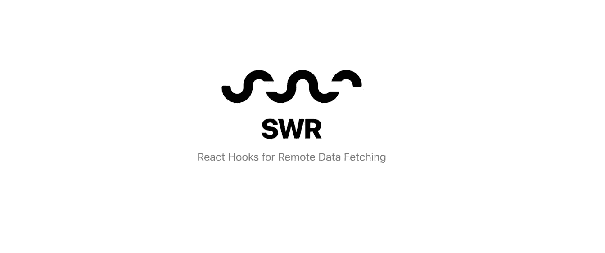
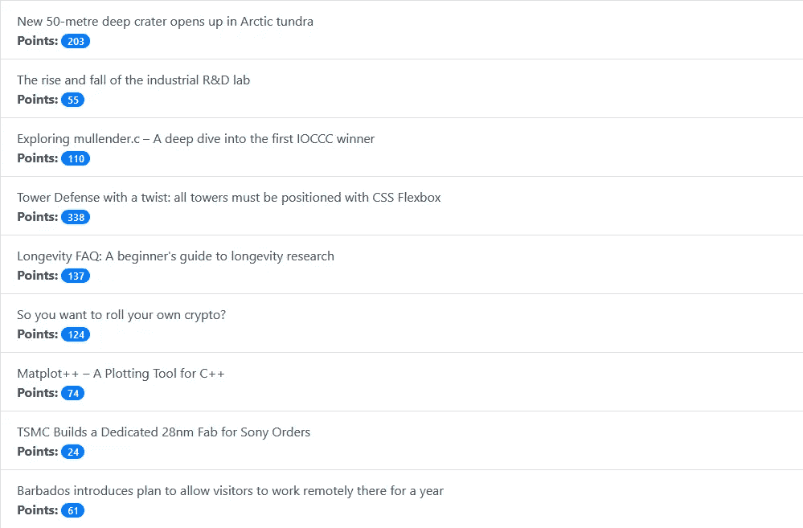
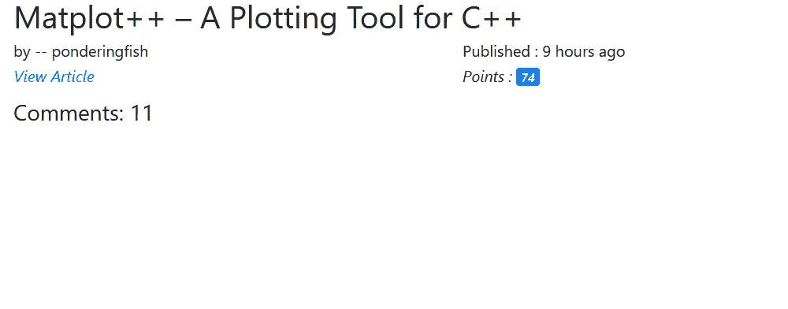
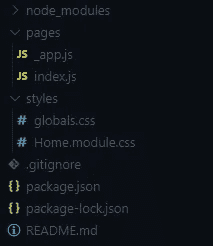
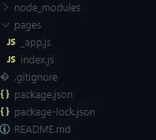
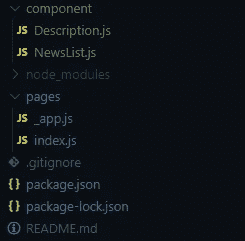

# 与 SWR 互动中的数据获取入门

> 原文：<https://javascript.plainenglish.io/getting-started-with-data-fetching-in-react-with-swr-bfb37ec0c65d?source=collection_archive---------3----------------------->



## 在这篇文章中，我们将首先讨论 SWR，它的特点。然后，我们将使用 SWR 的 HackerNews API 构建一个应用程序。

要理解这篇文章，您需要对 React 有一个基本的了解。

## SWR 简介

SWR 是一个轻量级的、后端不可知的库，由 Vercel 开发，它允许我们在 React 钩子的帮助下获取、重新获取和缓存数据。

SWR 这个名字来源于“失效而重新验证”当我们让 SWR 发出请求时，它首先向我们提供缓存的数据(陈旧的)，然后发出请求(重新验证)，最后提供最新的数据。

## SWR 的特色

这些是 SWR 的一些特征:

*   实时体验
*   类型脚本支持
*   内置缓存
*   轻量级选手
*   后端不可知
*   快速页面导航
*   间隔轮询
*   焦点的重新验证

有了这些功能，SWR 让我们的 React 应用程序更加用户友好和简洁。

到目前为止，我们已经讨论了 SWR 及其功能，现在让我们创建应用程序。

我们的应用程序看起来会像这样:



index page

这是我们应用程序的索引页面。它显示了文章标题及其要点的列表。如果用户点击这些标题中的任何一个，用户就会被定向到以 id 作为查询的*/新闻*路线。使用来自查询的 id，我们在*/新闻*路径中提供关于标题的更多信息。我们的/ *新闻*会是这样的:



example of news page

在本文中，我们不会过多关注应用程序的样式，好吗？

让我们现在设置我们的应用程序。为此，让我们在终端中编写以下命令:

```
npx create-next-app .
```

安装完成后，删除主项目目录中名为 *public* 的文件夹。这将使文件夹结构看起来像这样:



注意，我还删除了*页面* / *api* 目录。让我们也从主项目目录中快速删除*样式*目录。这应该使我们的文件夹结构看起来像这样:



现在让我们安装一些我们需要的包。为此，让我们启动终端并编写以下命令:

```
npm i bootstrap axios swr
```

这里，我们将使用 bootstrap 来设计我们的应用程序。

你可能会问，如果 SWR 应该是数据获取的库，我们为什么还要使用 Axios 呢？这个问题问得好。SWR 的目的是在向后端发出请求后缓存数据。我们总是需要 fetch API，或者 Axios，或者其他一些库来在 SWR 发出请求。从这些库或 API 接收的数据将由 SWR 处理和缓存，使我们的 React 应用程序更具反应性。记住，SWR 比请求库或 API 更复杂。

好吧。现在让我们打开 **_app.js** 文件并做一些修改。我们的 **_app.js** 文件应该是这样的:

```
import "bootstrap/dist/css/bootstrap.min.css"; function MyApp({ Component, pageProps }) { return <Component {...pageProps} />;}export default MyApp;
```

这里，我们已经导入了引导程序的 CSS 文件，并删除了先前存在的 CSS 文件的导入。其他的也一样。

现在让我们开始制作索引页面。在此之前，让我们在 *pages* 目录中创建一个名为 **news.js** 的新文件。

好吧！现在让我们来研究一下 index.js 。首先，您需要删除文件中预先存在的代码。然后，让我们编写下面几行代码:

这里的大多数东西对你来说可能看起来很熟悉，对吗？在第 1 行和第 2 行，我们导入了`useSWR`和`axios`。然后，在第 4 行，我们导入了`NewsList`组件——我们很快就会创建它。在第 6 行，我们创建了一个名为`url`的常量，它是我们接收文章列表的 URL。然后，我们在第 7 行有一个`fetcher`函数。`fetcher`函数的目的是返回 JSON 数据。我们将在使用`useSWR`的同时使用`fetcher`函数。你可以看到，在`fetcher`函数中，我已经用 rest 运算符展开了`args`。然后，在使用`axios`的`.get`方法时，我再次使用了 rest 操作符。

创建`fetcher`功能还有其他方法。我们不会在这里讨论，好吗？

让我们看看第 9 行的`Index`函数。我们已经导出了这个函数。在第 10 行，我们使用了`useSWR`。`useSWR`将`url`作为第一个参数，将`fetcher`作为第二个参数。`useSWR`返回给我们`data`和`error`。`data`和`error`不能同时存在。如果两者都不存在，这意味着数据正在加载。

如果存在任何错误，我们向用户提供错误消息(在第 12 行)。

正如我之前说过的，如果`error`和`data`不存在，数据当前正在加载。当数据被加载时，我们向用户显示数据正在被加载(从第 13 行到第 23 行)。在这里，我使用 bootstrap 添加了一个旋转器。如果你不知道如何用 bootstrap 创建一个 spinner，请点击这个[链接](https://getbootstrap.com/docs/4.5/components/spinners/)到他们关于创建 spinner 的文档。

如果数据存在，我们呈现`NewsList`组件(从第 25 行到第 29 行)。`NewsList`组件需要`newsList`作为道具。我们已经在第 27 行提供了`data`作为`newsList` prop 的值。

到目前为止，我们已经处理了 **index.js** 文件，现在让我们处理 **news.js** 文件。让我们打开 **news.js** 文件，并在文件中写入以下代码行:

让我们仔细看看这个文件。

在第 1 行，我们从`next/router`导入了`useRouter`。在第 2 行，我们导入了`axios`。在第 3 行，我们导入了`useSWR`。在第 5 行，我们导入了`Description`组件。

在第 7 行，我们已经定义了`url`常量。这里的`url`包含新闻描述或数据的 URL。然后，在第 8 行，我们定义了一个`fetcher`函数。您现在知道了`fetcher`函数的作用。所以，我就不再描述了。在第 10 行，我们创建了`News`函数。在第 11 行，我们将`withRouter()`钩子存储在`router`常量中。

在第 13 行，我们使用了`useSWR`。注意，我们使用`url + router.query.id`作为第一个参数，使用`fetcher`作为第二个参数。为了获得关于特定新闻或文章的数据，URL[https://node-hnapi.herokuapp.com/item/](https://node-hnapi.herokuapp.com/item/):id 应该包含 id 作为参数。我们将通过`router.query.id`提供该 id。`useSWR`提供`data`和`error`——你已经知道了。

如果出现任何错误，我们将向用户提供该信息(在第 15 行)，就像我们在 **index.js** 文件中所做的那样。

如果数据正在加载，我们向用户呈现加载信息(从第 16 行到第 26 行)，就像我们之前在 **index.js** 文件中所做的那样。

当数据存在时，我们在第 30 行呈现组件`Description`。我们已经提供了带有`news`的`Description`组件，作为道具，它包含`data`作为值。

我们终于完成了对 **news.js** 文件的处理。现在让我们来研究一下`NewsList`和`Description`组件。让我们在主项目目录中创建一个名为*组件*的目录。然后在*组件*目录下创建两个名为 **Description.js** 和 **NewsList.js** 的文件。这应该使我们的文件夹结构看起来像这样:



之后，让我们打开 **Description.js** 并编写以下几行代码:

这里，我们创建了一个箭头函数`Description`。注意，在第 1 行，我们使用了对象析构来获得`news`道具。

在第 6 行，我们借助`news.title`渲染新闻标题。在第 9 行，我们使用`news.user`呈现文章的作者。在第 10 行，我们使用`news.time_ago`呈现了这篇文章发布了多久。从第 16 行到第 18 行，我们添加了一个`a`标签来提供对文章的引用。在`news.url`的帮助下，`href`包含文章的链接。在第 23 行，我们使用`news.points`呈现文章的要点。然后，在第 27 行，我们使用`news.comments_count`呈现文章的评论数。最后，我们在第 34 行导出了`Description`。

既然我们已经处理了 **Description.js** ，现在让我们处理 **NewsList.js** 文件。让我们在文件中编写以下代码行:

在第 1 行，我们从`next/link`导入了`Link`。在第 3 行，我们创建了一个名为`NewsList`的箭头函数。注意，我们已经在第 3 行从道具中析构了`newsList`。在第 7 行，我们绘制了`newsList`。我们使用`news.title`在第 13 行显示新闻的标题。我们在第 17 行使用`news.points`显示新闻的要点。无论何时，只要用户点击这些新闻中的任何一个，我们就将用户引导到以`id`作为查询的 */news* 路线。为此，我们使用了`Link`(第 8 行到第 11 行)。我们已经在第 10 行向`Link`提供了`key`。`key`包含`news.id`作为其值。在第 9 行，我们使用`href`将用户指引到*/新闻*路线。这里的`href`包含`pathname`和`query`。我们已经将`"/news"`作为值提供给了`pathname`。另一方面，`query`包含一个对象。该对象具有值为`news.id`的`id`属性。我们终于在第 27 行导出了`NewsList`。

至此，我们已经完成了应用程序的创建。你现在可以试试这个。

## 进一步阅读

创建应用程序时，我们在本地配置了 SWR。我们也可以在全球范围内配置 SWR。为此，你可能想看看文档的这一部分。如果你想知道如何使用 fetch 或 GraphQL 通过 SWR 获取数据，你可以看看文档的这部分。

## 简单英语的 JavaScript

你知道我们有三份出版物和一个 YouTube 频道吗？在[**plain English . io**](https://plainenglish.io/)找到所有内容的链接！