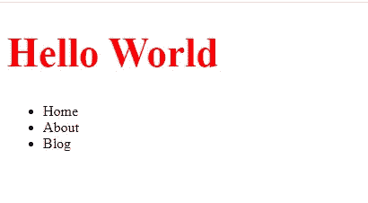
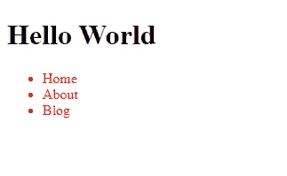
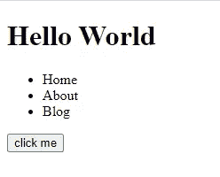
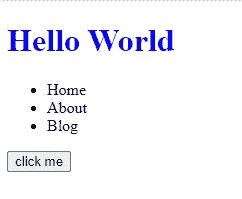

# JavaScript 操作入门

> 原文：<https://javascript.plainenglish.io/getting-started-with-dom-manipulation-in-javascript-3d1ec3b94bea?source=collection_archive---------13----------------------->

## 了解如何在 JavaScript 中操作 DOM


Image Created with ❤️️ By [Mehdi Aoussiad](https://mehdiouss315.medium.com/).

# 介绍

每个 web 开发人员必须掌握的技能之一是在 JavaScript 中操作 DOM，JavaScript 是一组用于控制 HTML 和样式信息的 API。

*[***DOM***](https://developer.mozilla.org/en-US/docs/Web/API/Document_Object_Model/Introduction)是 HTML 和 XML 页面中对象的数据表示。浏览器中加载的文档由一个 ***文档对象模型*** 表示。此外，它是由浏览器创建的“树形结构”表示，使得 HTML 结构能够容易地被编程语言访问。DOM 不是 JavaScript 语言的一部分，它由浏览器构建，并将文档表示为节点(DOM 中的元素)。*

*在本文中，我们将帮助您开始使用 JavaScript 进行 DOM 操作。让我们开始吧。*

# *我们需要什么来开始？*

*在开始使用 DOM 之前，我们需要创建一个 HTML 文件，并使用 Script 标记将它与另一个 JavaScript 文件链接起来。您现在可以打开您的文本编辑器并创建它们，这样您就可以在我们进行的过程中与我们一起编写代码。*

```
*<!DOCTYPE html>
<html lang="en">
<head>
<meta charset="UTF-8">
<meta name="viewport" content="width=device-width, initial-scale=1.0">
<title>The DOM</title><!-- **Linking your JavaScript file.** -->
<script src="app.js" defer="true"></script></head><body>
<!-- Your HTML -->
</body>
</html>*
```

# *在 DOM 中选择元素*

*有很多方法可以选择或访问 DOM 中的元素。在本文中，我们将介绍方法`document.querySelector()`和`document.querySelectorAll()`，因为它们可以通过 ID、名称和类来选择元素。第一个选择单个 HTML 元素，第二个选择具有相同 ID、名称或我们提供的类的所有元素。*

*让我们试一些例子:*

*我们的 HTML(我们将在下面的所有示例中使用这个 HTML):*

```
*<div><h1 id="text">Hello World</h1><ul>
    <li class="list">Home</li>
    <li class="list">About</li>
    <li class="list">Blog</li>
  </ul></div>*
```

*我们可以使用 JavaScript 中的方法`querySelector`选择元素`h1`。另一方面，我们也可以使用方法`querySelectorAll`选择所有元素`li`。看看下面的例子:*

```
*// Select h1 by name.
var h1 = document.**querySelector('h1')**;// You can also Select h1 by ID if you want.
var h1 = document.**querySelector('#text')**;// Select all lists by name.
var lists = document.**querySelectorAll('ul li')**;// Select all lists by class if you want.
var lists = document.**querySelectorAll('.list')**;*
```

*如您所见，我们将它们放在变量中，因为我们稍后将调用这些变量来设计、删除或更新它们。*

# *DOM 中的样式元素*

*我们可以使用属性`style`来设置上面选择的元素的样式，这将帮助我们像在 CSS 中一样设置元素的样式。看看下面的例子:*

*对我们上面选择的`h1`进行造型:*

```
*var h1 = document.querySelector('h1');h1.**style.color = 'red'**;h1.**style.fontSize = '45px'**;*
```

*您还可以使用属性`cssText`将所有样式放在一行中。*

*这里有一个例子:*

```
*var h1 = document.querySelector('h1');h1.style.**cssText = 'color: red; font-size: 45px;'**;*
```

*输出:*

**

*Output.*

*我们还可以使用方法`forEach`将一些样式应用于上面例子中的所有列表`li`。*

*这里有一个例子:*

```
*var lists = document.querySelectorAll('ul li');lists.**forEach**(list =>{ list.style.color = 'red';});*
```

*输出:*

**

*Output.*

# *更新文本内容*

*我们使用属性`innerHTML`或`textContent`更新文本内容。*

*看看下面的例子:*

```
*var h1 = document.querySelector('h1');h1.innerHTML = 'JavaScript is awesome';*
```

*现在，我们将在`h1`元素中使用`JavaScript is awesome`而不是`hello world`。*

*你可以用`textContent`做同样的事情。*

```
*var h1 = document.querySelector('h1');h1.textContent = 'JavaScript is awesome';*
```

# *创建和追加元素*

*我们可以使用方法`document.createElement`在 DOM 中创建一个元素。您所需要的只是将您想要创建的元素作为参数传递。*

```
*var btn = document.createElement('button');*
```

*在上面的例子中，我们创建了一个按钮元素。现在，我们可以使用方法`appendChild`将它添加到 HTML 中的 div 元素中。*

*这里有一个例子:*

```
*// Create the element.var btn = document.createElement('button');// Select the div.var div = document.querySelector('div');// Append the btn to the div.div.appendChild(btn);// Adding text to the btn.btn.innerHTML = 'click me';*
```

*输出:*

**

*Output.*

# *添加事件*

*我们经常使用方法`addEventListener`将事件添加到元素中，该方法有两个参数:事件和回调函数，回调函数将在事件发生时告诉我们该做什么。*

*事件基本上是，当你与一个元素交互时会发生的事情。例如，当您按下按钮时的单击事件。*

*下面是我们如何向上面创建的按钮添加一个点击事件:*

```
*var h1 = document.querySelector('h1');btn.**addEventListener**('click', function(){ h1.style.color = 'blue';});*
```

*正如你在上面看到的，当我们点击按钮时，元素`h1`将会是蓝色的。*

**

*Output.*

*这只是一个点击事件的例子，你需要知道更多的事件。您可以在 [MDN 文档](https://developer.mozilla.org/en-US/docs/Web/Events)中查看它们。*

# *结论*

*遍历 DOM 是您可以在 JavaScript 中学习的重要技能之一。因此，请记住，我们并没有涵盖它的所有内容，但是您可以从其他资源中了解更多信息。*

*感谢您阅读本文，希望您觉得有用。*

# *更多阅读*

*[](https://medium.com/javascript-in-plain-english/understanding-timing-events-in-javascript-3aac74b7c824) [## 理解 JavaScript 中的计时事件

### 用 JavaScript 计时事件，并附有实例

medium.com](https://medium.com/javascript-in-plain-english/understanding-timing-events-in-javascript-3aac74b7c824)*