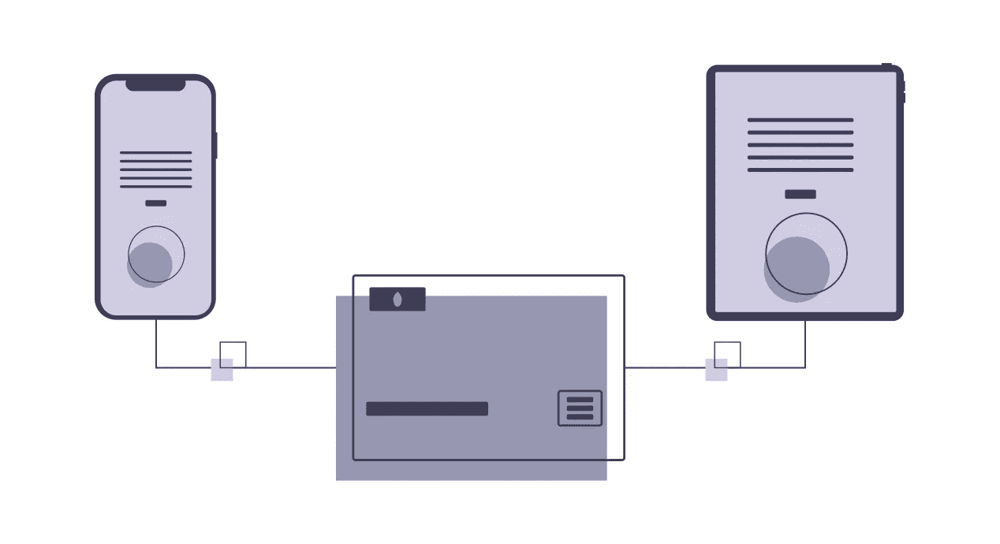
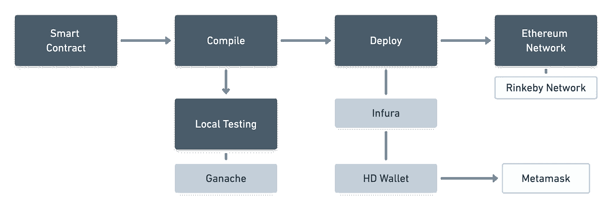
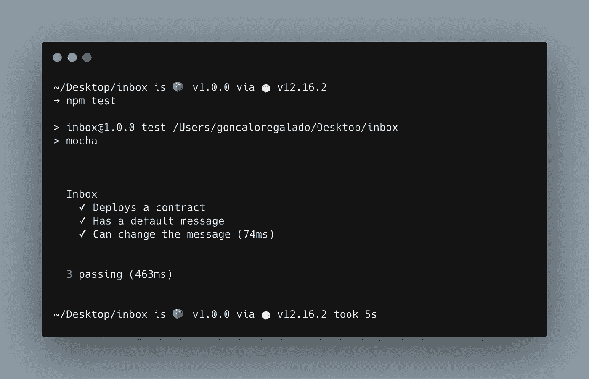
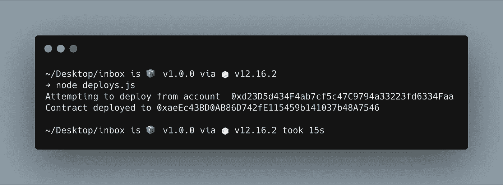

# 以太坊智能合约入门

> 原文：<https://javascript.plainenglish.io/getting-started-with-ethereum-smart-contracts-7aa01e496d23?source=collection_archive---------13----------------------->

## 如何使用 Solidity 构建和部署您的第一个智能合同

Illustration by unDraw

首先，我想说，如果你正在寻找关于智能合约或可靠性的高级解释，这不是你能找到的地方。我将展示的唯一内容是这些协议可以实现的基本功能，以及如何在区块链上部署它们。如果其中一些概念对您来说是陌生的，我在本文末尾附加了一些参考资料，这样您就可以理解我们将要讨论的一些概念需要遵循的基础知识。

# 什么是智能合同？

智能合约是在[以太坊虚拟机](https://www.bitrates.com/guides/ethereum/what-is-the-unstoppable-world-computer) (EVM)上运行的任何程序，通常被称为“智能合约”。它是一种计算机协议，旨在以数字方式促进、验证或加强合同的协商或履行。智能合约允许在没有第三方的情况下进行可信的交易。这些交易是可追踪和不可逆转的。如果你想了解更多关于区块链是如何工作的，你可以[看看这个由](https://www.youtube.com/watch?v=_160oMzblY8)[安德斯·布朗沃斯](https://anders.com/)制作的惊人视频。

**让我们来看一个现实生活中的例子:**

让我们想象一下，亚当想买苏珊的房子，他们已经决定使用智能合同这样做。这个智能合同包含双方之间以代码形式达成的协议。把它翻译成人类语言，计算机协议将表示如下:“当亚当付给苏珊 300 以太时，亚当将获得房子的所有权。”一旦这份智能合同协议生效，它就不能被修改——这意味着亚当可以放心地为房子支付 300 英镑。如果在这种情况下不使用智能合同，Adam 和 Susan 将不得不向第三方公司(如银行和律师)支付大量费用，以构建必要的工具来创建信任关系。

# 基本设置

我们将使用 [Solidity](https://solidity.readthedocs.io/en/v0.6.6/) 构建我们的智能合约，这样我们就可以在以太坊网络上部署它。请注意，以太坊有几个网络可以用于测试，因此我们将在 Rinkeby 网络而不是主网络中部署我们的智能合约，这样我们的虚拟操作就不会真正收费。

从一开始就要意识到的一点是，大多数智能合同操作需要执行一定量的乙醚。唯一不需要 ether 的操作是只读操作，但是我们会在后面看到它们的样子。为了部署和使用我们的智能合同，我们将需要创建一个[元掩码](https://metamask.io/)帐户，并将其切换到选项中的林克比网络。要在钱包里装上乙醚来部署我们的合同并运行运营，我们可以去[林克比水龙头](https://faucet.rinkeby.io/)请求一些来测试我们的第一份智能合同。

# 项目概述和工具

Project Flow Overview

上面的流程显示了我们项目的所有部分将如何结合在一起。我们的智能合同代表了我们的智能合同规则的适用范围。一旦我们定义了这些规则，我们就需要编译我们的智能合同，并使用[摩卡](https://mochajs.org/) & [Ganache](https://www.trufflesuite.com/ganache) 设置一些测试。如果您不熟悉摩卡，请确保查看本文末尾的附加资源。Ganache 是[块菌套件](https://www.trufflesuite.com/)的一部分，可作为个人区块链用于以太网开发和测试。

一旦我们的智能合同生效，我们将使用 [Infura](https://infura.io/) 将其部署到林克比网络，以连接到网络节点& [块菌高清钱包提供商](https://github.com/trufflesuite/truffle-hdwallet-provider)以连接到我们的元掩码帐户。

在此之后，我们将能够通过使用[林克比以太网](https://rinkeby.etherscan.io/)在林克比以太网网络上验证我们的合同的存在。

# 我们的智能合同

我们将构建一个非常基本的协议，它可以在变量中存储和返回消息。这里的要点是理解我们的合同可以执行的两种类型的操作。这也将使我们能够理解与使用区块链技术相关的限制。

Smart Contract using Solidity

查看我们的代码，我们可以看到，我们有一个消息变量，它将用一个默认消息和一个函数初始化，该函数可以为同一个变量设置一个新消息。作为 Solidity 语言的一部分，一旦创建了这个契约，就有一个与 Inbox 构造函数相关联的隐含只读函数，其唯一目的是返回消息变量。如果你想更深入地理解上面的代码，看看 Solidity 文档[这里](https://solidity.readthedocs.io/en/v0.6.6/index.html)。

让我们快速看一下编译文件:

Our compile.js file

为了编译我们的契约并在网络中部署它，我们将需要使用 [solc](https://www.npmjs.com/package/solc) 。Solc 是一个可靠的 JavaScript 编译器，它将转换我们的代码，并以字节码和 ABI 的格式返回给我们。字节码以一种为软件解释器设计的格式表示我们的合同。ABI 是一个描述部署代码及其功能的`.json`文件。它允许我们将契约放在上下文中，并在部署后调用它的函数。

# 测试我们的合同

我们将使用 Mocha 构建我们的测试电池，我们将设置两个简单的电池。首先验证初始化和设置默认消息的能力，其次验证更新相同消息的能力。但是，我们需要首先使用 Web3 & Ganache 在本地网络中部署我们的合同。我们将创建一个 beforeEach 函数，该函数使用 Web3 模块连接到 Ganache 来检索本地测试帐户以执行我们的操作。如果你记得我以前提到过，智能合约中的大多数操作都需要一些以太网。合约的部署就是这些操作之一。在我们的本地测试中，Ganache 将为我们提供执行此操作和其他操作所需的帐户和资金。

让我们看一下我们的代码:

Our local testing script

你可以看到，当我们使用之前定义的收件箱函数时，我们可以执行`call( )`或`send( )`操作。`Call( )`操作只返回信息，并且是即时的。此外，`send( )`业务打算发送信息到网络，这样做将需要一些以太网和时间来运行。时间表示开采每个操作将被注册的区块所需的时间。这就是为什么当我们执行一个`send( )`操作时，我们需要将一个帐户作为一个参数来传递，并且它们比我们习惯的要花费更多的时间来执行。

一旦我们运行我们的测试，我们应该在我们的终端中得到这样的东西:

Test results in the Terminal

# 部署我们的合同

将我们的契约部署到 Rinkeby 网络在许多方面类似于我们在前面的测试示例中所做的。两个主要区别是，我们将不使用 Ganache 连接到本地网络，我们将需要访问我们的 Metamask wallet 来使用 ether 执行操作。让我们从访问 Metamask 帐户开始。这可以使用您在创建帐户时收到的助记符，该助记符将使用 HD Wallet Provider 检索我们的元掩码公钥。如果你想更好地理解这个过程是如何工作的，你可以在这里阅读更多信息。

HD Wallet Provider constructor 将收到的第二个参数是通过 Infura 获得的端点，它将允许我们连接到网络。

让我们看一下代码:

Our deployment script

一旦我们运行部署脚本，我们应该在终端中得到类似这样的内容:

Our Terminal response once the code is deployed

我们可以使用以太扫描来验证我们的合同在区块链中的存在，或者，在这种情况下， [Rinkeby 以太扫描](https://rinkeby.etherscan.io/)。

# 结论

我希望你喜欢这个关于 Solidity 智能合约的基本介绍，以及我们如何在以太坊网络上部署它们。如果您想继续学习和发展您的技能，我在参考资料部分添加了一个完整的课程，我发现它非常有帮助，还有 GitHub 链接到我们刚刚做的内容。

感谢阅读！

# 资源

*   [摩卡测试快速完整指南](https://blog.logrocket.com/a-quick-and-complete-guide-to-mocha-testing-d0e0ea09f09d/)
*   [区块链简单讲解](https://www.youtube.com/watch?v=SSo_EIwHSd4)
*   [以太坊 101](https://www.coindesk.com/learn/ethereum-101/ethereum-smart-contracts-work)
*   [以太坊和坚固性:完整的开发者指南](https://www.udemy.com/course/ethereum-and-solidity-the-complete-developers-guide/)
*   [Github 上的完整代码](https://github.com/gfregalado/InboxSmartContract)

## **简明英语团队的笔记**

你知道我们有四种出版物吗？给他们一个 follow 来表达爱意:[**JavaScript in Plain English**](https://medium.com/javascript-in-plain-english)[**AI in Plain English**](https://medium.com/ai-in-plain-english)[**UX in Plain English**](https://medium.com/ux-in-plain-english)[**Python in Plain English**](https://medium.com/python-in-plain-english)**—谢谢，继续学习！**

**我们还推出了一个 YouTube，希望你能通过 [**订阅我们的简明英语频道**](https://www.youtube.com/channel/UCtipWUghju290NWcn8jhyAw) 来支持我们**

**一如既往,“简明英语”希望帮助推广好的内容。如果您有一篇文章想要提交给我们的任何出版物，请发送电子邮件至[**submissions @ plain English . io**](mailto:submissions@plainenglish.io)**，并附上您的媒体用户名和您感兴趣的内容，我们将会回复您！****