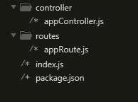
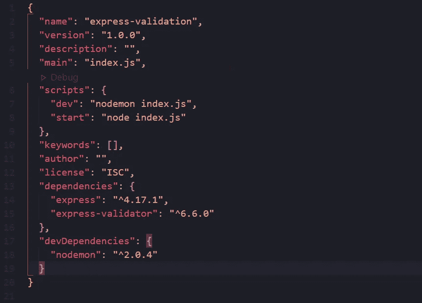

# 快速验证器入门

> 原文：<https://javascript.plainenglish.io/getting-started-with-express-validator-fae0bbeeb0f9?source=collection_archive---------1----------------------->


在这篇文章中，我们将学习 express-validator。我们还将学习自定义错误处理和自定义验证器。要阅读本文，您应该对 express.js 有一些基本的了解。

# 快速验证器简介

Express-validator 是一个 Express 中间件，它为我们提供了验证和净化功能。实际上，Express validator 是建立在 validator.js 之上的。Validator.js 是一个帮助我们验证几种不同类型的数据的库。

# 为什么要验证？

你可能会想“为什么我们需要验证？”这个问题问得好。假设我们有一个强大的应用程序，具有多种丰富的功能。比方说，这个功能丰富的应用程序可以让用户拨打世界上任何一个电话号码。要打电话，我们显然需要用户的电话号码。如果用户给了我们一个无效格式的电话号码或者只是一个随机的字符串会怎么样？在这种情况下，我们的应用程序可能会失灵。但是这个健壮的应用程序的开发者已经实现了验证，所以如果用户输入无效，应用程序会用一些错误消息来响应。这只是验证有用的一个例子。

*谨记“从客户端接收的数据不应盲目信任。”因此，添加一个验证检查。简单！*

现在让我们进入有趣的部分！我们将通过为用户注册创建验证来学习 express-validator。现在，跳过工作目录中的终端，编写以下命令:

```
npm init -y
```

现在让我们在主项目目录中创建一个名为 **index.js** 的文件。之后，在工作目录中创建两个目录，分别名为 routes 和 controller。在 routes 目录中，创建一个名为 **appRoute.js** 的文件。同样，在控制器目录中创建 **appController.js** 文件。这应该使我们的文件夹结构看起来像这样:



现在让我们安装我们需要的包。

```
npm i express express-validator
```

现在我们已经安装了包，让我们也安装 Nodemon 作为我们的开发依赖项。

```
npm i -D nodemon
```

Nodemon 是一个包，它通过在每次更改后自动重启服务器来帮助我们简化开发过程。标志帮助我们将这个包作为一个开发依赖包来安装。

现在让我们打开文件 **package.json** 并对脚本进行一些修改，这样我们就可以使用 Nodemon 了。

```
"scripts": { "dev": "nodemon index.js", "start": "node index.js"}
```

这应该使我们的 **package.json** 文件看起来像这样:



现在，在命令行中，键入以下内容:

```
npm run dev
```

这将启动我们的开发服务器，它也会在每次更改时自动重启。

现在，让我们转到主项目目录中的文件 **index.js** 并编写以下代码行:

```
const express = require("express");const AppRoute = require("./routes/appRoute");const app = express();const PORT = process.env.PORT || 3000;app.use(express.json());app.use("/api/", AppRoute);app.listen(PORT, () => console.log(`listening on port ${PORT}`));
```

在上面的代码中，我们已经导入了`AppRoute`并初始化了 app。我们使用`express.json()`中间件来处理 JSON 数据。然后，我们增加了一条`/api/`路线。之后，我们在`PORT` 上启动了我们的服务器。

现在让我们转到 routes 目录并打开 **appRoute.js** 。我们的 **appRoute.js** 文件应该有以下几行代码:

```
const express = require("express");const { signupController } = require("../controller/appController");const router = express.Router();router.post("/signup", signupController);module.exports = router;
```

这里没什么特别的。我们进口了`appController`，增加了一条`/api/signup`的路线。

现在让我们转到控制器目录中的文件 **appController.js** 。

```
const signupController = (*req*, *res*) => { *// add the user to the database* return res.status(200).json({ msg: "success" });};module.exports = { signupController };
```

在上面的代码中，我们向用户发送状态为 200 的消息。您显然知道这个函数只有在数据被验证时才起作用。请注意，我没有添加注册功能的代码，这里只写了伪代码。这是因为我们在这里的重点是实现验证。

现在让我们实现 express-validator。为此，让我们打开 routes 文件夹中的文件 **appRoute.js** ，并编写以下代码行:

这里我们加了很多东西。一个一个说吧。我们从`express-validator`导入了`check`和`validationResult` 。然后我们实现了一个`check`。`check`方法用于向字段添加验证。在我们的例子中，我们为`name`、`email`、`password`、`confirmPassword`添加了`check`验证。也可以用`body`方法代替`check`方法。但是在我们的例子中，我们将使用`check`而不是`body`，好吗？

现在，让我们仔细看看`check("name")`。在这里，我们实现了`.isLength({min:3})`。它的功能是告诉 express-validator,`name` 字段的最小长度应该是 3 个字符。如果需要，您也可以设置最大长度。以下是使用`max`的方法:

```
**check("name").isLength({ min:3, max:20 })**
```

要不要实施，看你自己了。

然后我们就有了`.withMessage()` *。它帮助我们告诉 express-validator 错误信息应该是什么。默认情况下，Express-validator 确实为我们提供了错误消息，但是 express-validator 提供的消息并不清楚。这个错误信息必须提供给我们的用户。为了让消息更容易理解和用户友好，我们使用了`.withMessage()`。你明白了，对吧？*

现在，让我们来看看`check(“email”)`。我们需要检查我们在该字段中收到的数据是否是电子邮件。幸运的是，express-validator 提供了`.isEmail()`功能，帮助我们检查数据是否是电子邮件。之后，我们使用了`.normalizeEmail()`，它可以帮助我们规范从用户那里收到的电子邮件。

现在，我们来看看`check(“password”)`。您可以决定希望用户输入什么类型的数据作为密码。我希望用户至少有一个数字，至少有一个特殊字符，最小长度为 8，最大长度为 15。你可以看到我们用`.isLength()`表示最小和最大长度。然后，我们用了`.matches(/\d/)`。该命令告诉 express-validator 它应该至少包含一个数字。`matches()`命令实际上接受 regex。如果你不明白`/\d/`是做什么的，它只是正则表达式。我推荐你看一下 regex。然后，我们实现了`.matches(/[!@#$%^&*(),.?":{}|<>]/)`。这有助于我们检查密码是否包含至少一个特殊字符。

现在，我们来看看`check("confirmPassword")`。这里我们实现了`.custom()`，这意味着我们创建了一个定制的验证器。`.custom()`带`value` 和`{req}`。`value`是我们在`confirmPassword`字段中从用户那里收到的数据，而`req`让我们可以访问请求。然后我们比较了`confirmPassword`(也就是`value`)和`password`(也就是`req.body.password`)是否匹配。如果`confirmPassword`不匹配，我们将抛出一个新的带有错误信息的`Error()`，否则我们返回`true`。

之后，您可以在验证检查之后立即看到一个功能/中间件，如下所示:`(req,res,next)=>{...}`，对吗？在函数内部你可以看到`validationResult(req)`。这个命令返回给我们错误。这个错误返回多个值，我们可能不需要这些值。在某些情况下，我们确实需要它。

但是，在本文中，我假设我们只需要错误消息。所以，我使用了`.formatWith()`命令。这个命令帮助我们格式化错误消息。正如我之前所说的，我们将返回一个错误消息`msg`。我们可以使用`.formatWith()`接收和格式化多种其他数据。分别是:`location`、`msg`、`param`、`value`、`nestedErrors`。您可以在 express-validator 文档中了解更多信息。好吗？

然后可以看到命令`!error.isEmpty()`。这将返回`true`或`false`。很简单，对吧？然后我们将布尔值存储在`hasError`变量中。

之后，我们执行了上面代码中的一个条件。如果`hasError`为`true`，用户会收到状态 422 和错误信息。注意，我们使用了`error.array()`，它帮助我们创建一个错误消息数组。该数组被发送给用户。非常简单，对吗？如果`hasError`是`false`，我们使用`next()`。我希望你知道`next()`是做什么的。

## 这意味着您已经成功实现了 express-validator！

这篇文章肯定会让你开始使用 express-validator。现在，我建议你一定要查看一下 express-validator 的[文档](https://express-validator.github.io/docs/)以深入了解。