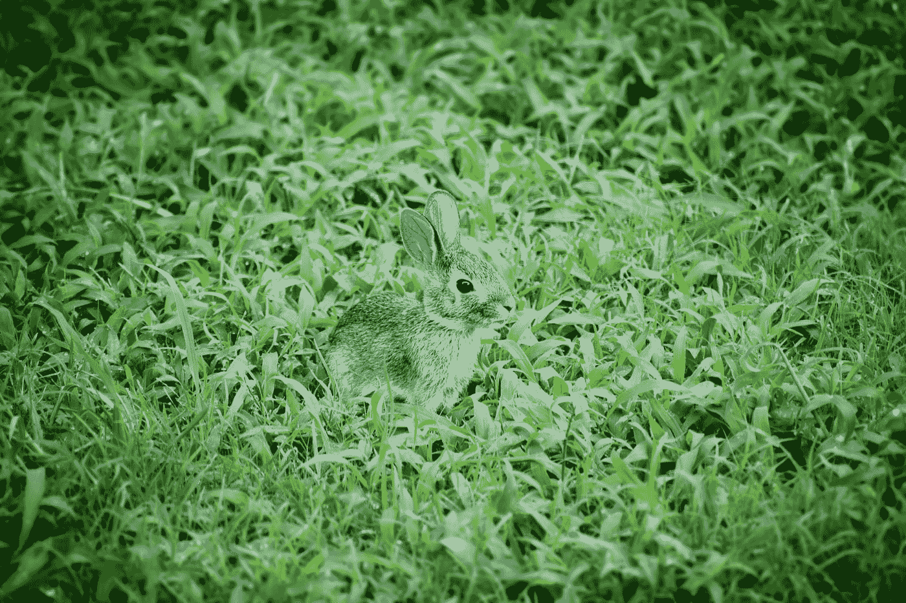

# 材料用户界面入门

> 原文：<https://javascript.plainenglish.io/getting-started-with-material-ui-f7c6130b5e08?source=collection_archive---------11----------------------->



Photo by [Davies Designs Studio](https://unsplash.com/@davies_designs?utm_source=medium&utm_medium=referral) on [Unsplash](https://unsplash.com?utm_source=medium&utm_medium=referral)

材质 UI 是一个为 React 制作的材质设计库。

这是一组具有材质设计风格的 React 组件。

在这篇文章中，我们将看看如何开始材料设计。

# 装置

我们可以通过运行以下命令来安装该软件包:

```
npm install @material-ui/core
```

与 NPM 或:

```
yarn add @material-ui/core
```

用纱线来安装它。

我们也可以通过书写来添加 Roboto 字体:

```
<link rel="stylesheet" href="https://fonts.googleapis.com/css?family=Roboto:300,400,500,700&display=swap" />
```

在我们的 HTML 中。

可以添加材料设计图标:

```
<link rel="stylesheet" href="https://fonts.googleapis.com/icon?family=Material+Icons" />
```

然后，我们可以从使用包中的一些组件开始。

# 箱子

我们可以使用`Box`组件进行布局。

例如，我们可以写:

```
import React from "react";
import Box from "@material-ui/core/Box";
import Button from "@material-ui/core/Button";export default function App() {
  return (
    <Box component="span" m={1}>
      <Button>foo</Button>
    </Box>
  );
}
```

添加`Box`组件进行布局，内部有一个按钮。

`component`指定渲染为哪个组件。

我们可以用`clone`调用`React.cloneElement`来克隆元素:

```
import React from "react";
import Box from "@material-ui/core/Box";
import Button from "@material-ui/core/Button";export default function App() {
  return (
    <Box color="text.primary" clone>
      <Button>foo</Button>
    </Box>
  );
}
```

`Box`还可以接受一个渲染道具功能:

```
import React from "react";
import Box from "@material-ui/core/Box";
import Button from "@material-ui/core/Button";export default function App() {
  return (
    <Box color="text.primary">{props => <Button {...props}>foo</Button>}</Box>
  );
}
```

# 容器

我们可以添加一个带有`Container`组件的容器。

例如，我们可以写:

```
import React from "react";
import Container from "@material-ui/core/Container";export default function App() {
  return <Container maxWidth="sm">foo</Container>;
}
```

我们可以添加一个`Container`组件。

`maxWidth`指定容器的最大宽度。

`sm`表示是小容器。

它也可以具有固定的大小:

```
import React from "react";
import Container from "[@material](http://twitter.com/material)-ui/core/Container";export default function App() {
  return <Container fixed>foo</Container>;
}
```

我们用`fixed`支柱把它修好了。

# 格子

我们可以用`Grid`组件创建自己的网格。

例如，我们可以如下使用 e:

```
import React from "react";
import { makeStyles } from "@material-ui/core/styles";
import Grid from "@material-ui/core/Grid";
import Paper from "@material-ui/core/Paper";const useStyles = makeStyles(theme => ({
  root: {
    flexGrow: 1
  },
  paper: {
    height: 140,
    width: 200
  },
  control: {
    padding: theme.spacing(2)
  }
}));
export default function App() {
  const [spacing] = React.useState(2);
  const classes = useStyles(); return (
    <Grid container className={classes.root} spacing={2}>
      <Grid item xs={12}>
        <Grid container justify="center" spacing={spacing}>
          {[0, 1, 2].map(value => (
            <Grid key={value} item>
              <Paper className={classes.paper} />
            </Grid>
          ))}
        </Grid>
      </Grid>
    </Grid>
  );
}
```

我们有`Grid`组件。

外面的那个被用作容器。

我们向它传递一个由`makeStyles`创建的类来设置 flexbox 进行扩展。

`spacing`设置为 2，给我们一个余量。

在内部的`Grid`中，我们添加了`item`道具来表示它是一个网格项目。

`justify`让我们根据 flexbox 设置校准。

然后我们添加`Grid`来显示容器内的一些盒子。

# 流体网格

我们可以用一些断点使网格变得流畅:

```
import React from "react";
import { makeStyles } from "@material-ui/core/styles";
import Paper from "@material-ui/core/Paper";
import Grid from "@material-ui/core/Grid";const useStyles = makeStyles(theme => ({
  root: {
    flexGrow: 1
  },
  paper: {
    padding: theme.spacing(2),
    textAlign: "center",
    color: theme.palette.text.secondary
  }
}));export default function App() {
  const classes = useStyles(); return (
    <div className={classes.root}>
      <Grid container spacing={3}>
        <Grid item xs={12} sm={3}>
          <Paper className={classes.paper}>foo</Paper>
        </Grid>
        <Grid item xs={12} sm={3}>
          <Paper className={classes.paper}>bar</Paper>
        </Grid>
        <Grid item xs={12} sm={6}>
          <Paper className={classes.paper}>baz</Paper>
        </Grid>
      </Grid>
    </div>
  );
}
```

我们用`makeStyles`函数创建一个网格，为网格创建样式。

我们有`root`类来让网格填充容器。

然后我们有一些断点道具，让我们设置每个断点的宽度。

`xs`是额外的小，它会设置屏幕尺寸的列大小。

`sm`很小，它将设置该屏幕尺寸及以上的列尺寸。


Photo by [Andy Brunner](https://unsplash.com/@andy_brunner?utm_source=medium&utm_medium=referral) on [Unsplash](https://unsplash.com?utm_source=medium&utm_medium=referral)

# 结论

我们可以用材质 UI 创建基本的布局。

它可以是固定大小，也可以是响应式的。

## 简单英语的 JavaScript

喜欢这篇文章吗？如果是这样，通过 [**订阅解码获得更多类似内容，我们的 YouTube 频道**](https://www.youtube.com/channel/UCtipWUghju290NWcn8jhyAw) **！**