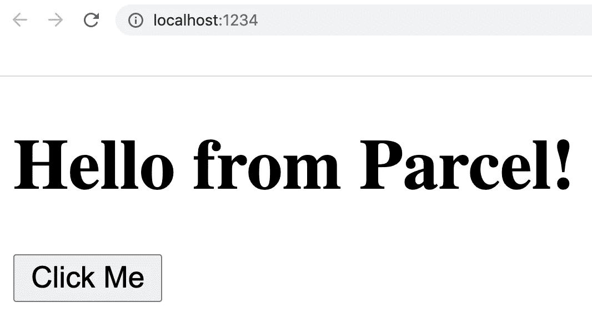
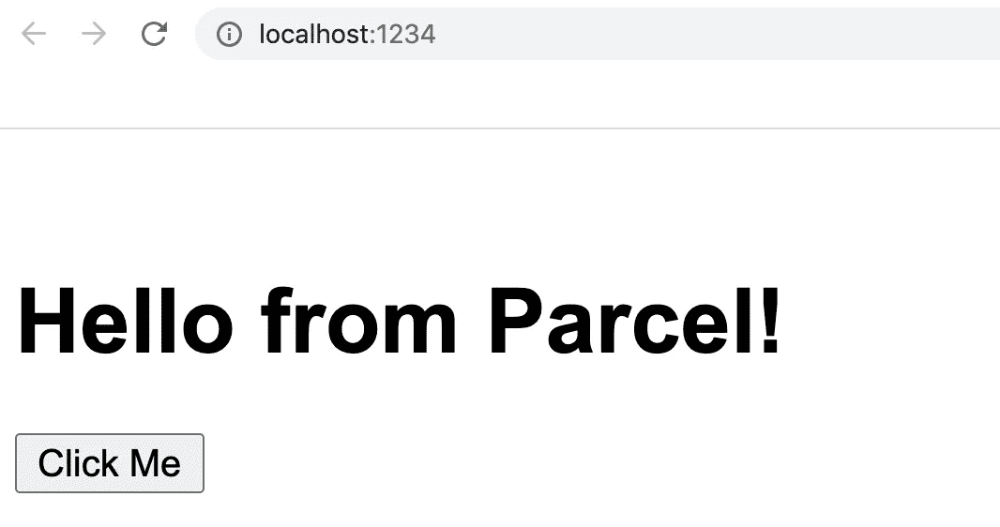

# Parcel.js 入门

> 原文：<https://javascript.plainenglish.io/getting-started-with-parcel-js-76d6a1e16017?source=collection_archive---------2----------------------->


Photo by [Kira auf der Heide](https://unsplash.com/@kadh?utm_source=unsplash&utm_medium=referral&utm_content=creditCopyText) on [Unsplash](https://unsplash.com/s/photos/parcel?utm_source=unsplash&utm_medium=referral&utm_content=creditCopyText)

当你开始开发一个新的、简单的、静态的网站时，你如何开始？你只是创建一个`index.html`文件并链接一个`style.css`表吗？如果您想在最终项目中使用 JavaScript 模块捆绑、Sass 和缩小，该怎么办？

如果您想利用这些特性，您可能会花费相当多的时间来安装和设置必要的预处理程序和工具，从而妨碍您开始简单的项目。

如果您想花更多的时间编写代码而不是设置工具，您可能会对使用 Parcel.js 感兴趣。

*本文的完整代码可以在*[*https://github.com/codebubb/parcel-example*](https://github.com/codebubb/parcel-example)找到

# 什么是 Parcel.js？

[Parcel](https://parceljs.org) 是一个打包工具，它将您的源文件(如 Sass、JavaScript 和 TypeScript)处理成浏览器可用的格式。如果你以前使用过 [Webpack](https://webpack.js.org/) ，你会对这个过程很熟悉。

与包和其他捆绑工具的主要区别是，它不需要配置，它真的很快，正如您将看到的，它处理您所需的任何额外依赖项的安装。

# 装置

您可以全局安装包，以便可以在命令行的任何位置使用它:

```
npm install -g parcel
```

或者，您可以将它作为开发依赖项安装到您的项目中。

```
npm init -y
npm install --save-dev parcel
```

在本教程的剩余部分，我将选择第二个选项，向您展示如何在自己的项目中使用 Parcel。

# 添加源文件

将 package 作为我们项目的一个依赖项安装后，让我们创建一些源文件。通常，我喜欢创建一个`src`文件夹，然后为 Sass、JavaScript 文件等创建单独的子文件夹。但是，您可以按照自己喜欢的方式构建项目。

```
myProject/
|── node_modules
|── src/
|   |── index.html
|   |── img/
|   |── scss/
|   |   |── styles.scss
|   |── js/
|   |   | - app.js
|── package.json
|── package-lock.json
```

接下来，让我们在 HTML 文件中添加一些内容。

注意我们如何将`<link>`标签直接指向我们创建的 SCSS 文件，对于我们的 JavaScript 也是如此。

# 使用包裹的内建服务器

创建源文件后，让我们创建一个`npm`脚本来运行 Parcel，为我们的源文件提供服务。创建脚本的好处是，这将使任何使用您的代码的人清楚地知道他们如何启动和运行项目。

在我们项目的`package.json`文件中，我们将添加一个名为`serve`的新脚本，该脚本运行包裹服务命令，将入口点设置为`src`文件夹中的`index.html`文件。如果你已经用不同的方式创建了你的文件夹结构，确保更新这个命令指向你的`index.html`文件所在的位置。

完成后，我们可以使用以下命令运行包裹服务器:

```
npm run serve
```

然后，您应该在终端中看到 Parcel 提供内容的 URL(默认为 [http://localhost:1234)](http://localhost:1234)) :

```
Server running at [http://localhost:1234](http://localhost:1234) 
✨  Built in 2.45s.
```

如果在浏览器中打开服务器地址，应该会看到显示的 HTML 页面。



目前没有什么令人印象深刻的事情发生，但是如果我们在项目中给`styles.scss`文件添加一些内容。例如，只是对`<h1>`标签的一些简单更新:

当您点击 save 时，如果您查看运行 Parcel server 的终端，您会注意到您会得到一条消息 *Installing Sass…* 表明 Parcel 已经识别了您的 SCSS 文件中的内容，并且正在安装必要的工具来将其处理成 CSS(如果您查看您的`package.json`文件，您会看到`sass`已经作为一个开发依赖项自动安装。

回到浏览器，您应该看到更新的字体和边距被应用到`<h1>`标签。



# 使用 JavaScript 模块

JavaScript 模块与 Parcel 一起开箱即用，因此如果您想将 JavaScript 代码分割成不同的文件，并使用`import/export`关键字引用不同的函数和值，那么 Parcel 将为您处理所有这些。

假设您想为页面上按钮的点击事件编写一个函数。我们可以将它作为一个新文件`Button.js`存储在我们的`src`文件夹的`js`子文件夹中。

在我们的`app.js`文件中，我们可以简单地`import`这个函数，并将其分配给页面上按钮的点击事件。

# 其他类型的资产

Parcel 不仅仅局限于处理 Sass 和 JavaScript 文件；它还可以处理广泛的其他资产,包括图像、打字稿、CoffeScript、Less 和 Web 汇编。

例如，也许您想在源代码中使用 TypeScript。Parcel 将处理这个到 JavaScript 的转换。

我们可以将我们的`app.js`转换成一个类型脚本文件:

然后在我们的`index.html`文件中更新对源文件的引用，将`app.js`改为`app.ts`。

当您保存这些更改时，Parcel 将安装`typescript`包，并使用它将您的类型脚本代码转换为 JavaScript，然后提供给浏览器。

# 生产建筑

当您准备好部署代码时，package 有一个`build`命令可以使用。

让我们创建另一个`npm`脚本来处理我们项目中的这个问题。

如果您想在最终输出中包含源地图，您可以删除`--no-source-maps`标志。

然后在终端上使用以下命令运行构建过程:

```
npm run build
```

完成后，您会在项目中找到一个新文件夹，即`dist`文件夹。在这个文件夹里，你会发现你的 HTML，JavaScript 和 CSS 的迷你版本。

```
dist/
|── index.html
|── app.700f0921.js
|── styles.43cd3188.css
```

JavaScript 和 CSS 文件有一个哈希应用于文件名，用于缓存破坏。如果您的项目中有任何图像，这些图像也将通过随机哈希拷贝到您的输出文件夹中。

如果您看一下`dist`中的`index.html`文件，您会注意到对 SCSS 和 JavaScript 文件的引用已经被编译后的分发文件所取代，这意味着您的`dist`文件夹已经准备好发布到 web 服务器/内容主机。

你会注意到在上面的代码中，HTML 也被缩小了，这并不是每个人都喜欢的。幸运的是，`build`命令有很多选项来配置最终输出。

# 宗地构建选项

如果您已经全局安装了包，您可以使用`parcel build --help`检查所有可用的构建选项。这里有几个有用的选项，你可以考虑一下:

```
-d, --out-dir <path>  set the output directory. defaults to "dist"
--no-minify           disable minification
--no-source-maps      disable sourcemaps
--no-content-hash     disable content hashing
```

如果项目被部署到远程托管服务器上的不同路径，也可以选择将项目的公共 URL 设置为其他值。

# 结论

page 使构建一个简单的静态页面变得非常简单，让您远离其他 bundlers 所需的所有配置，并让您快速使用您最喜欢的开发语言(例如 Sass、TypeScript ),而不必自己安装所有工具。

我们已经看到了如何利用 Sass 和 JavaScript 模块，而不需要创建配置文件

希望你已经学会了如何:

*   将地块作为依赖项全局安装或安装在项目中
*   使用`parcel serve`命令提供内容
*   使用`parcel build`命令构建您的生产项目

你试过 Parcel.js 吗？你怎么想呢?在推特上让我知道 [@codebubb](https://twitter.com/codebubb)

感谢阅读。