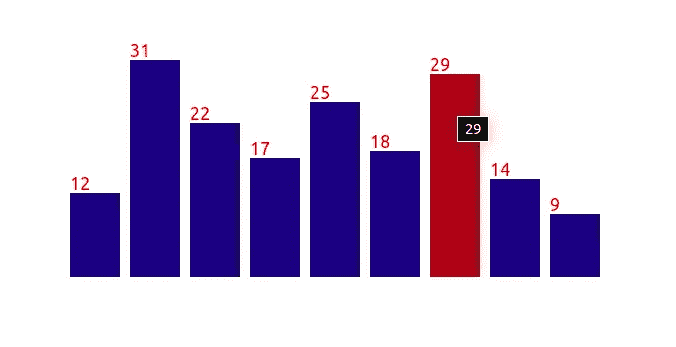

# React 和 D3 —交互式条形图入门。

> 原文：<https://javascript.plainenglish.io/getting-started-with-react-and-d3-interactive-bar-chart-3ed8c933beb3?source=collection_archive---------1----------------------->



D3 代表数据驱动文档，自 2011 年诞生以来，它一直是在网络上创建自定义数据可视化的行业标准。我喜欢把 D3 想象成一个加载数据并将其附加到 DOM 的库。React 是一项脸书技术，它使得创建交互式用户界面变得不费力。它被认为是有史以来最强大的用户界面库。

React 和 D3 都是用于在 web 上构建定制数据可视化的很好的工具。然而，它们的设计目的是相互冲突的。两者都控制用户界面元素或操作 DOM，并以不同的方式完成。我们如何让它们协同工作，同时最大限度地发挥各自的独特优势？

在本文中，我们将使用这两个库，利用它们独特的优势来创建一个交互式条形图。在同一个项目中使用 react 和 D3 有多种方法，但是必须遵循一个规则；

> 他们不应该共享 DOM 控制权。这将是一场灾难。马科斯·伊格莱西亚斯

这就是我们要构建的东西，也是我将在本文中向您介绍的内容。一个[现场演示在这里](https://www.asabahebwa.com/visualizations)，如果你想看它的行动。

当用 React 和 D3 创建数据可视化时，我们可以使用许多不同的方法，更多地倾向于 React 端或 D3.js 端。在我的[上一篇关于用 React 和 D3 创建 30 天比特币价格图表的文章](https://medium.com/analytics-vidhya/make-a-clever-bitcoin-price-chart-with-react-and-d3-e6359d604b54)中，我用 React 表示 DOM，D3 表示 Math。

**React 为 DOM，D3.js 为 math**

在这个策略中，我们尽可能的限制 D3.js 的使用。这意味着我们需要用 D3.js 对 SVG 路径、比例、布局和转换进行计算，并将其转换成我们可以用 React 绘制的东西。对于这个演示，我们将在 React 中使用 D3.js。

【React 内的 D3.js】

在这种方法中，我们给予 D3.js 尽可能多的 DOM 控制权。我们使用 React 来呈现一个 div，作为数据可视化的根元素。然后我们利用 *componentDidMount* 生命周期方法，用 D3.js 代码进行数据可视化，并借助 React refs 将其附加到根元素上。

好了，说够了！让我们开始实现交互式条形图。

# 交互式条形图的实现

实现这个条形图主要需要两个文件；

**反应元件**

*   包含发生 D3.js 计算的 *componentDidMount* 生命周期方法。
*   其中根元素由 React 呈现。
*   其中 D3.js 被添加到项目中。
*   包含条形图的一些样式。

**样式文件**

*   获取条形图的其他样式。

非常简单直接……:)

# 我是这样做的

为了快速启动这个项目，我用 create-react-app 引导应用程序，这是一个由脸书的工程师创建的节点模块，用于为 react 应用程序生成锅炉板代码。它负责引擎盖下的 webpack 和 babel 配置。

我将从 React 组件中的代码开始，该组件负责进行 D3.js 计算并将条形图可视化呈现到 DOM 上。

```
import React from "react";
import * as d3 from "d3";class App extends React.Component {
  constructor(props) {
  super(props);
  this.state = {};
 }

 componentDidMount() {
   const dataset = [12, 31, 22, 17, 25, 18, 29, 14, 9];
   const w = 600;
   const h = 300; const svg = d3
     .select(this.refs.chart)
     .append("svg")
     .attr("width", w)
     .attr("height", h)
     .attr("class", "bar"); svg
     .selectAll("rect")
     .data(dataset)
     .enter()
     .append("rect")
     .attr("fill", "navy")
     .attr("class", "sBar")
     .attr("x", (d, i) => i * 60)
     .attr("y", (d, i) => {
        return h - 7 * d;
      })
     .attr("width", 50)
     .attr("height", (d, i) => 7 * d)
     .append("title")
     .text(d => d); svg
     .selectAll("text")
     .data(dataset)
     .enter()
     .append("text")
     .style("font-size", 18)
     .attr("fill", "red")
     .attr("x", (d, i) => i * 60)
     .attr("y", (d, i) => h - 7 * d - 3)
     .text(d => d);
    } render() {
      const styles = {
        container: {
          display: "grid",
          justifyItems: "center"
        }
      }; return (
      <div ref="chart" style={styles.container}>
        <h1 style={{ textAlign: "center" }}>Hi, I'm the bar chart</h1>
      </div>
     );
   }
  }export default App;
```

首先，您需要将 D3.js 添加到项目中。导航到你的项目文件夹，运行命令`yarn add d3`如果你正在使用 yarn else 为 npm 风扇运行`npm i d3`。之后，将 D3 导入到`App.js`文件中，如上面代码片段开头所示。

```
const dataset = [12, 31, 22, 17, 25, 18, 29, 14, 9];
   const w = 600;
   const h = 300;
```

在这个文件中，我们需要将注意力集中在 *componentDidMount* 生命周期方法上。在这个方法的开始，我们将数据集变量初始化为一个简单的数字数组。我们还初始化了 svg 的高度和宽度。

```
const svg = d3
     .select(this.refs.chart)
     .append("svg")
     .attr("width", w)
     .attr("height", h)
     .attr("class", "bar");
```

这里，我们使用帮助 D3 的`select()`方法选择 render 方法中的根元素，React refs 并向其追加一个 svg 元素。D3 有`attr()`方法来添加任何 HTML 属性到元素中，包括类名。在上面的代码片段中，我们将宽度、高度和一个类*栏*添加到 svg 元素中。

```
 svg
     .selectAll("rect")
     .data(dataset)
     .enter()
     .append("rect")
     .attr("fill", "navy")
     .attr("class", "sBar")
     .attr("x", (d, i) => i * 60)
     .attr("y", (d, i) => {
        return h - 7 * d;
      })
     .attr("width", 50)
     .attr("height", (d, i) => 7 * d)
     .append("title")
     .text(d => d);
```

在突出显示的代码片段的开始，我们为*数据集*变量中的每个数据点创建并附加了一个矩形。这个过程的第一步是让 D3 知道数据。`data()`方法用于选择 DOM 元素，将数据附加到这些元素上。数据集作为参数传递给方法。

常见的工作流模式是在文档中为集合中的每条数据创建一个新元素。D3 为此使用了`enter()`方法。当`enter()`与`data()`方法结合使用时，它会查看从页面中选择的元素，并将它们与集合中的数据项数量进行比较。如果元素比数据项少，它会创建缺失的元素。

对于*数据集*数组中的每个数字，我们向 *svg* 追加一个 *rect* 元素。然后，我们借助 D3 的`attr()`方法将 HTML 属性*填充*和*类*添加到 rect 元素中。在这一点上，所有的矩形将堆叠在对方的顶部。矩形的放置由`x`和`y`属性处理。他们告诉 D3 在`svg`区域从哪里开始绘制形状。

记住`x`值需要随着你添加新的条形而改变。较大的 x 值会将项目向右推得更远。D3 的`attr()`方法接受一个回调函数来动态设置该属性。回调函数接受两个参数，一个用于数据点本身(通常是`d`)，另一个用于数组中数据点的索引。在这种情况下，我们返回乘以 60 的索引，这样我们可以在条形之间留出一些空间。

请记住，在 svg 中，较高的`y`值会将矩形向下推。要使条形正面朝上，您需要改变`y`坐标的计算方式。它需要考虑条形的高度和 SVG 区域的总高度。`y`坐标(即`y = heightOfSVG - heightOfBar`坐标)会将棒材正面朝上放置。

多亏了 D3，添加显示悬停效果数据值的工具提示是最简单的事情之一。您只需要添加一个 title 元素，然后用回调函数调用`text()`方法，这样文本就会显示数据值。

```
svg
     .selectAll("text")
     .data(dataset)
     .enter()
     .append("text")
     .style("font-size", 18)
     .attr("fill", "red")
     .attr("x", (d, i) => i * 60)
     .attr("y", (d, i) => h - 7 * d - 3)
     .text(d => d);
    }
```

在条形上方添加文本标签与为条形添加矩形几乎相同。你不需要像添加矩形那样担心宽度和高度属性。我们从属性`y`的返回值中减去 3，这样文本就可以位于条形的正上方。

如果你读到这里，很高兴让你知道我现在要结束了。你也应该准备奖励自己，是的。值了。

```
.bar {
  padding-left: 60px;
  padding: 0 auto;
 }.sBar:hover {
  fill: brown;
 }
```

无论如何，从我们的项目结构来看，我们有另一个小但重要的文件，`index.css`用于添加样式，例如改变悬停时条的颜色。添加到`App.js`文件中的类属性可以在该文件中访问。

你已经用 React 和 D3 成功地构建了一个交互式条形图。还是那句话，不太难。那鸿

源代码可以在[这个 GitHub 库](https://github.com/ahebwa49/bar_chart)里找到。

**结论**

开始使用 React 和 D3 可能会有些吓人。然而，如果您掌握了 D3 的基础知识以及如何将它与 React 一起使用，您将拥有一个很好的工具集来帮助您处理 DOM，而不会增加任何错误。

过几天再来看看，我将写一篇关于用 React 和 D3 向条形图添加画笔的文章，以便只检索指定可视范围内的数据。

**如果你喜欢读这篇文章，你可能也会喜欢我的其他一些博客:**

*   [用 React 和 D3 做一个巧妙的比特币价格图。](https://medium.com/analytics-vidhya/make-a-clever-bitcoin-price-chart-with-react-and-d3-e6359d604b54)
*   [每个 JavaScript 后端开发者都需要知道的基本 Node.js 设置。](https://medium.com/@ahebwa49/basic-node-js-setup-every-javascript-backend-developer-needs-to-know-f157dad834e6)

**参考资料和更多资源:**

*   [freeCodeCamp](https://www.freecodecamp.org/learn/data-visualization/data-visualization-with-d3/)
*   [d3js.org](https://d3js.org/)

**我对 React 和 D3 的数据可视化非常感兴趣。如果你** [**在 Twitter 上关注我，**](https://twitter.com/ahebwa49) **我不会浪费你的时间。！**