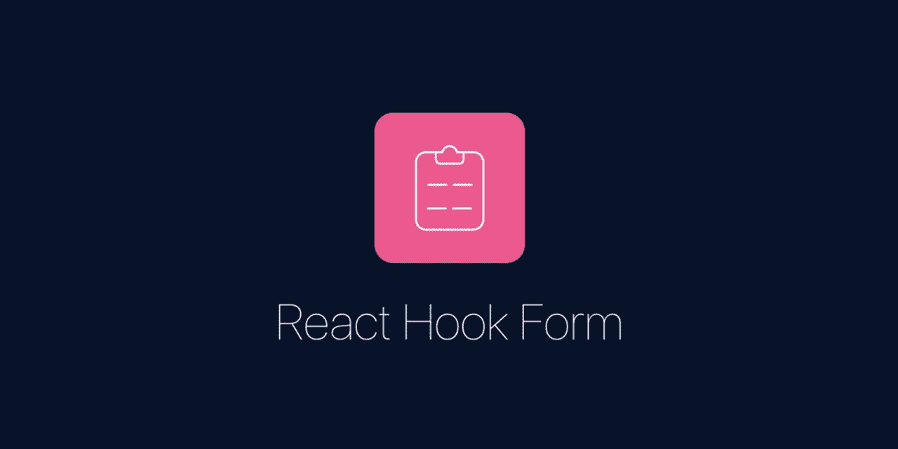

# react-hook-form 入门

> 原文：<https://javascript.plainenglish.io/getting-started-with-react-hook-form-1dcaa73a172c?source=collection_archive---------1----------------------->



## React-hook-form 是一个帮助我们在 React 中验证表单的库

# React 挂钩形式介绍

React-hook-form 是一个帮助我们在 React 中验证表单的库。React-hook-form 是一个很小的库，没有任何其他依赖。与其他验证库相比，它性能良好且易于使用，需要我们编写更少的代码行。如果你想了解更多关于 react-hook-form 的优点，你可以查看它的[网站](https://react-hook-form.com/)。

在本文结束时，我们将创建一个登录表单，如下所示:

在该项目中，我们将使用 react-hook-form 进行表单验证，并使用 bootstrap 添加一些样式。

在创建这个表单之前，我们需要熟悉 react-hooks-form 提供的 API。那么，我们开始吧。

我将用几行代码来解释这个 API。为此，我将创建 **Notes.js** 文件。你也可以看看上面 *src/Notes* 目录中 codesandbox 中的文件。

让我们看一下下面的代码，来理解这个 API:

我们慢慢来，理解代码，好吗？

让我们从第一步也是最重要的一步开始，即第 3 行的导入。

```
import { useForm } from "react-hook-form";
```

react-hook-form 库导出了`useForm`，帮助我们实现 react-hook-form。很清楚了，对吧？

现在，为了使用`useForm`，我们需要在组件内部编写以下代码行:

```
const { register, handleSubmit, errors } = useForm();
```

我们可以在 **Notes.js** 文件的第 7 行看到上面的代码。这一行代码表明`useForm`返回给我们`register`、`handleSubmit`和`errors`。还有其他的东西`useForm`也返回给我们，但是对于这篇文章，我们只讨论这三个。它们足以进行基本的验证。

现在，让我们看看第 24 行。代码如下所示:

```
<input name="name" type="text" ref={register} />
```

在代码中，我们添加了三个属性。一个属性是`type`，你显然知道`type`是做什么的。然后你可以看到`ref`收进了`register`。`register`帮助 react-hook-form 识别字段。记住，`name`属性是 react-hook-form 提交数据所必需的。我们稍后将讨论提交表单数据。

现在，让我们看看第 27 到 31 行。

```
<inputname="name2"type="text"ref={register({ minLength: 3, required: true })}/>
```

注意，在上面的代码中，我们向`register`添加了一个参数。`register`接受一个对象。这个对象有`minLength`和`required`选项。这些是 react-hook-form 提供的向字段添加验证的选项。下面列出了一些其他可用选项及其用途:

*   `minLength`:用于定义字段可以拥有的最小长度。
*   `maxLength`:用于定义字段可以拥有的最大长度。
*   `max`:用于定义该字段可以拥有的最大值。
*   `min`:用于定义该字段可以拥有的最小值。
*   `pattern`:它接受正则表达式，可用于使用正则表达式检查多个模式。
*   `required`:取布尔值来定义该字段是否为必填字段。

如果我们像上面一样使用`register`，我们将无法得到验证错误消息。我们需要错误消息来传达给我们的用户，对吗？为了得到错误信息，我们需要使用第 36 到 49 行中使用的`register`。让我们仔细看看它:

```
<inputname="name3"type="text"ref={register({required: {value: true,message: "name3 is required"},minLength: {value: 3,message: "name3 field should have min length of 3"}})}/>
```

你可以看到，选项(如`minLength`、`min` 等。)进行我们之前讨论过的验证，现在引入了`value`和`message`选项。`value`的用途顾名思义。然后，我们有了`message`选项。`message`是用户输入无效数据时我们提供的消息。

现在，我们来谈谈表格的提交。

正如您在第 21 行看到的，我们添加了一个`onSubmit`的事件监听器。当用户点击提交时，`handleSubmit(onSubmit)`被调用。react-hook-form 提供的`handleSubmit`为我们提供了表单数据。`handleSubmit`接收回调。在我们的例子中，我们使用`onSubmit`作为回调函数。

现在来说说第 14 行到第 17 行的`onSubmit`函数。这个函数看起来像这样:

```
const onSubmit = data => {console.log(data);*// do some stuff here with the data*};
```

正如我们已经讨论过的，`handleSubmit`为我们提供了表单数据。上面代码中的`data`参数是表单数据。你看得很清楚，对吧？

现在，我们来谈谈`errors`。在第 11 行，我们使用`console.log("ERROR", errors)`向控制台显示错误。记住`errors`是由`useForm()`提供的。

我想这足以让你熟悉 react-hook-form 的 API 了。我们现在将创建登录表单。

> 想了解更多关于 API 的知识吗？你可以查看这部分的[文档](https://react-hook-form.com/api)。

现在，让我们创建表单。

让我们在主工作目录中编写以下命令行:

```
npx create-react-app . 
```

之后，让我们安装一些我们需要的软件包。为此，让我们编写以下命令:

```
npm i bootstrap react-hook-form
```

我们需要 bootstrap 来添加一些样式，我们显然需要 react-hook-form 来进行表单验证。

现在，让我们打开 *src* 目录中的文件 **App.js** 。然后，编写下面几行代码:

在第 3 行，我们导入了 bootstrap 的 CSS 文件。在第 5 行，我们导入了`LoginForm`。然后，我们编写代码在第 12 行呈现`LoginForm`。

现在让我们来研究一下`LoginForm`。为此，在 *src* 目录中创建一个名为*组件*的文件夹。然后，在*组件*目录下创建一个名为 **LoginForm.js** 的文件，并编写以下代码行:

您可以看到我们已经创建了一个包含两个字段的表单，即`email`和`password`。我们已经使用 Bootstrap 为字段添加了样式。我们还使用了`register`并定义了我们的错误信息。

在我们的 email 字段中，我们编写了代码来指定 email 字段是必需的(从第 27 行到第 31 行)。我们还在第 30 行指定了该字段的验证错误消息。我们把检查输入的值是否是 email 的任务留给了我们的浏览器，而不是 react-hook-form，使用`type="email"`属性。我们可以通过使用前面讨论过的`pattern`选项为电子邮件添加一个验证检查。在`pattern`选项中，我们需要指定检查电子邮件的正则表达式模式。我把这个任务留给你来练习反应钩形，好吗？卡住了也不用担心。我会给你留下最终项目的链接，其中也将包含电子邮件验证的代码。

类似地，我们编写了代码来指定密码字段的最小长度为 8，最大长度为 15(从第 43 行到第 55 行)。我们还编写了代码来指定密码字段应该是必需的。我们还指定了各自验证错误的错误消息。

现在让我们来讨论显示验证错误消息。

现在，看一下第 18 行。我们在这里添加了`"container wasValidated”`作为`className`。你显然知道容器是做什么的。`wasValidated`类帮助我们利用 bootstrap 提供的验证样式。

现在，看一下第 24 行。在那里，我们检查电子邮件是否存在错误。如果电子邮件存在错误，我们将`is-invalid`作为`className`添加到该输入字段。当`is-invalid`被添加为`className`时，bootstrap 会在我们的输入字段中添加一个红色轮廓，并显示带有`className` : `invalid-feedback`的`div`的错误信息。记住这些都必须用`className` : `form-group`包在`div`内。在第 37 行，我们有一个以`invalid-feedback` 为`className`的`div`，它显示由`errors`对象提供的 email 字段的错误消息。你可以看到我们也在 59 和 64 为`password`字段做了类似的事情。

> 如果你没看懂`errors?.email`或`errors?.password`，那就是 ES2020。该代码检查`errors`是否存在。如果`errors`不存在，它返回`undefined`否则它返回该属性的值。这个特性被称为可选链接。

我们可以在第 7 行看到一个名为`onSubmit`的函数。当用户提交一个有效的表单时会调用这个函数。我们已经编写了代码，在函数内部向控制台显示表单数据。您显然知道使用这个函数可以很容易地将表单数据提交到后端。

这样，我们就成功地创建了验证表单。你可以通过这个[链接](https://codesandbox.io/s/react-hook-form-hp73o)在 codesandbox 看看最终的代码。

我推荐你查看 react-hook-form 的[文档](https://react-hook-form.com/get-started/)来深入了解。

## 简单英语的 JavaScript

喜欢这篇文章吗？如果有，通过 [**订阅获取更多类似内容解码，我们的 YouTube 频道**](https://www.youtube.com/channel/UCtipWUghju290NWcn8jhyAw) **！**