# React Native 和 Redux 入门

> 原文：<https://javascript.plainenglish.io/getting-started-with-react-native-and-redux-cc0205a30175?source=collection_archive---------4----------------------->

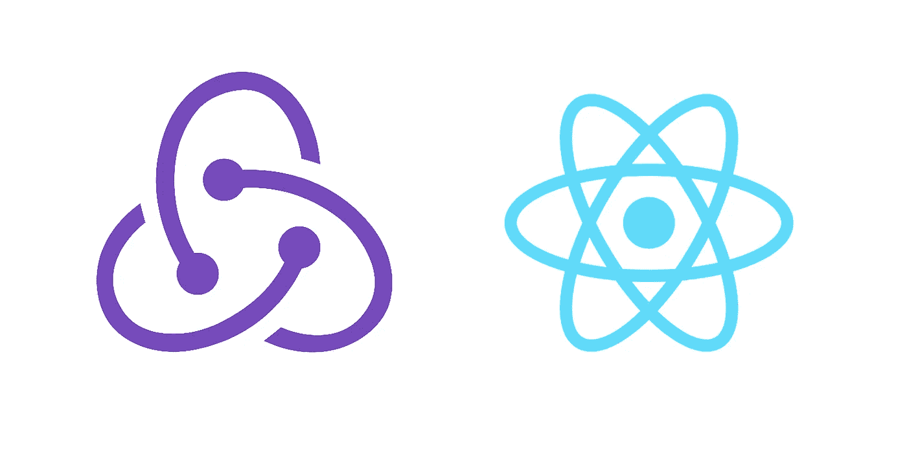

Redux 是一个流行的 React 和 React 本机状态管理库，旨在用于复杂的 React 和 React 本机应用程序，在这些应用程序中，在多级组件之间共享状态会变得非常难以管理。在本文中，我们将通过构建一个真正的 React 本机应用程序来学习如何使用 Redux 和 React 挂钩。

这是最终应用程序的样子

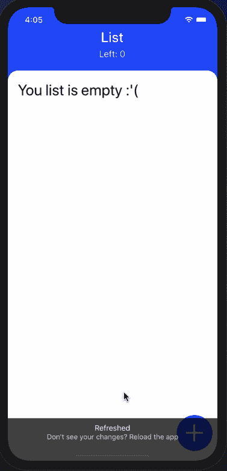

在本教程中，让我们来看看由`react-redux`库提供的一些挂钩，这些挂钩提供了一种在使用`connect()`高阶组件时避免编写样板代码的方法(如果您不熟悉 *connect()* ，不要担心，这不再那么重要了)。


## 1.创建新的 React 本机应用程序

```
expo init projectname
```

项目生成后，请在目录中导航并安装以下依赖项。

```
yarn add redux react-redux @react-navigation/native @react-navigation/stack
```

如果您使用 expo-cli，请运行以下命令来安装 navigator 工作所需的依赖项。

```
expo install react-native-gesture-handler react-native-reanimated react-native-screens react-native-safe-area-context @react-native-community/masked-view
```

如果您使用的是由`react-native-cli`生成的项目，建议您遵循此处[的说明](https://reactnavigation.org/docs/en/getting-started.html#installing-dependencies-into-a-bare-react-native-project)来安装所需的依赖项和本地操作系统平台的任何其他配置。

## 2.创建两个模拟屏幕

在设置好 stack navigator 之前，每个屏幕文件都会显示一些随机数据。

下面是`ListScreen.js`的代码片段:

```
import React from 'react'
import { StyleSheet, Text, View } from 'react-native'

function ListScreen() {
  return (
    <View style={styles.container}>
      <Text>List Screen</Text>
    </View>
  )
}

const styles = StyleSheet.create({
  container: {
    flex: 1,
    backgroundColor: '#fff',
    alignItems: 'center',
    justifyContent: 'center'
  }
})

export default ListScreen
```

下面是`ModalScreen.js`的代码片段:

```
import React from 'react'
import { StyleSheet, Text, View } from 'react-native'

function ModalScreen() {
  return (
    <View style={styles.container}>
      <Text>Modal Screen</Text>
    </View>
  )
}

const styles = StyleSheet.create({
  container: {
    flex: 1,
    backgroundColor: '#fff',
    alignItems: 'center',
    justifyContent: 'center'
  }
})

export default ModalScreen
```

## 3.设置堆栈导航器

随着最近发布的`react-navigation`版本 5，配置堆栈导航器的方式发生了变化。这些新变化的主要亮点是基于组件的配置。维护者团队在一篇博客文章[中列举的一些其他亮点是，导航模式现在更加基于组件，常见用例现在可以用预定义的钩子处理，新的架构允许您在组件本身内配置和更新屏幕。还有一些其他的变化。](https://reactnavigation.org/blog/)

```
import * as React from 'react'
import { NavigationContainer } from '@react-navigation/native'
import { createStackNavigator } from '@react-navigation/stack'

import ListScreen from '../screens/ListScreen'
import ModalScreen from '../screens/ModalScreen'
```

`NavigationContainer`是由管理导航树的`react-navigation`库提供的一个组件。它包含了`navigation`状态并包装了所有导航器的结构。

`createStackNavigator`是一个实现堆栈导航模式的函数。该函数返回两个 React 组件:`Screen`和`Navigator`，这将允许配置每个组件屏幕。

```
const Stack = createStackNavigator()

function MainStackNavigator() {
  return (
    <NavigationContainer>
      <Stack.Navigator>
        <Stack.Screen name='List' component={ListScreen} />
        <Stack.Screen name='Modal' component={ModalScreen} />
      </Stack.Navigator>
    </NavigationContainer>
  )
}

export default MainStackNavigator
```

打开`App.js`文件，导入 app 根目录下的`MainStackNavigator`，如下图所示:

```
import React from 'react'
import MainStackNavigator from './src/navigation/AppNavigator'

export default function App() {
  return <MainStackNavigator />
}
```

现在，进入终端窗口并执行命令`expo start`。在运行 Expo 客户端的模拟器或真实设备中，您将会注意到类似的结果，如下所示:

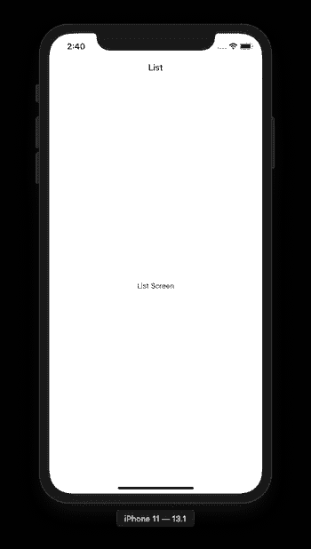

## 4.创建一个透明背景的叠加模型

`modal`可以很容易地配置一个堆栈导航器，在显示它的屏幕上覆盖一层透明背景。在当前的应用程序中，由于`ListScreen`将是第一个屏幕，并显示一个项目列表，因此`ModalScreen`将是一个对话框，通过单击`ListScreen`上的按钮出现。这个对话框打开后，会在它后面的屏幕上添加一个透明层。在此对话框下方可以看到上一个屏幕。

```
function MainStackNavigator() {
  return (
    <NavigationContainer>
      <Stack.Navigator
        mode='modal'
        headerMode='none'
        screenOptions={{
          cardStyle: { backgroundColor: 'transparent' },
          cardOverlayEnabled: true,
          cardStyleInterpolator: ({ current: { progress } }) => ({
            cardStyle: {
              opacity: progress.interpolate({
                inputRange: [0, 0.5, 0.9, 1],
                outputRange: [0, 0.25, 0.7, 1]
              })
            },
            overlayStyle: {
              opacity: progress.interpolate({
                inputRange: [0, 1],
                outputRange: [0, 0.5],
                extrapolate: 'clamp'
              })
            }
          })
        }}>
        <Stack.Screen name='List' component={ListScreen} />
        <Stack.Screen name='Modal' component={ModalScreen} />
      </Stack.Navigator>
    </NavigationContainer>
  )
}
```

从现在起什么都不会发生。您仍然需要配置两个屏幕的样式，并添加一个从`ListScreen`打开模态对话框的方法。

## 5.导航到模式屏幕

该按钮将是可触摸的，单次触摸将导航至`ModalScreen`。导航将由可以作为参数传递给功能组件`ListScreen`的`navigation`属性来处理。这是可能的，因为`ListScreen`是堆栈导航器的一部分。

```
import React from 'react'
import {
  StyleSheet,
  StatusBar,
  Text,
  View,
  TouchableOpacity
} from 'react-native'
import { Ionicons } from '@expo/vector-icons'

function ListScreen({ navigation }) {
  return (
    <View style={styles.container}>
      <View style={styles.fabContainer}>
        <TouchableOpacity
          onPress={() => navigation.navigate('Modal')}
          style={styles.fabButton}>
          <Ionicons name='ios-add' color='#fff' size={70} />
        </TouchableOpacity>
      </View>
    </View>
  )
}

const styles = StyleSheet.create({
  container: {
    flex: 1,
    backgroundColor: 'blue'
  },
  fabContainer: {
    justifyContent: 'flex-end',
    flexDirection: 'row',
    position: 'absolute',
    right: 10,
    bottom: 20
  },
  fabButton: {
    backgroundColor: 'blue',
    borderRadius: 35,
    width: 70,
    height: 70,
    alignItems: 'center',
    justifyContent: 'center'
  }
})

export default ListScreen
```

回到模拟器设备，你会注意到变化。首先要注意的是右下角浮动的动作按钮。

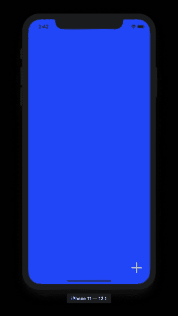

按下此按钮将打开一个全模式屏幕。

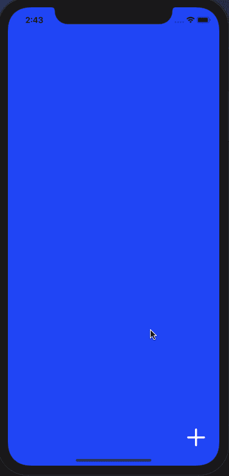

## 6.添加带有透明背景的自定义模式

这个模式将来会有一个输入字段，让用户向列表中添加条目。然而，现在，它将显示一个文本和一个关闭按钮。

```
import React from 'react'
import { StyleSheet, TouchableOpacity, Text, View } from 'react-native'
import { Ionicons } from '@expo/vector-icons'

function ModalScreen({ navigation }) {
  return (
    <View style={styles.container}>
      <View style={styles.innerContainer}>
        <View style={styles.closeButtonContainer}>
          <TouchableOpacity
            style={styles.closeButton}
            onPress={() => navigation.goBack()}>
            <Ionicons name='ios-close' color='#101010' size={40} />
          </TouchableOpacity>
        </View>
        <View style={styles.modalContainer}>
          <Text style={{ color: '#444', fontSize: 20 }}>
            What do you want to do?
          </Text>
        </View>
      </View>
    </View>
  )
}

const styles = StyleSheet.create({
  container: {
    flex: 1
  },
  innerContainer: {
    borderTopLeftRadius: 10,
    borderTopRightRadius: 10,
    justifyContent: 'flex-end',
    flexDirection: 'row',
    height: '30%',
    width: '100%',
    position: 'absolute',
    bottom: 0,
    right: 0,
    backgroundColor: '#fff'
  },
  closeButtonContainer: {
    position: 'absolute',
    alignItems: 'flex-end',
    right: 10
  },
  closeButton: {
    backgroundColor: '#d3d3d3',
    borderRadius: 20,
    width: 40,
    height: 40,
    top: 10,
    alignItems: 'center',
    justifyContent: 'center'
  },
  modalContainer: {
    justifyContent: 'center',
    alignItems: 'center',
    position: 'absolute',
    margin: 60,
    top: 10,
    left: 50
  }
})

export default ModalScreen
```

完成此步骤后，您将在设备中获得以下输出:

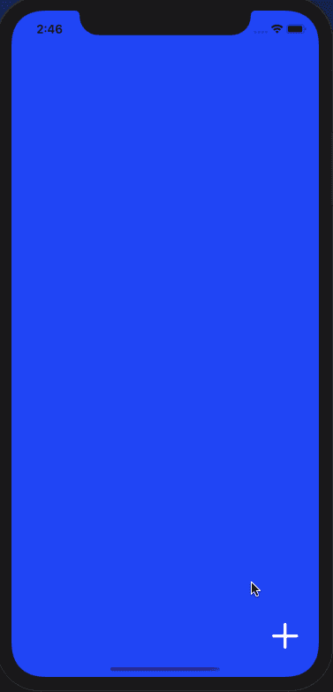

## 7.在自定义模式屏幕中添加文本输入

在本节中，让我们从`react-native`核心添加一个文本输入组件。这将允许用户输入他们想要添加到列表中的项目的名称。现在，因为我们还没有配置 Redux 来管理应用程序状态，所以让我们使用钩子`useState`来本地管理组件状态。

打开`ModalScreen.js`，从`react-native`内核导入`TextInput`。

```
import {
  StyleSheet,
  TouchableOpacity,
  Text,
  View,
  TextInput
} from 'react-native'
```

接下来，在样式为`modalContainer`的`View`中添加下面的`TextInput`组件以及一个可触摸的提交按钮。当用户在输入字段中输入一个值时，这个可触摸按钮将导航回列表屏幕。

```
<View style={styles.modalContainer}>
  <Text style={{ color: '#444', fontSize: 20 }}>What do you want to do?</Text>
  <TextInput
    style={{
      height: 50,
      width: 200,
      padding: 5,
      borderColor: 'gray',
      borderBottomWidth: 1
    }}
    numberOfLines={1}
    onChangeText={value => setValue(value)}
    value={value}
    clearButtonMode='while-editing'
  />
  <TouchableOpacity
    style={{
      marginTop: 10,
      backgroundColor: 'blue',
      width: 50,
      height: 50,
      alignItems: 'center',
      justifyContent: 'center',
      borderRadius: 5
    }}
    onPress={() => navigation.navigate('List')}>
    <Ionicons name='ios-arrow-dropright-circle' size={40} color='#fff' />
  </TouchableOpacity>
</View
```

## 8.向列表屏幕添加自定义标题

在目录`src/components`中创建一个名为`Header.js`的新文件。该功能组件将在列表屏幕中显示标题。

将以下代码片段添加到刚刚创建的文件中:

```
import React from 'react'
import { View, Text, StyleSheet } from 'react-native'

function Header(props) {
  const { title } = props
  return (
    <View style={styles.container}>
      <Text style={styles.text}>{title}</Text>
    </View>
  )
}

const styles = StyleSheet.create({
  container: {
    alignItems: 'center',
    justifyContent: 'center',
    backgroundColor: 'blue',
    height: 125,
    paddingTop: 20
  },
  text: {
    color: '#fff',
    fontSize: 28,
    fontWeight: '500'
  }
})

export default Header
```

接下来，转到`ListScreen.js`并在其他语句下导入这个功能组件。

```
// after other import statements import Header from '../components/Header'
```

然后，在浮动按钮之前添加要呈现的组件。

```
function ListScreen({ navigation }) {
  return (
    <View style={styles.container}>
      <Header title={'List'} />
      {/* rest of the code remains same */}
    </View>
  )
}
```

在模拟器中，您将看到如下所示的标题:

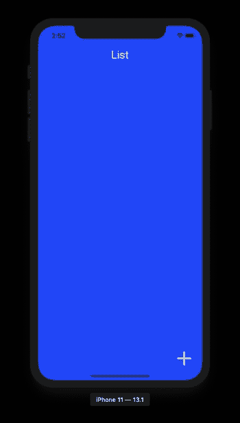

状态栏和页眉背景不搭，对吧？

## 9.更改状态栏外观

为了改变状态栏的外观，让我们从`react-native`核心 API 导入它。

```
import {
  StyleSheet,
  StatusBar,
  Text,
  View,
  TouchableOpacity
} from 'react-native'
```

接下来，使用带尖括号的 React 片段缩写，修改`ListScreen`组件的返回语句，如下所示:

```
function ListScreen({ navigation }) {
  return (
    <>
      <StatusBar barStyle='light-content' />
      <View style={styles.container}>
        <Header title={'List'} />
        <View style={styles.fabContainer}>
          <TouchableOpacity
            onPress={() => navigation.navigate('Modal')}
            style={styles.fabButton}>
            <Ionicons name='ios-add' color='#fff' size={70} />
          </TouchableOpacity>
        </View>
      </View>
    </>
  )
}
```

你现在会注意到状态栏有一个白色的外观。

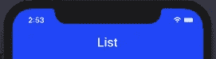

## 10.添加列表视图

在这一节中，让我们实现将显示一个项目列表的主视图。在`ListScreen.js`中，添加以下名为`ListView`的功能组件。

```
function ListView() {
  return (
    <View
      style={{
        backgroundColor: 'white',
        flex: 1,
        borderTopLeftRadius: 20,
        borderTopRightRadius: 20,
        paddingHorizontal: 20,
        paddingVertical: 20
      }}>
      <Text>Here goes list items</Text>
    </View>
  )
}
```

然后，修改`ListScreen`使其显示在`Header`下方。

```
<View style={styles.container}>
  <Header title={'List'} />
  <ListView />
  {/* rest of the code remains same */}
</View>
```

转到运行该应用程序的设备，您会注意到它的外观有了很大的不同。


## 11.创建根缩减器

创建一个名为`src/redux/`的新目录，并在其中创建一个名为`reducer.js`的新文件。该文件将包含动作类型的定义、动作创建者以及我们将在该应用程序中创建的唯一缩减器。这个减速器将被称为`rootReducer`。

当使用 Redux 管理整个应用程序的状态时，状态本身由一个 JavaScript 对象表示。把这个对象看作是只读的(不可变的)，因为你不能直接改变这个状态或对象(以树的形式表示)。这需要采取行动。

动作类似于 Redux 中的事件。它们可以在按键、定时器或网络请求中触发。

首先定义一个动作类型，如下所示。

```
export const addItem = item => ({
  type: ADD_ITEM,
  payload: item
})
```

定义一个初始状态，它将有一个名为`itemList`的空数组。每当一个动作被触发时，应用程序的状态就会改变。应用程序状态的处理由 reducers 完成。

这个初始状态将作为参数传递给`rootReducer`。调用 *create* 动作将调用为 reducer 中相同动作类型定义的逻辑。

```
const initialState = {
  itemList: []
}

const rootReducer = (state = initialState, action) => {
  switch (action.type) {
    case ADD_ITEM:
      return {
        ...state,
        itemList: state.itemList.concat({
          id: Math.random(),
          name: action.payload
        })
      }

    default:
      return state
  }
}

export default rootReducer
```

## 12.配置商店

创建一个新文件`src/redux/store.js`。存储是一个将动作和减少器集合在一起的对象。这个文件将实现这一点。

存储提供并保存应用程序级别的状态，而不是单个组件。向其中添加以下代码片段:

```
import { createStore } from 'redux'
import rootReducer from './reducer'

const store = createStore(rootReducer)

export default store
```

现在，要将该商店连接到应用程序，请打开`App.js`文件并从该文件导入`store`，以及从`react-redux` npm 包导入高阶组件`Provider`。这有助于你将商店传递给当前应用程序的其余组件。

```
import React from 'react'
import { Provider as StateProvider } from 'react-redux'
import store from './src/redux/store'
import MainStackNavigator from './src/navigation/AppNavigator'

export default function App() {
  return (
    <StateProvider store={store}>
      <MainStackNavigator />
    </StateProvider>
  )
}
```

## 13.用户选择器挂钩

钩子和参数之间的主要区别(旧的方法)是钩子可以返回任何值作为结果，而不仅仅是一个对象。

```
import { useSelector } from 'react-redux'
```

然后，使用`ListView`组件内的钩子`useSelector`获取`listItems`数组。此外，如果列表为空或不为空，则通过显示一条消息来修改它的 return 语句。

```
function ListView() {
  const listItems = useSelector(state => state.itemList)

  return (
    <View
      style={{
        backgroundColor: 'white',
        flex: 1,
        borderTopLeftRadius: 20,
        borderTopRightRadius: 20,
        paddingHorizontal: 20,
        paddingVertical: 20
      }}>
      {listItems.length !== 0 ? (
        <Text>Contains List items</Text>
      ) : (
        <Text style={{ fontSize: 30 }}>You list is empty :'(</Text>
      )}
    </View>
  )
}
```

下面是您将得到的输出:

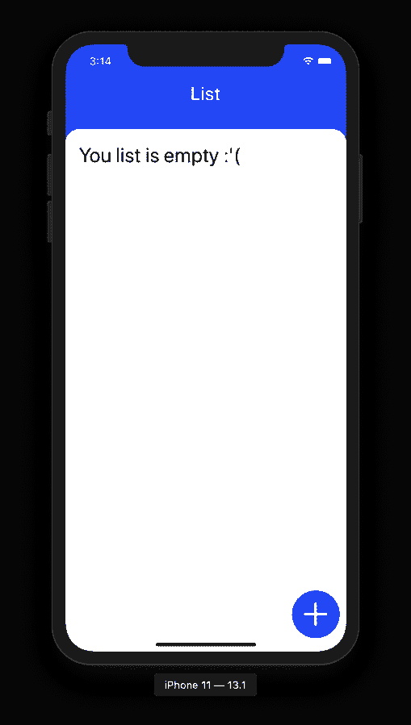

## 14.通过分派动作创建者向列表添加项目

`useDispatch()`钩子完全引用了 Redux 存储中的调度函数。这个钩子只在需要分派一个动作的时候使用。在`ModalScreen.js`中，要根据`TextInput`的值添加一个项目，必须更新状态。这可以通过触发在`redux/reducer.js`文件中创建动作时定义的名为`addItem`的动作创建器方法来实现。

首先导入以下语句:

```
import { useDispatch } from 'react-redux' 
import { addItem } from '../redux/reducer'
```

接下来，在`ModalScreen`组件中，创建一个名为`onSaveNote`的助手方法，当提交文本输入时，它将触发动作创建器，并将用户带回列表屏幕。

```
const [value, setValue] = useState('')

const dispatch = useDispatch()

const onSaveNote = value => {
  dispatch(addItem(value))
  navigation.navigate('List')
}
```

最后，在提交按钮上添加这个帮助器方法作为`onPress`的值。

```
<TouchableOpacity
  style={{
    marginTop: 10,
    backgroundColor: 'blue',
    width: 50,
    height: 50,
    alignItems: 'center',
    justifyContent: 'center',
    borderRadius: 5
  }}
  onPress={() => onSaveNote(value)}>
  <Ionicons name='ios-arrow-dropright-circle' size={40} color='#fff' />
</TouchableOpacity>
```

## 15.添加平面列表以显示列表中的项目

要在列表屏幕上显示项目列表，打开文件`ListScreen.js`并从`react-native`导入`FlatList`。

```
import {
  StyleSheet,
  StatusBar,
  Text,
  View,
  TouchableOpacity,
  FlatList
} from 'react-native'
```

然后，修改`ListView`渲染函数如下:

```
{
  listItems.length !== 0 ? (
    <FlatList
      data={listItems}
      keyExtractor={item => item.id.toString()}
      renderItem={({ item }) => (
        <View style={styles.listItemContainer}>
          <View style={styles.listItemMetaContainer}>
            <Text style={styles.itemTitle} numberOfLines={1}>
              {item.name}
            </Text>
          </View>
        </View>
      )}
    />
  ) : (
    <Text style={{ fontSize: 30 }}>You list is empty :'(</Text>
  )
}
```

## 16.更新标题

在这一部分，使用当前应用程序的状态，让我们显示列表中要在标题中显示的项目数。这可以通过使用`react-redux`的`useSelector`钩来完成。

将文件`components/Header.js`修改如下:

```
import React from 'react'
import { View, Text, StyleSheet } from 'react-native'
import { useSelector } from 'react-redux'

function Header(props) {
  const { title } = props
  const listItems = useSelector(state => state.itemList)

  return (
    <View style={styles.container}>
      <Text style={styles.title}>{title}</Text>
      <Text style={styles.subTitle}>Left: {listItems.length}</Text>
    </View>
  )
}

const styles = StyleSheet.create({
  container: {
    alignItems: 'center',
    justifyContent: 'center',
    backgroundColor: 'blue',
    height: 125,
    paddingTop: 20
  },
  title: {
    color: '#fff',
    fontSize: 28,
    fontWeight: '500'
  },
  subTitle: {
    paddingTop: 5,
    fontSize: 18,
    color: '#fff'
  }
})

export default Header
```

这是列表中有一个项目时更新的标题栏。

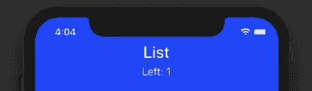

## 17.移除项目

由于我们已经了解了 redux 挂钩如何与 React 原生应用程序一起工作，请尝试添加一个 remove item 按钮，该按钮将从列表中删除一个项目，如下所示。

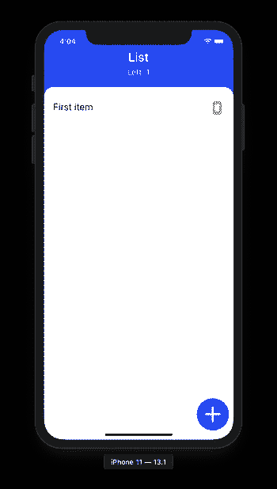

如果你需要任何帮助，你可以回到下面的源代码。

```
export const ADD_ITEM = 'ADD_ITEM'
export const REMOVE_ITEM = 'REMOVE_ITEM'

export const addItem = item => ({
  type: ADD_ITEM,
  payload: item
})

export const removeItem = id => ({
  type: REMOVE_ITEM,
  payload: id
})

const initialState = {
  itemList: []
}

const rootReducer = (state = initialState, action) => {
  switch (action.type) {
    case ADD_ITEM:
      return {
        ...state,
        itemList: state.itemList.concat({
          id: Math.random(),
          name: action.payload
        })
      }
    case REMOVE_ITEM:
      return {
        ...state,
        itemList: state.itemList.filter(item => item.id !== action.payload)
      }

    default:
      return state
  }
}

export default rootReducer
```

此外，这里是更新的`ListScreen.js`，您可以添加按钮来删除相应样式的项目。

要触发一个动作，您必须使用`useDispatch()`钩子。

```
import React from 'react'
import {
  StyleSheet,
  StatusBar,
  Text,
  View,
  TouchableOpacity,
  FlatList
} from 'react-native'
import { Ionicons } from '@expo/vector-icons'
import { useSelector, useDispatch } from 'react-redux'
import { removeItem } from '../redux/reducer'

import Header from '../components/Header'

function ListView() {
  const listItems = useSelector(state => state.itemList)
  console.log({ listItems })

  const dispatch = useDispatch()

  return (
    <View
      style={{
        backgroundColor: 'white',
        flex: 1,
        borderTopLeftRadius: 20,
        borderTopRightRadius: 20,
        paddingHorizontal: 20,
        paddingVertical: 20
      }}>
      {listItems.length !== 0 ? (
        <FlatList
          data={listItems}
          keyExtractor={item => item.id.toString()}
          renderItem={({ item }) => (
            <View style={styles.listItemContainer}>
              <Text style={styles.itemTitle} numberOfLines={1}>
                {item.name}
              </Text>
              <TouchableOpacity
                onPress={() => dispatch(removeItem(item.id))}
                style={styles.button}>
                <Ionicons name='ios-trash' color='#fff' size={20} />
              </TouchableOpacity>
            </View>
          )}
        />
      ) : (
        <Text style={{ fontSize: 30 }}>You list is empty :'(</Text>
      )}
    </View>
  )
}

function ListScreen({ navigation }) {
  return (
    <>
      <StatusBar barStyle='light-content' />
      <View style={styles.container}>
        <Header title={'List'} />
        <ListView />
        <View style={styles.fabContainer}>
          <TouchableOpacity
            onPress={() => navigation.navigate('Modal')}
            style={styles.fabButton}>
            <Ionicons name='ios-add' color='#fff' size={70} />
          </TouchableOpacity>
        </View>
      </View>
    </>
  )
}

const styles = StyleSheet.create({
  container: {
    flex: 1,
    backgroundColor: 'blue'
  },
  fabContainer: {
    justifyContent: 'flex-end',
    flexDirection: 'row',
    position: 'absolute',
    right: 10,
    bottom: 20
  },
  fabButton: {
    backgroundColor: 'blue',
    borderRadius: 35,
    width: 70,
    height: 70,

    alignItems: 'center',
    justifyContent: 'center'
  },
  listItemContainer: {
    flex: 1,
    flexDirection: 'row',
    paddingTop: 10,
    paddingBottom: 5,
    paddingRight: 5,
    justifyContent: 'space-between',
    width: '100%',
    borderBottomWidth: 0.25
  },
  itemTitle: {
    fontSize: 22,
    fontWeight: '400'
  },
  button: {
    borderRadius: 8,
    backgroundColor: '#ff333390',
    padding: 5
  }
})

export default ListScreen
```

这是演示应用程序的最终输出:


## 结论

关于 Redux 钩子的高级用法，可以在这里 查阅官方文档 [**。**](https://react-redux.js.org/next/api/hooks)

希望你现在已经掌握了如何使用钩子在 react 原生应用中使用 Redux，并且对 React 导航的基础有了更好的理解。如果你喜欢这个 React Native 教程，请与你的朋友分享。编码快乐！

# 后续步骤

既然您已经学习了在 React Native 中使用 Redux，下面是一些您可以研究的其他主题

*   Firebase — [推送通知](https://www.instamobile.io/react-native-tutorials/push-notifications-react-native-firebase/) | [Firebase 存储](https://www.instamobile.io/mobile-development/react-native-firebase-storage/)
*   如何 in React Native—[WebView](https://enappd.com/blog/react-native-life-cycle-hooks/79)|[渐变](https://www.instamobile.io/mobile-development/gradients-react-native/) | [相机](https://www.instamobile.io/react-native-tutorials/capturing-photos-and-videos-with-the-camera-in-react-native/) | [添加 GIF](https://www.instamobile.io/mobile-development/giphy-react-native/) | [谷歌地图](https://www.instamobile.io/react-native-tutorials/react-native-maps/) | [Redux](https://www.instamobile.io/mobile-development/react-native-redux/) | [调试](https://www.instamobile.io/react-native-tutorials/react-native-breakpoints-debugging/) | [钩子](https://www.instamobile.io/mobile-development/react-native-hooks/) | [黑暗模式](https://www.instamobile.io/mobile-development/react-native-dark-mode/) | [深度链接](https://www.instamobile.io/react-native-tutorials/deep-linking-react-native/) | [GraphQL](https://www.instamobile.io/react-native-tutorials/react-native-graphql-apollo-client/) | [异步存储【T22](https://www.instamobile.io/react-native-tutorials/asyncstorage-example-react-native/)
*   支付— [Apple Pay](https://www.instamobile.io/react-native-controls/apple-pay-integrate-android-pay-react-native/) | [条纹](https://www.instamobile.io/react-native-tutorials/accept-payments-android-ios-apps-react-native-checkout/)
*   认证— [谷歌登录](https://www.instamobile.io/mobile-development/google-login-react-native-firebase/) | [脸书登录](https://www.instamobile.io/react-native-tutorials/facebook-login-react-native-firebase/) | [手机认证](https://www.instamobile.io/mobile-development/firebase-phone-authentication-react-native/) |
*   最佳资源— [应用创意](https://www.instamobile.io/react-native-tutorials/react-native-app-ideas-beginners/) | [播客](https://www.instamobile.io/mobile-development/react-native-podcasts/) | [时事通讯](https://www.instamobile.io/react-native-tutorials/best-react-native-newsletters/) | [应用模板](https://www.instamobile.io/react-native-tutorials/best-free-react-native-app-templates-2018/)

如果你需要一个基础来开始你的下一个 React 原生应用，你可以使用许多 [React 原生模板](https://www.instamobile.io/templates/)来制作你的下一个令人敬畏的应用。

*原载于 2020 年 2 月 24 日*[*https://www . insta mobile . io*](https://www.instamobile.io/mobile-development/react-native-redux/)*。*