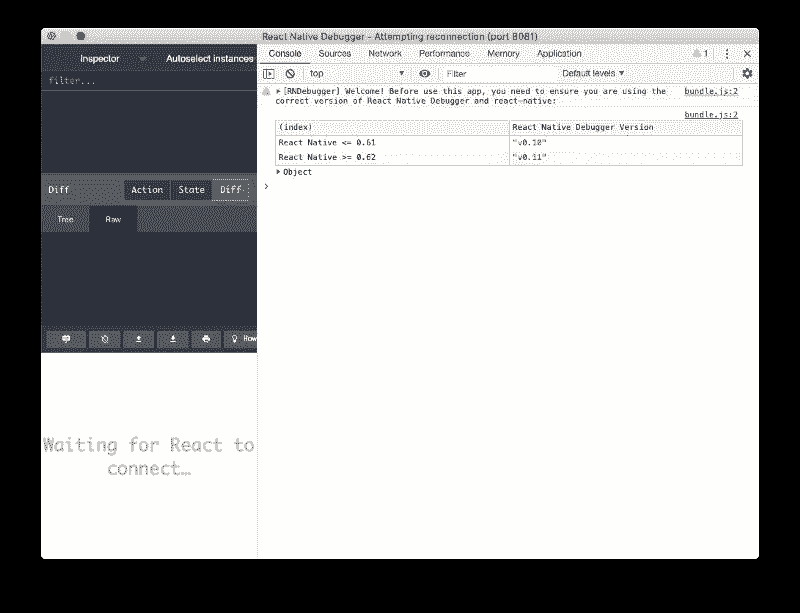
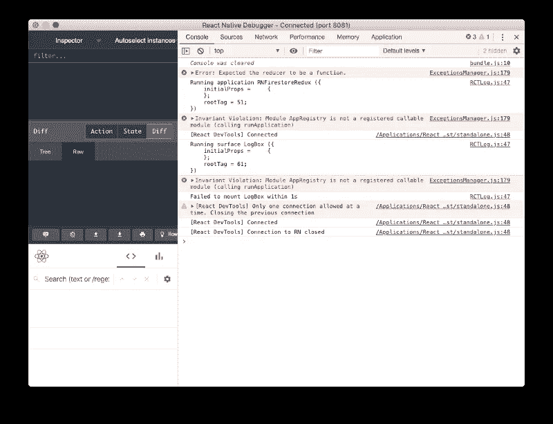
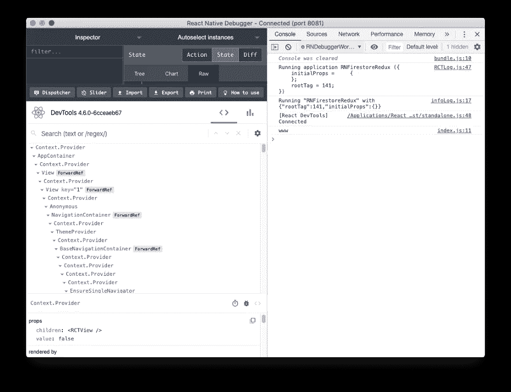
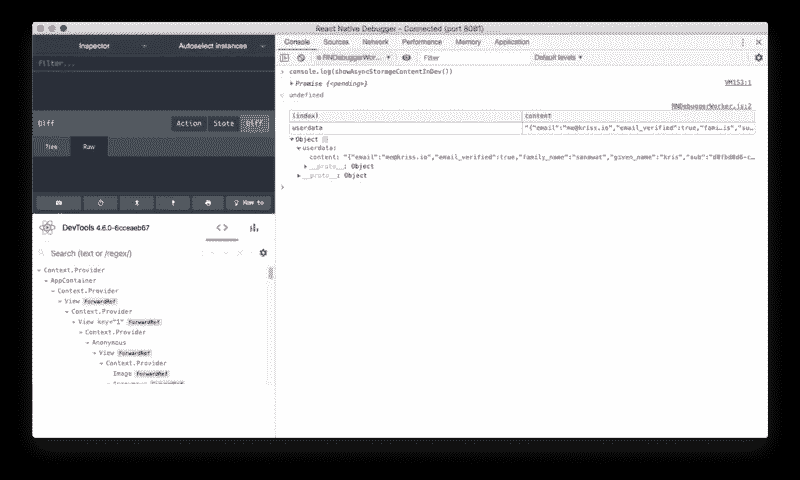
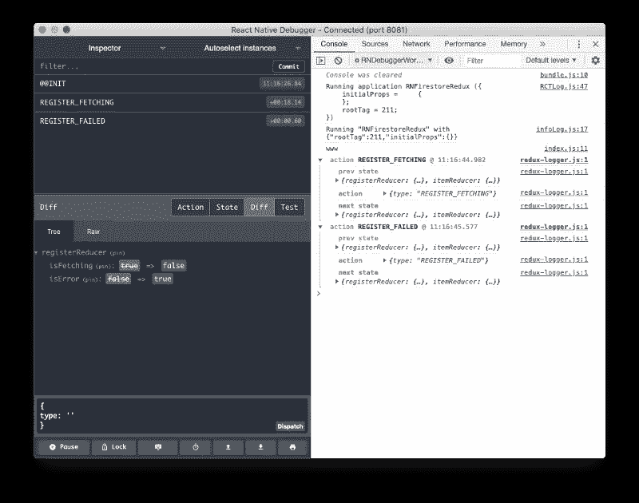

# React 本机调试器入门

> 原文：<https://javascript.plainenglish.io/getting-started-with-react-native-debugger-32f7f4fbeacc?source=collection_archive---------2----------------------->


Photo by [Timothy Dykes](https://unsplash.com/@timothycdykes?utm_source=medium&utm_medium=referral) on [Unsplash](https://unsplash.com?utm_source=medium&utm_medium=referral)

React 本机调试器是一个强大的工具，可以帮助开发人员更快地调试 React 本机应用程序。它提供了一套令人印象深刻的功能，如 UI 检查器，redux 检查器，断点和网络检查器。在本文中，我们将学习如何安装和使用 React 本机调试器，这将大大提高您的开发效率。

通俗地说，调试器就是用来调试的工具。如果您是任何编程背景的开发人员，那么您在生活中肯定已经遇到过调试器。React Native Debugger 是一个使用电子框架构建的独立调试器工具。您可以轻松地将这个调试器工具与 Chrome Dev 工具集成在一起。这个调试器工具基于 React Native 开箱即用中包含的远程调试器。然而，React 本机调试器比远程调试器包含了更多的功能。

## 安装 React 本机调试器

安装过程非常简单。我们可以简单地从[发布页面](https://github.com/jhen0409/react-native-debugger/releases)下载最新的安装文件。对于 macOS，我们可以使用家酿木桶安装。我们可以在终端中运行以下命令:

```
$ brew update && brew cask install react-native-debugger
```

安装后，只需打开`Applications`文件夹中的 **React Native Debugger.app** 文件(或使用 Spotlight search 找到它)。

## 使用 React 本机调试器

成功安装后，我们只需打开 React 本机调试器启动文件。因此，我们将在调试器应用程序窗口的标题栏上看到重新连接状态。调试过程将在端口 8081 上执行，如下图所示:



现在，当我们在调试模式下运行 React Native 应用程序时，我们不再需要打开浏览器。要让 React 本机应用程序进入调试模式，只需摇动设备，然后在弹出的菜单中选择“调试”。如果您在模拟器上，只需按下 *Command + Shift + Z* 即可打开菜单。

一旦应用程序处于调试模式，React 本机调试器已经打开，您会注意到应用程序连接到 React 本机调试器，而不是 Chrome 开发工具。所有控制台日志和调试选项都将出现在调试器应用程序中，如下图所示:



现在，我们已经了解了安装和使用案例，可以开始使用这个调试器应用程序了。

## Chrome 开发工具，React 开发工具，Redux 开发工具

正如你所注意到的，所有这些重要的调试扩展都在一个窗口下。一个好处是应用程序窗口大小不需要全屏。因此，我们可以将调试器与仿真器一起使用，如下图所示:



## 网络检查器

当开发一个需要连接到服务器的应用程序时，一般来说，我们可能不知道幕后发生了什么。例如，当我们向服务器发送请求时，如果发生错误，可能很难跟踪。开发人员通常通过打印或警告错误消息来调试，但这非常耗时(尽管大多数人都这样做)，因为需要多次迭代才能正确理解整个状态。

因此，在 React Native Debugger 的帮助下，我们可以很容易地监控应用程序和服务器之间的每个入站和出站流量请求。

*   我们可以在一个窗口内监控反应组件、Redux 存储以及网络活动。
*   我们可以随时修改 CORS。
*   我们可以修改请求头配置，例如名称、来源和用户代理。它使我们能够控制网络请求中的所有内容。

## 异步存储管理

我们也可以使用反应本机调试器调试`AsyncStorage`配置。我们可以使用下面代码片段中的行将它记录到控制台:

```
console.log(showAsyncStorageContentInDev())
```

将该行添加到项目后，您将在“反应本机调试器”控制台窗口中获得以下结果:



## 调试 Redux 状态和操作

正如官方的 React Native Debugger 文档中所提到的，该工具已经有了一个功能强大的内置 Redux Dev 工具。然而，除非我们在应用程序中明确激活 **redux devtools** ，否则 redux devtools 将无法正常工作。为了在 react-native-debugger 中使用 redux devtools，我们需要在我们的应用程序中激活 redux，方法是在我们的 **App.js** 文件或我们的 redux 主函数中添加一些配置行，如下面的代码片段所示:

```
const composeEnhancers = window.__REDUX_DEVTOOLS_EXTENSION_COMPOSE__ || compose;const store = createStore(reducers, /* preloadedState, */ composeEnhancers(middlewares));
```

现在，如果我们重新加载 RN 调试器工具并运行一些操作，我们将在调试器控制台中获得以下结果:



正如您所看到的，React Native Debugger 公开了整个 redux 状态，所以您不需要添加断点或控制台日志来了解数据在 Redux 生态系统中是如何流动的。一个惊人的特性是，您实际上可以直接从调试器回到过去，来撤销 Redux 操作并重新运行它们。另一个巨大的特点是，您可以可视化两个状态转换之间的精确差异，这对具有复杂 Redux 状态的应用程序非常有用。

## 反应本机调试器中的用户界面检查器

反应本机调试器工具还提供了强大的用户界面检查器。我们可以用它来检查应用程序的用户界面布局，这将极大地帮助我们理解应用程序的用户界面结构。我们可以通过检查布局来修正用户界面元素的风格。


到目前为止，这是检查 React Native 应用程序中的 UI 层次结构和调试布局问题的最有效方法。

## 反应本机调试器中的断点

React Native Debugger 还使我们能够在某个点停止执行任务。这将使开发人员能够了解应用程序的行为，或在应用程序生命周期的任何时间点查看一些数据状态。你可以在我们的[调试带断点的 React 本地应用](https://www.instamobile.io/react-native-tutorials/react-native-breakpoints-debugging/)文章中了解更多关于添加和使用断点的细节。


## 调试 Expo 应用

如果您选择使用 Expo CLI 而不是 React Native CLI 进行应用程序开发，好消息是 React Native 调试器在 Expo 上也能很好地工作。

通常，Expo 调试器运行在端口 19001 上。要切换到 React 本机调试器以获得支持，您需要运行以下命令:

```
open "rndebugger://set-debugger-loc?host=localhost&port=19001"
```

## 结论

在这篇文章中，我们发现了 React 本机调试器工具、其安装过程、工作原理、用例以及核心特性。毫无疑问，它将使任何 React 本地开发人员的生活变得更加容易、更加高效。你的应用程序也将更有性能，包含更少的错误。

我们强烈建议使用 React 原生调试器，而不是 Chrome 开发工具，因为它包含一组核心功能，将极大地提高您的开发速度。

## 后续步骤

现在您已经了解了 React 本机调试器工具，接下来您可以研究一些其他主题:

*   Firebase — [推送通知](https://www.instamobile.io/react-native-tutorials/push-notifications-react-native-firebase/) | [Firebase 存储](https://www.instamobile.io/mobile-development/react-native-firebase-storage/)
*   如何 in React Native — [被瞪](https://www.instamobile.io/react-native-tutorials/build-react-native-app/) | [WebView](https://enappd.com/blog/react-native-life-cycle-hooks/79) | [渐变](https://www.instamobile.io/mobile-development/gradients-react-native/) | [相机](https://www.instamobile.io/react-native-tutorials/capturing-photos-and-videos-with-the-camera-in-react-native/) | [添加 GIF](https://www.instamobile.io/mobile-development/giphy-react-native/) | [谷歌地图](https://www.instamobile.io/react-native-tutorials/react-native-maps/) | [Redux](https://www.instamobile.io/mobile-development/react-native-redux/) | [调试](https://www.instamobile.io/react-native-tutorials/react-native-breakpoints-debugging/) | [钩子](https://www.instamobile.io/mobile-development/react-native-hooks/) | [黑暗模式](https://www.instamobile.io/mobile-development/react-native-dark-mode/) | [深度链接](https://www.instamobile.io/react-native-tutorials/deep-linking-react-native/) | [GraphQL 【T23](https://www.instamobile.io/react-native-tutorials/react-native-graphql-apollo-client/)
*   支付— [Apple Pay](https://www.instamobile.io/react-native-controls/apple-pay-integrate-android-pay-react-native/) | [条纹](https://www.instamobile.io/react-native-tutorials/accept-payments-android-ios-apps-react-native-checkout/)
*   认证— [谷歌登录](https://www.instamobile.io/mobile-development/google-login-react-native-firebase/) | [脸书登录](https://www.instamobile.io/react-native-tutorials/facebook-login-react-native-firebase/) | [手机认证](https://www.instamobile.io/mobile-development/firebase-phone-authentication-react-native/) |
*   最佳资源— [应用创意](https://www.instamobile.io/react-native-tutorials/react-native-app-ideas-beginners/) | [播客](https://www.instamobile.io/mobile-development/react-native-podcasts/) | [时事通讯](https://www.instamobile.io/react-native-tutorials/best-react-native-newsletters/) | [应用模板](https://www.instamobile.io/react-native-tutorials/best-free-react-native-app-templates-2018/) | [工具](https://www.instamobile.io/react-native-tutorials/react-native-development-tools/)

如果你需要一个基础来开始你的下一个 React 原生应用，你可以通过利用我们的 [React 原生主题](https://www.instamobile.io)之一来节省几个月的开发时间。干杯！

*原载于 2020 年 7 月 30 日*[*https://www . insta mobile . io*](https://www.instamobile.io/mobile-tools/react-native-debugger/)*。*