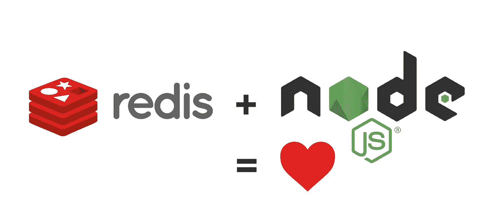

# Node.js & Redis。高性能缓存

> 原文：<https://javascript.plainenglish.io/getting-started-with-redis-and-how-to-use-it-in-node-js-8d4f1a3f7369?source=collection_archive---------3----------------------->



Performance & simplicity in two technologies. It’s a match!

我不想在这里长篇大论。
让我们从解释&在你的机器上安装 Redis 开始，包括 Redis CLI 的基础知识&然后在 Node.js 中使用它。现在我们将只处理 Redis 中的简单数据类型。因为这是我们最需要的。
这里有一个好消息:无论您使用 Redis with Node 还是任何其他编程语言，一旦我向您介绍了 Redis 中最重要的命令，它在任何地方都会非常相似。

# **Redis 是什么，为什么它这么酷？**

Redis 是一个内存数据库，使用键值。所以每个值都有一个键。因此，Redis 不是一个 SQL 数据库，它是为原始数据结构设计的，我们将在本文中使用它。由于 Redis 读写数据的速度和简单的键值系统，Redis 可以很好地用于缓存。
然而，用户信息或图像等永久数据不应存储在 Redis 中，因为其易变。你已经饿了吗？我们走吧！

[](https://medium.com/better-programming/how-to-build-a-node-js-api-cache-with-redis-ac0aa54dee48) [## 如何用 Redis 构建 Node.js API 缓存

### API 调用是必不可少的，但也很昂贵。对于 Redis 和 Node，我们可以通过构建 API 缓存来优化它们

medium.com](https://medium.com/better-programming/how-to-build-a-node-js-api-cache-with-redis-ac0aa54dee48) 

# 在你的机器上安装 Redis

**Linux:**
[https://redis.io/topics/quickstart](https://redis.io/topics/quickstart)
sudo 服务 redis 启动*或* sudo 服务 redis-服务器启动

**MacOS:**安装 brew，如果你还没有安装的话:[https://brew.sh/](https://brew.sh/)
brew 安装 redis
brew 服务启动 redis

**Windows:** 使用 Windows 的 Linux 子系统。然后就像在 linux 上一样安装它。

## 检查 Redis 是否正常工作:

一旦您已经启动了 Redis 服务，您应该能够通过 redis-cli 与它通信。试着做*redis-clip* 和 Redis 应 anser 用*“PONG”。这意味着，Redis 正在工作。*

# *Redis CLI*

*当您的 Redis 正在运行时，您总是可以使用 redis-cli 直接连接到它。在 CLI 中，您可以运行所有的 Redis 命令，所以让我们来看一些命令。*

## *使用简单的字符串*

*注意:在 CLI 中，SET 和其他命令是否大写无关紧要。
简单数据的原理很简单。我们说 SET，然后给出键，即变量名，后面加一个空格，简单地给出值。*

```
*SET name Max*
```

*现在我们可以打印出名为“name”的键的值。我们应该收到“最大值”*

```
*GET name* 
```

*当我们玩够了我们的名字，我们当然可以再次删除它。之后，当我们再次尝试访问已经删除的值时，a *(nil)* 应该会期待我们。*

```
*DEL name 
GET name    // (nil) will be printed.*
```

*但也许我们想以后再存一个名字。要做到这一点，让我们首先再次创建一个单独的名称，并有意地将这个键命名为“names”*

```
*SET names Max*
```

*现在我们可以扩展这个字符串，在这种情况下，我将使用引号，这样 Redis 也将包含空格&特殊字符。*

```
*APPEND names “ & Matt”*
```

*像以前一样，我们现在应该能够再次输出完整的字符串。我们应该买《麦克斯和马特》。*

# *但是我们现在如何优雅地实现一个缓存呢？*

*我认为这是个好问题。很明显，当我说 Redis 非常适合这个项目时，你一开始很小心。缓存的作用是临时存储数据。现在我们知道如何擦除数据，但对于整个缓存来说，这有点麻烦。
因此，Redis 提供了在我们定义的时间后自动终止数据的可能性。*

***我们有两种方法可以做到:**
1)要么我们在创建密钥时直接指定，它应该在多少秒后过期。
2)或者我们事后确定这一点。同样，我们传递的数字是密钥过期前的秒数。*

```
*// 1) The name-key will expire after 60 seconds
SET name Max EX 60// 2) First we define the name
SET name Max
// Then we define when to expire
EXPIRE name 60*
```

*因此，如果已经确定某个密钥应该在某个点过期，我们也可以在任何时候读出当前剩余寿命。只是为了再次说明:只有剩余的**时间**被输出，当然它每秒都在变化。*

```
*SET name Max EX 60// get the remaining time
TTL name// will be 60, 59, 58 etc...*
```

# *但是我们仍然需要一个工作缓存…*

*我们现在可以手动和自动删除密钥。但是如果我们只是想检查我们的钥匙是否还在那里呢？
为此，Redis 中有 **exists** 功能。如果键存在，则返回 1，如果不存在，则返回 0。*

```
*SET name Max
EXISTS name 
// will return: (integer) 1DEL name
EXISTS name
// will return: (integer) 0*
```

*现在您已经熟悉了 CLI 和 Redis 中最重要的命令。现在让我们用 Node.js 将它付诸实践！*

# *Node.js 中的 Redis 入门*

*首先，我们需要在 Node.js 项目中安装 Redis:*

```
*npm install redis*
```

*然后我们可以在代码中导入它，并连接到我们机器上的 Redis 实例。createClient 的参数将是我们机器上实例的地址(这就是为什么我们使用 localhost ),端口 6379 是 Redis 的默认端口。*

```
*const redis = require(‘redis’)
const client = redis.createClient(‘redis://localhost:6379’)*
```

*目前为止就这些。现在我们可以在 Node 中使用它，命令和以前一样。
所以你应该记住这个命令:*

```
*SET name Max*
```

*这是一样的，只是对于 Node.js:*

```
*client.set(‘hi’, ‘there’)*
```

*如你所见，几乎一样。只有语法有一点改变，通过客户端对象，我们总是在点之后访问相应的命令。当然，在 JavaScript 中我们必须在引号中传递字符串，在 CLI 中这不是必须的。*

*这是我们已经学过的所有命令。与 Node.js 进行比较*

```
*GET name client.get('name', (error, value) => {
 console.log(value)
})// or to print it out directly: (Will not just print out the value)
client.get('name', console.log)*
```

*正如你所看到的，我们总是对所有的命令使用另一个函数来获取某些东西。第一个参数给出了可能的错误消息，第二个是实际结果。
是的，对于第二个例子中显示的直接输出，我们可以将 console.log 直接写入函数中。重要提示:输出应该是“null Max”，但是这里的“null”只表示没有发生错误。在第一个例子中,“value”仅用于直接输出键的**值**。*

*下一个例子，**删除:***

```
*DEL nameclient.del(‘name’)*
```

***追加:***

```
*APPEND name ‘ & Tom’client.append(‘name’, ‘ & Tom’)*
```

***直接确定密钥何时到期:***

```
*SET name Max EX 60client.set('name', 'Max', 'EX', 60)*
```

***以及之后我们如何做:***

```
*EXPIRE name 60client.expire('name', 60)*
```

***到期前的剩余时间:***

```
*TTL nameclient.ttl(‘name’, (error, value) => {
 console.log(value)
})*
```

***检查键是否存在:** (JavaScript 将 0 视为假，1 当然视为真)*

```
*EXISTS nameclient.exists('name', (error, value) => {
 if (value) {
  console.log('Key does exist')
 } else {
  console.log('Key does not exist')
 }
})*
```

*我想现在原理应该清楚了。Node.js 的语法对于命令类型来说是绝对固定的，所以您现在能够自己扩展 Redis 的知识，不仅在 CLI 中，而且在 Node.js 中实现新学到的命令。这并不困难:)*

*但是这里有一个额外的东西给你——因为我们都喜欢使用 JSON 对象。下面是如何在 Redis 中保存一个 JS 对象。然后如何打印出来*

```
*client.set(‘name’, 
  JSON.stringify({ firstname: ‘max’, lastname: ‘meyer’})
) client.get(‘name’, (err, val) => {
 console.log(JSON.parse(val))
})*
```

*谢谢你阅读它。如果你有补充，写在评论里。我计划一直添加到这篇文章中，所以请经常回来查看。
在你最终能和 Redis 独处之前，还有最后一件事:给我一个掌声，这不需要花费任何东西:)*

## ***关于我，作者:)***

*嗨！再次感谢您的阅读，我叫路易斯，是一名来自德国的 18 岁学生。我热爱 Web 开发，包括后端和前端。我最喜欢的技术是 React，Vue，React Native 和 Node.js.
请务必关注我，了解更多与这些相关的内容，并随时查看我的 IG @ Louis . jsx&@ codingcultureshop
祝您愉快！*